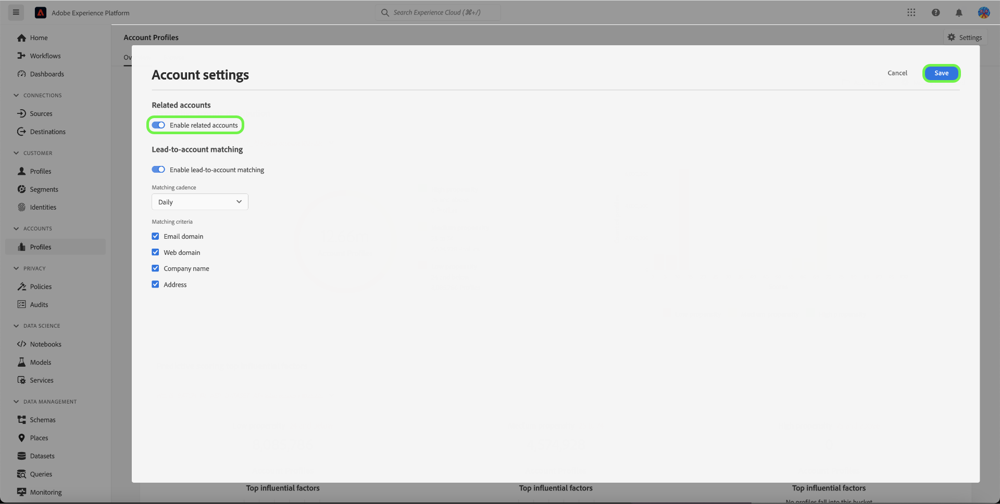

# Contas relacionadas no Real-Time CDP B2B Edition

## Visão geral {#overview}

As empresas B2B geralmente têm suas informações de clientes armazenadas em vários sistemas, cada um incluindo apenas dados parciais ou até mesmo conflitantes para a mesma entidade comercial real. Isso cria um enorme desafio de chegar a uma visão precisa de seus clientes, reduzindo, portanto, a eficiência e a eficácia de seus esforços de marketing e vendas B2B.

| ID | Nome | Site | Setor | Estado | Telefone | Tem oportunidade aberta com valor > `$1 million` |
|---|---|---|---|---|---|---|
| 1 | Acme | acme.com | Software | CA | (408)536-6000 |   |
| 2 | Acme | acm.com | Software | CA | 4085366000 | x |
| 3 | Acme Inc |   |   | CA | (408)5366000 |   |
| 4 | Serviço Acme Consulting | `http://www.acme.com/consulting` | Consultoria em tecnologia | NY | (212)471-0904 | x |
| 5 | Acme IT |   |   | CA |   |   |

{style="table-layout:auto"}

Com contas relacionadas, o [!DNL Real-Time CDP B2B] agora mostra uma lista de contas semelhantes à conta que você está navegando.

Use esse recurso para exibir perfis de conta relacionados para um perfil de conta na interface do usuário do Experience Platform e, em seguida, incluir as contas relacionadas nas definições de segmento para ampliar seu alcance ou aplicar critérios mais amplos em seus públicos.

## Habilitar o serviço de contas relacionado {#enable}

Para habilitar o serviço, selecione **[!UICONTROL Perfis]** na barra lateral seguido de **[!UICONTROL Configurações]**.

Selecione a opção ao lado de [!UICONTROL Habilitar contas relacionadas] para habilitar o serviço e selecione **[!UICONTROL Salvar]**.

## Como funciona {#how-it-works}

As tarefas de aprendizado de máquina executadas diariamente usam um algoritmo hierárquico para agrupar perfis de conta semelhantes em grupos com base em três fatores:

* Link da conta principal
* Domínio da web
* Nome da conta

Após um trabalho de processamento bem-sucedido, cada membro do grupo de perfis de conta é marcado com a lista Contas relacionadas. Você pode exibir a lista na guia **Contas relacionadas** da página Perfil da conta e usar as contas relacionadas nas definições de segmento.

Consulte a documentação para obter mais informações sobre os [trabalhos de contas relacionados ao enriquecimento de perfil](/help/dataflows/ui/b2b/monitor-profile-enrichment.md).

## Como visualizar contas relacionadas {#how-to-view}

É possível visualizar as contas relacionadas de uma conta que você está navegando na interface do usuário do Experience Platform.

Consulte a documentação para obter mais informações sobre [como localizar contas relacionadas na interface](/help/rtcdp/accounts/account-profile-ui-guide.md#related-accounts-tab).

## Como você pode usar contas relacionadas {#how-to-use}

Você pode usar contas e contas relacionadas na segmentação. A decisão de usar contas relacionadas nas definições de segmento depende do caso de uso de marketing. Por exemplo, você pode usar contas relacionadas para marketing por email ou campanhas publicitárias nas quais pode aceitar uma precisão menor em troca de um alcance mais amplo.

Veja um [exemplo de segmentação](/help/rtcdp/segmentation/b2b.md#related-accounts) que usa contas relacionadas.
