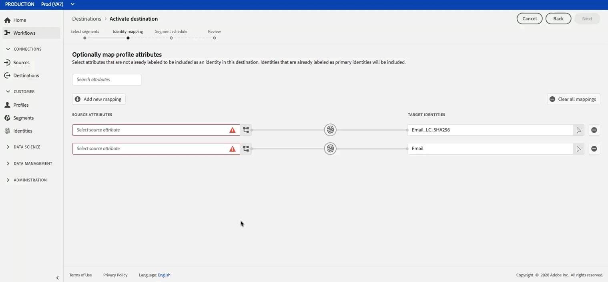
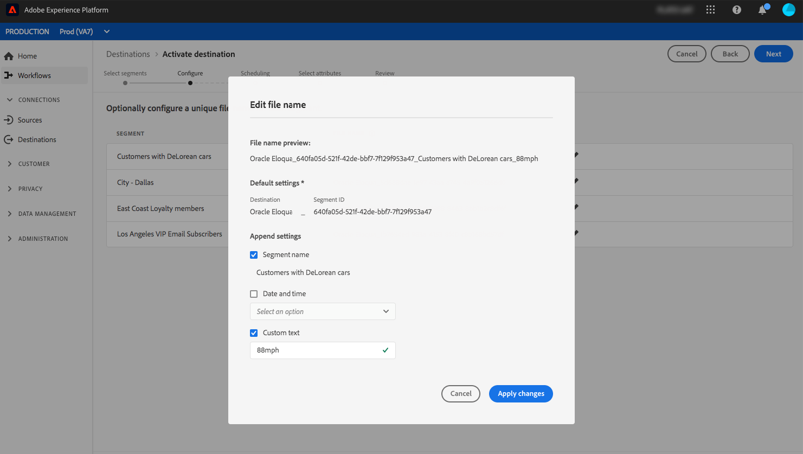

# Ativar perfis e segmentos em um destino

Ative os dados que você tem na Plataforma de dados do cliente em tempo real do Adobe mapeando segmentos para destinos. Para fazer isso, siga as etapas abaixo.

## Pré-requisitos {#prerequisites}

Para ativar os dados para destinos, você deve ter [conectado com êxito um destino](/help/rtcdp/destinations/connect-destination.md). Caso ainda não o tenha feito, vá para o catálogo [de](/help/rtcdp/destinations/destinations-catalog.md)destinos, navegue nos destinos suportados e configure um ou mais destinos.

## Ativar dados {#activate-data}

As etapas no fluxo de trabalho de ativação variam ligeiramente entre os tipos de destino. O fluxo de trabalho completo para todos os tipos de destino está descrito abaixo.

### Selecione para qual destino os dados serão ativados {#select-destination}

Aplica-se a: Todos os destinos

1. Na interface de usuário CDP em tempo real do Adobe, navegue até **[!UICONTROL Destinos]** > **[!UICONTROL Procurar]**e selecione o destino onde deseja ativar seus segmentos.
   
2. Clique no nome do destino. Isso leva você ao fluxo de trabalho da ativação.
   Observe que se já existir um fluxo de trabalho de ativação para um destino, você poderá ver os segmentos que estão sendo ativados no momento para o destino. Selecione **[!UICONTROL Editar ativação]** no painel direito e siga as etapas abaixo para modificar os detalhes da ativação.
3. Selecione **[!UICONTROL Ativar]**.

<br> 

### **[!UICONTROL Etapa Selecionar segmentos]** {#select-segments}

Aplica-se a: Todos os destinos


Na página **[!UICONTROL Ativar fluxo de trabalho de destino]** , na página **[!UICONTROL Selecionar segmentos]** , selecione um ou mais segmentos para ativar no destino. Pressione **[!UICONTROL Avançar]** para prosseguir para a próxima etapa.


<br> 

### **[!UICONTROL Etapa de mapeamento]** de identidade {#identity-mapping}

Aplica-se a: destinos sociais e destino publicitário da Correspondência de clientes do Google


Para destinos ** sociais, na etapa de mapeamento **** Identidade, você pode selecionar atributos de origem para mapear como identidades de público alvo no destino. Essa etapa é opcional ou obrigatória, dependendo da identidade primária usada no schema. <br> 

*Endereço de email como identidade* principal: Se você estiver usando o endereço de email como identidade primária em seu schema, poderá ignorar a etapa de mapeamento de identidade, como mostrado abaixo:


<br> 

*Outra ID como identidade* primária: Se estiver usando outra ID, como ID *de* recompensa ou ID *de* fidelidade, como a principal identidade do seu schema, é necessário mapear manualmente o endereço de email do seu schema de identidade como uma identidade de público alvo no destino social, como mostrado abaixo:




Selecione `Email_LC_SHA256` como identidade de público alvo se você tiver hash dos endereços de email do cliente na ingestão de dados no Adobe Experience Platform, de acordo com os requisitos [!DNL Facebook] de hash do [](/help/rtcdp/destinations/facebook-destination.md#email-hashing-requirements)email. <br> Selecione `Email` como identidade de público alvo se os endereços de email que você está usando não estiverem com hash. A CDP em tempo real do Adobe hash os endereços de email para atender aos [!DNL Facebook] requisitos.


<br> 

### **[!UICONTROL Configurar]** etapa {#configure}

Aplica-se a: Destinos de marketing por email e destinos de armazenamentos na nuvem


Esta etapa é opcional. Na etapa **[!UICONTROL Configurar]** , é possível configurar os nomes de arquivo para cada segmento que você está exportando. Os nomes de arquivo padrão consistem em nome de destino, ID de segmento e um indicador de data e hora. Por exemplo, é possível editar os nomes de arquivos exportados para distinguir entre campanhas diferentes ou para anexar o tempo de exportação de dados aos arquivos.

Selecione **[!UICONTROL Avançar]** para usar os nomes de arquivo padrão ou clique no ícone de lápis para abrir uma janela modal e editar os nomes dos arquivos. Observe que os nomes de arquivos são limitados a 255 caracteres.


No editor de nome de arquivo, você pode selecionar componentes diferentes para adicionar ao nome do arquivo. O nome de destino e a ID de segmento não podem ser removidos dos nomes de arquivo. Além disso, você pode adicionar o seguinte:

* **[!UICONTROL Nome]** do segmento: É possível anexar o nome do segmento ao nome do arquivo.
* **[!UICONTROL Data e hora]**: Selecione entre adicionar um `MMDDYYYY_HHMMSS` formato ou um carimbo de data e hora Unix de 10 dígitos do horário em que os arquivos são gerados. Selecione uma dessas opções se desejar que seus arquivos tenham um nome de arquivo dinâmico gerado a cada exportação incremental.
* **[!UICONTROL Texto]** personalizado: Adicione texto personalizado aos nomes dos arquivos.

Selecione **[!UICONTROL Aplicar alterações]** para confirmar sua seleção.

>[!IMPORTANT]
> 
>Se você não selecionar o componente **[!UICONTROL Data e hora]** , os nomes dos arquivos serão estáticos e o novo arquivo exportado substituirá o arquivo anterior no local do armazenamento a cada exportação. Ao executar um trabalho de importação recorrente de um local de armazenamento para uma plataforma de marketing por email, essa é a opção recomendada.



<br> 

### **[!UICONTROL Etapa Agendamento]** do segmento {#segment-schedule}

Aplica-se a: destinos publicitários, destinos sociais


Na página Agendamento **[!UICONTROL do]** segmento, é possível definir a data do start para enviar dados para o destino, bem como a frequência do envio de dados para o destino.

>[!IMPORTANT]
>
>Para destinos sociais, você deve selecionar a origem de sua audiência nesta etapa. Você pode prosseguir para a próxima etapa somente depois de selecionar uma das opções na imagem abaixo.


<br> 

### **[!UICONTROL Etapa de agendamento]** {#scheduling}

Aplica-se a: destinos de marketing por email e destinos de armazenamentos na nuvem


Na página **[!UICONTROL Agendamento]** , você pode ver a data de start para enviar dados para o destino, bem como a frequência de envio de dados para o destino. Esses valores não podem ser editados.

<br> 

### **[!UICONTROL Etapa Selecionar atributos]** {#select-attributes}

Aplica-se a: destinos de marketing por email e destinos de armazenamentos na nuvem


Na página **[!UICONTROL Selecionar atributos]** , selecione **[!UICONTROL Adicionar novo campo]** e selecione os atributos que deseja enviar para o destino.

>[!NOTE]
>
> A CDP em tempo real do Adobe pré-preenche sua seleção com quatro atributos recomendados e comumente usados do seu schema: `person.name.firstName`, `person.name.lastName`, `personalEmail.address`, `segmentMembership.status`.

As exportações de arquivos variam da seguinte forma, dependendo se `segmentMembership.status` estiver selecionado:
* Se o `segmentMembership.status` campo for selecionado, os arquivos exportados incluirão membros **ativos** no instantâneo completo inicial e membros **ativos** e **expirados** em exportações incrementais subsequentes.
* Se o `segmentMembership.status` campo não estiver selecionado, os arquivos exportados incluirão apenas membros **ativos** no instantâneo completo inicial e em exportações incrementais subsequentes.


Recomendamos que um dos atributos seja um identificador [](/help/rtcdp/destinations/email-marketing-destinations.md#identity) exclusivo do seu schema. Para obter mais informações sobre atributos obrigatórios, consulte Identidade no artigo Destinos [de marketing de](/help/rtcdp/destinations/email-marketing-destinations.md#identity) email.

>[!NOTE]
> 
>Se algum rótulo de uso de dados tiver sido aplicado a determinados campos em um conjunto de dados (em vez de todo o conjunto de dados), a imposição desses rótulos de nível de campo na ativação ocorrerá sob as seguintes condições:
>* Os campos são usados na definição do segmento.
>* Os campos são configurados como atributos projetados para o destino do público alvo.

>
> 
Considere a captura de tela abaixo. Por exemplo, se o campo `person.name.firstName` tivesse determinados rótulos de uso de dados que entrassem em conflito com o caso de uso de marketing do destino, você veria uma violação da política de uso de dados na etapa de revisão (etapa 9). Para obter mais informações, consulte Controle de [dados em CDP](/help/rtcdp/privacy/data-governance-overview.md#destinations)em tempo real.


<br> 

### **[!UICONTROL Etapa de revisão]** {#review}

Aplica-se a: todos os destinos


Na página **[!UICONTROL Revisar]** , você pode ver um resumo de sua seleção. Selecione **[!UICONTROL Cancelar]** para quebrar o fluxo, **[!UICONTROL Voltar]** para modificar suas configurações ou **[!UICONTROL Concluir]** para confirmar sua seleção e start enviando dados para o destino.

>[!IMPORTANT]
>
>Nesta etapa, a CDP em tempo real verifica se há violações da política de uso de dados. Abaixo está um exemplo de violação de uma política. Não é possível concluir o fluxo de trabalho da ativação de segmentos até que você tenha resolvido a violação. Para obter informações sobre como resolver violações de política, consulte Aplicação de [política](/help/rtcdp/privacy/data-governance-overview.md#enforcement) na seção de documentação de controle de dados.


Se nenhuma violação de política tiver sido detectada, selecione **[!UICONTROL Concluir]** para confirmar sua seleção e start enviando dados para o destino.


## Editar ativação {#edit-activation}

Siga as etapas abaixo para editar os fluxos de ativação existentes na CDP em tempo real:

1. Selecione **[!UICONTROL Destinos]** na barra de navegação esquerda, clique na guia **[!UICONTROL Procurar]** e clique no nome de destino.
2. Selecione **[!UICONTROL Editar ativação]** no painel direito para alterar quais segmentos enviar para o destino.

## Verificar se a ativação de segmentos foi bem-sucedida {#verify-activation}

### Destinos de marketing por email e destinos de armazenamentos na nuvem {#esp-and-cloud-storage}

Para destinos de marketing por email e destinos de armazenamento na nuvem, o Adobe Real-time CDP cria um arquivo delimitado por tabulação `.csv` ou `.txt` no local do armazenamento fornecido. Espera que um novo arquivo seja criado no local do armazenamento todos os dias. The default file format is:
`<destinationName>_segment<segmentID>_<timestamp-yyyymmddhhmmss>.csv|txt`

Observe que você pode editar o formato de arquivo. Para obter mais informações, vá para a etapa [Configurar](/help/rtcdp/destinations/activate-destinations.md#configure) destinos de armazenamentos na nuvem e destinos de marketing por email.

Com o formato de arquivo padrão, os arquivos que você receberia em três dias consecutivos podem ter a seguinte aparência:

```console
Salesforce_Marketing_Cloud_segment12341e18-abcd-49c2-836d-123c88e76c39_20200408061804.csv
Salesforce_Marketing_Cloud_segment12341e18-abcd-49c2-836d-123c88e76c39_20200409052200.csv
Salesforce_Marketing_Cloud_segment12341e18-abcd-49c2-836d-123c88e76c39_20200410061130.csv
```

A presença desses arquivos no local do seu armazenamento é a confirmação da ativação bem-sucedida. Para entender como os arquivos exportados são estruturados, é possível [baixar um arquivo](assets/sample_export_file_segment12341e18-abcd-49c2-836d-123c88e76c39_20200408061804.csv).csv de amostra. Esse arquivo de amostra inclui os atributos do perfil `person.firstname`, `person.lastname`, `person.gender`, `person.birthyear`e `personalEmail.address`.

### Destinos de publicidade

Verifique sua conta no respectivo destino de anúncio para o qual você está ativando seus dados. Se a ativação tiver sido bem-sucedida, as audiências serão preenchidas em sua plataforma de publicidade.

### Destinos da rede social

Por exemplo, [!DNL Facebook]uma ativação bem-sucedida significa que uma audiência [!DNL Facebook] personalizada seria criada programaticamente no Gerenciador [[!UICONTROL de anúncios do]](https://www.facebook.com/adsmanager/manage/)Facebook. A associação de segmento na audiência seria adicionada e removida, pois os usuários são qualificados ou desqualificados para os segmentos ativados.

>[!TIP]
>
>A integração entre a CDP em tempo real do Adobe e [!DNL Facebook] suporta preenchimentos retroativos históricos de audiência. Todas as qualificações de segmento histórico são enviadas para [!DNL Facebook] quando você ativa os segmentos para o destino.

## Desativar ativação {#disable-activation}

Para desativar um fluxo de ativação existente, siga as etapas abaixo:

1. Selecione **[!UICONTROL Destinos]** na barra de navegação esquerda, clique na guia **[!UICONTROL Procurar]** e clique no nome de destino.
2. Clique no controle **[!UICONTROL Ativado]** no painel direito para alterar o estado do fluxo de ativação.
3. Na janela **Atualizar estado** do fluxo de dados, selecione **Confirmar** para desativar o fluxo de ativação.
