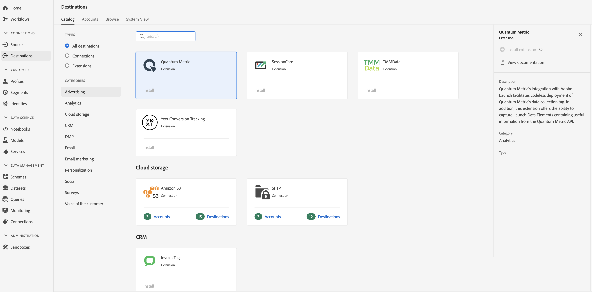

# Extensão de métrica quântica {#quantum-metric-extension}

## Visão geral {#overview}

A integração da métrica quântica com o Adobe Launch facilita a implantação ininterrupta da tag de coleta de dados da métrica quântica. Além disso, essa extensão oferta a capacidade de capturar Elementos de dados de inicialização que contêm informações úteis da API de métrica quântica.

A métrica quântica é uma extensão de análise na plataforma de dados do cliente em tempo real da Adobe. Para obter mais informações sobre a funcionalidade de extensão, consulte a página de extensão no [Adobe Exchange](https://exchange.adobe.com/experiencecloud.details.101535.quantum-metric-extension-for-adobe-launch.html).

Este destino é uma extensão do Experience Platform Launch. Para obter mais informações sobre como as extensões do Launch funcionam na Adobe Real-time CDP, consulte Visão geral [das extensões do Launch da plataforma](/help/rtcdp/destinations/experience-platform-launch-extensions.md)Experience.

## Pré-requisitos {#prerequisites}

Essa extensão está disponível no catálogo Destinos para todos os clientes que compraram a CDP em tempo real da Adobe.

Para usar essa extensão, você precisa acessar o Experience Platform Launch. O Experience Platform Launch é oferecido aos clientes da Adobe Experience Cloud como um recurso incluído, que agrega valor. Entre em contato com o administrador da organização para obter acesso ao Launch e solicitar que ele conceda a você a **[!UICONTROL manage_properties]** permissão para que você possa instalar extensões.

## Instalar extensão {#install-extension}

Para instalar a extensão da Métrica Quântica:

1. Na interface [CDP em tempo real da](http://platform.adobe.com/)Adobe, vá para **[!UICONTROL Destinations > Catalog]**.
2. Selecione a extensão do catálogo ou use a barra de pesquisa.
3. Clique no destino para realçá-lo e selecione **[!UICONTROL Install Extension]** no painel direito. Se o **[!UICONTROL Install Extension]** controle estiver acinzentado, você não terá a **[!UICONTROL manage_properties]** permissão. Consulte [Pré-requisitos](#prerequisites).
4. Na **[!UICONTROL Select available Launch property]** janela, selecione a propriedade Launch na qual deseja instalar a extensão. Você também tem a opção de criar uma nova propriedade no Launch. Uma propriedade é uma coleção de regras, elementos de dados, extensões configuradas, ambientes e bibliotecas. Saiba mais sobre as propriedades na seção [da página](https://docs.adobe.com/content/help/en/launch/using/reference/admin/companies-and-properties.html#properties-page) Propriedades da documentação do Launch.
5. O fluxo de trabalho leva você ao Launch para concluir a instalação.

Para obter informações sobre as opções de configuração de extensão e suporte de instalação, consulte a página Métrica [quântica no Adobe Exchange](https://exchange.adobe.com/experiencecloud.details.101535.quantum-metric-extension-for-adobe-launch.html).

Você também pode instalar a extensão diretamente na interface [do](https://launch.adobe.com/)Experience Platform Launch. Consulte [Adicionar uma nova extensão](https://docs.adobe.com/content/help/en/launch/using/reference/manage-resources/extensions/overview.html#add-a-new-extension) na documentação do Launch.

## Como usar a extensão {#how-to-use}

Depois de instalar a extensão, você pode start configurando regras para ela diretamente no Launch.

Em Iniciar, você pode configurar regras para suas extensões instaladas para enviar dados de evento para o destino da extensão somente em determinadas situações. Para obter mais informações sobre como configurar regras para suas extensões, consulte a documentação Regras.

## Configurar, atualizar e excluir extensão {#configure-upgrade-delete}

Você pode configurar, atualizar e excluir extensões na interface do Launch.

>[!TIP]
>
>Se a extensão já estiver instalada em uma de suas propriedades, a interface do usuário CDP em tempo real da Adobe ainda será exibida **[!UICONTROL Install]** para a extensão. Exclua o fluxo de trabalho de instalação conforme descrito em [Instalar extensão](#install-extension) para acessar Iniciar e configurar ou excluir sua extensão.

Para atualizar sua extensão, consulte Atualização [da](https://docs.adobe.com/content/help/en/launch/using/reference/manage-resources/extensions/extension-upgrade.html) extensão na documentação do Launch.