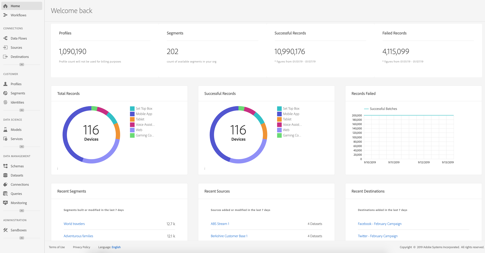
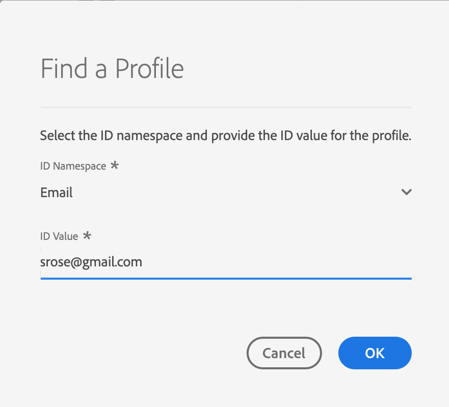
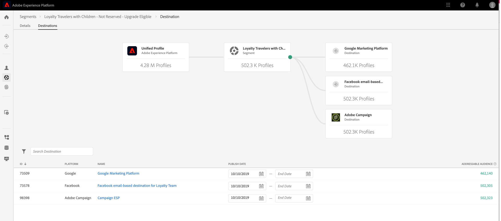

# Introdução à Plataforma de dados do cliente em tempo real

Este guia de introdução o orienta por meio de uma amostra da implementação da Plataforma de dados do cliente em tempo real (CDP em tempo real). Você pode usá-lo como exemplo ao configurar sua própria implementação. Embora este guia mostre exemplos específicos, ele vincula às informações adicionais que você pode usar ao criar sua configuração.

Este exemplo mostra o poder da Plataforma de dados do cliente em tempo real, viabilizada pela Adobe Experience Platform, de:

* Assimilar dados de várias fontes
* Mesclar em um único [!DNL real-time customer profile]
* Forneça uma experiência consistente, relevante e personalizada em todos os dispositivos.

## Caso de uso

A Luma, uma empresa de vestuário atlético, está sempre tentando melhorar a experiência do cliente. Eles têm uma nova iniciativa para aumentar as vendas relacionadas a presentes. Eles também desejam reduzir a exposição excessiva, como anúncios irritantes que seguem os clientes.

Atualmente, eles estão gastando muito em mídia que redireciona os itens que o visitante não vai comprar para o futuro. Por exemplo, o Luma não deseja redirecionar alguém com um item que foi pretendido como uma compra única para outra pessoa.

Neste momento, os dados do Luma estão dispersos por várias fontes. Como resultado, enfrentam desafios significativos:

* A organização de marketing deve trabalhar com várias equipes que possuem uma fonte de dados, incluindo um site, aplicativo móvel, sistemas de fidelidade, CRM e assim por diante.
* Quando a equipe de marketing recebe acesso aos dados, eles geralmente são obsoletos e não são mais relevantes para a campanha que leva em consideração o tempo.
* Eles precisam unificar os dados para direcionar uma pessoa, não canais.

Como resultado, a Luma tem os seguintes objetivos de negócios:

* Crie uma visão única em tempo real de seus consumidores a partir de suas diferentes fontes de dados.
* Personalize campanhas de marketing com mensagens relevantes em diferentes canais e dispositivos.

Para atingir essas metas, a equipe de marketing precisa gerenciar os dados do cliente em escala.

Com a CDP em tempo real, disponibilizada pela Adobe Experience Platform, a organização de marketing da Luma pode:

1. Colete dados de plataformas diferentes e verifique se estão disponíveis downstream para outras atividades de marketing.
1. Crie uma visualização única em tempo real de seus consumidores, independentemente de onde os dados são originados.
1. Impulsione uma experiência consistente, relevante e personalizada em todos os pontos de contato.

## Etapas

Este tutorial inclui as seguintes etapas:

1. Crie o [perfil do cliente](#customer-profile).
1. [](#personalizing-the-user-experience) Personalize a experiência do usuário.
1. Use [várias fontes de dados](#using-multiple-data-sources).
1. [Configurar uma fonte de dados](#configuring-a-data-source).
1. [Colete os ](#bringing-the-data-together-for-a-specific-customer) dados de um cliente específico.
1. Configure [segmentos](#segments).
1. Configure [destinos](#destinations).
1. [Encaixe o perfil em todos os dispositivos](#cross-device-identity-stitching).
1. [Analise o perfil](#analyzing-the-profile).

## Perfil do cliente

Quando os clientes visitam seu site pela primeira vez, você não sabe nada sobre eles.


À medida que navegam, os dados são capturados em tempo real e enviados não apenas para um conjunto de relatórios no Adobe Analytics, mas também diretamente para a Adobe Experience Platform. À medida que os dados são coletados, você começa a formar uma única visualização do consumidor, com base nos dados comportamentais em [!DNL Experience Platform's real-time customer profile].

Muitos visitantes do site provavelmente são clientes recorrentes que compraram anteriormente do Luma.  É importante que o Luma personalize mensagens e ofertas para atender a visitantes novos e repetidos, bem como clientes conhecidos.

### Primeira visita do novo cliente

Por exemplo, um visitante não identificado navega até a seção Men&#39;s (Masculino) do site Luma e exibe alguns suéteres em execução.


Conforme o cliente navega para saber mais sobre esses produtos, essas visualizações de produtos são coletadas no Adobe Analytics e enviadas para [!DNL Experience Platform].

<!---->

O Luma pode mapear o comportamento do visitante para um perfil de usuário na Adobe Experience Platform e começar a reunir uma visão mais rica do comportamento desse consumidor.

### Obter uma visão mais detalhada do cliente

À medida que o cliente continua a interagir com o site, uma imagem mais clara surge. Por exemplo, suponha que o visitante adicione um produto ao carrinho de compras e faça logon.

Quando o cliente entra, identifica-se como Sarah Rose.


Duas identidades são unidas:

* Os dados de navegação anônimos
* Os dados existentes associados à conta de Sarah Rose

Ambas as identidades são combinadas em um único perfil em [!DNL Experience Platform]. Luma tem agora uma visão unificada desse consumidor.

Com base no comportamento de navegação do visitante anônimo na seção Men&#39;s do site, pode ter sido considerado que o cliente era do sexo masculino. Agora que ela está conectada, Luma reconhece Sarah Rose. O Luma usa o poder do [!DNL Real-time Customer Profile] para refinar as mensagens enviadas a ela entre canais.

## Personalização da experiência do usuário

Sarah é recebida com uma mensagem de fidelidade e agradecida por ser membro do Bronze com mais informações sobre benefícios e como aumentar seu status e pontos.

Ela navega até a página inicial para navegar um pouco mais.


Sarah recebe uma experiência de página inicial personalizada que é fornecida dinamicamente, com base em seu [!DNL Real-time Customer Profile] na Adobe Experience Platform.

Ela vê conteúdo relevante, graças à personalização acionada pelo Adobe Sensei no Adobe Target, que leva em conta suas compras anteriores e afinidade com a execução de roupas e equipamentos. Luma também adequa o conteúdo do catálogo masculino em direção à engrenagem de corrida para homens com base em seu navegador mais recente.

Além da página, Sarah recebe os produtos em destaque, assim como uma nova bandeja de recomendações baseada em seus itens vistos mais recentemente.

Este conteúdo personalizado ajuda Sarah a encontrar itens relevantes rapidamente. Isso aumenta as conversões e fornece uma experiência do cliente mais agradável.

### Trazendo o cliente de volta

Sarah se distrai e deixa o site, terminando sua sessão. Luma pode usar seus dados na Adobe Experience Platform para ajudar a trazê-la de volta ao site.

A Plataforma de dados do cliente em tempo real, oferecida pela Adobe Experience Platform, foi criada para o gerenciamento da experiência do cliente. Ele permite que as organizações:

* Simplifique a integração e a ativação de dados
* Governar o uso de dados conhecidos e desconhecidos
* Acelere os casos de uso de marketing em escala

## Uso de várias fontes de dados

A equipe no Luma tem todos os dados comportamentais e do cliente em um único lugar.



Eles podem assimilar dados de todas as seguintes fontes:

* Dados de soluções existentes da Adobe Experience Cloud
* Fontes não-Adobe, como o programa de fidelidade do Luma, call center e dados do sistema de ponto de venda
* Dados de streaming em tempo real de fontes de dados Luma
* Dados em tempo real das soluções da Adobe (sem necessidade de novas tags)

Todos esses dados de fontes diferentes são unidos em um único perfil de cliente unificado.

## Configurar uma fonte de dados

Use [!DNL Real-time Customer Data Platform] para trazer novas fontes de dados para a Plataforma. A CDP em tempo real inclui um catálogo de fontes de dados que pode ser adicionado rápida e facilmente ao perfil.


Por exemplo, para assimilar dados de CRM do Luma, filtre o catálogo por *CRM* e todos os conectores prontos para uso que contêm *CRM* são listados. Para adicionar dados [!DNL Microsoft Dynamics CRM]:

1. Autorize a conexão.

   

1. Escolha o que deseja importar de uma lista recomendada de tabelas pré-mapeadas do XDM.

   <!--     -->

   Por exemplo, selecione **[!UICONTROL Contacts]**. Uma pré-visualização dos dados de contatos é carregada automaticamente para que você possa garantir que tudo fique como esperado.

   A Adobe Experience Platform retira muito do trabalho manual desse processo, mapeando automaticamente os campos padrão para o esquema de perfil [!DNL Experience Data Model] (XDM).

1. Revise os mapeamentos de campo.

   <!--     -->

   Por exemplo, verifique se o campo de email para contatos está mapeado corretamente.\
   Você tem a opção de visualizar os dados e executar o mapeamento avançado.

1. Defina um cronograma.

   

Está feito. Você acabou de adicionar [!DNL Microsoft CRM] como uma fonte de dados em [!DNL Experience Platform].

### Rotular dados assimilados para políticas de uso

O Luma tem muitas políticas internas que restringem o uso de determinados tipos de informações coletadas e também deve estar em conformidade com as preocupações legais e relacionadas à privacidade em relação ao uso de dados. Usando a Adobe Experience Platform [!DNL Data Governance], os rótulos de uso de dados predefinidos podem ser aplicados a conjuntos de dados (e campos específicos nesses conjuntos de dados), permitindo que o Luma categorize seus dados de acordo com restrições de uso específicas.


Depois que os rótulos de uso de dados forem aplicados, o Luma poderá usar [!DNL Data Governance] para criar políticas de uso de dados. As políticas de uso de dados são regras que descrevem os tipos de ações que você tem permissão para executar em dados que contêm determinados rótulos. Ao tentar executar uma ação na CDP em tempo real que constitui uma violação de política, a ação é impedida e é fornecido um alerta para mostrar qual política foi violada e por quê.

## Reunir os dados para um cliente específico

Neste cenário, procure perfis para Sarah Rose. Seu perfil aparece, com o email que costumava fazer logon.

<!--  -->

Todas as informações do perfil que Luma tem sobre Sarah são exibidas. Isso inclui suas informações pessoais, como endereço e número de telefone, preferências de comunicação e os segmentos para os quais ela se qualifica.

| Categoria | Descrição |
|---|---|
| Identidades | Mostra as identidades que foram vinculadas em [!DNL Platform] das interações de Sarah com o Luma nos canais e dispositivos. Sua ECID do site é exibida. Sua identidade também inclui a ECID do aplicativo móvel, a ID de email, uma ID de CRM do conjunto de dados [!DNL Microsoft Dynamics] adicionado recentemente e uma ID de fidelidade passada para a Adobe Experience Platform pelo sistema de fidelidade Luma. |
| Eventos | Mostra todos os dados de interação de Sarah com a marca Luma. Isso inclui o item que ela acabou de ver, qualquer coisa que ela tenha visto no passado, os emails que recebeu, suas interações com a central de atendimento, e em qual canal e dispositivo cada uma dessas interações aconteceu. |

O perfil da CDP em tempo real reduz o fluxo de trabalho da equipe de marketing do Luma de semanas para minutos e desbloqueia as possibilidades de personalização com base nessa visualização de 360 graus do cliente. O perfil mescla os dados comportamentais de quando ela navegou no site antes de entrar, com o perfil de cliente existente, criando uma exibição abrangente da Sarah.

A equipe de marketing pode usar isso aprimorado, [!DNL Real-time Customer Profile] para personalizar melhor a experiência de Sarah e aumentar a fidelidade de sua marca com o Luma.

## Segmentos

Os poderosos recursos de segmentação da Adobe Experience Platform permitem que os profissionais de marketing combinem atributos, eventos e segmentos existentes, com base em dados capturados no [!DNL Real-time Customer Profile].

<!--  -->

Neste cenário, as interações recentes de Sarah no site exibem um comportamento diferente de suas ações anteriores. Ela geralmente compra roupas femininas. No entanto, o item em seu carrinho é uma camisola grande para homens.

A equipe de ciência de dados Luma criou modelos sobre propensão a comprar. Um modelo identifica uma mudança súbita na categoria de vestuário (como homens/mulheres) ou no tamanho do consumidor existente. A mudança de comportamento de compra de Sarah sugere que ela não está comprando para si mesma.

<!--  -->

### Definição de um segmento

Modifique ou crie um segmento que represente os abandonadores do carrinho que parecem estar no processo de comprar um presente:

```sql
Profile: Category != Preferred Category 
AND 
Product Size != Preferred Size 
in last 7 days.  
AND 
Abandoned Cart 
AND 
Loyalty member 
```

<!-- -->

Como Sarah adicionou um aparente item de presente no carrinho e o abandonou, Luma pode direcioná-la com uma oferta de presente grátis.

## Destinos

Quando você adiciona o segmento &quot;Presente oferecendo Abandonadores de Carrinho&quot;, você pode ver aproximadamente quantas pessoas fazem parte desse segmento. É possível realizar uma ação e disponibilizá-la para personalização em todos os canais.

Selecione **[!UICONTROL Enviar para destinos]**.

Na CDP em tempo real, o Luma pode agir continuamente em seus segmentos de público-alvo para personalização.\
Aqui vemos todos os destinos disponíveis para o Luma enviar esse destino para soluções da Adobe e de outros fornecedores:


### Seleção de destinos

Nesse cenário, o Luma deseja redirecionar esse público-alvo com personalização nesses destinos:

* Google, para exibição

   <!--* Facebook -->
* Adobe Campaign, para email

<!--  -->

### Agendamento de destinos

Você também pode programar o segmento para iniciar ou terminar em um horário específico. O segmento será publicado e atualizado automaticamente nas plataformas configuradas nas datas programadas.

>[!NOTE]
>
>Como opção, se você selecionar o campo de data, ele programará automaticamente por 90 dias.

Selecione **[!UICONTROL Save]** para ir para a próxima página.

Quando um cliente nesse público-alvo realiza uma compra, sua associação a esse público-alvo é suprimida em tempo real. Eles não se qualificam mais porque seu status foi alterado.

Isso economiza centenas de milhares de dólares para o diretor da equipe de mídia do Luma, ao não usar o inventário para um público que não é qualificado.

### Aplicação de políticas de uso de dados para destinos

A Adobe Experience Platform inclui controles de privacidade e segurança para determinar se um segmento está disponível para ser ativado para um destino específico. A ativação é ativada ou restrita com base na(s) finalidade(ões) de marketing atribuída(s) ao destino quando foi criada, bem como nas políticas de uso de dados definidas pela organização.

Se sua atividade violar a política, um aviso será exibido. Este aviso contém informações de linhagem de dados que podem ajudar a identificar por que a política foi violada e o que você pode fazer para resolver a violação.

Com esses controles, [!DNL Experience Platform] ajuda o Luma a cumprir as regulamentações e o mercado de forma responsável. Esses controles são flexíveis e podem ser modificados para atender aos requisitos das equipes de segurança e governança do Luma, permitindo que elas solucionem com confiança os requisitos regionais e organizacionais para gerenciar dados conhecidos e desconhecidos do cliente.

### Tela do fluxo de dados

Ao salvar, uma tela de fluxo de dados visuais mostra o segmento mapeado do perfil unificado para os três destinos selecionados.



## Compilação de identidade entre dispositivos

Sarah navega por um site de mídia social em seu dispositivo móvel, e vê um anúncio Luma. Faz-lhe lembrar o item que ela deixou no carrinho.

Mais tarde, ela abre seu email e vê os emails redirecionados. Ela seleciona um link para o Luma a partir de um email.

O link leva Sarah à página inicial do Luma móvel, onde ela vê uma experiência altamente personalizada oferecida pelo Adobe Target.

* Ela é bem-vinda como membro do Bronze.
* Ela vê a mensagem do &quot;Presente&quot;.
* Ela também vê a mensagem &quot;Free Gift Wrap&quot;, que faz parte de seus benefícios à filiação ao Bronze.
* Ela ainda é alvo da imagem do herói com base na sua afinidade por correr.

Ela compra o suéter, adiciona presente e escreve uma nota de presente. Ela também tem a opção de se lembrar desse evento e receber um lembrete no próximo ano para receber presente nesse momento. Ela diz que sim, e está agendada para uma campanha por e-mail no ano seguinte para lembrá-la de comprar outro presente.

Graças às capacidades de supressão de audiência, Sarah não será alvo de um suéter masculino que avance.

## Análise do perfil

Os profissionais de marketing do Luma usam a Adobe Experience Platform para examinar o segmento de fornecedores de presentes no Painel CDP em tempo real. Eles veem os resultados dessa iniciativa ao longo do tempo e veem que ela está crescendo. Os clientes estão respondendo a ofertas e gastando mais dinheiro.

Esses insights permitem que os profissionais de marketing tomem medidas nesse sinal, que foi alimentado por ter esses dados disponíveis na CDP e ter clientes como Sarah conectados ao segmento.

O Luma usa esses dados da CDP para aumentar a fidelidade e a satisfação do cliente.
