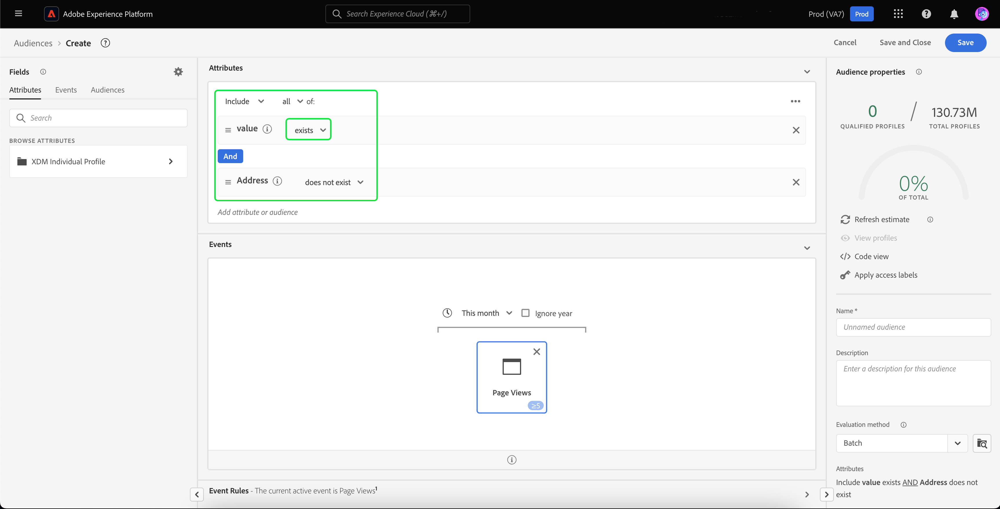

# Redirecionamento externo de visitantes não autenticados

>[!AVAILABILITY]
>
>Essa funcionalidade está disponível para clientes que licenciaram o Real-Time CDP (Serviço de aplicativo), Adobe Experience Platform Ativation, Real-Time CDP, Real-Time CDP Prime, Real-Time CDP Ultimate. Leia mais sobre esses pacotes nas [descrições do produto](https://helpx.adobe.com/br/legal/product-descriptions.html?lang=pt-BR) e entre em contato com a pessoa representante da Adobe para obter mais informações.

Saiba como criar um público-alvo de visitantes não autenticados e redirecioná-los usando IDs duráveis fornecidas pelo parceiro.

## Por que considerar este caso de uso {#why-use-case}

Com a eliminação gradual de cookies de terceiros, os profissionais de marketing digital devem reimaginar suas estratégias para se reengajarem com visitantes anônimos. As marcas que escolherem se integrar aos fornecedores de identidade para o reconhecimento de visitantes em tempo real também podem aproveitar os identificadores duráveis fornecidos pelos parceiros para o redirecionamento de mídia paga fora do site.

Apesar do alto volume de tráfego, muitas marcas observam uma queda significativa na fase de conversão. Os visitantes se envolvem com demonstrações de conteúdo e produto, mas saem sem se inscrever ou fazer uma compra.

Você não só pode criar públicos-alvo com base no engajamento no site para personalizar mensagens de marketing, como também pode usar o suporte da Adobe para IDs de parceiros para reengajar com visitantes em destinos de mídia paga.

## Pré-requisitos e planejamento {#prerequisites-and-planning}

Ao planejar o redirecionamento de visitantes não autenticados, considere os seguintes pré-requisitos durante o processo de planejamento:

- Eu configurei as IDs de parceiro com os namespaces de identidade adequados?

Além disso, para implementar o caso de uso, você usará a seguinte funcionalidade do Real-Time CDP e elementos da interface do usuário. Certifique-se de que você tenha as permissões de controle de acesso com base em atributos necessárias para todas essas áreas ou peça ao administrador do sistema para conceder as permissões necessárias.

- [Públicos-alvo](/help/segmentation/home.md)
- [Atributos computados](/help/profile/computed-attributes/overview.md)
- [Destinos](/help/destinations/home.md)
- [Coleção de dados](/help/collection/home.md)

## Obter dados de parceiros na Real-Time CDP {#get-data-in}

Para criar um público-alvo de visitantes não autenticados, primeiro será necessário obter os dados do parceiro no Real-Time CDP.

Para saber como importar dados para o Real-Time CDP usando o Web SDK, leia as [seções de gerenciamento de dados e coleta de dados do evento](./onsite-personalization.md#data-management) do caso de uso de personalização no site.

## Antecipando IDs fornecidas pelo parceiro {#bring-partner-ids-forward}

Depois de importar as IDs fornecidas pelo parceiro para um conjunto de dados de evento, será necessário obter esses dados nos registros de perfil. Você pode fazer isso utilizando atributos computados.

Os atributos computados permitem converter rapidamente os dados comportamentais do perfil em valores agregados no nível do perfil. Como resultado, você pode usar essas expressões, como &quot;total de compras vitalícias&quot; no perfil, permitindo usar facilmente o atributo calculado em seus públicos-alvo. Mais informações sobre atributos computados podem ser encontradas na [visão geral sobre atributos computados](/help/profile/computed-attributes/overview.md).

Para acessar atributos computados, selecione **[!UICONTROL Profiles]** seguido por **[!UICONTROL Computed attributes]** e **[!UICONTROL Create computed attribute]**.

![O botão [!UICONTROL Create computed attributes] é realçado além da guia [!UICONTROL Computed attributes] dentro do espaço de trabalho [!UICONTROL Profiles].](../assets/offsite-retargeting/create-ca.png)

A página **[!UICONTROL Create computed attribute]** é exibida. Nesta página, você pode usar os componentes para criar seu atributo calculado.

>[!NOTE]
>
>Para obter informações mais detalhadas sobre como criar atributos computados, leia o [guia da interface do usuário de atributos computados](/help/profile/computed-attributes/ui.md).

Para este caso de uso, você pode criar um atributo calculado que, se a ID do parceiro existir, obterá o valor mais recente da ID do parceiro nas últimas 24 horas.

Usando a barra de pesquisa, você pode localizar e adicionar o evento &quot;ID do parceiro&quot; que [você criou durante o caso de uso de personalização no site](#get-data-in) para a tela de atributos computada.

![A guia [!UICONTROL Events] e a barra de pesquisa estão realçadas.](../assets/offsite-retargeting/ca-add-partner-id.png)

Depois de adicionar o evento &quot;ID do Parceiro&quot; à definição, defina a condição de filtragem de evento como **[!UICONTROL Exists]**, defina a condição de filtragem de evento como o valor **[!UICONTROL Most Recent]** da ID do parceiro adicionada e com um período de pesquisa de 24 horas.

Dê ao atributo computado um nome apropriado (como &quot;ID de Parceiro&quot;) e uma descrição, em seguida, selecione **[!UICONTROL Publish]** para concluir o processo de criação do atributo computado.

## Criar um público-alvo usando o atributo calculado {#create-audience}

Agora que você criou o atributo calculado, pode usar este atributo calculado para criar um público-alvo. Neste exemplo, você criará um público-alvo composto por visitantes que visitaram seu site mais de 5 vezes este mês, mas ainda não se inscreveram.

Para criar uma audiência, selecione **[!UICONTROL Audiences]**, seguido por **[!UICONTROL Create audience]**.

![O botão [!UICONTROL Create audience] está realçado.](../assets/offsite-retargeting/create-audience.png)

Uma caixa de diálogo é exibida, solicitando que você escolha entre [!UICONTROL Compose audience] e [!UICONTROL Build rule]. Selecione **[!UICONTROL Build rule]** seguido por **[!UICONTROL Create]**.

![O botão [!UICONTROL Build rule] está realçado.](../assets/offsite-retargeting/select-build-rule.png)

A página Construtor de segmentos é exibida. Nesta página, você pode usar os componentes para criar seu público-alvo.

>[!NOTE]
>
>Para obter informações mais detalhadas sobre como usar o Construtor de segmentos, leia o [Guia da interface do Construtor de segmentos](/help/segmentation/ui/segment-builder.md).

Para atingir o objetivo de encontrar esses visitantes, primeiro adicione um evento **[!UICONTROL Page View]** ao público-alvo. Selecione a guia **[!UICONTROL Events]** em **[!UICONTROL Fields]**, em seguida, arraste e solte o evento **[!UICONTROL Page View]** e adicione-o à tela da seção de eventos.

![A guia [!UICONTROL Events] na seção [!UICONTROL Fields] é realçada ao exibir o [!UICONTROL Page View]evento.](../assets/offsite-retargeting/add-page-view.png)

Selecione o evento **[!UICONTROL Page View]** recém-adicionado. Altere o período de pesquisa de **[!UICONTROL Any time]** para **[!UICONTROL This month]** e altere a regra de evento para incluir **Pelo menos 5**.

![Detalhes do evento [!UICONTROL Page View] adicionado são exibidos.](../assets/offsite-retargeting/edit-event.png)

Depois de adicionar o evento, será necessário adicionar um atributo. Como você está trabalhando com visitantes não autenticados, é possível adicionar o atributo calculado que acabou de criar. Este atributo calculado recém-criado permite vincular IDs de parceiros a um público-alvo.

Para adicionar o atributo calculado, em **[!UICONTROL Attributes]**, selecione **[!UICONTROL XDM Individual Profile]**, seguido da **[ID de locatário de sua organização](/help/xdm/api/getting-started.md#know-your-tenant-id).**, **[!UICONTROL SystemComputedAttributes]** e **[!UICONTROL PartnerID]**. Agora, adicione o **[!UICONTROL Value]** do atributo computado à seção de atributos da tela.

Além disso, pesquise por **[!UICONTROL Personal Email]** e adicione o atributo **[!UICONTROL Address]** abaixo de **[!UICONTROL PartnerID]** à seção de atributos da tela.

![O atributo computado [!UICONTROL PartnerID] e o atributo [!UICONTROL Personal Email Address] estão realçados na tela do Construtor de segmentos.](../assets/offsite-retargeting/added-attributes.png)

Agora que seus atributos foram adicionados, será necessário definir seus critérios de avaliação. Para **[!UICONTROL PartnerID]**, defina o critério como **[!UICONTROL exists]**, e para **[!UICONTROL Address]**, defina o critério como **[!UICONTROL does not exist]**.

Você criou com sucesso um público-alvo que procura visitantes de alta intensidade com uma ID fornecida pelo parceiro, mas que ainda não se inscreveram no site. Nomeie seu público-alvo como &quot;Redirecionando usuários não autenticados&quot; e selecione **[!UICONTROL Save]** para concluir a criação do seu público-alvo.

## Ativar seu público {#activate-audience}

Depois de criar seu público-alvo com êxito, você pode ativá-lo para destinos downstream. Selecione **[!UICONTROL Audiences]** no painel de navegação esquerdo, procure o público-alvo recém-criado, selecione o ícone de reticências e selecione **[!UICONTROL Activate to destination]**.

![O botão [!UICONTROL Activate to destination] está realçado.](../assets/offsite-retargeting/activate-to-destination.png)

>[!NOTE]
>
>Todos os tipos de destino, incluindo destinos baseados em arquivos, oferecem suporte à ativação de público-alvo com IDs de parceiros.
>
>Para obter mais informações sobre como ativar públicos para um destino, leia a [visão geral da ativação](/help/destinations/ui/activation-overview.md).

A página **[!UICONTROL Activate destination]** é exibida. Nesta página, você pode selecionar para qual destino deseja ativar seu destino. Depois de selecionar o destino escolhido, selecione **[!UICONTROL Next]**.

A página **[!UICONTROL Scheduling]** é exibida. Nesta página, você pode criar um agendamento que determina a frequência com que deseja ativar o público-alvo. Selecione **[!UICONTROL Create schedule]** para criar um agendamento para a ativação de público-alvo.

![O botão [!UICONTROL Create schedule] está realçado.](../assets/offsite-retargeting/select-create-schedule.png)

O popover [!UICONTROL Scheduling] é exibido. Nesta página, você pode criar a programação para a ativação do público-alvo. Após configurar o agendamento, selecione **[!UICONTROL Create]** para continuar.

Depois de confirmar os detalhes do agendamento, selecione **[!UICONTROL Next]**.

A página **[!UICONTROL Select attributes]** é exibida. Nesta página, você pode selecionar quais atributos deseja exportar junto com o público-alvo ativado. No mínimo, inclua a ID do parceiro, pois isso permitirá identificar os visitantes que você planeja redirecionar. Selecione **[!UICONTROL Add new mapping]** e procure pelo atributo computado. Depois de adicionar os atributos necessários, selecione **[!UICONTROL Next]**.

![O botão [!UICONTROL Add new mapping] e o atributo computado estão realçados.](../assets/offsite-retargeting/add-new-mapping.png)

A página **[!UICONTROL Review]** é exibida. Nesta página, você pode revisar os detalhes da ativação do público-alvo. Se você estiver satisfeito com os detalhes fornecidos, selecione **[!UICONTROL Finish]**.

![A página [!UICONTROL Review] é exibida, mostrando detalhes da ativação de público-alvo.](../assets/offsite-retargeting/review-destination-activation.png)

Agora você ativou um público-alvo de usuários não autenticados para um destino downstream para redirecionamento adicional.

## Outros casos de uso {#other-use-cases}

Você pode explorar mais casos de uso ativados por meio do suporte a dados de parceiros no Real-Time CDP:

- [Envolva e adquira novos clientes](./prospecting.md) usando dados de parceiros.
- [Personalize experiências no site](./offsite-retargeting.md) com reconhecimento de visitante auxiliado por parceiro.
- [Complemente perfis próprios](./supplement-first-party-profiles.md) com atributos fornecidos pelo parceiro.
