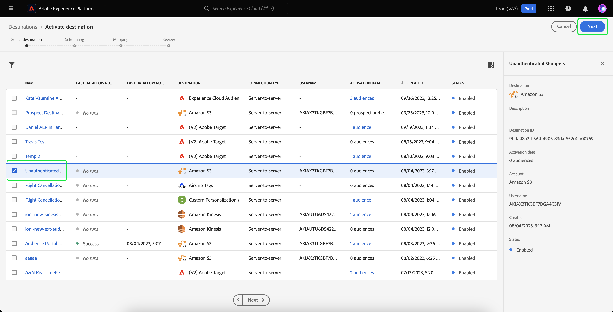

# Redirecionamento externo de visitantes não autenticados

>[!AVAILABILITY]
>
>Essa funcionalidade está disponível para clientes que licenciaram o Real-Time CDP (Serviço de aplicativo), Adobe Experience Platform Ativation, Real-Time CDP, Real-Time CDP Prime, Real-Time CDP Ultimate. Leia mais sobre esses pacotes nas [descrições do produto](https://helpx.adobe.com/legal/product-descriptions.html?lang=pt-BR) e entre em contato com a pessoa representante da Adobe para obter mais informações.

Saiba como criar um público-alvo de visitantes não autenticados e redirecioná-los usando IDs duráveis fornecidas pelo parceiro.

## Por que considerar este caso de uso {#why-use-case}

Com a eliminação gradual de cookies de terceiros, os profissionais de marketing digital devem reimaginar suas estratégias para se reengajarem com visitantes anônimos. As marcas que escolherem se integrar aos fornecedores de identidade para o reconhecimento de visitantes em tempo real também podem aproveitar os identificadores duráveis fornecidos pelos parceiros para o redirecionamento de mídia paga fora do site.

Apesar do alto volume de tráfego, muitas marcas observam uma queda significativa na fase de conversão. Os visitantes se envolvem com demonstrações de conteúdo e produto, mas saem sem se inscrever ou fazer uma compra.

Você não só pode criar públicos-alvo com base no engajamento no site para personalizar mensagens de marketing, como também pode usar o suporte ao Adobe para IDs de parceiros para reengajar com visitantes em destinos de mídia paga.

## Pré-requisitos e planejamento {#prerequisites-and-planning}

Ao planejar o redirecionamento de visitantes não autenticados, considere os seguintes pré-requisitos durante o processo de planejamento:

- Eu configurei as IDs de parceiro com os namespaces de identidade adequados?

Além disso, para implementar o caso de uso, você usará a seguinte funcionalidade do Real-Time CDP e elementos da interface do usuário. Certifique-se de que você tenha as permissões de controle de acesso com base em atributos necessárias para todas essas áreas ou peça ao administrador do sistema para conceder as permissões necessárias.

- [Públicos-alvo](../../segmentation/home.md)
- [Atributos computados](../../profile/computed-attributes/overview.md)
- [Destinos](../../destinations/home.md)
- [Web SDK](../../edge/home.md)

## Obter dados de parceiros na Real-Time CDP {#get-data-in}

Para criar um público-alvo de visitantes não autenticados, primeiro será necessário obter os dados do parceiro no Real-Time CDP.

Para saber como importar dados para o Real-Time CDP da melhor maneira usando o SDK da Web, leia o [seções de gerenciamento de dados e coleta de dados do evento](./onsite-personalization.md#data-management) do caso de uso de personalização no local.

## Antecipando IDs fornecidas pelo parceiro {#bring-partner-ids-forward}

Depois de importar as IDs fornecidas pelo parceiro para um conjunto de dados de evento, será necessário obter esses dados nos registros de perfil. Você pode fazer isso utilizando atributos computados.

Os atributos computados permitem converter rapidamente os dados comportamentais do perfil em valores agregados no nível do perfil. Como resultado, você pode usar essas expressões, como &quot;total de compras vitalícias&quot; no perfil, permitindo usar facilmente o atributo calculado em seus públicos-alvo. Mais informações sobre atributos computados podem ser encontradas na [visão geral dos atributos computados](../../profile/computed-attributes/overview.md).

Para acessar atributos calculados, selecione **[!UICONTROL Perfis]** seguido por **[!UICONTROL Atributos computados]** e **[!UICONTROL Criar atributo calculado]**.

![A variável [!UICONTROL Criar atributos computados] é realçado além do botão [!UICONTROL Atributos computados] na guia [!UICONTROL Perfis] espaço de trabalho.](../assets/offsite-retargeting/create-ca.png)

A variável **[!UICONTROL Criar atributo calculado]** é exibida. Nesta página, você pode usar os componentes para criar seu atributo calculado.

>[!NOTE]
>
>Para obter informações mais detalhadas sobre como criar atributos computados, leia a [guia da interface de atributos computados](../../profile/computed-attributes/ui.md).

Para este caso de uso, você pode criar um atributo calculado que, se a ID do parceiro existir, obterá o valor mais recente da ID do parceiro nas últimas 24 horas.

Usando a barra de pesquisa, você pode localizar e adicionar o evento &quot;ID do parceiro&quot; à tela de atributos computados.

![A variável [!UICONTROL Eventos] e a barra de pesquisa são realçadas.](../assets/offsite-retargeting/ca-add-partner-id.png)

Depois de adicionar o evento &quot;ID do parceiro&quot; à definição, defina a condição de filtragem do evento como **[!UICONTROL Existe]**, defina a condição de filtragem de eventos como a **[!UICONTROL Mais recente]** valor da ID de parceiro adicionada e com um período de pesquisa de 24 horas.

Dê ao atributo calculado um nome apropriado (como &quot;ID do parceiro&quot;) e uma descrição, em seguida, selecione **[!UICONTROL Publish]** para concluir o processo de criação de atributo calculado.

## Criar um público-alvo usando o atributo calculado {#create-audience}

Agora que você criou o atributo calculado, pode usar este atributo calculado para criar um público-alvo. Neste exemplo, você criará um público-alvo composto por visitantes que visitaram seu site mais de 5 vezes este mês, mas ainda não se inscreveram.

Para criar um público, selecione **[!UICONTROL Públicos-alvo]**, seguido por **[!UICONTROL Criar público]**.

![A variável [!UICONTROL Criar público] é realçado.](../assets/offsite-retargeting/create-audience.png)

Uma caixa de diálogo é exibida, solicitando que você escolha entre [!UICONTROL Compor público] e [!UICONTROL Criar regra]. Selecionar **[!UICONTROL Criar regra]** seguido por **[!UICONTROL Criar]**.

![A variável [!UICONTROL Criar regra] é realçado.](../assets/offsite-retargeting/select-build-rule.png)

A página Construtor de segmentos é exibida. Nesta página, você pode usar os componentes para criar seu público-alvo.

>[!NOTE]
>
>Para obter informações mais detalhadas sobre como usar o Construtor de segmentos, leia o [Guia da interface do usuário do Construtor de segmentos](../../segmentation/ui/segment-builder.md).

Para atingir o objetivo de encontrar esses visitantes, primeiro será necessário adicionar um **[!UICONTROL Exibição da página]** para o seu público-alvo. Selecione o **[!UICONTROL Eventos]** em **[!UICONTROL Campos]**, em seguida, arraste e solte a **[!UICONTROL Exibição da página]** evento e adicione-o à tela da seção eventos.

![A variável [!UICONTROL Eventos] na guia [!UICONTROL Campos] é realçada, durante a exibição da variável [!UICONTROL Exibição da página]evento.](../assets/offsite-retargeting/add-page-view.png)

Selecione o novo adicionado **[!UICONTROL Exibição da página]** evento. Alterar o período de pesquisa de **[!UICONTROL A qualquer momento]** para **[!UICONTROL Este mês]** e altere a regra de evento para incluir **No mínimo 5**.

![Detalhes do adicionado [!UICONTROL Exibição da página] evento são exibidos.](../assets/offsite-retargeting/edit-event.png)

Depois de adicionar o evento, será necessário adicionar um atributo. Como você está trabalhando com visitantes não autenticados, é possível adicionar o atributo calculado que acabou de criar. Este atributo calculado recém-criado permite vincular IDs de parceiros a um público-alvo.

Para adicionar o atributo calculado, em **[!UICONTROL Atributos]**, selecione **[!UICONTROL Perfil individual XDM]**, seguido por **[!UICONTROL _atag]**, **[!UICONTROL AtributosComputadosdoSistema]**, e **[!UICONTROL PartnerID]**. Agora, adicione o **[!UICONTROL Valor]** do atributo calculado para a seção atributos da tela.

Além disso, procure por **[!UICONTROL Email pessoal]** e adicione o **[!UICONTROL Endereço]** atributo abaixo **[!UICONTROL PartnerID]** à seção atributos da tela.

![A variável [!UICONTROL PartnerID] atributo calculado e a variável [!UICONTROL Endereço de email pessoal] atributos são destacados na tela Construtor de segmentos.](../assets/offsite-retargeting/added-attributes.png)

Agora que seus atributos foram adicionados, será necessário definir seus critérios de avaliação. Para **[!UICONTROL PartnerID]**, defina o critério como **[!UICONTROL existe]** e para **[!UICONTROL Endereço]**, defina o critério como **[!UICONTROL não existe]**.

Você criou com sucesso um público-alvo que procura visitantes de alta intensidade com uma ID fornecida pelo parceiro, mas que ainda não se inscreveram no site. Nomeie seu público-alvo como &quot;Redirecionamento de usuários não autenticados&quot; e selecione **[!UICONTROL Salvar]** para concluir a criação do público-alvo.

## Ativar seu público {#activate-audience}

Depois de criar seu público-alvo com êxito, você pode ativá-lo para destinos downstream. Selecionar **[!UICONTROL Públicos-alvo]** no painel de navegação esquerdo, procure pelo público-alvo recém-criado, selecione o ícone de reticências e selecione **[!UICONTROL Ativar para destino]**.

![A variável [!UICONTROL Ativar para destino] é realçado.](../assets/offsite-retargeting/activate-to-destination.png)

>[!NOTE]
>
>Todos os tipos de destino, incluindo destinos baseados em arquivos, oferecem suporte à ativação de público-alvo com IDs de parceiros.
>
>Para obter mais informações sobre como ativar públicos-alvo para um destino, leia o [visão geral da ativação](../../destinations/ui/activation-overview.md).

A variável **[!UICONTROL Ativar destino]** é exibida. Nesta página, você pode selecionar para qual destino deseja ativar seu destino. Após selecionar o destino escolhido, selecione **[!UICONTROL Próxima]**.

A variável **[!UICONTROL Agendamento]** é exibida. Nesta página, você pode criar um agendamento que determina a frequência com que deseja ativar o público-alvo. Selecionar **[!UICONTROL Criar programação]** para criar um agendamento para a ativação de público-alvo.

![A variável [!UICONTROL Criar programação] é realçado.](../assets/offsite-retargeting/select-create-schedule.png)

A variável [!UICONTROL Agendamento] popover é exibido. Nesta página, você pode criar a programação para a ativação do público-alvo. Após configurar o agendamento, selecione **[!UICONTROL Criar]** para continuar.

Depois de confirmar os detalhes do agendamento, selecione **[!UICONTROL Próxima]**.

A variável **[!UICONTROL Selecionar atributos]** é exibida. Nesta página, você pode selecionar quais atributos deseja exportar junto com o público-alvo ativado. No mínimo, inclua a ID do parceiro, pois isso permitirá identificar os visitantes que você planeja redirecionar. Selecionar **[!UICONTROL Adicionar novo mapeamento]** e procure o atributo calculado. Depois de adicionar os atributos necessários, selecione **[!UICONTROL Próxima]**.

![Ambos os [!UICONTROL Adicionar novo mapeamento] e o atributo calculado são destacados.](../assets/offsite-retargeting/add-new-mapping.png)

A variável **[!UICONTROL Revisão]** é exibida. Nesta página, você pode revisar os detalhes da ativação do público-alvo. Se estiver satisfeito com os detalhes fornecidos, selecione **[!UICONTROL Concluir]**.

![A variável [!UICONTROL Revisão] será exibida, mostrando os detalhes da ativação do público-alvo.](../assets/offsite-retargeting/review-destination-activation.png)

Agora você ativou um público-alvo de usuários não autenticados para um destino downstream para redirecionamento adicional.

## Outros casos de uso {#other-use-cases}

Você pode explorar mais casos de uso ativados por meio do suporte a dados de parceiros no Real-Time CDP:

- [Envolver e adquirir novos clientes](./prospecting.md) usando dados do parceiro.
- [Personalizar experiências no site](./offsite-retargeting.md) com reconhecimento de visitante auxiliado por parceiro.
- [Completar perfis próprios](./supplement-first-party-profiles.md) com atributos fornecidos pelo parceiro.
