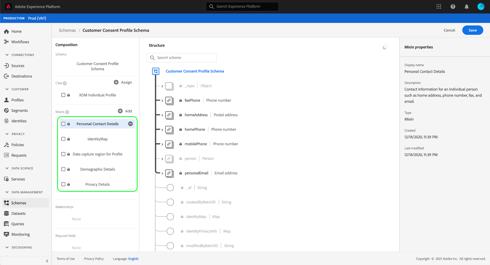

# Criar conjuntos de dados para capturar dados de consentimento do IAB TCF 2.0

Para [!DNL Real-time Customer Data Platform] processar os dados de consentimento do cliente em conformidade com o IAB [!DNL Transparency & Consent Framework] (TCF) 2.0, esses dados devem ser enviados para conjuntos de dados cujos schemas contenham campos de consentimento do TCF 2.0.

Especificamente, dois conjuntos de dados são necessários para capturar dados de consentimento do TCF 2.0:

* Um conjunto de dados baseado na [!DNL XDM Individual Profile] classe, habilitado para uso em [!DNL Real-time Customer Profile].
* Um conjunto de dados baseado na [!DNL XDM ExperienceEvent] classe.

Este documento fornece etapas para configurar esses dois conjuntos de dados para coletar dados de consentimento do IAB TCF 2.0. Para obter uma visão geral do fluxo de trabalho completo para configurar [!DNL Real-time CDP] para TCF 2.0, consulte a visão geral [de conformidade do](./overview.md)IAB TCF 2.0.

## Pré-requisitos

Este tutorial requer uma compreensão funcional dos seguintes componentes do Adobe Experience Platform:

* [Modelo de dados de experiência (XDM)](../../../xdm/home.md): A estrutura padronizada pela qual [!DNL Experience Platform] organiza os dados de experiência do cliente.
   * [Noções básicas da composição](../../../xdm/schema/composition.md)do schema: Saiba mais sobre os elementos básicos dos schemas XDM.
   * [Crie um schema na interface do usuário](../../../xdm/tutorials/create-schema-ui.md): Um tutorial que aborda as noções básicas de como trabalhar com o Editor de Schemas.
* [Serviço](../../../identity-service/home.md)de identidade Adobe Experience Platform: Permite que você conecte identidades de clientes de suas diferentes fontes de dados entre dispositivos e sistemas.
* [Perfil](../../../profile/home.md)do cliente em tempo real: Aproveita [!DNL Identity Service] para permitir que você crie perfis detalhados do cliente a partir de seus conjuntos de dados em tempo real. [!DNL Real-time Customer Profile] extrai dados do Data Lake e persiste em perfis do cliente em seu próprio armazenamento de dados separado.

## Estrutura do schema de consentimento {#structure}

Há duas misturas XDM que fornecem campos de consentimento do cliente necessários para o suporte ao TCF 2.0: um para dados baseados em registros ([!DNL XDM Individual Profile]) e outro para dados baseados em séries temporais ([!DNL XDM ExperienceEvent]):

| Esquema | Descrição |
| --- | --- |
| mixagem de privacidade do perfil | Essa combinação captura as preferências de consentimento atuais de um cliente. Quando usados em um schema [!DNL Profile]habilitado, os valores fornecidos nesta combinação são considerados a fonte da verdade para a forma como a aplicação da lei de consentimento deve se aplicar aos dados de um cliente. |
| [!DNL Experience Event] mixagem de privacidade | Essa combinação captura as preferências de consentimento de um cliente em um determinado momento. Os dados capturados nesses campos podem ser usados para rastrear alterações nas preferências de consentimento de um cliente ao longo do tempo. |

Embora o caso de uso de cada mistura seja diferente, os campos específicos que eles fornecem são aproximadamente os mesmos. Esses campos são explicados mais detalhadamente na seção a seguir.

### Confirmar campos de combinação {#privacy-mixin}

Embora cada combinação de privacidade varie na estrutura e nos tipos de campos que eles contêm, ambos fornecem o `xdm:consentString` atributo, cujos subcampos são necessários para que a aplicação do TCF 2.0 ocorra. A estrutura desses campos é mostrada abaixo, juntamente com os tipos de valores que eles esperam:

```json
{
  "xdm:consentString": {
    "xdm:consentStandard": "IAB TCF",
    "xdm:consentStandardVersion": "2.0",
    "xdm:consentStringValue": "BObdrPUOevsguAfDqFENCNAAAAAmeAAA.PVAfDObdrA.DqFENCAmeAENCDA",
    "xdm:gdprApplies": true,
    "xdm:containsPersonalData": false
  }
}
```

| Propriedade | Descrição |
| --- | --- |
| `xdm:consentString` | Contém os dados de consentimento atualizados do cliente e outras informações contextuais. |
| `xdm:consentStandard` | A estrutura de consentimento à qual os dados se aplicam. Para a conformidade com o TCF, o valor deve ser &quot;IAB TCF&quot;. |
| `xdm:consentStandardVersion` | O número da versão da estrutura de consentimento indicado por `xdm:consentStandard`. Para conformidade com TCF 2.0, o valor deve ser &quot;2.0&quot;. |
| `xdm:consentStringValue` | A cadeia de caracteres de consentimento que foi gerada com base nas configurações de consentimento selecionadas do cliente. |
| `xdm:gdprApplies` | Um valor booliano que indica se o RGPD se aplica ou não a este cliente. O valor deve ser definido como &quot;true&quot; para que a aplicação do TCF 2.0 ocorra. O padrão é &quot;false&quot; se não estiver incluído. |
| `xdm:containsPersonalData` | Um valor booliano que indica se a atualização de consentimento contém ou não dados pessoais. O padrão é &quot;false&quot; se não estiver incluído. |

## Criar schemas de consentimento do cliente {#create-schemas}

Na interface do usuário da plataforma, clique em **[!UICONTROL Schemas]** no painel de navegação esquerdo para abrir a área de trabalho de *[!UICONTROL Schemas]*. Aqui, siga as etapas nas seções abaixo para criar cada schema necessário.

>[!NOTE]
>
>Se você tiver schemas XDM existentes que deseja usar para capturar dados de consentimento, edite esses schemas em vez de criar novos. No entanto, ao editar schemas existentes, é importante seguir os [princípios da evolução](../../../xdm/schema/composition.md#evolution) do schema para evitar mudanças.

### Criar um schema de consentimento baseado em registros {#profile-schema}

Na guia **[!UICONTROL Procurar]** na área de trabalho **[!UICONTROL Schemas], crie um novo schema com base na** classe **[!DNL XDM Individual Profile]**. Depois que o schema for aberto no Editor de Schemas, clique em **[!UICONTROL Adicionar]** na seção **[!UICONTROL Misturas]** no lado esquerdo da tela.


A caixa de diálogo **[!UICONTROL Adicionar mistura]** é exibida. Aqui, selecione privacidade **[!UICONTROL do]** Perfil na lista. Como opção, você pode usar a barra de pesquisa para restringir os resultados para localizar a mistura mais fácil. Depois que a mistura for selecionada, clique em **[!UICONTROL Adicionar mistura]**.


A tela do Editor de Schemas é reexibida, permitindo que você analise a estrutura dos campos de sequência de caracteres de consentimento adicionados.


Daqui, repita as etapas acima para adicionar as seguintes combinações adicionais ao schema:

* [!UICONTROL IdentityMap]
* [!UICONTROL Região de captura de dados para o Perfil]
* [!UICONTROL Detalhes da pessoa do perfil]
* [!UICONTROL Detalhes pessoais do perfil]



Se você estiver editando um schema existente que já foi ativado para uso no [!DNL Real-time Customer Profile], clique em **[!UICONTROL Salvar]** para confirmar suas alterações antes de pular para a seção sobre como [criar um conjunto de dados com base no seu schema](#dataset)de consentimento. Se você estiver criando um novo schema, continue seguindo as etapas descritas na subseção abaixo.

#### Ative o schema para uso em [!DNL Real-time Customer Profile]

Para associar [!DNL Real-time CDP] os dados de consentimento que recebe a perfis de clientes específicos, o schema de consentimento deve ser habilitado para uso em [!DNL Real-time Customer Profile].

>[!NOTE]
>
>O schema de exemplo mostrado nesta seção usa seu `identityMap` campo como sua identidade primária. Se desejar definir outro campo como uma identidade primária, certifique-se de que está usando um identificador indireto, como uma ID de cookie, e não um campo diretamente identificável que está proibido de usar em publicidade com base em interesses, como um endereço de email. Consulte seu Consultor jurídico se não tiver certeza sobre quais campos são restritos.
>
>As etapas sobre como definir um campo de identidade principal para um schema podem ser encontradas no tutorial [de criação do](../../../xdm/tutorials/create-schema-ui.md#identity-field)schema.

Para ativar o schema para [!DNL Profile], clique no nome do schema no painel esquerdo para abrir a caixa de diálogo de propriedades **[!UICONTROL do]** Schema no painel direito. Aqui, clique no botão de alternância de **[!UICONTROL Perfil]** .


Um provedor é exibido, indicando uma identidade primária ausente. Marque a caixa de seleção para usar uma identidade primária alternativa, já que a identidade primária estará contida no campo identityMap.

<br>

Por fim, clique em **[!UICONTROL Salvar]** para confirmar as alterações.


### Criar um schema de consentimento baseado em séries de tempo {#event-schema}

Na guia **[!UICONTROL Procurar]** na área de trabalho **[!UICONTROL Schemas], crie um novo schema com base na** classe **[!DNL XDM ExperienceEvent]**. Depois que o schema for aberto no Editor de Schemas, clique em **[!UICONTROL Adicionar]** na seção **[!UICONTROL Misturas]** no lado esquerdo da tela.


A caixa de diálogo **[!UICONTROL Adicionar mistura]** é exibida. Aqui, selecione a combinação **[!UICONTROL de privacidade do]** Experience evento na lista. Como opção, você pode usar a barra de pesquisa para restringir os resultados para localizar a mistura mais fácil. Depois que a mistura for selecionada, clique em **[!UICONTROL Adicionar mistura]**.


A tela do Editor de Schemas é exibida novamente, mostrando os campos de sequência de caracteres de consentimento adicionados.


Daqui, repita as etapas acima para adicionar as seguintes combinações adicionais ao schema:

* [!UICONTROL IdentityMap]
* [!UICONTROL Detalhes do ambiente ExperienceEvent]
* [!UICONTROL Detalhes da Web do ExperienceEvent]
* [!UICONTROL Detalhes da implementação do ExperienceEvent]

Depois que as mixagens forem adicionadas, conclua clicando em **[!UICONTROL Salvar]**.


## Criar conjuntos de dados com base em seus schemas de consentimento {#datasets}

Para cada um dos schemas obrigatórios descritos acima, você deve criar um conjunto de dados que acabará assimilando os dados de consentimento dos clientes. O conjunto de dados baseado no [!DNL XDM Individual Profile] schema deve ser habilitado para [!DNL Real-time Customer Profile], enquanto o conjunto de dados baseado no [!DNL XDM ExperienceEvent] schema não deve ser [!DNL Profile]-ativado.

Para começar, selecione **[!UICONTROL Conjuntos]** de dados na navegação à esquerda e clique em **[!UICONTROL Criar conjunto]** de dados no canto superior direito.


Na próxima página, selecione **[!UICONTROL Criar conjunto de dados a partir do schema]**.


O fluxo de trabalho **[!UICONTROL Criar conjunto de dados a partir do schema]** é exibido, começando na etapa **[!UICONTROL Selecionar schema]** . Na lista fornecida, localize um dos schemas de consentimento criados anteriormente. Como opção, você pode usar a pesquisa para restringir os resultados e localizar seu schema mais facilmente. Clique no botão de opção ao lado do schema para selecioná-lo e clique em **[!UICONTROL Avançar]** para continuar.


A etapa **[!UICONTROL Configurar conjunto de dados]** é exibida. Forneça um nome e uma descrição exclusivos e facilmente identificáveis para o conjunto de dados antes de clicar em **[!UICONTROL Concluir]**.


A página de detalhes do conjunto de dados recém-criado é exibida. Se o conjunto de dados for baseado em seu [!DNL XDM ExperienceEvent] schema, o processo será concluído. Se o conjunto de dados for baseado no seu [!DNL XDM Individual Profile] schema, a etapa final do processo é habilitar o conjunto de dados para uso no [!DNL Real-time Customer Profile]. No painel direito, clique no botão de alternância de **[!UICONTROL Perfil]** para ativar o conjunto de dados.


Siga as etapas acima novamente para criar o outro conjunto de dados necessário para conformidade com o TCF 2.0.

## Próximas etapas

Seguindo este tutorial, você criou dois conjuntos de dados que agora podem ser usados para coletar dados de consentimento do cliente:

* Um conjunto de dados [!DNL Profile]habilitado com base no seu [!DNL XDM Individual Profile] schema.
* Um conjunto de dados baseado no seu [!DNL XDM ExperienceEvent] schema para o qual não está ativado [!DNL Profile].

Agora você pode retornar à visão geral [do](./overview.md#merge-policies) IAB TCF 2.0 para continuar o processo de configuração [!DNL Real-time CDP] para conformidade com o TCF 2.0.