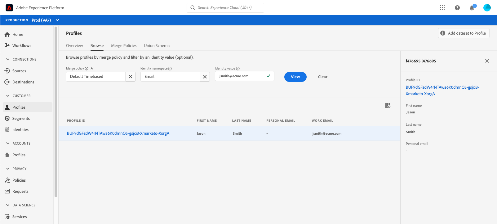
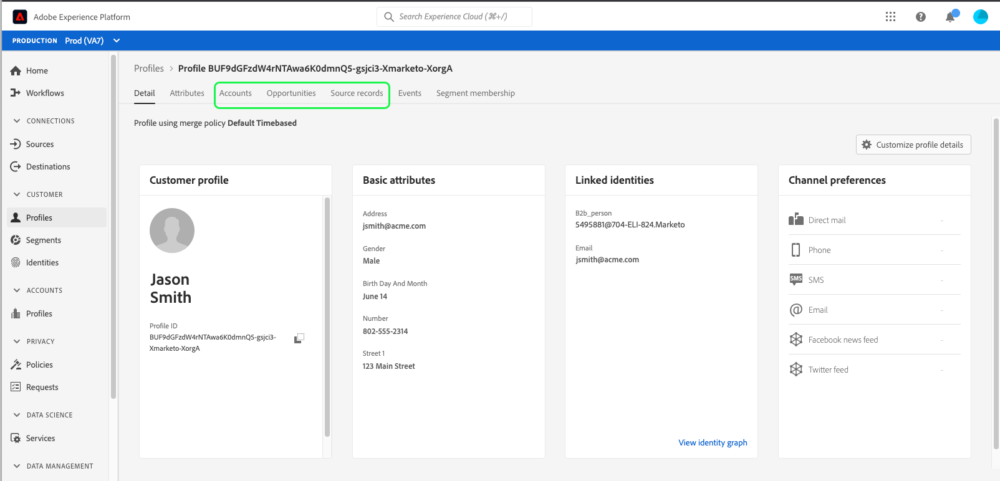
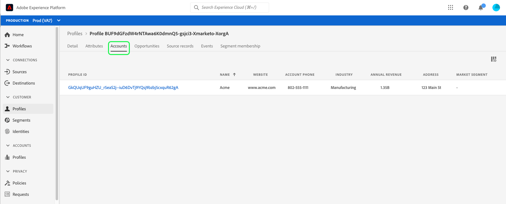
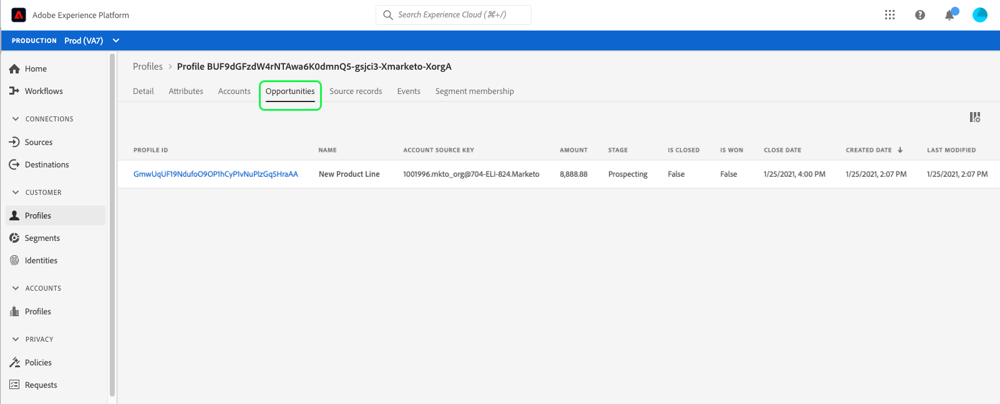
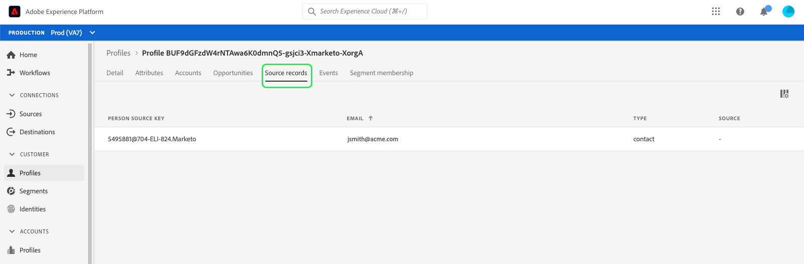

# Procurar perfis no Real-Time Customer Data Platform

O Perfil do cliente em tempo real cria uma visualização integral de cada cliente individual, combinando dados de vários canais, inclusive dados online, offline, de CRM e de terceiros. À medida que perfis individuais são agregados com base nos dados trazidos para o sistema de várias fontes, cada perfil se torna uma conta acionável com carimbo de data e hora de cada interação que seu cliente tem com sua marca.

Na interface do usuário do Adobe Experience Platform, você pode visualizar esses perfis somente leitura e ver informações importantes sobre cada cliente individual, incluindo suas preferências, eventos anteriores, interações e os públicos aos quais o indivíduo pertence.

O Adobe Real-Time Customer Data Platform foi criado com base no Adobe Experience Platform e, portanto, pode usar os recursos de visualização de perfil na interface do usuário do Experience Platform. Para obter um guia detalhado sobre como visualizar perfis de clientes na interface do usuário do Experience Platform, consulte o [guia do usuário do Perfil do cliente em tempo real](../../profile/ui/user-guide.md).

## Aprimoramentos de perfil para Real-Time CDP, B2B edition

Além dos recursos de navegação de perfil com suporte da Adobe Experience Platform, Real-Time CDP, os usuários do B2B edition podem acessar atributos e eventos B2B no perfil do cliente nas guias [!UICONTROL Attributes] e [!UICONTROL Events], respectivamente. Os dados B2B também podem ser usados para executar a segmentação, com esses públicos aparecendo na guia [!UICONTROL Audience membership] do cliente ao lado de públicos-alvo que não sejam B2B.

A Real-Time CDP e a B2B edition também permitem navegar no [!UICONTROL Accounts], [!UICONTROL Opportunities] e [!UICONTROL Source records] de todas as fontes da empresa associadas a um cliente individual.

Para explorar esses aprimoramentos, comece seguindo as etapas descritas no [guia do usuário do Perfil do cliente em tempo real](../../profile/ui/user-guide.md) para procurar um perfil por política de mesclagem ou namespace de identidade.

Os detalhes do perfil incluem acesso às guias [!UICONTROL Accounts], [!UICONTROL Opportunities] e [!UICONTROL Source records], além das informações padrão fornecidas no perfil do cliente, que também foram aprimoradas com eventos e atributos B2B.

Para saber mais sobre os detalhes do perfil fornecidos na interface do Experience Platform, consulte a [seção de detalhes da documentação do painel Perfis](../../dashboards/guides/profiles.md#browse-profiles).

### Guia Contas

Selecione **[!UICONTROL Accounts]** para exibir uma lista de contas relacionadas ao perfil. Essa lista inclui informações básicas do perfil da conta, como nome, site e setor da conta, bem como um link para o perfil da conta.

Para obter mais informações sobre como visualizar e explorar perfis de conta, comece lendo a [visão geral dos perfis de conta](../accounts/account-profile-overview.md).

### Guia Oportunidades

A guia **[!UICONTROL Opportunities]** fornece detalhes relacionados a oportunidades abertas e fechadas relacionadas à conta. Essas oportunidades podem ser assimiladas na Experience Platform a partir de várias fontes. No entanto, a Real-Time CDP e a B2B edition facilitam que os profissionais de marketing vejam todas essas oportunidades juntas em um único local.

Cada oportunidade inclui informações como o nome da oportunidade, sua quantidade, estágio e se a oportunidade está em aberto, fechada, ganha ou perdida.

### Guia Registros do Source

A guia **[!UICONTROL Source records]** permite ver facilmente os vários registros de origem provenientes das fontes da empresa que estão contribuindo para o perfil de cliente único. Além do [!UICONTROL Person source key] e do endereço de email, cada registro de origem também fornece o tipo de registro (por exemplo, um registro de &quot;contato&quot; ou &quot;cliente potencial&quot;), bem como a origem.

