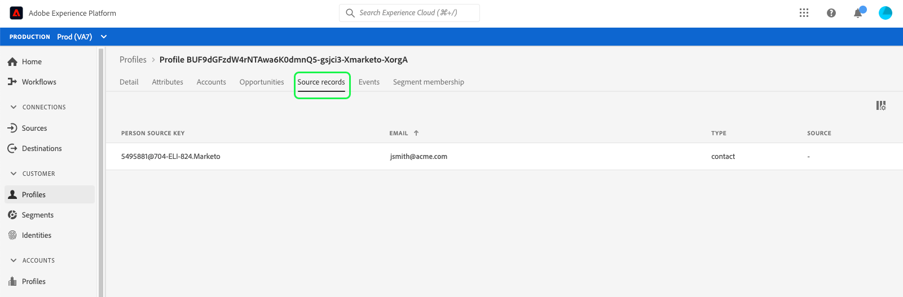

# Procurar perfis no Real-time Customer Data Platform

O Perfil do cliente em tempo real cria uma visualização holística de cada cliente individual, combinando dados de vários canais, incluindo dados online, offline, CRM e de terceiros. À medida que perfis individuais são agregados com base em dados trazidos para o sistema de várias fontes, cada perfil se torna uma conta acionável com carimbos de data e hora de cada interação que seu cliente tem com sua marca.

Na interface do usuário do Adobe Experience Platform, é possível visualizar esses perfis somente leitura e ver informações importantes sobre cada um de seus clientes individuais, incluindo suas preferências, eventos passados, interações e os segmentos aos quais o indivíduo pertence.

O Real-time Customer Data Platform foi criado sobre o Adobe Experience Platform e, portanto, pode usar os recursos de visualização de perfil na interface do usuário do Experience Platform. Para obter um guia detalhado para visualizar os perfis do cliente na interface do usuário da plataforma, consulte o [Guia do usuário do Perfil do cliente em tempo real](../../profile/ui/user-guide.md).

## Aprimoramentos de perfil para CDP em tempo real, B2B Edition

>[!IMPORTANT]
>
>Atualmente, o Real-time Customer Data Platform B2B Edition está em beta. A documentação e a funcionalidade estão sujeitas a alterações.

Além dos recursos de navegação do perfil compatíveis com o Adobe Experience Platform, os usuários de CDP em tempo real, B2B Edition podem acessar atributos e eventos B2B no perfil do cliente nas guias [!UICONTROL Atributos] e [!UICONTROL Eventos], respectivamente. Os dados B2B também podem ser usados para executar a segmentação, com os segmentos aparecendo na guia [!UICONTROL Segment membership] do cliente ao lado de segmentos não B2B.

A CDP em tempo real, B2B Edition também permite navegar [!UICONTROL Accounts], [!UICONTROL Oportunidades], e [!UICONTROL Source records] de todas as origens empresariais associadas a um cliente individual.

Para explorar esses aprimoramentos, comece seguindo as etapas descritas no [Guia do usuário de Perfil do cliente em tempo real](../../profile/ui/user-guide.md) para navegar em um perfil por política de mesclagem ou namespace de identidade.

Os detalhes do perfil incluem acesso às guias [!UICONTROL Accounts], [!UICONTROL Oportunidades] e [!UICONTROL Source records], além das informações padrão fornecidas no perfil do cliente que também foram aprimoradas com eventos e atributos B2B.

### Guia Contas

Selecione **[!UICONTROL Accounts]** para visualizar uma lista de contas relacionadas ao perfil. Esta lista inclui informações básicas do perfil da conta, como o nome, o site e o setor da conta, bem como um link para o perfil da conta.

Para obter mais informações sobre como visualizar e explorar perfis de conta, comece lendo a [visão geral dos perfis de conta](../accounts/account-profile-overview.md).

### Guia Oportunidades

A guia **[!UICONTROL Oportunidades]** fornece detalhes relacionados a oportunidades abertas e fechadas relacionadas à conta. Essas oportunidades podem ser assimiladas em Experience Platform de várias fontes, no entanto, a CDP em tempo real, a B2B Edition, facilita para os profissionais de marketing verem todas essas oportunidades juntas em um único lugar.

Cada oportunidade inclui informações como o nome da oportunidade, sua quantidade, estágio e se a oportunidade está aberta, fechada, ganha ou perdida.

### Guia Registros de origem

A guia **[!UICONTROL Source records]** permite ver facilmente os vários registros de origem provenientes de suas fontes empresariais que estão contribuindo para o perfil único do cliente. Além da [!UICONTROL Chave de origem da pessoa] e endereço de email, cada registro de origem também fornece o tipo de registro (por exemplo, um registro de &quot;contato&quot; ou &quot;lead&quot;), bem como a fonte.

