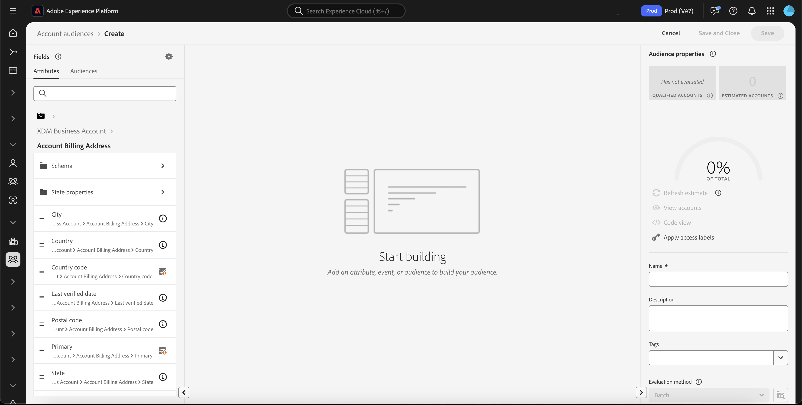
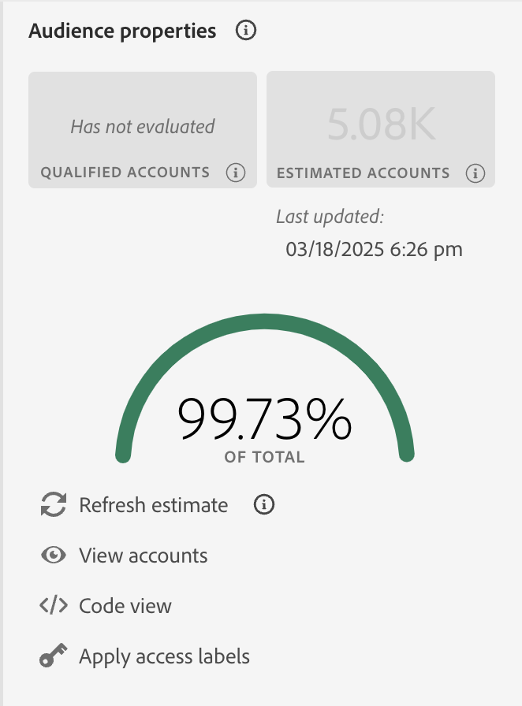

# Construtor de público-alvo no Real-Time Customer Data Platform

Criado com base no Adobe Experience Platform, o [!DNL Adobe Real-Time Customer Data Platform] pode usar todos os recursos do Audience Builder que fazem parte do [!DNL Experience Platform]. O espaço de trabalho fornece controles intuitivos para criar e editar regras, como arrastar e soltar blocos usados para representar propriedades de dados.

{zoomable="yes"}

## Campos {#fields}

>[!CONTEXTUALHELP]
>id="platform_b2b_audiencebuilder_showfullxdmschema"
>title="Mostrar esquema XDM completo"
>abstract="Por padrão, somente os campos que contêm dados são exibidos. Habilite essa opção para mostrar todos os campos no esquema XDM."

>[!CONTEXTUALHELP]
>id="platform_b2b_audiencebuilder_showrelationselectors"
>title="Mostrar seletores de relação"
>abstract="Por padrão, são usadas as relações padrão de sua organização. Habilite esta opção para mostrar os seletores de relação usados."

>[!CONTEXTUALHELP]
>id="platform_b2b_audiencebuilder_showconstrainedfields"
>title="Mostrar campos restritos"
>abstract="Por padrão, somente os campos que não têm restrições são exibidos. Habilite esta opção para mostrar os campos que possuem restrições."

Ao usar o Construtor de público-alvo para contas, você pode usar atributos de conta ou públicos-alvo existentes como campos do público-alvo.

Você pode selecionar o  para ajustar as configurações dos campos exibidos.

{zoomable="yes"}

>[!NOTE]
>
>A seção **[!UICONTROL Field options]** está atualmente na versão beta e está disponível somente para clientes selecionados. Entre em contato com o atendimento ao cliente da Adobe para mais informações.

A seção [!UICONTROL Settings] é exibida. Nesta seção, você pode atualizar quais campos são exibidos, bem como a relação dos campos.

Para **[!UICONTROL Field options]**, você pode mostrar apenas os campos que contêm dados ou o esquema XDM completo.

Para o **[!UICONTROL Relationship of fields]**, você pode usar as relações padrão para sua organização ou mostrar os seletores de relação.

{width="300"}

### Atributos {#attributes}

A guia [!UICONTROL Attributes] permite procurar atributos de Conta pertencentes à classe Conta Comercial XDM, bem como atributos baseados em oportunidades e pessoas. Cada pasta pode ser expandida para revelar atributos adicionais, onde cada atributo é um bloco que pode ser arrastado para a [tela do construtor de regras](#rule-builder-canvas) no centro do espaço de trabalho.

Ao selecionar um atributo, você pode ver dados de resumo selecionando o [ícone de informações](../../images/icons/info.png). Os dados de resumo incluem informações como valores principais, uma explicação do que é o campo, bem como a porcentagem de contas que contêm valores para esse atributo.

{width="300"}

Se um atributo for preenchido por menos de 25% das contas, o  será exibido. Os mesmos dados de resumo serão exibidos para o atributo, independentemente.

{width="300"}

>[!NOTE]
>
>Os dados de resumo só estarão disponíveis se o atributo pertencer ao esquema Conta, Pessoa ou Oportunidade. Além disso, os valores principais serão exibidos somente se o campo **não** contiver muitos valores diferentes e se esses valores forem repetidos com frequência.
>
>Estes dados de resumo são atualizados **diariamente**.

Para obter um guia mais detalhado sobre o Audience Builder, leia o [guia do usuário do Audience Builder](../../segmentation/ui/segment-builder.md){target="_blank"}.

### Públicos-alvo {#audiences}

A guia **[!UICONTROL Audiences]** lista todos os públicos com base em pessoas e em contas disponíveis no Experience Platform.

Você pode passar o mouse sobre o  ao lado de um público-alvo para ver informações sobre ele, incluindo sua ID, descrição e a hierarquia de pastas para localizá-lo.

{zoomable="yes"}

## Tela do construtor de regras {#rule-builder-canvas}

Um público-alvo criado no Audience Builder é uma coleção de regras usadas para descrever as principais características ou comportamentos de um público-alvo. Essas regras são criadas usando a tela do construtor de regras, localizada no centro do Audience Builder.

Para adicionar uma nova regra à definição de segmento, arraste um bloco da guia **[!UICONTROL Fields]** e solte-o na tela do construtor de regras.

{zoomable="yes"}

Para obter mais informações sobre como usar a tela do construtor de regras, leia a [documentação sobre o Construtor de segmentos](../../segmentation/ui/segment-builder.md#rule-builder-canvas){target="_blank"}.

### Containers {#containers}

As regras de público são avaliadas na ordem em que são listadas. Você pode usar containers para permitir maior controle sobre a ordem de execução por meio do uso de consultas aninhadas.

Para obter mais informações sobre contêineres, leia a [documentação sobre o Construtor de segmentos](../../segmentation/ui/segment-builder.md#containers){target="_blank"}.

## Propriedades de público-alvo {#properties}

A seção **[!UICONTROL Audience properties]** exibe informações sobre o público incluindo o tamanho estimado do público. Você também pode especificar detalhes sobre o público-alvo, incluindo nome, descrição e tags.

{width="300"}

O **[!UICONTROL Qualified accounts]** indica o número real de contas que correspondem às regras do público-alvo. Esse número é atualizado a cada 24 horas, após a execução do trabalho de segmentação.

O **[!UICONTROL Estimated accounts]** indica o número aproximado de contas com base no trabalho de amostra. Você pode atualizar este valor depois de adicionar novas regras ou condições e selecionar **[!UICONTROL Refresh estimate]**.

{width="300"}

Você pode selecionar **[!UICONTROL View accounts]** para ver uma amostra das contas que se qualificariam para o público-alvo com as regras atuais.

{width="300"}

O **[!UICONTROL Code view]** fornece uma descrição baseada em texto das regras do público-alvo.

Você pode selecionar **[!UICONTROL Apply access labels]** para aplicar os rótulos de acesso relevantes ao público. Mais informações sobre rótulos de acesso podem ser encontradas no [guia de gerenciamento de rótulos](../../access-control/abac/ui/labels.md){target="_blank"}.

O restante da seção de propriedades do público permite editar detalhes relacionados ao público-alvo da conta, incluindo o nome, a descrição e as tags.

{width="300"}

Você **não pode** alterar o método de avaliação para públicos-alvo da conta, pois todos os públicos-alvo da conta são avaliados usando a segmentação em lotes.

## Próximas etapas {#next-steps}

O Audience Builder fornece um fluxo de trabalho avançado que permite criar públicos a partir dos dados da conta de negócios XDM.

Para saber mais sobre o Serviço de segmentação para dados de perfil do cliente, leia a [Visão geral do serviço de segmentação](../../segmentation/home.md){target="_blank"}.
