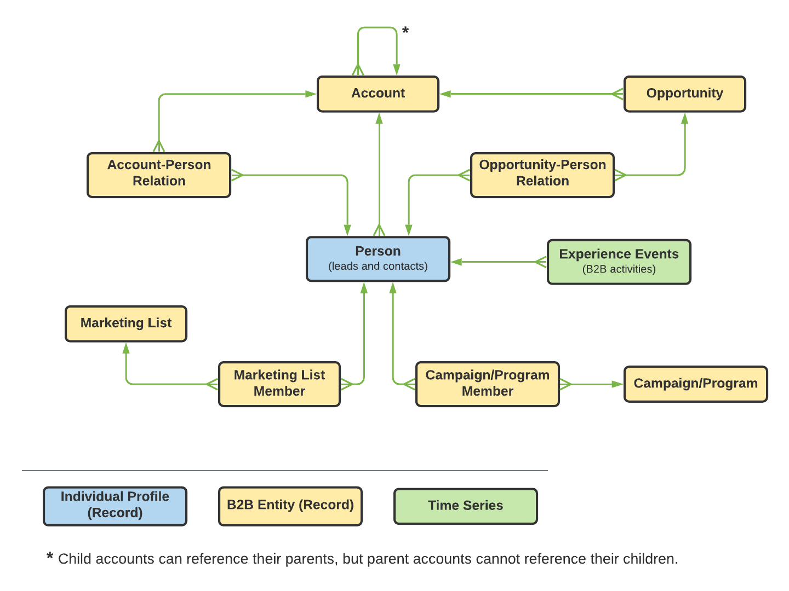
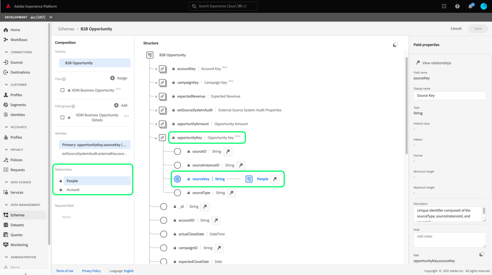

# Visão geral de casos de uso de segmentação para Real-time Customer Data Platform B2B Edition (Beta)

<!-- This document relates to this [ticket](https://jira.corp.adobe.com/browse/PLAT-100468) -->

>[!IMPORTANT]
>
>A CDP B2B Edition em tempo real está atualmente em beta. A documentação e a funcionalidade estão sujeitas a alterações.

Este documento fornece exemplos sobre a segmentação disponível para a CDP B2B Edition em tempo real e como os diferentes tipos de atributos podem ser combinados para casos de uso comuns B2B.

>[!NOTE]
>
>Os atributos necessários para esses casos de uso de segmentação estão disponíveis somente para clientes do Real-time Customer Data Platform B2B Edition. Se você não estiver usando o Real-time Customer Data Platform B2B Edition, consulte [visão geral da segmentação](./segmentation-overview.md) em vez disso.

## Pré-requisitos

Antes de usar os atributos de segmentação para classes B2B, você deve concluir as seguintes etapas:

1. Crie esquemas que usam classes B2B. As classes B2B Edition incluem Conta, Campanha, Oportunidade, Lista de marketing e muito mais. Para obter informações sobre [como configurar esquemas para usar com classes B2B](../schemas/b2b.md) consulte a documentação do schema.
1. Crie relações entre seus esquemas B2B do Experience Data Model (XDM). Segmentos baseados nos atributos B2B Edition exigem relacionamentos entre as classes para usar totalmente a funcionalidade estendida de Segmentação B2B. Consulte a documentação em [como definir uma relação entre dois esquemas B2B](../../xdm/tutorials/relationship-b2b.md) para obter mais informações.
1. Assimilar dados usando conjuntos de dados com base em seus esquemas B2B. Consulte a documentação das fontes para [informações sobre como assimilar dados](../../sources/connectors/adobe-applications/marketo/marketo.md).
1. Leia o [Guia do usuário do Construtor de segmentos](../../segmentation/ui/segment-builder.md) para obter uma orientação mais detalhada sobre como criar segmentos.

Depois que esses requisitos forem atendidos, você poderá combinar esses atributos para casos de uso comuns do B2B.

## Introdução

Depois que os esquemas de união para as classes B2B tiverem relações estabelecidas e tiverem sido usados para assimilar dados, seus atributos serão disponibilizados no painel esquerdo do Construtor de segmentos.

As classes B2B e seus atributos são anexados com um `B2B` no espaço de trabalho Segmentação para diferenciá-los dos disponíveis como padrão no Real-time Customer Data Platform.

Para criar segmentos de maneira eficaz para casos de uso B2B, é importante ter um conhecimento profundo do schema e entender a aparência do modelo de dados. Também é útil estar ciente do caminho que os dados levam de um objeto de dados para outro.

A imagem abaixo ilustra as relações entre as classes B2B disponíveis na CDP B2B Edition em tempo real.

Como seu modelo de dados pode ser complicado, você pode usar a interface do usuário da plataforma para exibir uma representação visual mais detalhada do modelo de dados para ajudar a encontrar os atributos relevantes para o caso de uso. Para iniciar, vá para a interface do usuário da plataforma e selecione Schemas no painel de navegação esquerdo.

Selecione o schema apropriado na lista disponível e selecione o relacionamento apropriado no [!UICONTROL Composição] painel lateral. No exemplo abaixo, selecionar a relação &quot;Pessoa&quot; revela qual atributo no schema atual faz referência ao schema &quot;Pessoa&quot; relacionado (se for o schema de origem no relacionamento), ou é referenciado pelo schema &quot;Pessoa&quot; (se for o schema de destino no relacionamento).

Essa relação é refletida no Construtor de segmentos por meio do uso de `Key` conforme mostrado na imagem abaixo.

Consulte a [esquemas na documentação do Real-time Customer Data Platform B2B Edition](../schemas/b2b.md) para obter mais informações sobre as classes B2B disponíveis.

Os casos de uso abaixo fornecem informações sobre quais classes são usadas para estabelecer relações entre os diferentes esquemas para alcançar esses resultados. Esses exemplos podem ser usados para ajudar você a criar seus próprios segmentos.

## Exemplos de casos de uso diferentes

Os seguintes casos de uso estão disponíveis para segmentação com a B2B Edition. Cada exemplo fornece uma descrição do que o segmento faz e uma descrição das classes usadas para criá-las. As imagens fornecidas realçam o caminho do arquivo na [!UICONTROL Atributos] painel lateral que reflete a estrutura do schema . O [!UICONTROL Propriedades do segmento] A seção à direita da exibição contém um detalhamento escrito dos atributos do segmento.

### Exemplo 1

Encontre todas as pessoas que são o &quot;Decisor&quot; de qualquer oportunidade. Esse segmento requer um link entre as [!UICONTROL Perfil individual XDM] classe e [!UICONTROL Relação de Pessoa da Oportunidade de Negócios XDM] classe .

### Exemplo 2

Encontre todas as pessoas que são diretamente atribuídas a quaisquer oportunidades das quais a quantia de oportunidade é superior à quantia especificada (US$1 milhão). Esse segmento requer um link entre as [!UICONTROL Perfil individual XDM] classe, [!UICONTROL Relação de Pessoa da Oportunidade de Negócios XDM] classe e [!UICONTROL Oportunidade de negócios XDM] classe .

### Exemplo 3

Encontre todas as pessoas que são atribuídas diretamente a qualquer oportunidade em que a conta esteja localizada em um determinado local (Canadá). Esse segmento requer um link entre as [!UICONTROL Perfil individual XDM] classe, [!UICONTROL Relação de Pessoa da Oportunidade de Negócios XDM] classe, [!UICONTROL Oportunidade de negócios XDM] classe e [!UICONTROL Conta Comercial XDM] classe .

### Exemplo 4

Encontre todas as pessoas que são &quot;Decisores&quot; de qualquer oportunidade, onde a conta esteja no setor &quot;Finanças&quot;, e visite a página de preços nos últimos três dias. Esse segmento requer um link entre as [!UICONTROL Perfil individual XDM] classe, [!UICONTROL Relação de Pessoa da Oportunidade de Negócios XDM] classe, [!UICONTROL Oportunidade de negócios XDM] classe e [!UICONTROL Conta Comercial XDM] classe e [!UICONTROL ExperiênciaEvento XDM] classe .

### Exemplo 5

Encontre todas as pessoas que trabalham em um departamento de Recursos Humanos (HR) e estão relacionadas a qualquer conta que tenha pelo menos uma oportunidade aberta no valor de um determinado valor (US$ 1 milhão) ou mais. Esse segmento requer um link entre as [!UICONTROL Perfil individual XDM] classe, [!UICONTROL Conta Comercial XDM] classe e [!UICONTROL Oportunidade de negócios XDM] classe .

### Exemplo 6

Encontre todas as pessoas cujo cargo é Vice-presidente e estejam relacionadas a qualquer conta com receita anual do valor especificado (US$ 100 milhões) ou mais, e tenha visitado a página de preços pelo menos três vezes no último mês. Esse segmento requer um link entre as [!UICONTROL Perfil individual XDM] classe, [!UICONTROL Conta Comercial XDM] classe e [!UICONTROL ExperiênciaEvento XDM] classe .

### Exemplo 7

Encontre todas as pessoas que são &quot;Decisores&quot; de qualquer oportunidade perdida e visite a página de preços na última semana. Esse segmento requer um link entre as [!UICONTROL Perfil individual XDM] classe, [!UICONTROL Relação de Pessoa da Oportunidade de Negócios XDM] classe, [!UICONTROL Oportunidade de negócios XDM] classe e [!UICONTROL ExperiênciaEvento XDM] classe .

## Próximas etapas

Depois de ler essa visão geral, você agora tem uma compreensão das possibilidades de segmentação que estão disponíveis usando a CDP em tempo real, a B2B Edition. Para obter mais informações sobre o Serviço de segmentação, leia o [Documentação de segmentação](../../segmentation/home.md).
