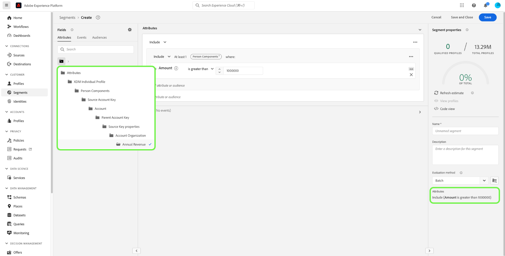

# Casos de uso de segmentação para o Real-Time Customer Data Platform B2B edition

>[!IMPORTANT]
>
>Os públicos-alvo que incluem Eventos de experiência que fazem referência a entidades B2B (como Campanhas e Listas de marketing) não são mais compatíveis. Para obter mais informações, leia a visão geral das [atualizações da arquitetura do Real-Time CDP B2B edition](../../rtcdp/b2b-architecture-upgrade.md).

Este documento fornece exemplos de definições de segmento no Adobe Real-Time Customer Data Platform B2B edition e como diferentes tipos de atributos podem ser combinados para casos de uso comuns de B2B. Para entender como os destinos se encaixam no seu fluxo de trabalho B2B, consulte o [tutorial completo](../b2b-tutorial.md#create-a-segment-to-evaluate-your-data).

>[!NOTE]
>
>Os atributos necessários para esses casos de uso de segmentação só estão disponíveis para clientes do Real-Time Customer Data Platform B2B edition. Se você não estiver usando o Real-Time Customer Data Platform B2B edition, consulte a [visão geral da segmentação](./segmentation-overview.md).

>[!BEGINSHADEBOX]

## Alteração de política de mesclagem

Como parte das atualizações na arquitetura do Real-Time CDP B2B edition, públicos-alvo de várias entidades com atributos B2B agora oferecem suporte a apenas uma única política de mesclagem (a política de mesclagem padrão), em vez de várias políticas de mesclagem. Além disso, as alterações nas quais os perfis podem se qualificar para públicos-alvo podem afetar os fluxos de trabalho de downstream, como ativação, orquestração de jornadas e direcionamento de campanha. É recomendável realizar as seguintes ações para garantir que seus dados estejam funcionando como esperado:

- Revise e teste todos os públicos-alvo que dependam de lógica de mesclagem não padrão para entender os possíveis impactos dessa atualização.
- Reavalie os critérios de qualificação de público-alvo para os principais públicos-alvo para entender se as alterações na lógica de mesclagem podem afetar as qualificações.
- Monitore os resultados da ativação para detectar qualquer mudança nos resultados do público causada pela alteração na política de mesclagem.

>[!ENDSHADEBOX]

## Pré-requisitos {#prerequisites}

Antes de usar os atributos de segmentação para classes B2B, você deve realizar as seguintes etapas:

1. Crie esquemas que usam as classes B2B. As classes do B2B edition incluem Conta, Campanha, Oportunidade, Lista de marketing e muito mais. Para obter informações sobre [como configurar esquemas para uso com classes B2B](../schemas/b2b.md), consulte a documentação do esquema.
2. Crie relacionamentos entre seus esquemas B2B do Experience Data Model (XDM). Os públicos-alvo com base nos atributos do B2B edition exigem relações entre as classes para usar totalmente a funcionalidade estendida de Segmentação B2B. Consulte a documentação sobre [como definir uma relação entre dois esquemas B2B](../../xdm/tutorials/relationship-b2b.md) para obter mais informações.
3. Assimilar dados usando conjuntos de dados com base em seus esquemas B2B. Consulte a documentação das fontes para obter [informações sobre como assimilar dados](../../sources/connectors/adobe-applications/marketo/marketo.md).
4. Leia o [guia do usuário do Construtor de segmentos](../../segmentation/ui/segment-builder.md) para obter uma orientação mais detalhada sobre como construir públicos.

Depois que esses requisitos forem atendidos, você poderá combinar esses atributos para casos de uso comuns de B2B.

## Introdução {#getting-started}

Depois que os esquemas de união para as classes B2B tiverem relacionamentos estabelecidos e forem usados para assimilar dados, seus atributos serão disponibilizados no painel esquerdo do Construtor de segmentos.

As classes B2B e seus atributos são anexados com um rótulo `B2B` no espaço de trabalho de Segmentação para diferenciá-los daqueles disponíveis como padrão no Real-Time Customer Data Platform.

Para criar públicos-alvo para casos de uso B2B de maneira eficaz, é importante ter um conhecimento profundo do esquema e entender como é o modelo de dados. Também é útil estar ciente do caminho que os dados tomam de um objeto de dados para outro.

A imagem abaixo ilustra os relacionamentos entre as classes B2B disponíveis no Real-Time CDP B2B edition.

Como seu modelo de dados pode ser complicado, você pode usar a interface do usuário da Platform para exibir uma representação visual mais detalhada de seu modelo de dados e ajudar a encontrar os atributos relevantes para seu caso de uso. Para iniciar, vá para a interface do usuário da Platform e selecione Schemas na navegação à esquerda.

Selecione o esquema apropriado na lista disponível e selecione a relação apropriada no painel lateral [!UICONTROL Composição]. No exemplo abaixo, selecionar o relacionamento &quot;Pessoa&quot; revela qual atributo no esquema atual faz referência ao esquema &quot;Pessoa&quot; relacionado (se for o esquema de origem no relacionamento), ou é referenciado pelo esquema &quot;Pessoa&quot; (se for o esquema de referência no relacionamento).

Essa relação é refletida no Construtor de segmentos através do uso de `Key` pastas, conforme mostrado na imagem abaixo.

Consulte os [esquemas na documentação do Real-Time Customer Data Platform B2B edition](../schemas/b2b.md) para obter mais informações sobre as classes B2B disponíveis.

Os casos de uso abaixo fornecem informações sobre quais classes são usadas para estabelecer relações entre os diferentes esquemas para alcançar esses resultados. Esses exemplos podem ser usados para ajudar você a criar seus próprios públicos.

## Exemplos de casos de uso de segmentação diferentes {#use-cases}

Os seguintes casos de uso estão disponíveis para segmentação com o B2B edition. Cada exemplo fornece uma descrição do que o público-alvo faz e uma descrição das classes usadas para criá-los. As imagens fornecidas destacam o caminho do arquivo no painel lateral [!UICONTROL Atributos], que reflete a estrutura do esquema. A seção [!UICONTROL Propriedades do segmento], à direita da exibição, contém um detalhamento por escrito dos atributos do público-alvo.

### Exemplo 1: encontrar &quot;tomadores de decisão&quot; para oportunidades B2B {#find-decision-maker}

Encontre todas as pessoas que são o &quot;Tomador de decisões&quot; de qualquer oportunidade. Este público-alvo requer um link entre a classe [!UICONTROL Perfil Individual XDM] e a classe [!UICONTROL Relação de Pessoa de Oportunidade Comercial XDM].

### Exemplo 2: encontrar perfis B2B atribuídos a oportunidades acima de um determinado valor em dólar {#find-opportunities-amount}

Localize todas as pessoas diretamente atribuídas a qualquer oportunidade cujo valor da oportunidade seja maior que o valor especificado (US$ 1 milhão). Este público-alvo requer um link entre a classe [!UICONTROL Perfil Individual XDM], a classe [!UICONTROL Relação de Pessoa de Oportunidade Comercial XDM] e a classe [!UICONTROL Oportunidade Comercial XDM].

### Exemplo 3: Localizar perfis B2B atribuídos a oportunidades por localização {#find-opportunities-location}

Localize todas as pessoas diretamente atribuídas a qualquer oportunidade em que a conta esteja localizada em um determinado local (Canadá). Este público-alvo requer um link entre a classe [!UICONTROL Perfil Individual XDM], a classe [!UICONTROL Relação de Pessoa de Oportunidade Comercial XDM], a classe [!UICONTROL Oportunidade Comercial XDM] e a classe [!UICONTROL Conta Comercial XDM].

### Exemplo 4: encontrar &quot;tomadores de decisão&quot; para oportunidades por setor e comportamento de navegação {#find-industry-browsing-behavior}

Encontre todas as pessoas que são &quot;Tomadores de decisão&quot; sobre qualquer oportunidade em que a conta esteja no setor &quot;Finanças&quot; e visite a página de preços nos últimos três dias.

Para criar esse público-alvo, você deve usar &quot;segmentos de segmentos&quot; criando um público-alvo básico de todas as pessoas que visitaram a página de preços nos últimos três dias.

Depois de criar o primeiro público-alvo, você pode combiná-lo com outro público-alvo de pessoas que são &quot;Tomadores de decisão&quot; de qualquer oportunidade em que a conta esteja no setor &quot;Financeiro&quot;.

### Exemplo 5: Localizar perfis B2B para oportunidades por nome de departamento e valor de oportunidade {#find-department-opportunity-amount}

Encontre todas as pessoas que trabalham em um departamento de Recursos Humanos (RH) e têm qualquer conta com pelo menos uma oportunidade em aberto no valor especificado (US$ 1 milhão) ou mais. Este público-alvo requer um link entre a classe [!UICONTROL Perfil Individual XDM], a classe [!UICONTROL Conta Comercial XDM] e a classe [!UICONTROL Oportunidade Comercial XDM].

### Exemplo 6: encontrar perfis B2B por título do cargo e receita anual da conta {#find-by-job-title-and-revenue}

Encontre todas as pessoas cujo cargo é de vice-presidente e tenha qualquer conta com receita anual do valor determinado (US$ 100 milhões) ou mais, e tenha visitado a página de preços pelo menos três vezes no último mês. Este público-alvo requer um link entre a classe [!UICONTROL Perfil Individual XDM], a classe [!UICONTROL Conta Comercial XDM] e a classe [!UICONTROL XDM ExperienceEvent].

### Exemplo 7: encontrar &quot;tomadores de decisão&quot; por status de oportunidade e comportamento de navegação {#find-by-opportunity-status-and-browsing-behavior}

Encontre todas as pessoas que são &quot;Tomadores de decisão&quot; de qualquer oportunidade perdida e visite a página de preços nos últimos três dias.

Para criar esse público-alvo, você deve usar &quot;segmentos de segmentos&quot; criando um público-alvo básico de todas as pessoas que visitaram a página de preços nos últimos três dias.

Depois de criar o primeiro público-alvo, você pode combiná-lo com outro público-alvo de pessoas que são &quot;Tomadores de decisão&quot; de qualquer oportunidade em que &quot;Sinalizador fechado&quot; esteja definido como verdadeiro e &quot;Sinalizador perdido&quot; esteja definido como falso.

### Exemplo 8: usar contas relacionadas para expandir o alcance da segmentação {#related-accounts}

Encontre todas as pessoas que trabalham em um departamento de Recursos Humanos (HR) e estão relacionadas a qualquer conta *ou a qualquer conta relacionada* da conta que tenha pelo menos uma oportunidade em aberto no valor especificado (US$ 1 milhão) ou mais. Este público-alvo requer um link entre a classe [!UICONTROL Perfil Individual XDM], a classe [!UICONTROL Conta Comercial XDM] e a classe [!UICONTROL Oportunidade Comercial XDM].

### Exemplo 9: usar pontuações de lead e/ou pontuações de conta para qualificar o perfil {#account-scoring}

Encontre todos os perfis com pontuação superior a 80.

### Exemplo 10: encontre perfis B2B associados a contas cuja organização principal tenha receita sobre um determinado valor em dólar {#find-parent-org-amount}

Localize todas as pessoas associadas a contas cuja Organização principal tenha uma receita maior que o valor especificado (US$ 100.000.000).

### Exemplo 11: encontrar perfis B2B por cargo e nome da conta com um relacionamento ativo {#find-by-job-title-and-account-name}

Encontre todas as pessoas que são &quot;Gerente&quot; na conta &quot;Acme&quot;, onde o relacionamento da conta é &quot;Ativo&quot;.

### Exemplo 12: encontre perfis B2B direcionados para campanhas em que o atualCost excede o budgetedCost {#find-actualcost-exceed-budgetcost}

Encontre todas as pessoas que são alvos de campanhas nas quais o atualCost excedeu o budgetedCost.

### Exemplo 13: localizar perfis B2B pertencentes a uma lista estática do Marketo e isDeleted=false {#find-marketo-static-list}

Encontre todas as pessoas que pertencem à lista estática do Marketo &quot;Usuários de aniversário&quot;, onde isDeleted=false.

<!-- 
### Example 14: Find "decision makers" by opportunity status using streaming or edge segmentation {#find-decision-makers-personalization}

>[!NOTE]
>
>This example uses **streaming or edge** segmentation, as opposed to batch segmentation.

Find all the people who are a "Decision Maker" of any closed-lost opportunity and visited the pricing page in the last 24 hours. This example can be evaluated using streaming or edge segmentation, to support more real-time use cases.

To create this audience, you must use "segment of segments" by creating a base audience of all the people who visited the pricing page in the last 24 hours.

After creating the first audience, you can combine that with another audience of  people who are a "Decision Maker" of any opportunity where both the "Closed Flag" is set to true and the "Lost Flag" is set to false.

 -->

## Próximas etapas {#next-steps}

Depois de ler esta visão geral, você compreende as possibilidades de segmentação disponíveis no Real-Time CDP, no B2B edition. Para obter mais informações sobre o Serviço de segmentação, leia a [documentação sobre segmentação](../../segmentation/home.md).
