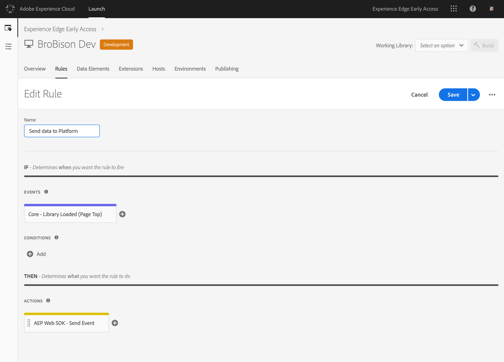

# Tutorial: Implementar tags de site com o Adobe Launch

Este tutorial explica como implementar as tags de seu site para enviar dados para a Adobe Experience Platform usando o Adobe Launch.

## Pré-requisitos

* O schema e o conjunto de dados necessários são criados em [!DNL Platform].
* A configuração necessária foi implantada no Experience Edge e possui a ID de configuração e o domínio de borda correspondentes.
* O CMS da empresa já foi configurado para fornecer um objeto JavaScript em cada página com os dados necessários para enviar à plataforma.

## Etapas

Este tutorial contém as seguintes etapas:

1. Instale a extensão Adobe Experience Platform [!DNL Web SDK].
1. Crie uma regra para dizer [!DNL Launch] quais dados enviar.
1. Compacte a extensão e a regra em uma biblioteca.

## Instale a extensão Adobe Experience Platform [!DNL Web SDK]

Primeiro, instale a extensão Adobe Experience Platform [!DNL Web SDK].

1. Em [!DNL Launch], abra a guia **[!UICONTROL Extensões]**.

   

1. Selecione a extensão do Adobe Experience Platform Web SDK no Catálogo de extensão de inicialização
A tela de configuração é aberta.

   

   Para obter mais informações, consulte [Extensões](https://docs.adobe.com/content/help/en/launch/using/reference/manage-resources/extensions/overview.html) na documentação [!DNL Launch].

1. Configurar a extensão.

   As únicas configurações necessárias no momento são:

   * **ID de configuração:** especifique a ID de configuração obtida do representante do Adobe.
   * **Domínio de borda:** especifique o domínio de borda obtido do seu representante de Adobe.

1. Selecione **[!UICONTROL Salvar]** e vá para a próxima etapa.

## Crie uma regra para dizer [!DNL Launch] quais dados serão enviados

Em seguida, crie uma regra para permitir que [!DNL Launch] saiba quais dados você deseja enviar à Adobe Experience Platform e quando deseja enviá-los.

1. Na guia **[!UICONTROL Regras]**, configure um evento que será acionado em cada nova página do site quando a biblioteca [!DNL Launch] for carregada.

   

1. Adicionar uma ação.

   Para configurar a ação, diga [!DNL Launch] onde localizar a camada de dados. A camada de dados é um objeto JavaScript que existe na página, que é entregue pelo mesmo CMS que renderiza a página da Web. Forneça o caminho do JavaScript para o objeto de dados.

   

   O objeto de dados enviado precisa ser um XDM válido que passe a validação em relação ao schema usado pelo conjunto de dados conectado à sua ID de configuração.

1. Selecione **[!UICONTROL Manter alterações]**.

Para obter mais informações, consulte [Regras](https://docs.adobe.com/content/help/en/launch/using/reference/manage-resources/rules.html) na documentação [!DNL Launch].

## Compacte a extensão e a regra em uma biblioteca

Em seguida, [agrupe a extensão](https://docs.adobe.com/content/help/en/launch/using/reference/publish/overview.html) e a nova regra em uma biblioteca e teste essas alterações em um ambiente de desenvolvimento.

Depois de concluir o teste, promova a biblioteca por meio do fluxo de trabalho para que ela possa ser implantada no site de produção. Os dados agora fluem de cada usuário individual para o Adobe Experience Platform.

Para obter mais informações, consulte [Bibliotecas](https://docs.adobe.com/content/help/pt-BR/launch/using/reference/publish/libraries.html) na documentação [!DNL Launch].