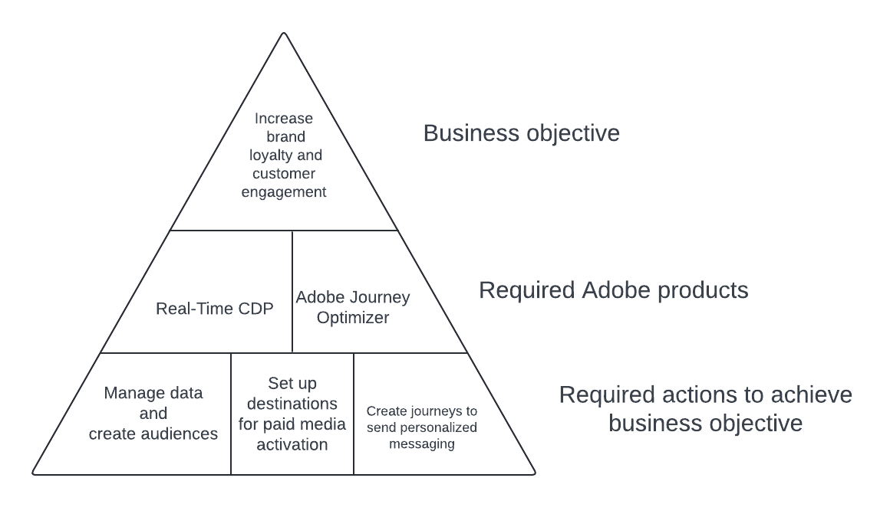

# Evoluir valor único do cliente para valor vitalício

>[!IMPORTANT]
> 
>* Esta página apresenta um exemplo de implementação do Real-Time CDP e do Adobe Journey Optimizer para obter o caso de uso descrito. Use as figuras, os critérios de qualificação e outros campos fornecidos na página como um guia, não como figuras prescritivas.
>* Para concluir esse caso de uso, você precisa ter uma licença do Real-Time CDP e do Adobe Journey Optimizer. Leia mais na [seção de pré-requisitos e planejamento](#prerequisites-and-planning) mais abaixo.

Implemente o caso de uso Valor único do cliente para valor vitalício para impulsionar o engajamento e a fidelidade à marca. Crie uma experiência de cliente conectada em vários canais ou jornadas usando o poder do Experience Platform, aumentado por [Real-Time CDP](/help/rtcdp/home.md) e [Journey Optimizer](https://experienceleague.adobe.com/pt-br/docs/journey-optimizer/using/ajo-home).

As personalidades que você está direcionando são os visitantes pouco frequentes de suas propriedades que fizeram algumas compras nos últimos três meses.

Considere esses clientes que visitam suas propriedades e compram esporadicamente os produtos ou serviços que você oferece. Você pode criar campanhas personalizadas para atrair esses clientes para que sua marca possa oferecer a eles valor de longo prazo em vez de valor único. Saiba como:

* Coletar e gerenciar dados
* Criar públicos-alvo
* Crie jornadas para direcionar esses públicos-alvo no Adobe Journey Optimizer e ative-as no Real-Time CDP.

{zoomable="yes"}

## Pré-requisitos e planejamento {#prerequisites-and-planning}

Considerando que internamente você definiu uma meta e um objetivo comerciais para aumentar a fidelidade à marca. Isso pode se traduzir na execução de um caso de uso para impulsionar o engajamento e a fidelidade do cliente.

Para isso, a tecnologia necessária consiste nos dois aplicativos Experience Platform [Real-Time CDP](https://experienceleague.adobe.com/docs/experience-platform/rtcdp/overview.html?lang=pt-BR) e [Adobe Journey Optimizer](https://experienceleague.adobe.com/docs/journey-optimizer/using/get-started/get-started.html?lang=pt-BR). A seguir estão listados vários elementos de funcionalidade e interface do usuário dos dois aplicativos que você usará ao implementar o caso de uso.

>[!TIP]
>
>Verifique se tem as [permissões de controle de acesso baseado em atributo](/help/access-control/abac/end-to-end-guide.md) necessárias para todas essas áreas, ou solicite ao(à) administrador(a) que as conceda a você.

* [[!DNL Adobe Real-Time Customer Data Platform (Real-Time CDP)]](https://experienceleague.adobe.com/docs/platform-learn/tutorials/rtcdp/understanding-the-real-time-customer-data-platform.html?lang=pt-BR): integre dados entre fontes de dados para alimentar a campanha. Esses dados são usados para criar os públicos-alvo da campanha e exibir elementos de dados personalizados usados no email e nos blocos promocionais da Web (por exemplo, nome ou informações relacionadas à conta). Por fim, o Real-Time CDP também é usado para ativar públicos para destinos de mídia paga.
   * [Esquemas](/help/xdm/home.md)
   * [Perfis](/help/profile/home.md)
   * [Conjuntos de dados](/help/catalog/datasets/overview.md)
   * [Públicos-alvo](/help/segmentation/home.md)
   * [Destinos](/help/destinations/home.md)
* [[!DNL Adobe Journey Optimizer]](https://experienceleague.adobe.com/docs/journey-optimizer/using/orchestrate-journeys/journey.html?lang=pt-BR): crie jornadas, configure acionadores e crie as mensagens certas para endereçar seus visitantes.
   * [Acionador de evento ou público-alvo](https://experienceleague.adobe.com/docs/journey-optimizer/using/offer-decisioning/collect-event-data/data-collection.html?lang=pt-BR)
   * [Públicos-alvo e eventos](https://experienceleague.adobe.com/docs/journey-optimizer/using/audiences-profiles-identities/audiences/about-audiences.html?lang=pt-BR)
   * [Jornadas](https://experienceleague.adobe.com/docs/journey-optimizer/using/orchestrate-journeys/journey.html?lang=pt-BR)

## Arquitetura do Real-Time CDP e do Journey Optimizer

Abaixo está uma visualização de arquitetura de alto nível dos vários componentes do Real-Time CDP e do Journey Optimizer. Este diagrama mostra como os dados fluem pelos dois aplicativos Experience Platform, da coleta de dados ao ponto em que são ativados por meio de jornadas ou campanhas para destinos, para obter o caso de uso descrito nesta página.

{zoomable="yes"}

## Como atingir o caso de uso: visão geral de alto nível {#achieve-the-use-case-high-level}

Veja abaixo uma visão geral de alto nível do workflow, uma combinação de um workflow de jornada e um workflow de ativação.

No fluxo de trabalho de amostra mostrado abaixo, você procura clientes que atendem a determinados critérios e deseja atraí-los a retornar ao seu site ou aplicativo. Você pretende defini-los em uma jornada em que, em vez da atividade limitada na propriedade, eles retornam de maneira mais recorrente. Você está tentando levá-los de volta à sua propriedade e, em seguida, uma vez que eles estão de volta, você inseri-los na jornada para fazer compras recorrentes em seu site. A configuração da campanha aqui limita-se a um envolvimento com os clientes por mês.

Você começa enviando uma mensagem para o seu público-alvo de clientes altamente valorizados e de baixa frequência. Você então verifica se eles receberam essa mensagem nos últimos trinta dias. Caso contrário, você pode inseri-los em uma jornada sobre, por exemplo, um novo programa de assinatura. Em seguida, você pode aguardar alguns dias (sete dias neste exemplo). Após esse período, se eles não tiverem adquirido a assinatura sobre a qual você enviou uma mensagem, você poderá fornecer anúncios de mídia pagos por meio de destinos. Se ele tiver comprado a assinatura, você poderá fazer com que ele insira uma jornada de confirmação de pedido, concluindo assim o caso de uso.

>[!IMPORTANT]
>
>Conforme descrito mais abaixo nesta página, ao ter um [grupo de campos de consentimento dedicado no esquema](#customer-attributes-schema) e ao [implementar políticas de consentimento](#privacy-consent), todas as ações e fluxos de trabalho são implementados de maneira privada e consentânea.

>[!BEGINSHADEBOX]

{zoomable="yes"}

1. Crie esquemas e conjuntos de dados e marque-os para [!UICONTROL Profile].
2. Os dados são coletados e integrados ao Experience Platform via Web SDK, Mobile Edge SDK ou API. O Conector de dados do Analytics também pode ser usado, mas pode resultar em latência de jornada.
3. Você carrega perfis no Real-Time CDP e cria políticas de governança para garantir um uso responsável.
4. Você constrói públicos-alvo focados a partir da lista de perfis para verificar clientes de alto valor e baixa frequência.
5. Você cria duas jornadas no [!DNL Adobe Journey Optimizer], uma para enviar mensagens aos usuários sobre um novo programa de assinatura e outra para enviá-los mensagens para que eles confirmem a compra mais tarde.
6. Se desejar, ative o público-alvo dos clientes que não compraram sua assinatura para os destinos de mídia paga desejados.

>[!ENDSHADEBOX]

## Como obter o caso de uso {#achieve-use-case-instruction}

Para concluir cada uma das etapas da visão geral de alto nível acima, leia as seções abaixo, que oferecem links para mais informações e instruções mais detalhadas.

### Elementos e funcionalidade da interface que serão utilizados {#ui-functionality-and-elements}

Ao concluir as etapas para implementar o caso de uso, você usará a Real-Time CDP, a funcionalidade do Adobe Journey Optimizer e os elementos da interface do usuário listados no início deste documento. Verifique se você tem as permissões de controle de acesso baseadas em atributos necessárias para todas essas áreas ou peça ao administrador do sistema para conceder as permissões necessárias.

### Criar um design de esquema e especificar grupos de campos {#schema-design}

Os recursos do Experience Data Model (XDM) são gerenciados no espaço de trabalho [!UICONTROL Schemas] em [!DNL Adobe Experience Platform]. Você pode visualizar e explorar os recursos principais fornecidos pelo [!DNL Adobe] (por exemplo, [!UICONTROL field groups]) e criar recursos e esquemas personalizados para sua organização.

Para obter mais informações sobre como criar [esquemas](https://experienceleague.adobe.com/docs/experience-platform/xdm/home.html?lang=pt-BR), leia o [tutorial sobre como criar um esquema.](/help/xdm/tutorials/create-schema-ui.md)

Há vários designs de esquema que você pode usar nesta implementação de amostra para o caso de uso para evoluir o valor único para o valor vitalício. Cada esquema inclui campos obrigatórios específicos a serem configurados e alguns campos sugeridos.

Com base em implementações de amostra, a Adobe sugere que você crie os três esquemas a seguir para realizar esse caso de uso:

* [Esquema de atributos do cliente](#customer-attributes-schema) (um esquema de perfil)
* [Esquema de transações digitais do cliente](#customer-digital-transactions-schema) (um esquema de evento de experiência)
* [Esquema de transações offline do cliente](#customer-offline-transactions-schema) (um esquema de evento de experiência)

#### Esquema de atributos do cliente {#customer-attributes-schema}

Use esse esquema para estruturar e fazer referência aos dados do perfil que compõem as informações do cliente. Normalmente, esses dados são assimilados no [!DNL Adobe Experience Platform] por meio do seu CRM ou sistema semelhante e são necessários para consultar os detalhes do cliente usados para personalização, consentimento de marketing e recursos de segmentação aprimorados.

O esquema de atributos do cliente é representado por uma classe [!UICONTROL XDM Individual Profile], que inclui os seguintes grupos de campos:

+++Detalhes demográficos (Grupo de campos)

[Detalhes demográficos](/help/xdm/field-groups/profile/demographic-details.md) é um grupo de campos de esquema padrão para a classe Perfil Individual XDM. O grupo de campos fornece um objeto de pessoa de nível raiz, cujos subcampos descrevem informações sobre uma pessoa individual.

+++

+++Detalhes de contato pessoal (grupo de campos)

[Detalhes de Contato Pessoal](/help/xdm/field-groups/profile/personal-contact-details.md) é um grupo de campos de esquema padrão para a classe Perfil Individual XDM, que descreve as informações de contato de uma pessoa individual.

+++

+++Detalhes de auditoria externa do sistema Source (grupo de campos)

[Atributos de Auditoria de Sistema Externos do Source](/help/xdm/data-types/external-source-system-audit-attributes.md) é um tipo de dados padrão do Experience Data Model (XDM) que captura detalhes de auditoria sobre um sistema de origem externo.

+++

+++Grupos de campos de consentimento e preferência (Grupo de campos)

[O grupo de campos Consentimentos e Preferências](/help/xdm/field-groups/profile/consents.md) fornece um único campo de tipo de objeto, consentimentos, para capturar informações de consentimento e preferência.

+++

#### Esquema de transações digitais do cliente {#customer-digital-transactions-schema}

Esse esquema é usado para estruturar e fazer referência aos dados do evento que compõem a atividade do cliente que ocorre no seu site ou em outras plataformas digitais associadas. Normalmente, esses dados são assimilados no [!DNL Adobe Experience Platform] por meio do [Web SDK](/help/collection/js/js-overview.md) e são necessários para fazer referência aos vários eventos de navegação e conversão usados para acionar jornadas, análise online detalhada do cliente e recursos de segmentação aprimorados.

O esquema de transações digitais do cliente é representado por uma classe [!UICONTROL XDM ExperienceEvent], que inclui os seguintes grupos de campos:

+++ExperienceEvent do Adobe Experience Platform Web SDK (Grupo de campos)

| Campos | Requisito |
| --- | --- |
| `device.model` | Sugerido |
| `environment.browserDetails.userAgent` | Sugerido |

+++

+++Detalhes da Web (Grupo de Campos)

[Detalhes da Web](/help/xdm/field-groups/event/web-details.md) é um grupo de campos de esquema padrão para a classe XDM ExperienceEvent, usado para descrever informações sobre eventos de detalhes da Web, como interação, detalhes da página e referenciador.

+++

+++Evento de experiência do consumidor (grupo de campos)

Este grupo de campos inclui várias informações sobre ações, como eventos de compra ou navegação, realizadas por usuários em sua propriedade da Web.

| Campo | Requisito |
| --- | --- |
| `commerce.cart.cartID` | Sugerido |
| `commerce.cart.cartSource` | Sugerido |
| `commerce.cartAbandons.id` | Sugerido |
| `commerce.cartAbandons.value` | Sugerido |
| `commerce.order.orderType` | Sugerido |
| `commerce.order.payments.paymentAmount` | Sugerido |
| `commerce.order.payments.paymentType` | Sugerido |
| `commerce.order.payments.transactionID` | Sugerido |
| `commerce.order.priceTotal` | Sugerido |
| `commerce.order.purchaseID` | Sugerido |
| `commerce.productListAdds.id` | Sugerido |
| `commerce.productListAdds.value` | Sugerido |
| `commerce.productListOpens.id` | Sugerido |
| `commerce.productListOpens.value` | Sugerido |
| `commerce.productListRemoval.id` | Sugerido |
| `commerce.productListRemoval.value` | Sugerido |
| `commerce.productListViews.id` | Sugerido |
| `commerce.productListViews.value` | Sugerido |
| `commerce.productViews.id` | Sugerido |
| `commerce.productViews.value` | Sugerido |
| `commerce.purchases.id` | Sugerido |
| `commerce.purchases.value` | Sugerido |
| `marketing.campaignGroup` | Sugerido |
| `marketing.campaignName` | Sugerido |
| `marketing.trackingCode` | Sugerido |
| `productListItems.name` | Sugerido |
| `productListItems.priceTotal` | Sugerido |
| `productListItems.product` | Sugerido |
| `productListItems.quantity` | Sugerido |

+++

+++Detalhes da ID do usuário final (Grupo de campos)

O grupo de campos [Detalhes da ID do Usuário Final](/help/xdm/field-groups/event/enduserids.md) inclui várias informações sobre os usuários, como se eles estão autenticados no site quando visitam, e informações sobre a identidade deles.

+++

+++Detalhes de auditoria externa do sistema Source (grupo de campos)

Atributos de auditoria de sistema do Source externo é um tipo de dados padrão do Experience Data Model (XDM) que captura os detalhes de auditoria sobre um sistema de origem externa.

+++

#### Esquema de transações offline do cliente {#customer-offline-transactions-schema}

Esse esquema é usado para estruturar e fazer referência aos dados do evento que compõem a atividade do cliente que ocorre em plataformas fora do site. Normalmente, esses dados são assimilados no [!DNL Adobe Experience Platform] a partir de um PDV (ou sistema semelhante) e, na maioria das vezes, são transmitidos para o Experience Platform por meio de uma conexão de API. Leia sobre [assimilação em lote](/help/ingestion/batch-ingestion/getting-started.md). Seu objetivo é fazer referência aos vários eventos de conversão offline usados para acionar jornadas, análises profundas de clientes online e offline e recursos aprimorados de segmentação.

O esquema de transações offline do cliente é representado por uma classe [!UICONTROL XDM ExperienceEvent], que inclui os seguintes grupos de campos:

+++Detalhes do Commerce (Grupo de Campos)

[Detalhes do Commerce](/help/xdm/field-groups/event/commerce-details.md) é um grupo de campos de esquema padrão para a classe [!DNL XDM ExperienceEvent], usado para descrever dados de comércio, como informações do produto (SKU, nome, quantidade) e operações padrão do carrinho (pedido, check-out, abandono).

+++

+++Detalhes de contato pessoal (grupo de campos)

[[!UICONTROL Personal Contact Details]](/help/xdm/field-groups/profile/personal-contact-details.md) é um grupo de campos de esquema padrão para a classe [!DNL XDM Individual Profile], que descreve as informações de contato de uma pessoa individual.

+++

+++Detalhes de auditoria externa do sistema Source (grupo de campos) 

Atributos de auditoria de sistema do Source externo é um tipo de dados padrão do Experience Data Model (XDM) que captura os detalhes de auditoria sobre um sistema de origem externa.

+++

#### Esquema do Adobe web connector {#adobe-web-connector-schema}

>[!NOTE]
>
>Esta é uma implementação opcional se você estiver usando o [!DNL Adobe Analytics Data Connector].

Esse esquema é usado para estruturar e fazer referência aos dados do evento que compõem a atividade do cliente que ocorre no seu site ou em outras plataformas digitais associadas. Esse esquema é semelhante ao esquema Transações digitais do cliente, mas difere na medida em que é possível quando o Web SDK não é uma opção para a coleta de dados. Dessa forma, você pode usar esse esquema quando estiver utilizando o [!DNL Adobe Analytics Data Connector] para enviar seus dados online para o [!DNL Adobe Experience Platform] como uma sequência de dados primária ou secundária.

O esquema do conector da Web [!DNL Adobe] é representado por uma classe [!UICONTROL XDM ExperienceEvent], que inclui os seguintes grupos de campos:

+++Modelo de evento de experiência do Adobe Analytics (grupo de campos)

[[!UICONTROL Adobe Analytics ExperienceEvent Full Extension]](/help/xdm/field-groups/event/analytics-full-extension.md) é um grupo de campos de esquema padrão, que captura métricas comuns coletadas pelo Adobe Analytics.

+++

### Criar um conjunto de dados a partir de um esquema {#dataset-from-schema}

Um conjunto de dados é uma estrutura de armazenamento e gerenciamento para um grupo de dados. Cada esquema usado para realizar essa implementação de amostra tem um único conjunto de dados.

Para obter mais informações sobre como criar um [conjunto de dados](/help/catalog/datasets/overview.md) a partir de um esquema, leia o [guia da interface do usuário de conjuntos de dados](/help/catalog/datasets/user-guide.md).

>[!NOTE]
>
>Semelhante à etapa para criar um esquema, é necessário ativar o conjunto de dados para ser incluído no Perfil do cliente em tempo real. Para obter mais informações sobre como habilitar o conjunto de dados para uso no Perfil de Cliente em Tempo Real, leia o [tutorial criar esquema.](/help/xdm/tutorials/create-schema-ui.md#profile).

### Privacidade, consentimento e governança de dados {#privacy-consent}

#### Políticas de consentimento

>[!IMPORTANT]
>
>Oferecer aos clientes a capacidade de cancelar a inscrição para receber comunicações de uma marca, bem como garantir que essa escolha seja respeitada, é um requisito legal. Saiba mais sobre a legislação aplicável na [Visão geral das regras de privacidade](https://experienceleague.adobe.com/docs/experience-platform/privacy/regulations/overview.html?lang=pt-BR).

Considere implementar as [políticas de consentimento](https://experienceleague.adobe.com/docs/platform-learn/data-collection/web-sdk/consent/overview.html?lang=pt-BR) a seguir e peça o consentimento dos visitantes antes de contatá-los:

* Se `consents.marketing.email.val = "Y"` então pode enviar um email
* Se `consents.marketing.sms.val = "Y"` então pode SMS
* Se `consents.marketing.push.val = "Y"` então Pode enviar
* Se `consents.share.val = "Y"` então pode anunciar

#### Rótulo e aplicação da governança de dados

Considere adicionar e impor os seguintes [rótulos de governança de dados](/help/data-governance/labels/overview.md):

* Endereços de email pessoais são utilizados como dados diretamente identificáveis usados para identificar ou entrar em contato com um indivíduo específico, em vez de com um dispositivo.
   * `personalEmail.address = I1`

#### Políticas de marketing

Não são necessárias [políticas de marketing](/help/data-governance/policies/overview.md) para as jornadas criadas como parte deste caso de uso. No entanto, você pode considerar as seguintes políticas conforme desejado:

* Restringir Dados Confidenciais
* Restringir o Advertising no local
* Restringir o direcionamento de email
* Restringir o direcionamento entre sites
* Restringir a combinação de dados diretamente identificáveis com dados anônimos

### Criar públicos-alvo {#create-audiences}

Esse caso de uso exige a criação de dois públicos-alvo para definir atributos ou comportamentos específicos compartilhados por um subconjunto de perfis da loja de perfis para distinguir um grupo comercializável de pessoas. Os públicos-alvo podem ser criados de várias maneiras no Adobe Experience Platform:

* Para obter informações sobre como criar um público-alvo, leia o [Guia da interface do usuário do serviço de público-alvo](https://experienceleague.adobe.com/docs/experience-platform/segmentation/ui/overview.html?lang=pt-BR#create-audience).
* Para obter informações sobre como compor [públicos-alvo](/help/segmentation/home.md), leia o [Guia da interface do usuário de composição de público-alvo](/help/segmentation/ui/audience-composition.md).
* Para obter informações sobre como criar públicos-alvo por meio de definições de segmento derivadas da Experience Platform, leia o [Guia da Interface do usuário do Audience Builder](/help/segmentation/ui/segment-builder.md).

Você deve criar e usar dois públicos-alvo em etapas diferentes do caso de uso, conforme mostrado na imagem abaixo.

{zoomable="yes"}

>[!BEGINTABS]

>[!TAB Público-alvo qualificado do Adobe Journey Optimizer]

Esse público-alvo de alto valor e baixa frequência inclui os perfis que você deseja alcançar por meio de uma jornada, para que eles saibam sobre um novo programa de assinatura. Os detalhes do público-alvo estão abaixo:

* Descrição: Perfis que gastaram mais de US$ 250 na agregação nos últimos três meses
* Campos e condições necessários no público-alvo:
   * Evento: `commerce.order.payments.paymentamount`
* Soma agregada: >= US$ 250
   * Tipo de Evento: `commerce.purchases`
* Carimbo de data e hora: menos de 3 meses antes agora

>[!TAB Público-alvo de mídia paga]

Esse público-alvo é criado para incluir perfis que gastaram mais de US$ 250 no agregado nos últimos três meses e não tiveram uma compra nos últimos sete dias. Os detalhes do público-alvo estão abaixo:

* Descrição: perfis que gastaram mais de US$ 250 no agregado nos últimos três meses e não tiveram uma compra nos últimos sete dias.
* Campos e condições necessários:
   * Tipo de Evento: `journey.feedback`
      * Operando: = true
   * Evento: `experience.journeyOrchestration.stepEvents.nodeName`
      * Operando: = JourneyStepEventTracker - Assinatura não adquirida
      * Carimbo de data e hora: nos últimos 7 dias
   * EventType não é: `commerce.purchases`
      * Carimbo de data e hora: &lt;= 7 dias antes agora
   * Evento: SKU
      * Valor: = `subscription`

>[!ENDTABS]

### Configuração do Jornada no Adobe Journey Optimizer {#journey-setup}

>[!NOTE]
>
>[!DNL Adobe Journey Optimizer] não abrange tudo o que é mostrado nos diagramas. Todos os [anúncios de mídia pagos](/help/destinations/catalog/social/overview.md) são criados no [!UICONTROL destinations] [espaço de trabalho](/help/destinations/ui/destinations-workspace.md).

[[!DNL Adobe Journey Optimizer]](https://experienceleague.adobe.com/docs/journey-optimizer/using/orchestrate-journeys/journey.html?lang=pt-BR) ajuda você a fornecer experiências conectadas, contextuais e personalizadas aos seus clientes. A jornada do cliente envolve todo o processo de interação do cliente com a marca. Cada jornada de caso de uso requer informações específicas.

Para realizar esse caso de uso, você deve criar duas jornadas separadas:

* A jornada vitalícia, que inclui a mensagem que você envia aos seus clientes de alto valor e baixa frequência
* A jornada de confirmação do pedido para os usuários que respondem à sua chamada e compram uma assinatura.

{zoomable="yes"}

Os dados precisos necessários para cada ramificação de Jornada estão listados abaixo.

>[!BEGINTABS]

>[!TAB Jornada vitalícia]

A jornada vitalícia aborda o público-alvo de clientes de alto valor e baixa frequência que não foram direcionados nos últimos 30 dias. Uma mensagem é mostrada a esses clientes e, se após 7 dias eles ainda não comprarem, você poderá incluir os não compradores em um público para o qual poderá mostrar anúncios de mídia pagos. Se eles comprarem, você poderá definir os compradores em uma jornada de confirmação de pedido, detalhada na guia separada.

{zoomable="yes"}

+++Lógica de Jornada detalhada

A jornada mostrada acima segue a lógica a seguir.

1. Ler público: Use uma [atividade de leitura de público](https://experienceleague.adobe.com/docs/journey-optimizer/using/orchestrate-journeys/about-journey-building/read-audience.html?lang=pt-BR) para o primeiro público criado na seção de públicos acima.

2. Condição - Canal preferencial: use uma [atividade de condição](https://experienceleague.adobe.com/docs/journey-optimizer/using/orchestrate-journeys/about-journey-building/condition-activity.html?lang=pt-BR) para determinar como entrar em contato com os clientes, seja por email, SMS ou notificações por push. Use três atividades de ação para criar as três ramificações.

3. Aguardar: use uma [atividade de espera](https://experienceleague.adobe.com/docs/journey-optimizer/using/orchestrate-journeys/about-journey-building/read-audience.html?lang=pt-BR) para aguardar até ouvir compras.

4. Condição - Assinatura adquirida nos últimos 7 dias?: use uma atividade de condição para acompanhar as compras de produtos nos últimos sete dias.

5. JourneyStepEventTracker - Assinatura não adquirida: use uma [ação personalizada](https://experienceleague.adobe.com/docs/journey-optimizer/using/orchestrate-journeys/about-journey-building/using-custom-actions.html?lang=pt-BR) para os visitantes que ainda não compraram sua assinatura, apesar de terem recebido sua mensagem. Como parte da condição personalizada no final da jornada, crie um evento `journey.feedback` e adicione-o a um conjunto de dados com base no esquema [!UICONTROL Journey Step Event]. Você usará esse evento para segmentar o público-alvo que não comprou a assinatura e que pode direcionar por meio de anúncios de mídia paga.

+++

>[!TAB Jornada de confirmação do pedido]

A jornada de confirmação de pedido foca se uma compra foi feita pelo site ou aplicativo móvel. Depois que um cliente concluir com êxito a compra, por exemplo, de uma assinatura com sua empresa, você pode defini-los em uma jornada de confirmação de pedido.

{zoomable="yes"}

+++Lógica de jornada

Use os eventos, campos e ações sugeridos abaixo em sua jornada de confirmação:

* A jornada é acionada por um evento de compra online
   * Esquema: Transações digitais do cliente
   * Campos:
      * `EventType`
   * Condição:
      * `EventType = commerce.purchases`
      * Campos:
         * `Commerce.purchases.id`
         * `Commerce.purchases.value`
         * `eventType`
         * `identityMap.authenticatedState`
         * `identityMap.id`
         * `identityMap.primary`
         * `productListItems.SKU`
         * `productListItems.currencyCode`
         * `productListItems.name`
         * `productListItems.priceTotal`
         * `productListItems.product`
         * `productListItems.productImageUrl`
         * `productListItems.quantity`
         * `timestamp`
         * `endUserIDs._experience.emailid.authenticatedState`
         * `endUserIDs._experience.emailid.id`
         * `endUserIDs._experience.emailid.namespace.code`
         * `_id`

+++

+++Lógica de Jornada principal

* Jornada Lógica de Entrada
   * Evento de pedido

* Condições
   * Selecione Canal de destino (você pode selecionar um ou vários canais para maior alcance).
      * A confirmação do pedido é considerada de natureza pessoal, portanto, a verificação de consentimento geralmente é desnecessária.
      * Email
      * Push
      * SMS

   * Personalization de conteúdo do canal
      * Exibe informações detalhadas do pedido e pode exibir uma lista de produtos usando um formato de tabela.

+++

>[!ENDTABS]

Para obter mais informações sobre como criar jornadas no [!DNL Adobe Journey Optimizer], leia o guia de [introdução ao jornada](https://experienceleague.adobe.com/docs/journey-optimizer/using/orchestrate-journeys/journey.html?lang=pt-BR).

### Configurar um destino para exibir anúncios de mídia paga {#paid-media-ads}

Alguns usuários podem não ter comprado sua assinatura mesmo depois de receber uma mensagem sobre o novo programa. Depois de esperar um número de dias (sete, neste exemplo de caso de uso), você pode decidir mostrar anúncios de mídia pagos a esses usuários para incentivá-los a comprar sua assinatura.

Use a estrutura de destinos no Real-Time CDP para anúncios de mídia paga. Selecione um dos muitos destinos de publicidade disponíveis para exibir anúncios de mídia paga aos clientes e ativar o público de mídia paga que você [criou anteriormente](#create-audiences) para um destino de sua escolha. Consulte uma visão geral dos destinos [advertising](/help/destinations/catalog/advertising/overview.md) e [social](/help/destinations/catalog/social/overview.md) disponíveis.

Para saber como ativar dados para destinos (por exemplo [A Trade Desk](/help/destinations/catalog/advertising/tradedesk.md) ou [Correspondência de cliente do Google](/help/destinations/catalog/advertising/google-customer-match.md)), leia a documentação abaixo:

* [Criar uma nova conexão de destino](/help/destinations/ui/connect-destination.md)
* [Ativar dados do público-alvo para streaming de destinos de exportação de público](/help/destinations/ui/activate-segment-streaming-destinations.md)

## Próximas etapas {#next-steps}

Ao definir seus usuários de baixa frequência e alto valor em uma jornada e ao exibir anúncios de mídia paga em um subconjunto deles, você espera que alguns deles tenham mudado de valor único para clientes com valor vitalício, melhorando assim a fidelidade à sua marca e as métricas de engajamento do cliente.

Em seguida, você pode explorar outros casos de uso compatíveis com o Real-Time CDP, como [reengajamento inteligente de clientes](/help/rtcdp/use-case-guides/intelligent-re-engagement/intelligent-re-engagement.md) ou [exibição de conteúdo personalizado para usuários não autenticados](/help/rtcdp/partner-data/onsite-personalization.md) em suas propriedades da Web.
