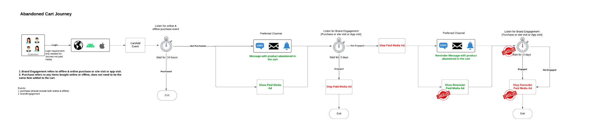
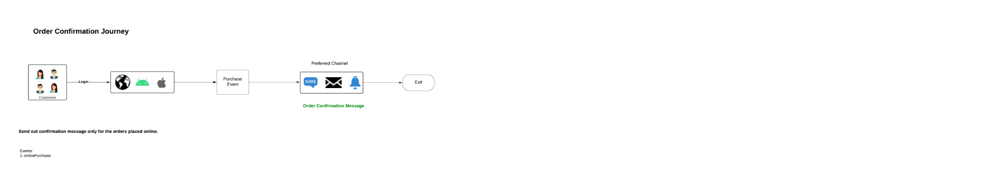

# Engaje novamente clientes de uma forma inteligente para que retornem

>[!NOTE]
>
>Esta é uma amostra de implementação e os exemplos nesta página, como sintaxe de segmento, são apenas exemplos. Você deve usar os exemplos como um guia, pois sua implementação pode ser diferente.

Reenvolva os clientes que abandonaram uma conversão de forma inteligente e responsável. Envolva os clientes obsoletos com experiências para aumentar a conversão e o valor vitalício do cliente.

Empregue considerações em tempo real, considere todas as qualidades e comportamentos do consumidor e ofereça requalificação rápida com base em eventos online e offline.

Abaixo está uma visualização de arquitetura de alto nível dos vários componentes do Real-Time CDP e do Journey Optimizer. Este diagrama mostra como os dados fluem pelos dois aplicativos Experience Platform, da coleta de dados ao ponto em que são ativados por meio de jornadas ou campanhas para destinos, para obter o caso de uso descrito nesta página.

## Visão geral do caso de uso {#overview}

Você construirá esquemas, conjuntos de dados e públicos à medida que trabalhar com exemplos de cenários de reengajamento. Você também descobrirá os recursos necessários para configurar as jornadas de exemplo no [!DNL Adobe Journey Optimizer] e os necessários para criar anúncios de mídia paga nos destinos. Este guia usa exemplos de reengajamento dos clientes nas jornadas de caso de uso descritas abaixo:

* **Cenário de navegação de produto abandonado** - Segmente os clientes que abandonaram a navegação de produto no site e no aplicativo móvel.
* **Cenário de abandono do carrinho** - Segmente os clientes que colocaram produtos no carrinho, mas ainda não foram comprados no site e no aplicativo móvel.
* **Cenário de confirmação de pedido** - Concentre-se nas compras de produtos feitas por meio do site e do aplicativo móvel.

## Pré-requisitos e planejamento {#prerequisites-and-planning}

Ao concluir as etapas para implementar o caso de uso, você usará a seguinte funcionalidade do Real-Time CDP e do Adobe Journey Optimizer (listada na ordem em que será usada). Verifique se tem as [permissões de controle de acesso baseado em atributo](/help/access-control/home.md) necessárias para todas essas áreas, ou solicite ao(à) administrador(a) que as conceda a você.

* [[!DNL Adobe Real-Time Customer Data Platform (Real-Time CDP)]](https://experienceleague.adobe.com/docs/platform-learn/tutorials/rtcdp/understanding-the-real-time-customer-data-platform.html?lang=pt-BR) - Integra dados em fontes de dados para alimentar a campanha. Esses dados são usados para criar os públicos-alvo da campanha e exibir elementos de dados personalizados usados no email e nos blocos promocionais da Web (por exemplo, nome ou informações relacionadas à conta). A CDP também é usada para ativar públicos-alvo no email e na Web (via [!DNL Adobe Target]).
   * [Esquemas](/help/xdm/home.md)
   * [Perfis](/help/profile/home.md)
   * [Conjuntos de dados](/help/catalog/datasets/overview.md)
   * [Públicos-alvo](/help/segmentation/home.md)
   * [[!DNL Adobe Journey Optimizer]](https://experienceleague.adobe.com/docs/journey-optimizer/using/orchestrate-journeys/journey.html?lang=pt-BR)
   * [Destinos](/help/destinations/home.md)

* [[!DNL Adobe Journey Optimizer]](https://experienceleague.adobe.com/docs/journey-optimizer-learn/tutorials/introduction-to-journey-optimizer/introduction.html?lang=pt-BR) - Ajuda você a fornecer experiências conectadas, contextuais e personalizadas aos seus clientes.
   * [Acionador de evento ou público-alvo](https://experienceleague.adobe.com/docs/journey-optimizer/using/offer-decisioning/collect-event-data/data-collection.html?lang=pt-BR)
   * [Públicos-alvo/Eventos](https://experienceleague.adobe.com/docs/journey-optimizer/using/audiences-profiles-identities/audiences/about-audiences.html?lang=pt-BR)
   * [Ações de Jornada](https://experienceleague.adobe.com/docs/journey-optimizer/using/orchestrate-journeys/journey.html?lang=pt-BR)

## Como obter o caso de uso {#achieve-use-case-instruction}

Abaixo está uma visão geral de alto nível dos três exemplos de cenários de reengajamento.

>[!BEGINTABS]

>[!TAB Cenário de pesquisa de produtos abandonada]

O cenário de navegação de produto abandonado segmenta a navegação de produto abandonada no site e no aplicativo móvel. Esse cenário é acionado quando um produto foi visualizado, mas não foi comprado ou adicionado ao carrinho. Neste exemplo, o engajamento da marca é acionado após três dias se não houver adições à lista nas últimas 24 horas.
{width="1920" zoomable="yes"}

1. Você cria esquemas e conjuntos de dados e habilita para [!UICONTROL Profile].
2. Você assimila dados na Experience Platform por meio da Web SDK, Mobile SDK ou API. O Analytics Source Connector também pode ser usado, mas pode resultar em latência de jornada.
3. Você assimila dados adicionais ativados por perfil, que podem ser vinculados ao visitante da Web e do aplicativo móvel autenticado por meio de gráficos de identidade.
4. Você compila públicos-alvo focalizados a partir da lista de perfis para verificar se um **cliente** fez um compromisso nos últimos três dias.
5. Você cria uma jornada de pesquisa de produto abandonada em [!DNL Adobe Journey Optimizer].
6. Se necessário, trabalhe com o **parceiro de dados** para a ativação de públicos-alvo para os destinos de mídia paga desejados.
7. [!DNL Adobe Journey Optimizer] verifica o consentimento e envia as várias ações configuradas.

>[!TAB Cenário de Carrinho Abandonado]

O cenário de carrinho abandonado se aplica quando os produtos foram colocados no carrinho, mas ainda não foram comprados no site e no aplicativo móvel. Além disso, as campanhas de Mídia paga são iniciadas e interrompidas usando esse método.
{width="1920" zoomable="yes"}

1. Você cria esquemas e conjuntos de dados, o habilitado para [!UICONTROL Profile].
2. Você assimila dados na Experience Platform por meio da Web SDK, Mobile SDK ou API. O Analytics Source Connector também pode ser usado, mas pode resultar em latência de jornada.
3. Você assimila dados adicionais ativados por perfil, que podem ser vinculados ao visitante da Web e do aplicativo móvel autenticado por meio de gráficos de identidade.
4. Você compila públicos-alvo focalizados a partir da lista de perfis para verificar se um **cliente** colocou um item no carrinho, mas não concluiu a compra. O evento **[!UICONTROL Add to cart]** inicia um temporizador que aguarda 30 minutos e verifica a compra. Se nenhuma compra for feita, o **cliente** será adicionado aos públicos-alvo de **[!UICONTROL Abandon Cart]**.
5. Você cria uma jornada de carrinho abandonada em [!DNL Adobe Journey Optimizer].
6. Se necessário, trabalhe com o **parceiro de dados** para a ativação de públicos-alvo para os destinos de mídia paga desejados.
7. [!DNL Adobe Journey Optimizer] verifica o consentimento e envia as várias ações configuradas.

>[!TAB Cenário de confirmação do pedido]

O cenário de confirmação de pedido se concentra nas compras de produtos feitas pelo site e pelo aplicativo móvel.
{width="1920" zoomable="yes"}

1. Você cria esquemas e conjuntos de dados e habilita para [!UICONTROL Profile].
2. Você assimila dados na Experience Platform por meio da Web SDK, Mobile SDK ou API. O Analytics Source Connector também pode ser usado, mas pode resultar em latência de jornada.
3. Você assimila dados adicionais ativados por perfil, que podem ser vinculados ao visitante da Web e do aplicativo móvel autenticado por meio de gráficos de identidade.
4. Você cria uma jornada de confirmação em [!DNL Adobe Journey Optimizer].
5. [!DNL Adobe Journey Optimizer] envia uma mensagem de confirmação de pedido usando o canal preferido.

>[!ENDTABS]

Para concluir cada uma das etapas das visões gerais de alto nível acima, leia as seções abaixo, que oferecem links para mais informações e instruções mais detalhadas.

### Criar esquemas e especificar grupos de campos {#schema-design}

Os recursos do Experience Data Model (XDM) são gerenciados no espaço de trabalho [!UICONTROL Schemas] em [!DNL Adobe Experience Platform]. Você pode visualizar e explorar os recursos principais fornecidos por [!DNL Adobe] (por exemplo, grupos de campos) e criar recursos e esquemas personalizados para sua organização.

Para obter mais informações sobre como criar [esquemas](/help/xdm/home.md), consulte o tutorial [criar esquema.](/help/xdm/tutorials/create-schema-ui.md) e [Modelar seus dados de experiência do cliente com XDM](https://experienceleague.adobe.com/docs/courses/using/experienceplatform-d-1-2021-1-xdm.html).

Há quatro designs de esquema que são usados para o caso de uso de reengajamento. Cada esquema requer a configuração de campos específicos. Você precisa ativar o esquema para ser incluído no Perfil de cliente em tempo real. Para obter mais informações sobre como habilitar o esquema para uso no Perfil de Cliente em Tempo Real, leia [habilitar um esquema para o Perfil de Cliente em Tempo Real](/help/xdm/ui/resources/schemas.md#enable-a-schema-for-real-time-customer-profile).

#### Esquema de atributos do cliente

Esse esquema é usado para estruturar e fazer referência aos dados do perfil que compõem as informações do cliente. Normalmente, esses dados são assimilados no [!DNL Adobe Experience Platform] por meio do seu CRM ou sistema semelhante e são necessários para consultar os detalhes do cliente usados para personalização, consentimento de marketing e recursos aprimorados do público-alvo.

O esquema de atributos do cliente é representado por uma classe [[!UICONTROL XDM Individual Profile]](/help/xdm/classes/individual-profile.md), que inclui os seguintes grupos de campos:

+++Detalhes de contato pessoal (grupo de campos)

[Detalhes de Contato Pessoal](/help/xdm/field-groups/profile/personal-contact-details.md) é um grupo de campos de esquema padrão para a classe Perfil Individual XDM que descreve as informações de contato de uma pessoa individual.

| Campos | Descrição |
| --- | --- |
| `mobilePhone.number` | O número do celular da pessoa, que será usado para SMS. |
| `personalEmail.address` | O endereço de email da pessoa. |

+++

+++Detalhes de auditoria externa do sistema Source (grupo de campos)

[Atributos de Auditoria de Sistema Externos do Source](/help/xdm/data-types/external-source-system-audit-attributes.md) é um tipo de dados padrão do Experience Data Model (XDM) que captura detalhes de auditoria sobre um sistema de origem externo.

+++

+++Grupos de campos de consentimento e preferência (Grupo de campos)

O grupo de campos [Consentimentos e Preferências](/help/xdm/field-groups//profile/consents.md) fornece um único campo de tipo de objeto, consentimentos, para capturar informações de consentimento e preferência.

| Campos | Requisito |
| --- | --- |
| `consents.marketing.email.val` | Obrigatório |
| `consents.marketing.preferred` | Obrigatório |
| `consents.marketing.push.val` | Obrigatório |
| `consents.marketing.sms.val` | Obrigatório |
| `consents.personalize.content.val` | Obrigatório |
| `consents.share.val` | Obrigatório |

+++

+++Detalhes do teste de perfil (grupo de campos)

Este grupo de campos permite testar sua jornada antes de ela ser publicada, usando perfis de teste. Para obter mais informações sobre como criar perfis de teste, leia o [tutorial Criar perfis de teste](https://experienceleague.adobe.com/docs/journeys/using/building-journeys/about-journey-building/creating-test-profiles.html?lang=pt-BR) e o [tutorial Testar o jornada](https://experienceleague.adobe.com/docs/journeys/using/building-journeys/testing-the-journey.html?lang=pt-BR).

+++

#### Esquema de transações digitais do cliente

Esse esquema é usado para estruturar e fazer referência aos dados do evento que compõem a atividade do cliente que ocorre no site ou nas plataformas digitais associadas. Normalmente, esses dados são assimilados no [!DNL Adobe Experience Platform] por meio do [Web SDK](/help/collection/js/js-overview.md) e são necessários para fazer referência aos vários eventos de navegação e conversão usados para acionar jornadas, análises detalhadas online de clientes, recursos aprimorados de público-alvo e mensagens personalizadas.

O esquema de transações digitais do cliente é representado por uma classe [[!UICONTROL XDM ExperienceEvent]](/help/xdm/classes/experienceevent.md).

+++XDM ExperienceEvent (Classe)

A classe [[!UICONTROL XDM ExperienceEvent]](/help/xdm/classes/experienceevent.md) inclui os seguintes grupos de campos:

| Campos | Descrição |
| --- | --- |
| `_id` | Identifica com exclusividade os eventos individuais que são assimilados em [!DNL Adobe Experience Platform]. |
| `timestamp` | Um carimbo de data e hora ISO 8601 de quando o evento ocorreu, formatado de acordo com RFC 3339 Seção 5.6. Esse carimbo de data e hora deve ocorrer no passado. |
| `eventType` | Uma string que indica o tipo de categoria do evento. |

+++

+++Detalhes da ID do usuário final (Grupo de campos)

O grupo de campos [Detalhes da ID do Usuário Final](/help/xdm/field-groups/event/enduserids.md) é usado para descrever as informações de identidade de um indivíduo em vários aplicativos da Adobe.

| Campos | Descrição |
| --- | --- |
| `endUserIDs._experience.emailid.authenticatedState` | Estado autenticado da ID do endereço de email do usuário final. |
| `endUserIDs._experience.emailid.id` | ID do endereço de email do usuário final. |
| `endUserIDs._experience.emailid.namespace.code` | Código de namespace da ID do endereço de email do usuário final. |
| `endUserIDs._experience.mcid.authenticatedState` | [!DNL Adobe] Estado autenticado da Marketing Cloud ID (MCID). O MCID agora é conhecido como Experience Cloud ID (ECID). |
| `endUserIDs._experience.mcid.id` | [!DNL Adobe] Marketing Cloud ID (MCID). O MCID agora é conhecido como Experience Cloud ID (ECID). |
| `endUserIDs._experience.mcid.namespace.code` | [!DNL Adobe] código de namespace da Marketing Cloud ID (MCID). |

+++

+++Detalhes do Commerce (Grupo de Campos)

O grupo de campos [Detalhes do Commerce](/help/xdm/field-groups/event/commerce-details.md) é usado para descrever dados de comércio, como informações do produto (SKU, nome, quantidade) e operações padrão do carrinho (pedido, check-out, abandono).

| Campos | Descrição |
| --- | --- |
| `commerce.cart.cartID` | Uma ID para o carrinho de compras. |
| `commerce.order.orderType` | Um objeto que descreve o tipo de pedido do produto. |
| `commerce.order.payments.paymentAmount` | Um objeto que descreve o valor do pagamento da ordem do produto. |
| `commerce.order.payments.paymentType` | Um objeto que descreve o tipo de pagamento de ordem de produto. |
| `commerce.order.payments.transactionID` | Um ID de transação de ordem de produto de objeto. |
| `commerce.order.purchaseID` | Uma ID de compra da ordem de produto do objeto. |
| `productListItems.name` | Uma lista de nomes de itens que representam os produtos selecionados por um cliente. |
| `productListItems.priceTotal` | O preço total da lista de itens que representam os produtos selecionados por um cliente. |
| `productListItems.product` | Os produtos selecionados. |
| `productListItems.quantity` | A quantidade de itens da lista que representam os produtos selecionados por um cliente. |

+++

+++Detalhes de auditoria externa do sistema Source (grupo de campos)

Atributos de auditoria de sistema do Source externo é um tipo de dados padrão do Experience Data Model (XDM) que captura os detalhes de auditoria sobre um sistema de origem externa.

+++

#### Esquema de transações offline do cliente

Esse esquema é usado para estruturar e fazer referência aos dados do evento que compõem a atividade do cliente que ocorre em plataformas fora do site. Normalmente, esses dados são assimilados no [!DNL Adobe Experience Platform] a partir de um PDV (ou sistema semelhante) e, na maioria das vezes, são transmitidos para o Experience Platform por meio de uma conexão de API. Seu objetivo é fazer referência aos vários eventos de conversão offline usados para acionar jornadas, análises profundas online e offline do cliente, recursos aprimorados de público-alvo e mensagens personalizadas.

O esquema de transações offline do cliente é representado por uma classe [[!UICONTROL XDM ExperienceEvent]](/help/xdm/classes/experienceevent.md).

+++XDM ExperienceEvent (Classe)

A classe [[!UICONTROL XDM ExperienceEvent]](/help/xdm/classes/experienceevent.md) inclui os seguintes grupos de campos:

| Campos | Descrição |
| --- | --- |
| `_id` | Identifica com exclusividade os eventos individuais que são assimilados em [!DNL Adobe Experience Platform]. |
| `timestamp` | Um carimbo de data e hora ISO 8601 de quando o evento ocorreu, formatado de acordo com RFC 3339 Seção 5.6. Esse carimbo de data e hora deve ocorrer no passado. |
| `eventType` | Uma string que indica o tipo de categoria do evento. |

+++

+++Detalhes do Commerce (Grupo de Campos)

O grupo de campos [Detalhes do Commerce](/help/xdm/field-groups/event/commerce-details.md) é usado para descrever dados de comércio, como informações do produto (SKU, nome, quantidade) e operações padrão do carrinho (pedido, check-out, abandono).

| Campos | Descrição |
| --- | --- |
| `commerce.cart.cartID` | Uma ID para o carrinho de compras. |
| `commerce.order.orderType` | Um objeto que descreve o tipo de pedido do produto. |
| `commerce.order.payments.paymentAmount` | Um objeto que descreve o valor do pagamento da ordem do produto. |
| `commerce.order.payments.paymentType` | Um objeto que descreve o tipo de pagamento de ordem de produto. |
| `commerce.order.payments.transactionID` | Um ID de transação de ordem de produto de objeto. |
| `commerce.order.purchaseID` | Uma ID de compra da ordem de produto do objeto. |
| `productListItems.name` | Uma lista de nomes de itens que representam os produtos selecionados por um cliente. |
| `productListItems.priceTotal` | O preço total da lista de itens que representam os produtos selecionados por um cliente. |
| `productListItems.product` | Os produtos selecionados. |
| `productListItems.quantity` | A quantidade de itens da lista que representam os produtos selecionados por um cliente. |

+++

+++Detalhes de contato pessoal (grupo de campos)

[Detalhes de Contato Pessoal](/help/xdm/field-groups/profile/personal-contact-details.md) é um grupo de campos de esquema padrão para a classe Perfil Individual XDM que descreve as informações de contato de uma pessoa individual.

| Campos | Descrição |
| --- | --- |
| `mobilePhone.number` | O número do celular da pessoa, que será usado para SMS. |
| `personalEmail.address` | O endereço de email da pessoa. |

+++

+++Detalhes de auditoria externa do sistema Source (grupo de campos) 

Atributos de auditoria de sistema do Source externo é um tipo de dados padrão do Experience Data Model (XDM) que captura os detalhes de auditoria sobre um sistema de origem externa.

+++

#### Esquema do Adobe web connector

>[!NOTE]
>
>Esta é uma implementação opcional se você estiver usando o [[!DNL Adobe Analytics Source Connector]](/help/sources/connectors/adobe-applications/analytics.md).

Esse esquema é usado para estruturar e fazer referência aos dados do evento que compõem a atividade do cliente que ocorre no site ou nas plataformas digitais associadas. Este esquema é semelhante ao esquema de Transações digitais do cliente, mas difere na medida em que se destina a ser usado quando o [Web SDK](/help/collection/js/js-overview.md) não é uma opção para coleta de dados; portanto, este esquema é necessário quando você está utilizando o [!DNL Adobe Analytics Source Connector] para enviar seus dados online para o [!DNL Adobe Experience Platform] como uma sequência de dados primária ou secundária.

O esquema do conector da Web [!DNL Adobe] é representado por uma classe [[!UICONTROL XDM ExperienceEvent]](/help/xdm/classes/experienceevent.md).

+++XDM ExperienceEvent (Classe)

A classe [[!UICONTROL XDM ExperienceEvent]](/help/xdm/classes/experienceevent.md) inclui os seguintes grupos de campos:

| Campos | Descrição |
| --- | --- |
| `_id` | Identifica com exclusividade os eventos individuais que são assimilados em [!DNL Adobe Experience Platform]. |
| `timestamp` | Um carimbo de data e hora ISO 8601 de quando o evento ocorreu, formatado de acordo com RFC 3339 Seção 5.6. Esse carimbo de data e hora deve ocorrer no passado. |
| `eventType` | Uma string que indica o tipo de categoria do evento. |

+++

+++Modelo de evento de experiência do Adobe Analytics (grupo de campos)

O grupo de campos [Adobe Analytics ExperienceEvent](/help/xdm/field-groups/event/analytics-full-extension.md) captura métricas comuns coletadas pelo Adobe Analytics.

| Campos | Descrição |
| --- | --- |
| `endUserIDs._experience.emailid.authenticatedState` | Estado autenticado da ID do endereço de email do usuário final. |
| `endUserIDs._experience.emailid.id` | ID do endereço de email do usuário final. |
| `endUserIDs._experience.emailid.namespace.code` | Código de namespace da ID do endereço de email do usuário final. |
| `endUserIDs._experience.mcid.authenticatedState` | [!DNL Adobe] Estado autenticado da Marketing Cloud ID (MCID). O MCID agora é conhecido como Experience Cloud ID (ECID). |
| `endUserIDs._experience.mcid.id` | [!DNL Adobe] Marketing Cloud ID (MCID). O MCID agora é conhecido como Experience Cloud ID (ECID). |
| `endUserIDs._experience.mcid.namespace.code` | [!DNL Adobe] código de namespace da Marketing Cloud ID (MCID). |

+++

+++Detalhes de auditoria externa do sistema Source (grupo de campos)

Atributos de auditoria de sistema do Source externo é um tipo de dados padrão do Experience Data Model (XDM) que captura os detalhes de auditoria sobre um sistema de origem externa.

+++

### Criar um conjunto de dados a partir de um esquema {#create-datasets}

Um conjunto de dados é uma estrutura de armazenamento e gerenciamento para um grupo de dados. Cada esquema para cenários inteligentes de reengajamento deve ter seu próprio conjunto de dados.

Para obter mais informações sobre como criar um [conjunto de dados](/help/catalog/datasets/overview.md) a partir de um esquema, leia o [guia da interface do usuário de conjuntos de dados](/help/catalog/datasets/user-guide.md).

>[!NOTE]
>
>Semelhante à etapa para criar um esquema, é necessário ativar o conjunto de dados para ser incluído no Perfil do cliente em tempo real. Para obter mais informações sobre como habilitar o conjunto de dados para uso no Perfil de Cliente em Tempo Real, consulte o tutorial em [trazendo dados para o Perfil de Cliente em Tempo Real](https://experienceleague.adobe.com/docs/platform-learn/tutorials/profiles/bring-data-into-the-real-time-customer-profile.html?lang=pt-BR).

### Consentimento e governança de dados {#privacy-consent}

>[!IMPORTANT]
>
>Oferecer aos clientes a capacidade de cancelar a inscrição para receber comunicações de uma marca, bem como garantir que essa escolha seja respeitada, é um requisito legal. Saiba mais sobre a legislação aplicável na [Visão geral das regras de privacidade](https://experienceleague.adobe.com/docs/experience-platform/privacy/regulations/overview.html?lang=pt-BR).

#### Políticas de consentimento

Ao criar um caminho de reengajamento, considere adicionar as [políticas de consentimento](https://experienceleague.adobe.com/docs/platform-learn/data-collection/web-sdk/consent/overview.html?lang=pt-BR) a seguir:

* Se `consents.marketing.email.val = "Y"` então pode enviar um email
* Se `consents.marketing.sms.val = "Y"` então pode SMS
* Se `consents.marketing.push.val = "Y"` então Pode enviar
* Se `consents.share.val = "Y"` então pode anunciar

#### Rotulagem e aplicação da governança de dados

Ao criar um caminho de reengajamento, considere adicionar os [rótulos de Governança de Dados](/help/data-governance/labels/overview.md) a seguir:

* Os endereços de email pessoais são utilizados como dados diretos identificáveis usados para identificar ou entrar em contato com um indivíduo específico, em vez de com um dispositivo.
   * `personalEmail.address = I1`

#### Políticas de uso de dados

Não há [políticas de uso de dados](/help/data-governance/policies/overview.md) necessárias para o cenário de pesquisa de produto abandonado. No entanto, você deve considerar o seguinte:

* Restringir Dados Confidenciais
* Restringir o Advertising no local
* Restringir o direcionamento de email
* Restringir o direcionamento entre sites
* Restringir a combinação de dados diretamente identificáveis com dados anônimos

### Criar públicos-alvo {#create-audience}

Os cenários de reengajamento usam públicos para definir atributos ou comportamentos específicos compartilhados por um subconjunto de perfis da sua loja de perfis para distinguir um grupo comercializável de pessoas da sua base de clientes. Os públicos podem ser criados de várias maneiras no [!DNL Adobe Experience Platform].

Para obter mais informações sobre como criar um público, leia o [guia da interface do usuário do serviço de público-alvo](https://experienceleague.adobe.com/docs/experience-platform/segmentation/ui/overview.html?lang=pt-BR#create-audience).

Para obter mais informações sobre como compor diretamente [Públicos-alvo](/help/segmentation/home.md), leia o [Guia da Interface do Usuário de Composição de Público](/help/segmentation/ui/audience-composition.md).

Para obter mais informações sobre como criar públicos-alvo por meio de definições de público-alvo derivadas da Experience Platform, leia o [Guia da Interface do usuário do Audience Builder](/help/segmentation/ui/segment-builder.md).

>[!BEGINTABS]

>[!TAB Cenário de pesquisa de produtos abandonada]

Esse público-alvo é criado como um aprimoramento do cenário clássico de &quot;Abandono do carrinho&quot;. Enquanto o abandono do carrinho geralmente se concentra em uma adição ao carrinho sem uma compra subsequente em um determinado período de tempo, esse público-alvo busca um envolvimento anterior, especificamente aqueles que podem ter navegado em um produto específico, mas não o adicionaram ao carrinho e não tiveram nenhuma atividade de acompanhamento no site em um determinado período de tempo. Esse público-alvo ajuda a manter sua marca no topo da mente para os clientes que atendem a esse critério de inclusão e também pode ser aproveitado para clientes cujas propriedades digitais podem diferir de um modelo de comércio eletrônico tradicional.

+++Exibição de produto abandonada sem engajamento nos últimos três dias

O evento a seguir é usado para o cenário de navegação de produto abandonada em que os usuários visualizaram produtos online e não se envolveram (visitas ao site, visitas a aplicativos, compras online, compras offline e eventos de adição ao carrinho) nos 3 dias seguintes.

Os seguintes campos e condições são obrigatórios ao configurar este público-alvo:

* `eventType: commerce.productViews`
* E `THEN` (evento sequencial) excluir `eventType: commerce.productListAdds` AND `application.launch` AND `web.webpagedetails.pageViews` AND `commerce.purchases` (isso inclui online e offline)
   * `Timestamp: > 3 days after productView`
* `Timestamp: > 4 days`

+++

+++Exibição do produto com envolvimento nos últimos três dias

O evento a seguir é usado para o cenário de navegação de produto abandonado em que os usuários visualizaram produtos online e se envolveram (visitas a sites, visitas a aplicativos, compras online, compras offline e eventos de adição ao carrinho) nos 3 dias seguintes.

Os seguintes campos e condições são obrigatórios ao configurar este público-alvo:

* `eventType: commerce.productViews`
* E `THEN` (evento sequencial) inclui `eventType: commerce.productListAdds` OU `application.launch` OU `web.webpagedetails.pageViews` OU `commerce.purchases` (isso inclui online e offline)
   * `Timestamp: > 3 days after productView`
* `Timestamp: > 4 days`
+++

+++Transmissão de engajamento no último dia

O evento a seguir é usado para o cenário de navegação de produto abandonado em que os usuários se envolveram (visitas ao site, visitas de aplicativos, compras online, compras offline e eventos de adição ao carrinho) nos últimos 1 dia.

Os seguintes campos e condições são obrigatórios ao configurar este público-alvo:

* `eventType: commerce.productListAdds OR application.launch OR web.webpagedetails.pageViews OR commerce.purchases`
   * `Timestamp: in last 1 day` (Streaming)

+++

+++Lote de participação nos últimos três dias

O evento a seguir é usado para o cenário de navegação de produto abandonado em que os usuários se envolveram (visitas a sites, visitas a aplicativos, compras online, compras offline e eventos de adição ao carrinho) nos últimos 3 dias.

Os seguintes campos e condições são obrigatórios ao configurar este público-alvo:

* `EventType: commerce.productListAdds OR application.launch OR web.webpagedetails.pageViews OR commerce.purchases`
   * `Timestamp: in last 3 days` (Lote)

+++

>[!TAB Cenário de Carrinho Abandonado]

Esse público-alvo é criado para oferecer suporte ao cenário clássico de &quot;Abandono do carrinho&quot;. Seu objetivo é encontrar clientes que adicionaram um produto ao carrinho de compras, mas que não fizeram uma compra. Esse público-alvo ajudará a manter não apenas a sua marca no topo da mente dos seus clientes, mas também os produtos que eles deixaram para trás sem uma compra subsequente.

Os eventos a seguir são usados para o cenário de carrinho abandonado em que os usuários adicionaram um produto ao carrinho entre 1 e 4 dias atrás, mas não concluíram a compra ou limparam o carrinho.

Os seguintes campos e condições são obrigatórios ao configurar este público-alvo:

* `eventType: commerce.productListAdds`
   * `Timestamp: >= 1 days before now AND <= 4 days before now`
* `eventType: commerce.purchases`
   * `Timestamp: <= 4 days before now`
* `eventType: commerce.productListRemovals`
   * `Timestamp: <= 4 days before now`

O descritor do cenário de carrinho abandonado aparece como:

`Include eventType = commerce.productListAdds between 30 min and 1440 minutes before now. exclude eventType = commerce.purchases 30 minutes before now OR eventType = commerce.productListRemovals AND Cart ID equals Product List Adds1 Cart ID (the inclusion event).`

>[!TAB Cenário de confirmação do pedido]

Esta jornada não requer a criação de públicos-alvo.

>[!ENDTABS]

### Configuração do Jornada no Adobe Journey Optimizer {#journey-setup}

>[!NOTE]
>
>[!DNL Adobe Journey Optimizer] não abrange tudo o que é mostrado nos diagramas. Todos os [anúncios de mídia pagos](/help/destinations/catalog/social/overview.md) são criados em [!UICONTROL Destinations].

[[!DNL Adobe Journey Optimizer]](https://experienceleague.adobe.com/docs/journey-optimizer/using/orchestrate-journeys/journey.html?lang=pt-BR) ajuda você a fornecer experiências conectadas, contextuais e personalizadas aos seus clientes. A jornada do cliente envolve todo o processo de interação do cliente com a marca. Cada jornada de caso de uso requer informações específicas. Veja abaixo os dados precisos necessários para cada jornada.

>[!BEGINTABS]

>[!TAB Cenário de pesquisa de produtos abandonada]

O cenário de navegação de produto abandonado segmenta a navegação de produto abandonada no site e no aplicativo móvel.
{width="1920" zoomable="yes"}

+++Eventos

Os eventos permitem acionar as jornadas de forma unitária para enviar mensagens em tempo real à pessoa que flui para a jornada. Para obter mais informações sobre eventos, leia o [guia de eventos gerais](https://experienceleague.adobe.com/docs/journey-optimizer/using/orchestrate-journeys/about-journey-building/general-events.html?lang=pt-BR).

* Evento 1: visualizações do produto
   * Esquema: Transações digitais do cliente
   * Campos:
      * `eventType`
   * Condição:
      * `eventType = commerce.productViews`
      * Campos:
         * `eventType`
         * `productListItems.name`
         * `productListItems.priceTotal`
         * `productListItems.product`
         * `productListItems.productImageUrl`
         * `productListItems.quantity`
         * `timestamp`
         * `endUserIDs._experience.emailid.authenticatedState`
         * `endUserIDs._experience.emailid.id`
         * `endUserIDs._experience.emailid.namespace.code`
         * `_id`

* Evento 2: Adicionar ao carrinho
   * Esquema: Transações digitais do cliente
   * Campos:
      * `eventType`
   * Condição:
      * `eventType = commerce.productListAdds`
      * Campos:
         * `commerce.productListAdds.id`
         * `commerce.productListAdds.value`
         * `eventType`
         * `identityMap.authenticatedState`
         * `identityMap.id`
         * `identityMap.primary`
         * `productListItems.SKU`
         * `productListItems.currencyCode`
         * `productListItems.name`
         * `productListItems.priceTotal`
         * `productListItems.product`
         * `productListItems.productImageUrl`
         * `productListItems.quantity`
         * `timestamp`
         * `commerce.cart.cartID`
         * `endUserIDs._experience.emailid.authenticatedState`
         * `endUserIDs._experience.emailid.id`
         * `endUserIDs._experience.emailid.namespace.code`
         * `_id`

* Evento 3: Engajamento com a marca
   * Esquema: Transações digitais do cliente
   * Campos:
      * `eventType`
   * Condição:
      * `eventType in application.launch, commerce.purchases, web.webpagedetails.pageViews`
      * Campos:
         * `eventType`
         * `identityMap.authenticatedState`
         * `identityMap.id`
         * `identityMap.primary`
         * `productListItems.SKU`
         * `productListItems.currencyCode`
         * `productListItems.name`
         * `productListItems.priceTotal`
         * `productListItems.product`
         * `productListItems.productImageUrl`
         * `productListItems.quantity`
         * `timestamp`
         * `web.webpagedetails.URL`
         * `web.webpagedetails.isHomePage`
         * `web.webpagedetails.name`
         * `endUserIDs._experience.emailid.authenticatedState`
         * `endUserIDs._experience.emailid.id`
         * `endUserIDs._experience.emailid.namespace.code`
         * `_id`
         * `commerce.purchases.id`
         * `commerce.purchases.value`
         * `shipping.address.city`
         * `shipping.address.countryCode`
         * `shipping.address.postalCode`
         * `shipping.address.state`
         * `shipping.address.street1`
         * `shipping.address.street2`
         * `shipping.shipDate`
         * `shipping.trackingNumber`
         * `shipping.trackingURL`

+++

+++Jornada lógica da chave da tela

A lógica da chave da tela de jornada exige que você identifique eventos específicos e configure as ações que devem ocorrer após a ocorrência do evento.

* Jornada Lógica de Entrada
   * Evento de exibição de produto

* Condições
   * Verifique pelo menos um evento de compra online ou offline desde a última visualização do produto.
      * Esquema: Transações digitais do cliente
      * `eventType = commerce.purchases`
      * `timestamp > timestamp of product last viewed`

   * Verifique pelo menos uma compra offline desde a última visualização do produto:
      * Esquema: Transações Offline do Cliente
      * `eventType = commerce.purchases`
      * `timestamp > timestamp of product last viewed`

   * Condições - Selecione o canal de público alvo
      * Email
         * `consents.marketing.email.val = y`
      * Push
         * `consents.marketing.push.val=y`
      * SMS
         * `consents.marketing.sms.val = y`

   * Channel Personalization
      * Conteúdo de canal personalizado com base na exibição do produto.

+++

>[!TAB Cenário de Carrinho Abandonado]

O cenário de carrinho abandonado segmenta os produtos que foram colocados no carrinho, mas que ainda não foram comprados no site e no aplicativo móvel.
{width="1920" zoomable="yes"}

+++Eventos

Os eventos permitem acionar as jornadas de forma unitária para enviar mensagens em tempo real à pessoa que flui para a jornada. Para obter mais informações sobre eventos, leia o [guia de eventos gerais](https://experienceleague.adobe.com/docs/journey-optimizer/using/orchestrate-journeys/about-journey-building/general-events.html?lang=pt-BR).

* Evento 2: Adicionar ao carrinho
   * Esquema: Transações digitais do cliente
   * Campos:
      * `eventType`
   * Condição:
      * `eventType = commerce.productListAdds`
      * Campos:
         * `commerce.productListAdds.id`
         * `commerce.productListAdds.value`
         * `eventType`
         * `identityMap.authenticatedState`
         * `identityMap.id`
         * `identityMap.primary`
         * `productListItems.SKU`
         * `productListItems.currencyCode`
         * `productListItems.name`
         * `productListItems.priceTotal`
         * `productListItems.product`
         * `productListItems.productImageUrl`
         * `productListItems.quantity`
         * `timestamp`
         * `commerce.cart.cartID`
         * `endUserIDs._experience.emailid.authenticatedState`
         * `endUserIDs._experience.emailid.id`
         * `endUserIDs._experience.emailid.namespace.code`
         * `_id`

* Evento 4: compras online
   * Esquema: Transações digitais do cliente
   * Campos:
      * `eventType`
   * Condição:
      * `eventType = commerce.purchases`
      * Campos:
         * `commerce.purchases.id`
         * `commerce.purchases.value`
         * `eventType`
         * `identityMap.authenticatedState`
         * `identityMap.id`
         * `identityMap.primary`
         * `productListItems.SKU`
         * `productListItems.currencyCode`
         * `productListItems.name`
         * `productListItems.priceTotal`
         * `productListItems.product`
         * `productListItems.productImageUrl`
         * `productListItems.quantity`
         * `timestamp`
         * `endUserIDs._experience.emailid.authenticatedState`
         * `endUserIDs._experience.emailid.id`
         * `endUserIDs._experience.emailid.namespace.code`
         * `_id`

* Evento 3: Engajamento com a marca
   * Esquema: Transações digitais do cliente
   * Campos:
      * `eventType`
   * Condição:
      * `eventType in application.launch, commerce.purchases, web.webpagedetails.pageViews`
      * Campos:
         * `eventType`
         * `identityMap.authenticatedState`
         * `identityMap.id`
         * `identityMap.primary`
         * `productListItems.SKU`
         * `productListItems.currencyCode`
         * `productListItems.name`
         * `productListItems.priceTotal`
         * `productListItems.product`
         * `productListItems.productImageUrl`
         * `productListItems.quantity`
         * `timestamp`
         * `web.webpagedetails.URL`
         * `web.webpagedetails.isHomePage`
         * `web.webpagedetails.name`
         * `endUserIDs._experience.emailid.authenticatedState`
         * `endUserIDs._experience.emailid.id`
         * `endUserIDs._experience.emailid.namespace.code`
         * `_id`
         * `commerce.purchases.id`
         * `commerce.purchases.value`
         * `shipping.address.city`
         * `shipping.address.countryCode`
         * `shipping.address.postalCode`
         * `shipping.address.state`
         * `shipping.address.street1`
         * `shipping.address.street2`
         * `shipping.shipDate`
         * `shipping.trackingNumber`
         * `shipping.trackingURL`

+++

+++Jornada lógica da chave da tela

A lógica da chave da tela de jornada exige que você identifique eventos específicos e configure as ações que devem ocorrer após a ocorrência do evento.

* Jornada Lógica de Entrada
   * `AddToCart` Evento

* AuthenticatedState em autenticado

* Condição: compras offline desde que o carrinho foi abandonado pela última vez:
   * Esquema: Transações Offline do Cliente
   * `eventType = commerce.purchases`
   * `timestamp > timestamp of cart was last abandoned`

* Condição: carrinho limpo desde que o carrinho foi abandonado pela última vez:
   * Esquema: Transações digitais do cliente
   * `eventType = commerce.cartCleared`
   * `cartID` (ID do carrinho)
   * `timestamp > timestamp of cart was last abandoned`

* Selecionar canal de destino (selecione um ou vários canais para maior alcance)
   * Email
      * `consents.marketing.email.val = y`
   * Push
      * `consents.marketing.push.val = y`
   * SMS
      * `consents.marketing.sms.val = y`
   * Channel Personalization
      * Exibir informações detalhadas do carrinho e exibir vários produtos em formato de tabela.

+++

>[!TAB Cenário de confirmação do pedido]

O cenário de confirmação de pedido se concentra nas compras de produtos feitas pelo site e pelo aplicativo móvel.
{width="1920" zoomable="yes"}

+++Eventos

Os eventos permitem acionar as jornadas de forma unitária para enviar mensagens em tempo real à pessoa que flui para a jornada. Para obter mais informações sobre eventos, leia o [guia de eventos gerais](https://experienceleague.adobe.com/docs/journey-optimizer/using/orchestrate-journeys/about-journey-building/general-events.html?lang=pt-BR).

* Evento 4: compras online
   * Esquema: Transações digitais do cliente
   * Campos:
      * `eventType`
   * Condição:
      * `eventType = commerce.purchases`
      * Campos:
         * `commerce.purchases.id`
         * `commerce.purchases.value`
         * `eventType`
         * `identityMap.authenticatedState`
         * `identityMap.id`
         * `identityMap.primary`
         * `productListItems.SKU`
         * `productListItems.currencyCode`
         * `productListItems.name`
         * `productListItems.priceTotal`
         * `productListItems.product`
         * `productListItems.productImageUrl`
         * `productListItems.quantity`
         * `timestamp`
         * `endUserIDs._experience.emailid.authenticatedState`
         * `endUserIDs._experience.emailid.id`
         * `endUserIDs._experience.emailid.namespace.code`
         * `_id`

+++

+++Jornada lógica da chave da tela

A lógica da chave da tela de jornada exige que você identifique eventos específicos e configure as ações que devem ocorrer após a ocorrência do evento.

* Jornada Lógica de Entrada
   * Evento de pedido

* Condições
   * Selecionar canal de destino (selecione um ou vários canais para maior alcance).
      * A confirmação do pedido é considerada de natureza pessoal, portanto, a verificação de consentimento geralmente é desnecessária.
      * Email
      * Push
      * SMS

   * Personalization de conteúdo do canal
      * Exibe informações detalhadas do pedido e pode exibir uma lista de produtos usando um formato de tabela.

+++

>[!ENDTABS]

Para obter mais informações sobre como criar jornadas no [!DNL Adobe Journey Optimizer], leia o [Guia de Introdução ao jornada](https://experienceleague.adobe.com/docs/journey-optimizer/using/orchestrate-journeys/journey.html?lang=pt-BR).

### Configuração de anúncios de mídia paga em destinos {#paid-media-ads}

A estrutura de destinos é usada para anúncios de mídia paga. Após verificar o consentimento, ele é enviado para os vários destinos configurados. Para obter mais informações sobre destinos, leia o documento [Visão geral sobre destinos](/help/destinations/home.md).

#### Dados exigidos para destinos

Os destinos de exportação de público-alvo de transmissão (como Facebook, Google Customer Match, Google DV360) são compatíveis com várias identidades de dados do cliente:

* `personalEmail.address`
* `ECID`
* `mobilePhone.number`

Você pode ativar a navegação abandonada de produtos e abandonar os públicos do carrinho para anúncios de mídia pagos.

* Fluxo/Acionado
   * [Advertising](/help/destinations/catalog/advertising/overview.md)/[Mídia paga e Redes Sociais](/help/destinations/catalog/social/overview.md)
   * [Dispositivo móvel](/help/destinations/catalog/mobile-engagement/overview.md)
   * [Destino do streaming](/help/destinations/catalog/streaming/http-destination.md)
   * [Destino personalizado criado usando o Destination SDK.](/help/destinations/destination-sdk/overview.md). Se você for um cliente do Real-Time CDP Ultimate, também poderá criar um [destino personalizado particular usando o Destination SDK](/help/destinations/destination-sdk/overview.md#productized-and-custom-integrations)

## Próximas etapas {#next-steps}

Ao reengajar seus clientes que abandonaram uma conversão de uma maneira inteligente e responsável, você esperamos que tenha aumentado as conversões e aumentado o valor vitalício do cliente.

Em seguida, você pode explorar outros casos de uso compatíveis com o Real-Time CDP, como [exibir conteúdo personalizado para usuários não autenticados](/help/rtcdp/partner-data/onsite-personalization.md) em suas propriedades da Web.
