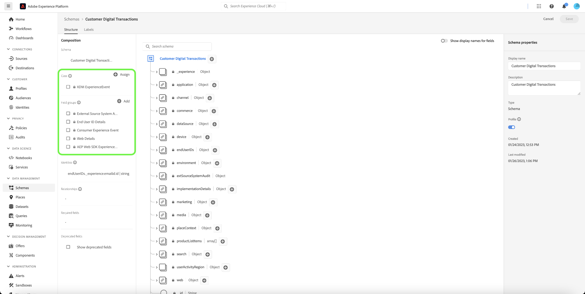

# Reenvolva seus clientes de forma inteligente para retornar

O reengajamento inteligente permite que você configure uma campanha personalizada com informações em vários canais para persuadir os clientes a executar uma ação específica. A campanha de incentivo deve operar por um período limitado, que inclui o envio de clientes que mostraram emails de intenção, SMS e veiculação de anúncios pagos. Depois que o cliente tomar a ação apropriada, a campanha de incentivo será encerrada imediatamente.

## Pré-requisitos e planejamento {#prerequisites-and-planning}

Ao concluir as etapas para implementar o caso de uso, você usará a seguinte funcionalidade do Real-Time CDP e os elementos da interface do usuário (listados na ordem em que serão usados). Verifique se você tem as permissões de controle de acesso baseadas em atributos necessárias para todas essas áreas ou peça ao administrador do sistema para conceder as permissões necessárias.

* [Adobe Real-time Customer Data Platform (Real-Time CDP)](https://experienceleague.adobe.com/docs/platform-learn/tutorials/rtcdp/understanding-the-real-time-customer-data-platform.html) - Agrega dados em fontes de dados para alimentar a campanha. Esses dados são usados para criar os públicos-alvo da campanha e exibir elementos de dados personalizados usados no email e nos blocos promocionais da Web (por exemplo, nome ou informações relacionadas à conta). A CDP também é usada para ativar os públicos-alvo no email e na Web (via Adobe Target).
   * [Esquemas](/help/xdm/home.md)
   * [Perfis](/help/profile/home.md)
   * [Públicos-alvo](/help/segmentation/home.md)
   * [Adobe Journey Optimizer](https://experienceleague.adobe.com/docs/journey-optimizer/using/orchestrate-journeys/journey.html)
   * [Acionador de evento ou público-alvo](https://experienceleague.adobe.com/docs/journey-optimizer/using/offer-decisioning/collect-event-data/data-collection.html)
   * [Públicos/ eventos](https://experienceleague.adobe.com/docs/journey-optimizer/using/audiences-profiles-identities/audiences/about-audiences.html)
   * [Jornada ações](https://experienceleague.adobe.com/docs/journey-optimizer/using/orchestrate-journeys/journey.html)

### Como atingir o caso de uso: visão geral de alto nível {#achieve-the-use-case-high-level}

Foram criadas três jornadas de reengajamento.

>[!BEGINTABS]

>[!TAB Jornada de reengajamento]

A jornada de reengajamento é direcionada a navegações de produtos abandonadas no site e no aplicativo. Essa jornada é disparada quando um produto é visualizado sem produto comprado ou adicionado ao carrinho. O engajamento com a marca é acionado após três dias se não houver adições de lista nas últimas 24 horas.

1. Os dados são agregados ao SDK da Web/SDK móvel/assimilação da API da rede de borda por meio da rede de borda (método preferencial).
2. Como um **cliente**, você cria conjuntos de dados marcados para [!UICONTROL Perfil].
3. Como um **cliente**, você carrega perfis no Real-Time CDP e cria políticas de governança para garantir um uso responsável.
4. Como um **cliente**, você cria públicos-alvo focados a partir da lista de perfis para verificar se uma **usuário** fez um envolvimento com a marca nos últimos três dias.
5. Como um **cliente**, você criará uma jornada de reengajamento no Adobe Journey Optimizer.
6. Se necessário, trabalhe com a **parceiro de dados** para ativação de públicos para os destinos de mídia paga desejados.
7. O Adobe Journey Optimizer verifica o consentimento e envia as várias ações configuradas.

>[!TAB Jornada de carrinho abandonada]

Esta jornada de carrinho abandonada destina-se a produtos que foram colocados no carrinho, mas não comprados no site e no aplicativo. Usado para iniciar e parar campanhas de mídia paga

1. Os dados são agregados ao SDK da Web/SDK móvel/assimilação da API da rede de borda por meio da rede de borda (método preferencial).
2. Como um **cliente**, você cria conjuntos de dados marcados para [!UICONTROL Perfil].
3. Como um **cliente**, você carrega perfis no Real-Time CDP e cria políticas de governança para garantir um uso responsável.
4. Como um **cliente**, você cria públicos-alvo focados a partir da lista de perfis para verificar se uma **usuário** colocou um item no carrinho, mas não concluiu a compra. A variável **[!UICONTROL Adicionar ao carrinho]** O evento inicia um temporizador que aguarda 30 minutos e verifica a compra. Se nenhuma compra tiver sido feita, a variável **usuário** é adicionado à **[!UICONTROL Abandonar carrinho]** públicos-alvo.
5. Como um **cliente**, você criará uma jornada de carrinho abandonada no Adobe Journey Optimizer
6. Se necessário, trabalhe com a **parceiro de dados** para ativação de públicos para os destinos de mídia paga desejados.
7. O Adobe Journey Optimizer verifica o consentimento e envia as várias ações configuradas.

>[!TAB Jornada de confirmação de pedido]

Esta jornada de confirmação de pedido destina-se às compras de produtos no site e no aplicativo.

1. Os dados são agregados ao SDK da Web/SDK móvel/assimilação da API da rede de borda por meio da rede de borda (método preferencial).
2. Como um **cliente**, você cria conjuntos de dados marcados para [!UICONTROL Perfil].
3. Como um **cliente**, você carrega perfis no Real-Time CDP e cria políticas de governança para garantir um uso responsável.
4. Como um **cliente**, você cria públicos-alvo focados a partir da lista de perfis para verificar se uma **usuário** fez uma compra.
5. Como um **cliente**, você criará uma jornada de confirmação no Adobe Journey Optimizer.
6. O Adobe Journey Optimizer envia uma mensagem de confirmação de pedido usando o canal preferencial.

>[!ENDTABS]

## Como atingir o caso de uso: instruções passo a passo {#step-by-step-instructions}

Leia as seções abaixo, que incluem links para documentação adicional e conclua cada uma das etapas das visões gerais de alto nível acima.

### Funcionalidade e elementos da interface do usuário que você usará {#ui-functionality-and-elements}

Ao concluir as etapas para implementar o caso de uso, você usará a seguinte funcionalidade do Real-Time CDP e os elementos da interface do usuário (listados na ordem em que serão usados). Verifique se você tem as permissões de controle de acesso baseadas em atributos necessárias para todas essas áreas ou peça ao administrador do sistema para conceder as permissões necessárias.

* [Esquemas](/help/xdm/home.md)
* [Perfis](/help/profile/home.md)
* [Conjuntos de dados](/help/catalog/datasets/overview.md)
* [Públicos-alvo](/help/segmentation/home.md)
* [Adobe Journey Optimizer](https://experienceleague.adobe.com/docs/journey-optimizer/using/orchestrate-journeys/journey.html)
* [Destinos](/help/destinations/home.md)

### Criar um design de esquema e especificar grupos de campos

Os recursos do Experience Data Model (XDM) são gerenciados no [!UICONTROL Esquemas] espaço de trabalho no Adobe Experience Platform. Você pode visualizar e explorar os recursos principais fornecidos pela Adobe e criar recursos e esquemas personalizados para sua organização.

Para criar um schema, conclua as etapas abaixo:

1. Navegue até **[!UICONTROL Gerenciamento de dados]** > **[!UICONTROL Esquemas]** e selecione **[!UICONTROL Criar esquema]**.
2. Selecionar **[!UICONTROL Perfil individual XDM]/[!UICONTROL XDM ExperienceEvent]**.
3. Navegue até **[!UICONTROL Grupos de campos]** e selecione **[!UICONTROL Adicionar]**.
4. Use a caixa de pesquisa para localizar e selecionar o grupo de campos e selecione **[!UICONTROL Adicionar grupos de campos]**.
5. Dê um nome ao esquema e, opcionalmente, uma descrição.
6. Selecione **[!UICONTROL Salvar]**.

Para obter mais informações sobre como criar schemas, leia a [criar tutorial de esquema.](/help/xdm/tutorials/create-schema-ui.md)

Há quatro designs de esquema usados para a jornada de reengajamento. Cada esquema requer a configuração de campos específicos, bem como de alguns campos altamente sugeridos.

#### Requisitos do grupo de campos para o esquema de atributos do cliente

O esquema de atributos do cliente é um [!UICONTROL Perfil individual XDM] esquema, contendo os seguintes grupos de campos:

+++Detalhes de contato pessoal (grupo de campos)

[Detalhes de contato pessoal](/help/xdm/field-groups/profile/personal-contact-details.md) é um grupo de campos de esquema padrão para a classe Perfil individual XDM que descreve as informações de contato de uma pessoa individual.

| Campos | Requisito | Descrição |
| --- | --- | --- |
| mobilePhone.number | Obrigatório | O número do celular da pessoa, que será usado para SMS. |
| personalEmail.address | Obrigatório | O endereço de email da pessoa. |

+++

+++Detalhes demográficos (Grupo de campos)

[Detalhes demográficos](/help/xdm/field-groups/profile/demographic-details.md) é um grupo de campos de esquema padrão para a classe Perfil individual XDM. O grupo de campos fornece um objeto de pessoa de nível raiz, cujos subcampos descrevem informações sobre uma pessoa individual.

| Campos | Requisito |
| --- | --- |
| person.name.firstName | Sugerido |
| person.name.lastName | Sugerido |

+++

+++Detalhes de auditoria do sistema de origem externo (grupo de campos)

[Atributos de auditoria do sistema de origem externa](/help/xdm/data-types/external-source-system-audit-attributes.md) é um tipo de dados padrão do Experience Data Model (XDM) que captura os detalhes de auditoria sobre um sistema de origem externa.

+++

+++Grupos de campos de consentimento e preferência (Grupo de campos)

[Os consentimentos e preferências](/help/xdm/field-groups//profile/consents.md) grupo de campos fornece um único campo do tipo objeto, consentimentos, para capturar informações de consentimento e preferência.

| Campos | Requisito |
| --- | --- |
| consents.marketing.email.val | Obrigatório |
| consents.marketing.preferred | Obrigatório |
| consents.marketing.push.val | Obrigatório |
| consents.marketing.sms.val | Obrigatório |
| consents.personalize.content.val | Obrigatório |
| consents.share.val | Obrigatório |

+++

+++Detalhes do teste de perfil (grupo de campos)

Este grupo de campos é usado para prática recomendada.

+++

#### Requisitos do grupo de campos para o esquema de transações digitais do cliente

O esquema de transações digitais do cliente é um [!UICONTROL XDM ExperienceEvent] esquema, contendo os seguintes grupos de campos:

+++ExperienceEvent do SDK da Web do Adobe Experience Platform (Grupo de campos)

| Campos | Requisito |
| --- | --- |
| device.model | Sugerido |
| environment.browserDetails.userAgent | Sugerido |

+++

+++Detalhes da Web (Grupo de Campos)

Detalhes da Web é um grupo de campos de esquema padrão para a classe XDM ExperienceEvent, usado para descrever informações sobre eventos de detalhes da Web, como interação, detalhes da página e referenciador.

| Campos | Requisito | Descrição |
| --- | --- | --- |
| web.webInteraction.linkClicks.id | Sugerido | A ID do link da Web ou URL que corresponde à interação. |
| web.webInteraction.linkClicks.value | Sugerido | O número de cliques do link da web ou URL que corresponde à interação. |
| web.webInteraction.name | Sugerido | O nome da página da Web. |
| web.webInteraction.URL | Sugerido | O URL da página da Web. |
| web.webPageDetails.name | Sugerido | O nome da página da Web onde ocorreu a interação da Web. |
| web.webPageDetails.URL | Sugerido | A URL da página da Web em que ocorreu a interação da Web. |
| web.webReferrer.URL | Sugerido | Descreve o referenciador de uma interação da web, que é o URL de onde um visitante veio imediatamente antes de a interação da web atual ser registrada. |

+++

+++Evento de experiência do consumidor (grupo de campos)

| Campos | Requisito |
| --- | --- |
| commerce.cart.cartID | Sugerido |
| commerce.cart.cartSource | Sugerido |
| commerce.cartAbandons.id | Sugerido |
| commerce.cartAbandons.value | Sugerido |
| commerce.order.orderType | Sugerido |
| commerce.order.payments.paymentAmount | Sugerido |
| commerce.order.payments.paymentType | Sugerido |
| commerce.order.payments.transactionID | Sugerido |
| commerce.order.priceTotal | Sugerido |
| commerce.order.purchaseID | Sugerido |
| commerce.productListAdds.id | Sugerido |
| commerce.productListAdds.value | Sugerido |
| commerce.productListOpens.id | Sugerido |
| commerce.productListOpens.value | Sugerido |
| commerce.productListRemoval.id | Sugerido |
| commerce.productListRemoval.value | Sugerido |
| commerce.productListViews.id | Sugerido |
| commerce.productListViews.value | Sugerido |
| commerce.productViews.id | Sugerido |
| commerce.productViews.value | Sugerido |
| commerce.purchases.id | Sugerido |
| commerce.purchases.value | Sugerido |
| marketing.campaignGroup | Sugerido |
| marketing.campaignName | Sugerido |
| marketing.trackingCode | Sugerido |
| productListItems.name | Sugerido |
| productListItems.priceTotal | Sugerido |
| productListItems.product | Sugerido |
| productListItems.quantity | Sugerido |

+++

+++Detalhes da ID do usuário final (Grupo de campos)

| Campos | Requisito | Descrição |
| --- | --- | --- |
| endUserIDs._experience.emailid.authenticatedState | Obrigatório | Estado autenticado da ID do endereço de email do usuário final. |
| endUserIDs._experience.emailid.id | Obrigatório | ID do endereço de email do usuário final. |
| endUserIDs._experience.emailid.namespace.code | Obrigatório | Código de namespace da ID do endereço de email do usuário final. |
| endUserIDs._experience.mcid.authenticatedState | Obrigatório | Estado autenticado da Adobe Marketing Cloud ID (MCID). O MCID agora é conhecido como Experience Cloud ID (ECID). |
| endUserIDs._experience.mcid.id | Obrigatório | Adobe Marketing Cloud ID (MCID). O MCID agora é conhecido como Experience Cloud ID (ECID). |
| endUserIDs._experience.mcid.namespace.code | Obrigatório | Código de namespace da Adobe Marketing Cloud ID (MCID). |

+++

+++Valor da classe (grupo de campos)

| Campos | Requisito |
| --- | --- |
| eventType | Obrigatório |
| carimbo de data e hora | Obrigatório |

+++

+++Detalhes de auditoria do sistema de origem externo (grupo de campos)

Atributos de auditoria do sistema de origem externa é um tipo de dados padrão do Experience Data Model (XDM) que captura os detalhes de auditoria sobre um sistema de origem externa.

+++

#### Requisitos do grupo de campos para o esquema de transações offline do cliente

O esquema de transações offline do cliente é um [!UICONTROL XDM ExperienceEvent] esquema, contendo os seguintes grupos de campos:

+++Detalhes do comércio (Grupo de campos)

| Campos | Requisito | Descrição |
| --- | --- | --- |
| commerce.cart.cartID | Obrigatório | Uma ID para o carrinho de compras. |
| commerce.order.orderType | Obrigatório | Um objeto que descreve o tipo de pedido do produto. |
| commerce.order.payments.paymentAmount | Obrigatório | Um objeto que descreve o valor do pagamento da ordem do produto. |
| commerce.order.payments.paymentType | Obrigatório | Um objeto que descreve o tipo de pagamento de ordem de produto. |
| commerce.order.payments.transactionID | Obrigatório | Um ID de transação de ordem de produto de objeto. |
| commerce.order.purchaseID | Obrigatório | Uma ID de compra da ordem de produto do objeto. |
| productListItems.name | Obrigatório | Uma lista de nomes de itens que representam os produtos selecionados por um cliente. |
| productListItems.priceTotal | Obrigatório | O preço total da lista de itens que representam os produtos selecionados por um cliente. |
| productListItems.product | Obrigatório | Os produtos selecionados. |
| productListItems.quantity | Obrigatório | A quantidade de itens da lista que representam os produtos selecionados por um cliente. |

+++

+++Detalhes de contato pessoal (grupo de campos)

| Campos | Requisito | Descrição |
| --- | --- | --- |
| mobilePhone.number | Obrigatório | O número do celular da pessoa, que será usado para SMS. |
| personalEmail.address | Obrigatório | O endereço de email da pessoa. |

+++

+++Valor da classe (grupo de campos)

| Campos | Requisito |
| --- | --- |
| eventType | Obrigatório |
| carimbo de data e hora | Obrigatório |

+++

+++Detalhes de auditoria do sistema de origem externo (grupo de campos)

Atributos de auditoria do sistema de origem externa é um tipo de dados padrão do Experience Data Model (XDM) que captura os detalhes de auditoria sobre um sistema de origem externa.

+++

#### Requisitos do grupo de campos para o esquema do conector web do Adobe

O esquema do conector da Web do Adobe é um [!UICONTROL XDM ExperienceEvent] esquema, contendo os seguintes grupos de campos:

+++Modelo de evento de experiência do Adobe Analytics (grupo de campos)

| Campos | Requisito | Descrição |
| --- | --- | --- |
| web.webInteraction.linkClicks.id | Sugerido | A ID do link da Web ou URL que corresponde à interação. |
| web.webInteraction.linkClicks.value | Sugerido | O número de cliques do link da web ou URL que corresponde à interação. |
| web.webInteraction.name | Sugerido | O nome da página da Web. |
| web.webInteraction.URL | Sugerido | O URL da página da Web. |
| web.webPageDetails.name | Sugerido | O nome da página da Web onde ocorreu a interação da Web. |
| web.webPageDetails.URL | Sugerido | A URL da página da Web em que ocorreu a interação da Web. |
| web.webReferrer.URL | Sugerido | Descreve o referenciador de uma interação da web, que é o URL de onde um visitante veio imediatamente antes de a interação da web atual ser registrada. |
| commerce.cart.cartID | Sugerido | |
| commerce.cart.cartSource | Sugerido | |
| commerce.cartAbandons.id | Sugerido | |
| commerce.cartAbandons.value | Sugerido | |
| commerce.order.orderType | Sugerido | |
| commerce.order.payments.paymentAmount | Sugerido | |
| commerce.order.payments.paymentType | Sugerido | |
| commerce.order.payments.transactionID | Sugerido | |
| commerce.order.priceTotal | Sugerido | |
| commerce.order.purchaseID | Sugerido | |
| commerce.productListAdds.id | Sugerido | |
| commerce.productListAdds.value | Sugerido | |
| commerce.productListOpens.id | Sugerido | |
| commerce.productListOpens.value | Sugerido | |
| commerce.productListRemoval.id | Sugerido | |
| commerce.productListRemoval.value | Sugerido | |
| commerce.productListViews.id | Sugerido | |
| commerce.productListViews.value | Sugerido | |
| commerce.productViews.id | Sugerido | |
| commerce.productViews.value | Sugerido | |
| commerce.purchases.id | Sugerido | |
| commerce.purchases.value | Sugerido | |
| marketing.campaignGroup | Sugerido | |
| marketing.campaignName | Sugerido | |
| marketing.trackingCode | Sugerido | |
| productListItems.name | Sugerido | |
| productListItems.priceTotal | Sugerido | |
| productListItems.product | Sugerido | |
| productListItems.quantity | Sugerido | |
| endUserIDs._experience.emailid.authenticatedState | Obrigatório | Estado autenticado da ID do endereço de email do usuário final. |
| endUserIDs._experience.emailid.id | Obrigatório | ID do endereço de email do usuário final. |
| endUserIDs._experience.emailid.namespace.code | Obrigatório | Código de namespace da ID do endereço de email do usuário final. |
| endUserIDs._experience.mcid.authenticatedState | Obrigatório | Estado autenticado da Adobe Marketing Cloud ID (MCID). O MCID agora é conhecido como Experience Cloud ID (ECID). |
| endUserIDs._experience.mcid.id | Obrigatório | Adobe Marketing Cloud ID (MCID). O MCID agora é conhecido como Experience Cloud ID (ECID). |
| endUserIDs._experience.mcid.namespace.code | Obrigatório | Código de namespace da Adobe Marketing Cloud ID (MCID). |

+++

+++Valor da classe (grupo de campos)

| Campos | Requisito |
| --- | --- |
| eventType | Obrigatório |
| carimbo de data e hora | Obrigatório |

+++

+++Detalhes de auditoria do sistema de origem externo (grupo de campos)

Atributos de auditoria do sistema de origem externa é um tipo de dados padrão do Experience Data Model (XDM) que captura os detalhes de auditoria sobre um sistema de origem externa.

+++

### Criar um conjunto de dados a partir de um esquema

Um conjunto de dados é uma construção de armazenamento e gerenciamento para uma coleção de dados, normalmente uma tabela, que contém um esquema (colunas) e campos (linhas). Para jornadas inteligentes de reengajamento, cada esquema terá um conjunto de dados.

Para criar um conjunto de dados a partir de um esquema, conclua as etapas abaixo:

1. Navegue até **[!UICONTROL Gerenciamento de dados]** > **[!UICONTROL Conjuntos de dados]** e selecione **[!UICONTROL Criar conjunto de dados]**.
2. Selecione **[!UICONTROL Criar conjunto de dados a partir do esquema]**.
3. Selecione o esquema de reengajamento relevante que você criou.
4. Dê um nome e, opcionalmente, uma descrição ao conjunto de dados.
5. Selecione **[!UICONTROL Concluir]**.

Observe que, semelhante à etapa para criar um esquema, é necessário ativar o conjunto de dados para ser incluído no Perfil do cliente em tempo real. Para obter mais informações sobre como ativar o conjunto de dados para uso no Perfil do cliente em tempo real, leia o [criar tutorial de esquema.](/help/xdm/tutorials/create-schema-ui.md#profile)

### Privacidade, consentimento e governança de dados

#### Políticas de consentimento

>[!IMPORTANT]
>
>Oferecer aos clientes a capacidade de cancelar a inscrição para receber comunicações de uma marca é um requisito legal, bem como garantir que essa escolha seja respeitada. Saiba mais sobre a legislação aplicável na [documentação da Experience Platform](https://experienceleague.adobe.com/docs/experience-platform/privacy/regulations/overview.html).

As seguintes políticas de consentimento precisam ser consideradas e usadas ao configurar uma jornada de reengajamento:

* Se consents.marketing.email.val = &quot;Y&quot;, poderá enviar um email
* Se consents.marketing.sms.val = &quot;Y&quot;, então Pode SMS
* Se consentimentos.marketing.push.val = &quot;Y&quot;, em seguida, Pode enviar
* Se consents.share.val = &quot;Y&quot;, então Pode anunciar
* Necessidade definida pela implementação do cliente

#### Rótulo e aplicação do DULE

O endereço de email pessoal é usado como dados diretamente identificáveis que podem ser usados para identificar ou entrar em contato com uma pessoa específica, em vez de com um dispositivo.

* personalEmail.address = I1

#### Políticas de marketing

Não há políticas de marketing adicionais para as jornadas de reengajamento, no entanto, as seguintes opções devem ser consideradas conforme desejado:

* Considere como desejado
* Restringir Dados Confidenciais
* Restringir publicidade no local
* Restringir o direcionamento de email
* Restringir o direcionamento entre sites
* Restringir a combinação de dados diretamente identificáveis com dados anônimos

### Criar um público-alvo

Para criar um público-alvo, conclua as etapas abaixo:

1. Navegue até **[!UICONTROL Cliente]** > **[!UICONTROL Públicos-alvo]** e selecione **[!UICONTROL Criar público]**.
2. Selecionar **[!UICONTROL Criar regra]** e selecione **[!UICONTROL Criar]**.
3. Navegue até **[!UICONTROL Campo]** e selecione **[!UICONTROL Eventos]** guia.
4. Navegue ou use a caixa de pesquisa para localizar o tipo de evento e arraste-o para o construtor. Finalmente, adicione as regras de evento arrastando os tipos de evento.
5. Dê um nome ao esquema e, opcionalmente, uma descrição.
6. Selecione **[!UICONTROL Salvar]**.

Para obter mais informações sobre como criar públicos-alvo, leia a [Guia da interface do usuário do Audience Builder](/help/segmentation/ui/segment-builder.md).

#### Criação de público-alvo para jornadas de reengajamento da marca

Os públicos-alvo de cada jornada de reengajamento precisam ser configurados com eventos específicos para qualificação de segmento. Essas especificações podem ser encontradas abaixo nas guias correspondentes para cada jornada.

>[!BEGINTABS]

>[!TAB Jornada de reengajamento]

Os eventos a seguir são usados para a jornada de reengajamento, em que os usuários visualizaram produtos online e não adicionaram ao carrinho nas próximas 24 horas, seguidos por nenhum engajamento da marca nos 3 dias seguintes.

Inclua público que tenha pelo menos 1 EventType = ProductViews event THEN que tenha pelo menos 1 Qualquer evento em que (EventType não é igual a commerce.productListAdds) e ocorra nas últimas 24 horas e, depois de 3 dias, não tenha nenhum evento em que (EventType = application.launch ou web.webpagedetails.pageViews ou commerce.purchases) e ocorra nos últimos 2 dias.

>[!TAB Jornada de carrinho abandonada]

Os eventos a seguir são usados para perfis que adicionaram um produto ao carrinho, mas não concluíram a compra ou limparam o carrinho nas últimas 24 horas.

inclua EventType = commerce.productListAdds entre 30 minutos e 1440 minutos antes de agora.
excluir EventType = commerce.purchases 30 minutos antes OU EventType = commerce.productListRemovals E ID do carrinho é igual a Lista de produtos Adiciona1 ID do carrinho (o evento de inclusão).

>[!ENDTABS]

Para obter mais informações sobre a criação de públicos-alvo, leia a [Guia da interface do usuário do Audience Builder](/help/segmentation/ui/segment-builder.md).

### Configuração do Jornada no Adobe Journey Optimizer

>[!NOTE]
>
>O Adobe Journey Optimizer não abrange tudo o que é mostrado nos diagramas na parte superior desta página. Todos os anúncios de mídia paga são criados no [!UICONTROL Destinos].

Informações específicas são necessárias para as várias jornadas que cada caso de uso pode ter. Os dados específicos necessários para cada ramificação de Jornada podem ser encontrados abaixo nas guias correspondentes.

>[!BEGINTABS]

>[!TAB Jornada de reengajamento]

+++Eventos

* Visualizações de produto
   * Esquema: Transações digitais do cliente
   * Campos:
      * EventType
   * Condição:
      * EventType = commerce.productViews
      * Campos:
         * Commerce.productViews.id
         * Commerce.productViews.value
         * eventType
         * identityMap.authenticatedState
         * identityMap.id
         * identityMap.primary
         * productListItems.SKU
         * productListItems.currencyCode
         * productListItems.name
         * productListItems.priceTotal
         * productListItems.product
         * productListItems.productImageUrl
         * productListItems.quantity
         * carimbo de data e hora
         * endUserIDs._experience.emailid.authenticatedState
         * endUserIDs._experience.emailid.id
         * endUserIDs._experience.emailid.namespace.code
         * _id

* Adicionar ao carrinho
   * Esquema: Transações digitais do cliente
   * Campos:
      * Tipo de evento
   * Condição:
      * Tipo de evento = commerce.productListAdds
      * Campos:
         * Commerce.productListAdds.id
         * Commerce.productListAdds.value
         * eventType
         * identityMap.authenticatedState
         * identityMap.id
         * identityMap.primary
         * productListItems.SKU
         * productListItems.currencyCode
         * productListItems.name
         * productListItems.priceTotal
         * productListItems.product
         * productListItems.productImageUrl
         * productListItems.quantity
         * carimbo de data e hora
         * commerce.cart.cartID
         * endUserIDs._experience.emailid.authenticatedState
         * endUserIDs._experience.emailid.id
         * endUserIDs._experience.emailid.namespace.code
         * _id

* Engajamento com a marca
   * Esquema: Transações digitais do cliente
   * Campos:
      * EventType
   * Condição:
      * EventType em application.launch, commerce.purchases, web.webpagedetails.pageViews
      * Campos:
         * eventType
         * identityMap.authenticatedState
         * identityMap.id
         * identityMap.primary
         * productListItems.SKU
         * productListItems.currencyCode
         * productListItems.name
         * productListItems.priceTotal
         * productListItems.product
         * productListItems.productImageUrl
         * productListItems.quantity
         * carimbo de data e hora
         * web.webpagedetails.URL
         * web.webpagedetails.isHomePage
         * web.webpagedetails.name
         * endUserIDs._experience.emailid.authenticatedState
         * endUserIDs._experience.emailid.id
         * endUserIDs._experience.emailid.namespace.code
         * _id
         * Commerce.purchases.id
         * Commerce.purchases.value
         * shipping.address.city
         * shipping.address.countryCode
         * shipping.address.postalCode
         * shipping.address.state
         * shipping.address.street1
         * shipping.address.street2
         * shipping.shipDate
         * shipping.trackingNumber
         * shipping.trackingURL

+++

+++Lógica de Jornada de tecla

* Jornada Lógica de Entrada
   * Evento de exibição de produto

* Condições
   * Verifique pelo menos um evento de compra online ou offline desde a última visualização do produto.
      * Esquema: Transações digitais do cliente
      * eventType = commerce.purchases
      * timestamp > timestamp do último produto exibido

   * Verifique pelo menos uma compra offline desde a última visualização do produto:
      * Esquema: Transações off-line do cliente v.1
      * eventType = commerce.purchases
      * timestamp > timestamp do último produto exibido

   * Condições - Selecione o canal de público alvo
      * Email
         * consentimentos.marketing.email.val = y
      * Push
         * consents.marketing.push.val=y
      * SMS
         * consents.marketing.sms.val = y

   * Personalização de canal
      * Conteúdo de canal personalizado com base na exibição do produto.

+++

>[!TAB Jornada de carrinho abandonada]

+++Eventos

* Adicionar ao carrinho
   * Esquema: Transações digitais do cliente
   * Campos:
      * Tipo de evento
   * Condição:
      * Tipo de evento = commerce.productListAdds
      * Campos:
         * Commerce.productListAdds.id
         * Commerce.productListAdds.value
         * eventType
         * identityMap.authenticatedState
         * identityMap.id
         * identityMap.primary
         * productListItems.SKU
         * productListItems.currencyCode
         * productListItems.name
         * productListItems.priceTotal
         * productListItems.product
         * productListItems.productImageUrl
         * productListItems.quantity
         * carimbo de data e hora
         * commerce.cart.cartID
         * endUserIDs._experience.emailid.authenticatedState
         * endUserIDs._experience.emailid.id
         * endUserIDs._experience.emailid.namespace.code
         * _id

* Compras on-line
   * Esquema: Transações digitais do cliente
   * Campos:
      * Tipo de evento
   * Condição:
      * Tipo de evento = commerce.purchases
      * Campos:
         * Commerce.purchases.id
         * Commerce.purchases.value
         * eventType
         * identityMap.authenticatedState
         * identityMap.id
         * identityMap.primary
         * productListItems.SKU
         * productListItems.currencyCode
         * productListItems.name
         * productListItems.priceTotal
         * productListItems.product
         * productListItems.productImageUrl
         * productListItems.quantity
         * carimbo de data e hora
         * endUserIDs._experience.emailid.authenticatedState
         * endUserIDs._experience.emailid.id
         * endUserIDs._experience.emailid.namespace.code
         * _id

* Engajamento com a marca
   * Esquema: Transações digitais do cliente
   * Campos:
      * EventType
   * Condição:
      * EventType em application.launch, commerce.purchases, web.webpagedetails.pageViews
      * Campos:
         * eventType
         * identityMap.authenticatedState
         * identityMap.id
         * identityMap.primary
         * productListItems.SKU
         * productListItems.currencyCode
         * productListItems.name
         * productListItems.priceTotal
         * productListItems.product
         * productListItems.productImageUrl
         * productListItems.quantity
         * carimbo de data e hora
         * web.webpagedetails.URL
         * web.webpagedetails.isHomePage
         * web.webpagedetails.name
         * endUserIDs._experience.emailid.authenticatedState
         * endUserIDs._experience.emailid.id
         * endUserIDs._experience.emailid.namespace.code
         * _id
         * Commerce.purchases.id
         * Commerce.purchases.value
         * shipping.address.city
         * shipping.address.countryCode
         * shipping.address.postalCode
         * shipping.address.state
         * shipping.address.street1
         * shipping.address.street2
         * shipping.shipDate
         * shipping.trackingNumber
         * shipping.trackingURL

+++

+++Lógica de Jornada de chave

* Jornada Lógica de Entrada
   * Evento AddToCart

* AuthenticatedState em autenticado

* Condição: compras offline desde que o carrinho foi abandonado pela última vez:
   * Esquema: Transações off-line do cliente v.1
   * eventType = commerce.purchases
   * timestamp > timestamp do carrinho foi abandonado pela última vez

* Condição: carrinho limpo desde que o carrinho foi abandonado pela última vez:
   * Esquema: Transações digitais do cliente v.1
   * eventType = commerce.cartCleared
   * cartID (ID do carrinho)
   * timestamp > timestamp do carrinho foi abandonado pela última vez

* Selecionar canal de destino (selecione um ou vários canais para maior alcance)
   * Email
      * consentimentos.marketing.email.val = y
   * Push
      * consentimentos.marketing.push.val = y
   * SMS
      * consents.marketing.sms.val = y
   * Personalização de canal
      * Exibir informações detalhadas do carrinho e exibir vários produtos em formato de tabela.

+++

>[!TAB Jornada de confirmação de pedido]

+++Eventos

* Compras on-line
   * Esquema: Transações digitais do cliente
   * Campos:
      * EventType
   * Condição:
      * Tipo de evento = commerce.purchases
      * Campos:
         * Commerce.purchases.id
         * Commerce.purchases.value
         * eventType
         * identityMap.authenticatedState
         * identityMap.id
         * identityMap.primary
         * productListItems.SKU
         * productListItems.currencyCode
         * productListItems.name
         * productListItems.priceTotal
         * productListItems.product
         * productListItems.productImageUrl
         * productListItems.quantity
         * carimbo de data e hora
         * endUserIDs._experience.emailid.authenticatedState
         * endUserIDs._experience.emailid.id
         * endUserIDs._experience.emailid.namespace.code
         * _id

+++

+++Lógica de Jornada de tecla

* Jornada Lógica de Entrada
   * Evento de pedido

* Condições
   * Selecionar canal de destino (selecione um ou vários canais para maior alcance).
      * A confirmação do pedido é considerada de natureza pessoal, portanto, a verificação de consentimento geralmente é desnecessária.
      * Email
      * Push
      * SMS

   * Personalização de conteúdo do canal
      * Exibe informações detalhadas do pedido e pode exibir uma lista de produtos usando um formato de tabela.

+++

>[!ENDTABS]

Para obter mais informações sobre como criar jornadas no [Adobe Journey Optimizer], leia o [Introdução ao guia do jornada](https://experienceleague.adobe.com/docs/journey-optimizer/using/orchestrate-journeys/journey.html).

### Configuração de anúncios de mídia pagos em Destinos

A estrutura de destinos é usada para anúncios de mídia paga. Após verificar o consentimento, ele será enviado para os vários destinos configurados. Por exemplo, correspondência direta, email e assim por diante.

#### Dados exigidos para destinos

Os destinos de exportação de segmento de transmissão (como Facebook, Google Customer Match, Google DV360) oferecem suporte a várias identidades dos dados do cliente:

* `personalEmail.address`
* `ECID`
* `mobilePhone.number`

O segmento do carrinho de abandono é de fluxo contínuo e, portanto, pode ser usado pela estrutura de destino neste caso de uso.

* Fluxo/Acionado
   * [Publicidade](/help/destinations/catalog/advertising/overview.md)/[Mídia paga e redes sociais](/help/destinations/catalog/social/overview.md)
   * [Dispositivo móvel](/help/destinations/catalog/mobile-engagement/overview.md)
   * [Destino do streaming](/help/destinations/catalog/streaming/http-destination.md)
   * [Destination SDK personalizado](/help/destinations/destination-sdk/overview.md)

* Arquivo/Agendado a cada três horas
   * [Marketing por email](/help/destinations/catalog/email-marketing/overview.md)
