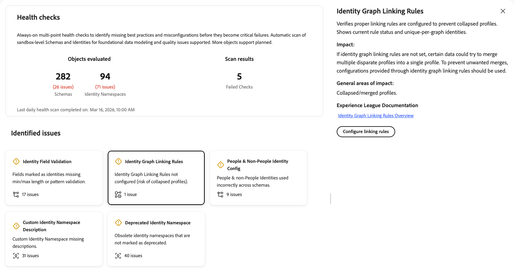
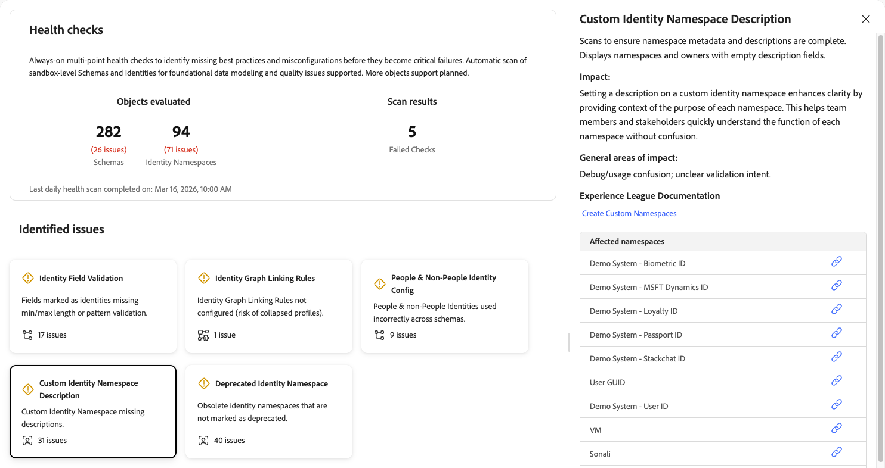

# Verificações de integridade

As verificações de integridade verificam seus esquemas e identidades usados na sandbox e fornecem um resumo dos problemas que você pode usar para explorar e solucionar problemas com o [!UICONTROL AI Assistant]. No futuro, mais objetos poderão ser examinados para obter um relatório mais abrangente.

Configurações insatisfatórias de esquema e identidade levam a problemas significativos de downstream, incluindo criação incorreta de perfis, falha na qualificação de segmentos e ativação imprecisa. Esses problemas são difíceis de detectar e geralmente exigem conhecimento especializado para serem diagnosticados. As verificações de integridade mudam sua abordagem da solução de problemas reativa para a manutenção proativa e preventiva.

Com as verificações de integridade, é possível:

* **Detectar problemas de configuração antecipadamente**: identifique práticas recomendadas, configurações incorretas e padrões que levam a ineficiências na personalização, ativação e muito mais.
* **Receber correção guiada**: Obtenha orientações claras sobre o que é cada problema e o que fazer sobre ele.
* **Monitorar continuamente**: neste momento, verificações de integridade executam verificações automáticas diárias para que você possa detectar problemas antes que eles se tornem falhas críticas. O cronograma pode mudar em versões futuras.

## Pré-requisitos {#prerequisites}

Para acessar as verificações de integridade, você precisa da **[!UICONTROL View Health Checks]** [permissão de controle de acesso](/help/access-control/home.md#permissions). Entre em contato com o administrador do sistema para garantir que você tenha as permissões apropriadas.

## Acessar verificações de integridade {#access-health-checks}

Para acessar as verificações de integridade na interface do usuário [!UICONTROL Experience Platform]:

1. Selecione **[!UICONTROL Run and Operate]** na navegação à esquerda.
1. Selecione **[!UICONTROL Health Checks]**.

O painel de verificações de integridade exibe um resumo dos resultados de verificação mais recentes.

## Noções básicas sobre o painel {#understanding-dashboard}

O painel de verificações de integridade fornece três áreas de informação para ajudar você a avaliar o estado da implementação.

### Objetos avaliados {#objects-evaluated}

A seção **[!UICONTROL Objects evaluated]** mostra o número total de esquemas e namespaces de identidade examinados, juntamente com quantos problemas foram encontrados para cada categoria. Isso fornece uma visualização rápida do escopo e da gravidade dos problemas de configuração na sandbox.

### Resultados da varredura {#scan-results}

A seção **[!UICONTROL Scan results]** exibe o número de verificações com falha. Uma verificação com falha indica que uma ou mais verificações de integridade detectaram problemas de configuração que exigem atenção. O carimbo de data/hora **Última verificação diária de integridade concluída em** mostra quando a verificação mais recente foi executada.

### Problemas identificados {#identified-issues}

A seção **[!UICONTROL Identified issues]** mostra um cartão para cada verificação de integridade. Cada cartão exibe:

* O nome da verificação de integridade e uma breve descrição do problema.
* O número de problemas encontrados ou uma confirmação de que não há problemas.
* Um indicador de status que mostra se a verificação foi aprovada ou requer atenção.

Selecione qualquer cartão para explorar os detalhes dessa verificação de integridade.

## Verificações de integridade disponíveis {#available-health-checks}

Atualmente, as verificações de integridade avaliam cinco áreas fundamentais da configuração de esquema e identidade. Essas verificações abordam os problemas de modelagem de dados mais impactantes na plataforma.

### Validação do campo de identidade {#identity-field-validation}

Verificações para garantir que os campos de identidade tenham restrições de comprimento mínimo e máximo e regras de padrão regex para integridade dos dados.

| Detalhe | Descrição |
| --- | --- |
| **Problema** | Os campos marcados como identidades não têm um comprimento mínimo/máximo ou validação de padrão. |
| **Impacto** | Sem validação, os valores de lixo podem inserir [!UICONTROL Identity Service]. Valores como &quot;0&quot;, &quot;Guest&quot; ou maiúsculas/minúsculas incompatíveis (por exemplo, &quot;xyz123&quot; versus &quot;XYZ123&quot;) comprometem a integridade do perfil montado durante a segmentação e a ativação. |
| **Correção** | Defina restrições de comprimento mínimo/máximo e padrão em campos personalizados marcados como identidades. Use expressões regulares para aplicar regras como somente dígitos, maiúsculas ou minúsculas ou combinações de caracteres específicas. |

Ao selecionar o cartão **[!UICONTROL Identity Field Validation]**, um painel de detalhes é aberto à direita. O painel mostra:

* **[!UICONTROL Description]**: verifica se os campos de identidade têm comprimentos mín/máx e regras de padrão regex para integridade de dados. Lista esquemas e campos afetados.
* **[!UICONTROL Impact]**: se os campos de identidade nos esquemas não tiverem tamanhos mínimos/máximos e validações de padrão definidas, isso poderá levar a dados inconsistentes, o que pode comprometer a integridade e a qualidade dos dados.
* **[!UICONTROL General areas of impact]**: identificadores de baixa qualidade em [!UICONTROL Identity Service]; compilação não confiável.
* **[!UICONTROL Experience League Documentation]**: um link para as práticas recomendadas para modelagem de dados.
* **[!UICONTROL Affected Schemas]**: uma lista de esquemas afetados, cada um com um expansor para exibir mais detalhes e um link para abrir o esquema.

Para obter mais informações, consulte as [dicas de integridade de dados](/help/xdm/schema/best-practices.md#data-integrity-tips) na documentação de práticas recomendadas do esquema.

### Regras de vinculação do gráfico de identidade {#identity-graph-linking-rules}

Verifica se as regras de vinculação do gráfico de identidade estão configuradas para uma sandbox para impedir perfis recolhidos.

| Detalhe | Descrição |
| --- | --- |
| **Problema** | As regras de vinculação do gráfico de identidade não estão configuradas para esta sandbox. |
| **Impacto** | Sem a vinculação de regras, vários perfis diferentes podem ser mesclados em um único perfil (recolhimento de gráfico). Determinados dados de dispositivos compartilhados ou identidades não exclusivas podem acionar mesclagens indesejadas, o que resulta em personalização imprecisa. |
| **Correção** | Navegue até o menu **[!UICONTROL Identities]**, selecione **[!UICONTROL Settings]** e selecione pelo menos uma identidade exclusiva por gráfico. Isso habilita as regras de vinculação do gráfico de identidade e impede o recolhimento do perfil. |

Ao selecionar o cartão **[!UICONTROL Identity Graph Linking Rules]**, um painel de detalhes é aberto à direita. O painel mostra:

* **[!UICONTROL Description]**: verifica se as regras de vinculação apropriadas estão configuradas para impedir perfis recolhidos. Ele mostra o status atual da regra e identidades exclusivas por gráfico.
* **[!UICONTROL Impact]**: Se as regras de vinculação do gráfico de identidade não estiverem definidas, determinados dados poderão tentar mesclar vários perfis diferentes em um único perfil. Para evitar mesclagens indesejadas, as configurações fornecidas por meio das regras de vinculação do gráfico de identidade devem ser usadas.
* **[!UICONTROL General areas of impact]**: perfis recolhidos ou mesclados.
* **[!UICONTROL Experience League Documentation]**: um link para a visão geral das Regras de vinculação do gráfico de identidade para obter mais informações.
* **[!UICONTROL Configure linking rules]**: quando a verificação falha, um botão é exibido para que você possa configurar regras de vinculação diretamente do painel.

Para obter mais informações, consulte a [visão geral das regras de vinculação do gráfico de identidade](/help/identity-service/identity-graph-linking-rules/overview.md) e o [guia de implementação](/help/identity-service/identity-graph-linking-rules/implementation-guide.md).

### Configuração de identidade de pessoas e não pessoas {#people-non-people-identity}

Valida o uso correto de tipos de identidade de pessoas e não pessoas em classes de esquema.

| Detalhe | Descrição |
| --- | --- |
| **Problema** | Identificadores que não sejam de pessoas são usados em esquemas de classe Perfil individual ou Evento de experiência, ou identificadores de pessoas são usados em esquemas de pesquisa. |
| **Impacto** | Os identificadores que não sejam de pessoas em esquemas de perfil não participam do gráfico de identidade, o que resulta em uma resolução de identidade incompleta. Os identificadores de pessoas em esquemas de pesquisa aumentam a contagem de perfis e tornam os dados inelegíveis para casos de uso de pesquisa. Ambos os casos correm o risco de as melhorias futuras do produto interromperem a implementação. |
| **Correção** | Revise os esquemas sinalizados e corrija as atribuições do tipo de identidade. Remova identificadores que não sejam de pessoas de esquemas de Perfil individual quando possível. Para esquemas já em uso por conjuntos de dados, consulte as [regras de evolução do esquema](/help/xdm/schema/composition.md#evolution). |

Ao selecionar o cartão **[!UICONTROL People & Non-People Identity Config]**, um painel de detalhes é aberto à direita. O painel mostra:

* **[!UICONTROL Description]**: valida o uso adequado de tipos de identidade em classes de esquema. Lista esquemas configurados incorretamente e destaca atribuições incorretas.
* **[!UICONTROL Impact]**: Se uma entidade que não seja uma pessoa tiver uma identidade de pessoa, isso aumentará a contagem de perfis e tornará esses dados inelegíveis como uma pesquisa. Se uma entidade de pessoa tiver uma identidade que não seja de pessoa, os dados não estarão disponíveis para transmissão ou segmentação de borda.
* **[!UICONTROL General areas of impact]**: Gráficos de identidade incompletos; contagens de perfis aumentadas; uso incorreto de pesquisa.
* **[!UICONTROL Affected Schemas]**: uma lista de esquemas com problemas. Expanda uma linha de esquema para ver o caminho, o nome da identidade e o tipo de esquema para cada erro de configuração. Use o ícone de link para abrir o esquema.

Para obter mais informações, consulte a [documentação do tipo de identidade](/help/identity-service/features/namespaces.md#identity-type) e as [práticas recomendadas do esquema](/help/xdm/schema/best-practices.md).

### Descrição do namespace de identidade personalizado {#namespace-missing-description}

Verificações para garantir que os metadados e as descrições do namespace de identidade personalizado estejam completos.

| Detalhe | Descrição |
| --- | --- |
| **Problema** | Os namespaces de identidade personalizados não têm o campo de descrição. |
| **Impacto** | A ausência de descrições pode gerar confusão durante o uso e a depuração. |
| **Correção** | Documente cada namespace personalizado no campo de descrição. Inclua critérios de validação (comprimento mínimo/máximo, padrão) e informações de ciclo de vida que identifiquem qual sistema de origem externo cria essas identidades. |

Ao selecionar o cartão **[!UICONTROL Custom Identity Namespace Description]**, um painel de detalhes é aberto à direita. O painel mostra:

* **[!UICONTROL Description]**: verifica se os metadados e as descrições do namespace foram concluídos. Exibe namespaces e proprietários com campos de descrição vazios.
* **[!UICONTROL Impact]**: definir uma descrição em um namespace de identidade personalizado aumenta a clareza, fornecendo o contexto da finalidade de cada namespace. Isso ajuda os membros da equipe e as partes interessadas a entender rapidamente a função de cada namespace sem confusão.
* **[!UICONTROL General areas of impact]**: Confusão de depuração ou uso; intenção de validação não clara.
* **[!UICONTROL Experience League Documentation]**: Um link para Criar Namespaces Personalizados para obter mais informações.
* **[!UICONTROL Affected namespaces]**: uma lista de namespaces de identidade personalizados com descrições ausentes. Use o ícone de link ao lado de cada namespace para exibi-lo ou editá-lo.

Para obter mais informações, consulte a documentação em [criando namespaces personalizados](/help/identity-service/features/namespaces.md#create-namespaces).

### Namespace de identidade obsoleto {#deprecated-namespace}

Detecta namespaces de identidade obsoletos ou não utilizados que devem ser marcados para limpeza.

| Detalhe | Descrição |
| --- | --- |
| **Problema** | Os namespaces de identidade obsoletos não estão marcados como obsoletos. |
| **Impacto** | Os namespaces não usados ou obsoletos geram confusão sobre o que está sendo usado ativamente e aumentam o risco de rotular incorretamente os campos de identidade. |
| **Correção** | Renomeie os namespaces não utilizados para incluir um prefixo &quot;Não usar&quot; (por exemplo, &quot;Não usar - [nome original]&quot;). No momento, o Adobe Experience Platform não oferece suporte à exclusão de namespace, portanto, a renomeação é a abordagem recomendada. |

Ao selecionar o cartão **[!UICONTROL Deprecated Identity Namespace]**, um painel de detalhes é aberto à direita. O painel mostra:

* **[!UICONTROL Description]**: Detecta namespaces de identidade obsoletos ou não utilizados para limpeza. Lista os namespaces não utilizados com o último carimbo de data e hora de uso ou referência de esquema.
* **[!UICONTROL Impact]**: os namespaces de identidade não usados em nenhum esquema devem ser marcados para remoção adicionando uma marca &quot;DEPRECATED&quot; ou &quot;DO NOT USE&quot; aos seus nomes. No momento, não há suporte para a exclusão de namespaces de identidade.
* **[!UICONTROL General areas of impact]**: Risco de confusão e erro de rotulagem.
* **[!UICONTROL Experience League Documentation]**: Um link para Namespaces de Identidade Obsoletos para documentação adicional.
* **[!UICONTROL Affected namespaces]**: uma lista de namespaces de identidade obsoletos ou não utilizados. Use o ícone de link ao lado de cada namespace para exibi-lo ou gerenciá-lo.

Para obter mais informações, consulte o [artigo da base de dados de conhecimento da Experience Cloud sobre namespaces obsoletos](https://experienceleague.adobe.com/en/docs/experience-cloud-kcs/kbarticles/ka-18155){target="_blank"}.

## Próximas etapas {#next-steps}

Depois de analisar os resultados da verificação de integridade, explore os seguintes recursos para aprofundar sua compreensão:

* Saiba mais sobre as [práticas recomendadas de esquema](/help/xdm/schema/best-practices.md) para criar modelos de dados confiáveis.
* Entenda as [regras de vinculação de gráfico de identidade](/help/identity-service/identity-graph-linking-rules/overview.md) para evitar o colapso do perfil.
* Consulte a [documentação de namespace de identidade](/help/identity-service/features/namespaces.md) para obter as práticas recomendadas de gerenciamento de namespace.
* Explore outras [Ferramentas de execução e operação](/help/run-and-operate/overview.md), incluindo [[!UICONTROL Job Schedules]](/help/run-and-operate/job-schedules.md) para visibilidade de operação em lote.
