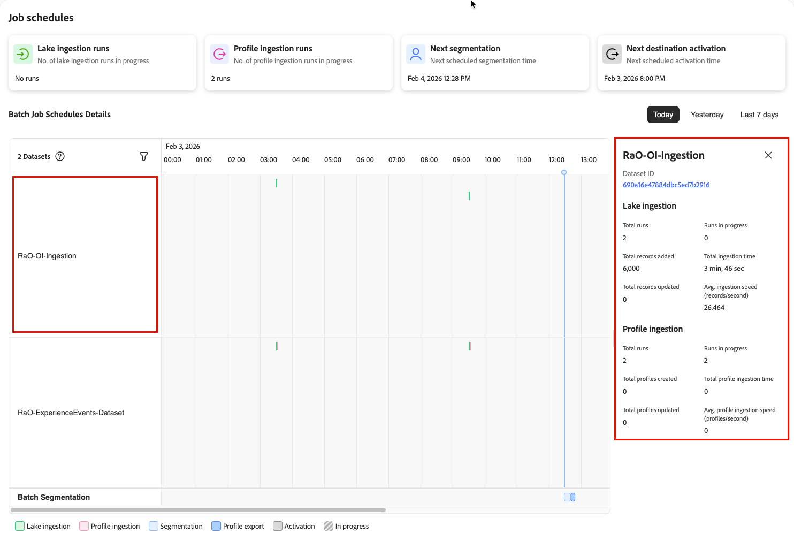
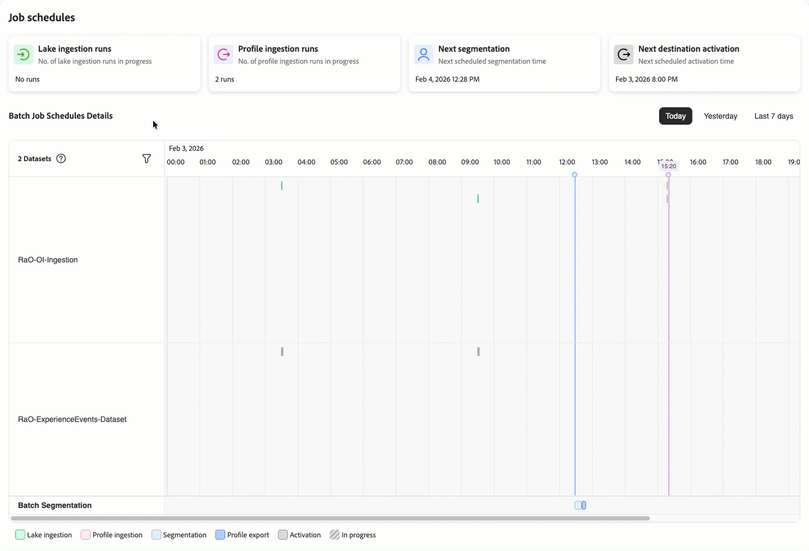
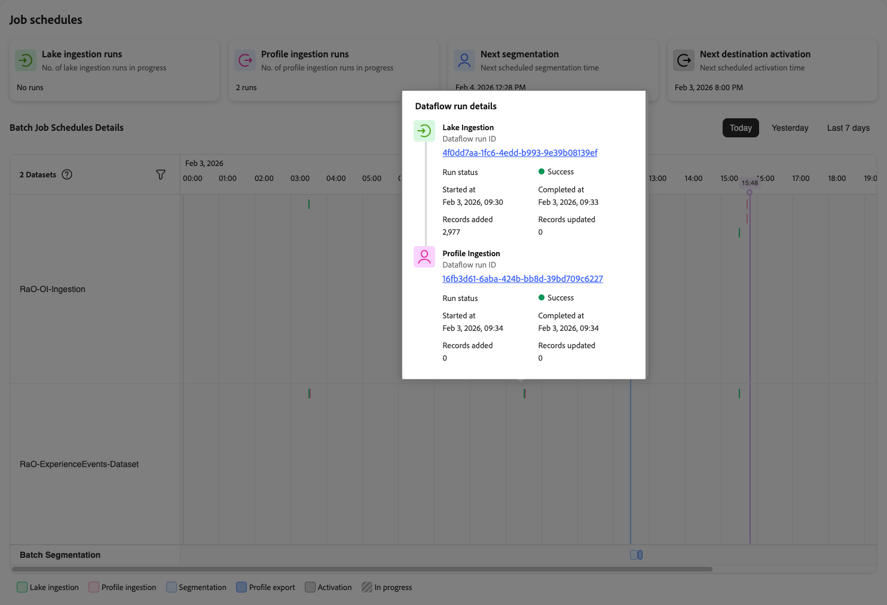

# Exibir detalhes da programação de trabalho

>[!AVAILABILITY]
>
>[!UICONTROL Job schedules] estão disponíveis no momento como uma versão limitada e somente para os seguintes trabalhos do Real-Time CDP:
>
> * Assimilação em lote de data lake
> * Assimilação de perfil em lote
> * Segmentação em lote
> * Ativação do destino de lote.

Ao solucionar falhas de tarefa ou investigar problemas de desempenho, você precisa de informações detalhadas sobre conjuntos de dados específicos e suas execuções de tarefa. A interface [Calendários de Trabalho](job-schedules.md) permite que você faça drill-down da exibição da linha do tempo em conjuntos de dados e trabalhos individuais para entender o histórico de execução, o tempo e o status.

Use essa exibição detalhada para:

* Investigar por que um trabalho específico falhou ou demorou mais do que o esperado
* Revise o histórico de execução de um conjunto de dados ao longo do tempo
* Entenda os padrões de tempo e duração de trabalhos em lotes
* Identifique quais lotes específicos estão causando problemas de pipeline
* Colete as informações necessárias para solucionar problemas com o suporte da Adobe

## Pré-requisitos {#prerequisites}

Antes de exibir detalhes do trabalho, você deve:

* Ter acesso a [!UICONTROL Job Schedules] com **[!UICONTROL View Job Schedules]** e **[!UICONTROL View Profile Management]** [permissões de controle de acesso](/help/access-control/home.md#permissions).
* Familiarize-se com a [interface de Agendamentos de Trabalho](job-schedules.md#understanding-interface) e a exibição da linha do tempo.
* Entenda os [tipos de trabalho](job-schedules.md#job-schedules-details) diferentes (assimilação de lake, assimilação de perfil, segmentação, ativação).

## Como entender a hierarquia de detalhes {#details-hierarchy}

As programações de trabalho fornecem três níveis de detalhes, permitindo passar de padrões amplos para problemas específicos:

| Exibir nível | O que ele mostra | Quando usar |
|------------|---------------|----------------|
| **Modo de exibição de Linha do Tempo** | Todos os conjuntos de dados e seus trabalhos agendados no período selecionado | Identificação de padrões, identificação de [antipadrões](job-schedules-anti-patterns.md) e obtenção de uma visão geral de todo o pipeline |
| **Detalhes do conjunto de dados** | Métricas agregadas e histórico de execução para um único conjunto de dados | Acompanhamento do desempenho geral de um conjunto de dados, noções básicas sobre volumes de dados e revisão da frequência de trabalho |
| **Detalhes da execução do trabalho** | Informações de execução específicas para uma execução de job individual | Investigando por que um determinado trabalho falhou, verificando o tempo exato e verificando os registros processados |

**Fluxo de navegação**: comece com a exibição da linha do tempo para identificar problemas → Selecione um conjunto de dados para ver seus detalhes → Selecione uma execução de trabalho específica para investigar os detalhes.

### Noções básicas sobre a exibição da linha do tempo {#timeline-visualization}

A exibição da linha do tempo usa um layout horizontal e vertical para ajudá-lo a entender as programações de job e os tempos de processamento críticos:

* **Eixo horizontal (progressão de tempo)**: os conjuntos de dados e suas execuções de trabalho são exibidos na linha do tempo, da esquerda para a direita, mostrando quando os trabalhos são executados no período selecionado (hoje, ontem ou nos últimos 7 dias). Cada barra colorida representa uma execução de trabalho, posicionada horizontalmente de acordo com sua hora inicial e final.

* **Eixo vertical (horas de início agendadas)**: as horas de início agendadas críticas são exibidas como linhas verticais que se estendem por todos os conjuntos de dados, facilitando a visualização da relação de tempo entre trabalhos upstream e processamento downstream:
   * **Linha vertical azul**: representa quando a segmentação está agendada para começar
   * **Linha vertical preta**: representa quando a ativação de destino está agendada para começar

Esse layout permite identificar rapidamente as relações de tempo entre os trabalhos de pipeline de dados e o processamento downstream. Idealmente, as tarefas de upstream (como assimilação de data lake e perfil) devem ser concluídas à esquerda desses marcadores verticais, garantindo que os dados estejam prontos antes da segmentação e ativação começarem. Os processos que se estendem além desses marcadores indicam possíveis problemas de tempo em que os processos de downstream podem começar antes que os dados sejam totalmente preparados.

### Qual exibição devo usar? {#which-view}

Use a tabela abaixo para escolher a exibição correta para sua tarefa. Combine o que é necessário fazer com a exibição recomendada para navegar com eficiência.

| Eu preciso... | Usar esta exibição |
|--------------|---------------|
| Ver todos os meus conjuntos de dados habilitados para perfil e suas agendas de uma só vez | [Modo de exibição de Linha do Tempo](job-schedules.md) |
| Identificar conflitos de agendamento ou antipadrões | [Modo de exibição de Linha do Tempo](job-schedules.md) |
| Acompanhe o desempenho geral de um conjunto de dados | [Detalhes do conjunto de dados](#view-dataset-details) |
| Veja quantos registros totais um conjunto de dados processou | [Detalhes do conjunto de dados](#view-dataset-details) |
| Comparar o desempenho do trabalho ao longo do tempo para um conjunto de dados | [Detalhes do conjunto de dados](#view-dataset-details) |
| Investigar por que um trabalho específico falhou | [Detalhes da execução do trabalho](#view-job-details) |
| Verificar a hora exata de uma execução de trabalho específica | [Detalhes da execução do trabalho](#view-job-details) |
| Verificar registros processados em uma única execução | [Detalhes da execução do trabalho](#view-job-details) |
| Acessar mensagens de erro detalhadas | [Detalhes da execução do trabalho](#view-job-details) → Selecionar ID de execução do fluxo de dados |

## Exibir detalhes do conjunto de dados {#view-dataset-details}

Para exibir detalhes de um conjunto de dados específico:

1. Na exibição da linha do tempo **[!UICONTROL Job Schedules]**, localize o conjunto de dados que deseja investigar.
2. Selecione o nome do conjunto de dados na coluna à esquerda.

A visualização de detalhes do conjunto de dados é aberta em um painel do lado direito, mostrando informações sobre todas as tarefas associadas a esse conjunto de dados.

O painel Detalhes do conjunto de dados exibe o nome do conjunto de dados, a ID e as métricas específicas do trabalho organizadas por tipo de trabalho. Na parte superior do painel, a ID do conjunto de dados é exibida como um link clicável. Selecione essa ID para navegar até a página completa de detalhes do conjunto de dados.

Cada painel de detalhes do conjunto de dados inclui as seguintes métricas:

### Métricas de assimilação do Lake {#lake-ingestion-metrics}

Para conjuntos de dados com trabalhos de assimilação de data lake, o painel mostra as seguintes métricas:

| Métrica | Descrição | Usar para |
|--------|-------------|---------|
| **[!UICONTROL Total runs]** | O número total de trabalhos de assimilação de data lake concluídos para este conjunto de dados | Rastreamento de atividade |
| **[!UICONTROL Runs in progress]** | Quantos trabalhos de assimilação de lago estão em execução no momento | Detecção de gargalo |
| **[!UICONTROL Total records added]** | O número cumulativo de novos registros adicionados ao data lake em todas as execuções de trabalho | Monitoramento de volume |
| **[!UICONTROL Total ingestion time]** | A duração combinada de todos os trabalhos de assimilação de data lake | Avaliação do tempo de processamento |
| **[!UICONTROL Total records updated]** | O número cumulativo de registros existentes que foram atualizados durante a assimilação | Atualizar análise de padrão |
| **[!UICONTROL Avg. ingestion speed (records/second)]** | A taxa de transferência média dos trabalhos de assimilação do data lake | Comparação de desempenho |

### Métricas de assimilação de perfil {#profile-ingestion-metrics}

Para conjuntos de dados com tarefas de assimilação de perfil, o painel mostra as seguintes métricas:

| Métrica | Descrição | Usar para |
|--------|-------------|---------|
| **[!UICONTROL Total runs]** | O número total de trabalhos de assimilação de perfis concluídos para este conjunto de dados | Rastreamento de atividade |
| **[!UICONTROL Runs in progress]** | Quantos trabalhos de assimilação de perfil estão em execução no momento | Detecção de atraso |
| **[!UICONTROL Total profiles created]** | O número cumulativo de novos perfis criados a partir deste conjunto de dados em todas as execuções de trabalhos | Monitoramento do crescimento de perfis |
| **[!UICONTROL Total profile ingestion time]** | A duração combinada de todos os trabalhos de assimilação de perfis | Identificação de problema de tempo |
| **[!UICONTROL Total profiles updated]** | O número cumulativo de perfis existentes que foram atualizados com dados deste conjunto de dados | Atualizar rastreamento de frequência |
| **[!UICONTROL Avg. profile ingestion speed (profiles/second)]** | A taxa de transferência média dos trabalhos de assimilação de perfil | Monitoramento de desempenho |

>[!NOTE]
>
> Essas métricas mostram totais cumulativos em todas as execuções de trabalho para este conjunto de dados. Para ver detalhes de uma execução específica, selecione um job diretamente na linha do tempo.

## Filtrar conjuntos de dados na linha do tempo {#filter-datasets}

Quando você tem muitos conjuntos de dados com jobs agendados, pode querer se concentrar em conjuntos de dados específicos em vez de visualizar todos eles de uma só vez. O filtro do conjunto de dados permite selecionar quais conjuntos de dados aparecem na exibição de linha do tempo.

Para filtrar os conjuntos de dados exibidos na linha do tempo:

1. Procure o contador de conjunto de dados no canto superior esquerdo da exibição da linha do tempo (por exemplo, &quot;2 conjuntos de dados&quot;).
2. Selecione o ícone de filtro ao lado do contador de conjunto de dados.
3. Um painel de seleção de conjunto de dados é aberto, mostrando todos os conjuntos de dados habilitados para perfil com tarefas agendadas.
4. Marque ou desmarque conjuntos de dados para mostrar ou ocultar na exibição de linha do tempo.
5. A linha do tempo é atualizada imediatamente para mostrar apenas os conjuntos de dados selecionados.

Use a filtragem para:

* **Concentre-se em fontes de dados específicas**: ao solucionar problemas de um pipeline de dados específico, filtre para mostrar apenas os conjuntos de dados relevantes.
* **Reduza a desordem visual**: se você tiver muitos conjuntos de dados, a filtragem o ajudará a visualizar os padrões mais claramente para um subconjunto de dados.
* **Comparar conjuntos de dados relacionados**: selecione somente conjuntos de dados relacionados para entender sua relação de agendamento.
* **Investigar antipadrões**: ao identificar um possível [problema de configuração](job-schedules-anti-patterns.md), filtre para os conjuntos de dados afetados para examiná-los mais detalhadamente.

O filtro persiste durante a sessão, para que você possa navegar entre períodos de tempo (hoje, ontem, últimos 7 dias) enquanto mantém a seleção do conjunto de dados.

## Exibir detalhes da execução do trabalho individual {#view-job-details}

Quando precisar investigar uma execução de job específica, selecione-a na linha do tempo para ver informações detalhadas sobre a execução dessa execução específica.

### Acessar detalhes da execução do trabalho {#access-job-details}

Para exibir detalhes de uma execução de job específica:

1. Na exibição da linha do tempo [!UICONTROL Job Schedules], localize a execução de trabalho específica que deseja investigar.
2. Selecione o indicador de trabalho na linha do tempo (a barra colorida que representa o trabalho).

O painel **[!UICONTROL Dataflow run details]** é aberto, mostrando informações sobre essa execução de trabalho específica.

### Detalhes de execução do fluxo de dados {#dataflow-run-details}

O painel de detalhes da execução do fluxo de dados exibe informações sobre a execução do job específico, organizado por tipo de job. Para trabalhos de assimilação, você verá detalhes para os estágios de assimilação de lago e de perfil.

#### Detalhes do trabalho de assimilação do lago {#lake-ingestion-job-details}

| Campo | Descrição |
|-------|-------------|
| **[!UICONTROL Dataflow run ID]** | O identificador exclusivo para esta execução específica do trabalho de assimilação do lago. Selecione a ID para exibir os detalhes completos do monitoramento do fluxo de dados. |
| **[!UICONTROL Run status]** | O resultado do trabalho (Sucesso, Falha, Em andamento, Em fila). Um indicador verde mostra a conclusão bem-sucedida. |
| **[!UICONTROL Started at]** | A data e hora em que o trabalho de assimilação do lago começou a ser executado. |
| **[!UICONTROL Completed at]** | A data e hora em que o trabalho de assimilação do lago terminou de ser executado. |
| **[!UICONTROL Records added]** | O número de novos registros adicionados ao data lake durante esta execução de trabalho. |
| **[!UICONTROL Records updated]** | O número de registros existentes que foram atualizados no data lake durante esta execução de trabalho. |

#### Detalhes do trabalho de assimilação de perfil {#profile-ingestion-job-details}

| Campo | Descrição |
|-------|-------------|
| **[!UICONTROL Dataflow run ID]** | O identificador exclusivo da execução desse trabalho de assimilação de perfil específico. Selecione a ID para exibir os detalhes completos do monitoramento do fluxo de dados. |
| **[!UICONTROL Run status]** | O resultado do trabalho (Sucesso, Falha, Em andamento, Em fila). Um indicador verde mostra a conclusão bem-sucedida. |
| **[!UICONTROL Started at]** | A data e hora em que o trabalho de assimilação de perfil começou a ser executado. |
| **[!UICONTROL Completed at]** | A data e hora em que o trabalho de assimilação de perfil terminou de ser executado. |
| **[!UICONTROL Records added]** | O número de novos perfis criados durante esta execução de trabalho. |
| **[!UICONTROL Records updated]** | O número de perfis existentes que foram atualizados durante a execução do trabalho. |

### Noções básicas sobre o fluxo de execução de trabalhos {#job-execution-flow}

Ao visualizar uma execução de trabalho específica, você pode ver a relação entre a assimilação de lago e a assimilação de perfil:

* **A assimilação do Lake é executada primeiro**: os dados são carregados no data lake e validados.
* **A assimilação de perfil se segue**: depois que a assimilação de lake for concluída, os registros qualificados serão processados no repositório de perfis.
* **O tempo é importante**: observe a diferença de tempo entre o momento em que a assimilação de lacetes é concluída e o momento em que a assimilação de perfis é iniciada. As lacunas aqui podem afetar os processos downstream, como a segmentação.

**Usar detalhes da execução do trabalho para**:

* Verificar se um trabalho específico foi concluído com êxito
* Calcular a duração real de uma execução de trabalho (tempo concluído menos o tempo iniciado)
* Entender quantos registros foram processados em uma execução específica
* Comparar desempenho entre diferentes execuções de job
* Acesse o monitoramento detalhado do fluxo de dados para solucionar falhas
* Identificar problemas de tempo entre os estágios de assimilação de lago e perfil

## Solução de problemas com detalhes do trabalho {#troubleshooting}

Use os detalhes do trabalho para investigar problemas e determinar as próximas etapas:

**Trabalhos com falha**: selecione a ID de execução do fluxo de dados para exibir os detalhes do erro no painel de monitoramento. Verifique os [detalhes do conjunto de dados](#view-dataset-details) quanto a padrões recorrentes, revise a [linha do tempo](job-schedules.md) quanto à contenção de recursos e identifique [antipadrões](job-schedules-anti-patterns.md) na sua configuração.

**Trabalhos lentos**: comparar duração com médias históricas em [métricas do conjunto de dados](#view-dataset-details). Causas comuns incluem [sobreposição de agendamento](job-schedules-anti-patterns.md#schedule-overlap-pattern), [empilhamento de lote denso](job-schedules-anti-patterns.md#scheduled-density) ou aumento do volume de dados.

**Incompatibilidades de registro**: compare os registros de assimilação do lake com os registros de assimilação de perfil nos detalhes de execução do trabalho. A assimilação de perfis geralmente mostra menos registros devido a requisitos de identidade e regras de qualidade de dados.

Para obter informações detalhadas sobre o status do fluxo de dados, consulte [Monitorar assimilação de data lake](../dataflows/ui/monitor-sources.md), [Monitorar fluxos de dados para perfis](../dataflows/ui/monitor-profiles.md), [Monitorar fluxos de dados para públicos](../dataflows/ui/monitor-audiences.md) e [Monitorar fluxos de dados para destinos](../dataflows/ui/monitor-destinations.md).

## Próximas etapas {#next-steps}

Depois de saber como exibir detalhes do trabalho:

* Revise a [visão geral das Agendas de Trabalho](job-schedules.md) para entender a exibição e a interface da linha do tempo.
* Saiba mais sobre os [antipadrões](job-schedules-anti-patterns.md) para evitar problemas comuns de configuração.
* Entenda [assimilação em lote](../ingestion/batch-ingestion/overview.md) para otimizar seus agendamentos de carregamento de dados.
* Explore o [monitoramento dos fluxos de dados de destino](../dataflows/ui/monitor-destinations.md) para uma visibilidade completa do pipeline.
