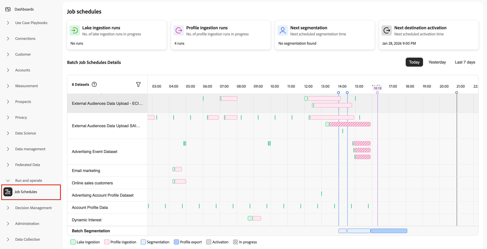

# Inspecionar agendas de trabalho

>[!IMPORTANT]
>
>[!UICONTROL Job schedules] estão disponíveis no momento apenas para os seguintes trabalhos do Real-Time CDP:
>
> * Assimilação em lote de data lake
> * Assimilação de perfil em lote
> * Segmentação em lote
> * Ativação do destino de lote

O [!UICONTROL Job Schedules] fornece uma exibição unificada de todos os trabalhos agendados de processamento em lote em seu pipeline de dados, desde a assimilação até a ativação de destino. Inspecione o status da execução, identifique conflitos de agendamento e diagnostique problemas de configuração antes que eles afetem as operações de negócios.

Use os Cronogramas de trabalho para investigar falhas, otimizar o tempo de trabalho e entender as dependências entre a assimilação de data lake, o processamento de perfil, a segmentação e a ativação de destino. Para obter orientação sobre como resolver problemas comuns de configuração, consulte a documentação em [identificação de antipadrões de agendamento de trabalho](job-schedules-anti-patterns.md).

## Pré-requisitos {#prerequisites}

Para acessar [!UICONTROL Job Schedules], você precisa de **[!UICONTROL View Job Schedules]** e **[!UICONTROL View Profile Management]** [permissões de controle de acesso](/help/access-control/home.md#permissions).

Entre em contato com o administrador do sistema para garantir que você tenha as permissões apropriadas.

## Introdução {#getting-started}

Antes de usar o [!UICONTROL Job Schedules], você deve se familiarizar com os seguintes conceitos do Experience Platform:

* **[Assimilação em lote](../ingestion/batch-ingestion/overview.md)**: como os dados são carregados no data lake e no repositório de perfis em intervalos agendados.
* **[Segmentação](../segmentation/home.md)**: como os públicos-alvo são avaliados e atualizados com base nos dados do perfil e nas definições de segmento.
* **[Perfil do cliente em tempo real](../profile/home.md)**: como os dados do perfil são unificados e disponibilizados para segmentação e ativação.
* **[Destinos](../destinations/home.md)**: onde e como os dados são ativados para sistemas downstream e plataformas de marketing.

A compreensão desses componentes ajuda a interpretar padrões de execução de trabalhos e diagnosticar problemas quando eles ocorrem.

## Noções básicas sobre a interface de agendamentos de trabalhos {#understanding-interface}

Para acessar [!UICONTROL Job Schedules]:

1. Na interface do usuário do Experience Platform, selecione **[!UICONTROL Run and Operate]** na navegação à esquerda.
2. Selecione **[!UICONTROL Job Schedules]**.

A página [!UICONTROL Job Schedules] fornece uma visão geral de todos os seus trabalhos de processamento em lote agendados.

### Cartões de resumo {#summary-cards}

Na parte superior da página, você pode ver cartões de resumo que fornecem insights rápidos sobre seus trabalhos de processamento em lote.

* **A assimilação do lago é executada**: o número de trabalhos de assimilação de data lake executados.
* **A assimilação de perfil é executada**: o número de trabalhos de assimilação de perfil executados.
* **Próxima segmentação**: quando o próximo trabalho de segmentação agendado será executado.
* **Próxima ativação de destino**: quando o próximo trabalho de ativação de destino agendado será executado.

Esses cartões ajudam você a entender a atividade e as programações futuras em seu pipeline de dados. Os valores de **Assimilação do Lake** e **Assimilação de perfil** são alterados com base no intervalo de tempo selecionado (Hoje, Ontem ou Últimos 7 dias); os cartões de próxima execução (**Próxima segmentação** e **Próxima ativação de destino**) não são afetados pelo seletor de tempo.

### Seletor de período de tempo {#time-period}

Use os seletores de período de tempo para escolher até que ponto pesquisar os trabalhos agendados.

* **Hoje**: exibir trabalhos agendados para hoje (exibição padrão).
* **Ontem**: exibir trabalhos executados ontem.
* **Últimos 7 dias**: exibir trabalhos da semana passada.

### Detalhes de agendamentos de trabalho em lote {#job-schedules-details}

A exibição principal mostra quando seus trabalhos em lote estão programados para serem executados durante o dia. É possível:

* **Exibir trabalhos por conjunto de dados ou entidade**: a coluna da esquerda mostra os nomes dos conjuntos de dados ou trabalhos de processamento (por exemplo, conjuntos de dados de assimilação ou trabalhos de segmentação).
* **Consulte a sincronização do trabalho**: a linha do tempo mostra quando cada trabalho está agendado para execução, com indicadores visuais marcando a hora agendada.
* **Filtrar trabalhos**: use o ícone de filtro para restringir quais conjuntos de dados incluir no relatório.
* **Entender os tipos de trabalho**: a legenda codificada por cores na parte inferior ajuda a identificar os diferentes tipos de trabalho:
   * **Assimilação no lago** (verde): Assimilação de dados no data lake
   * **Assimilação de perfil** (rosa): Assimilação de dados no armazenamento de perfil
   * **Segmentação** (azul-claro): trabalhos de avaliação de público-alvo
   * **Exportação de perfil** (azul): exportação de dados de perfil
   * **Ativação** (cinza escuro): trabalhos de ativação de destino
   * **Em andamento** (distribuído): trabalhos em execução ou em fila no momento

Essa exibição da linha do tempo ajuda a identificar conflitos de agendamento, compreender dependências entre tarefas e otimizar seus agendamentos de processamento em lote.

## Identificação de problemas de configuração {#identifying-issues}

Ao revisar as programações de jobs, você pode notar padrões que indicam problemas de configuração. Problemas comuns incluem:

* Trabalhos agendados muito próximos, causando contenção de recursos
* Muitos lotes em execução na mesma janela de tempo
* Conjuntos de dados individuais com muitos trabalhos em lote diários
* Trabalhos de assimilação agendados imediatamente antes da execução da segmentação

Esses padrões podem levar a falhas de trabalho, processamento de dados incompleto e desempenho deficiente do sistema. Para saber como identificar e resolver esses problemas, consulte a documentação em [identificação de antipadrões de agendamento de trabalho](job-schedules-anti-patterns.md).

Quando for necessário investigar conjuntos de dados específicos ou execuções de job, você poderá se aprofundar em exibições detalhadas para ver o histórico de execução, as mensagens de erro, as métricas de desempenho e as dependências. Para obter informações sobre como exibir esses dados detalhados, consulte a documentação em [exibindo detalhes do trabalho](job-schedules-details.md).

## Próximas etapas {#next-steps}

Depois de saber mais sobre as programações de trabalho, talvez você queira explorar estes tópicos relacionados:

* [Exibir detalhes do trabalho](job-schedules-details.md): saiba como detalhar conjuntos de dados individuais e execuções de trabalho para investigação detalhada.
* [Identificar padrões antirpadrão de agendamento de trabalho](job-schedules-anti-patterns.md): saiba como detectar e resolver problemas comuns de configuração que afetam o desempenho do pipeline.
* [Assimilação em lote](../ingestion/batch-ingestion/overview.md): saiba como assimilar dados na Experience Platform usando o processamento em lote.
* [Segmentação](../segmentation/home.md): entenda como os públicos são avaliados e atualizados em intervalos agendados.
* [Monitorar fluxos de dados para destinos](../dataflows/ui/monitor-destinations.md): Saiba como monitorar fluxos de dados de ativação de destino.
* [Agendar exportações de público-alvo](../destinations/ui/activate-batch-profile-destinations.md): saiba como configurar ativações de destino de lote agendadas.
