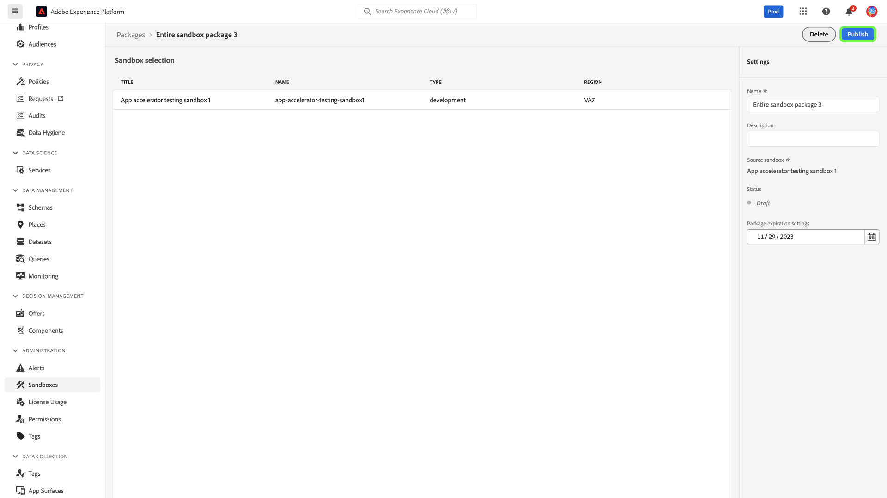
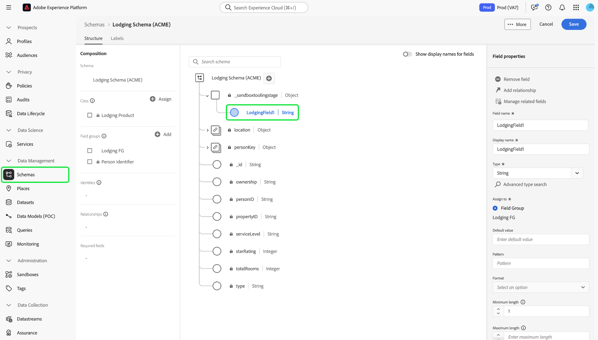
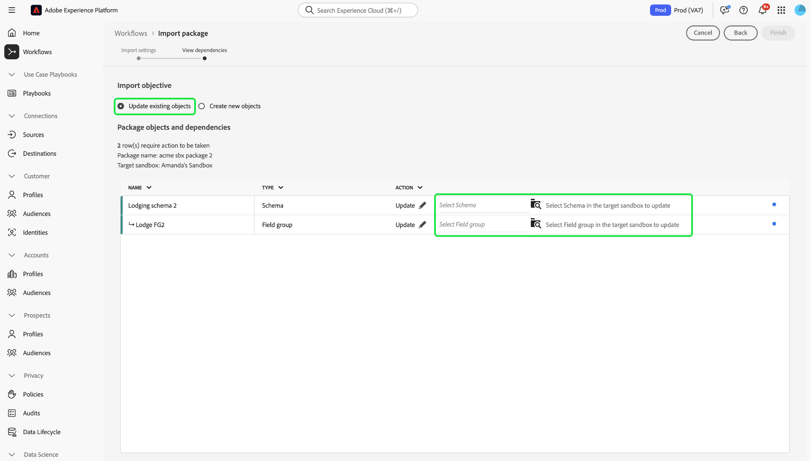

# Ferramentas de sandbox

>[!NOTE]
>
>A ferramenta de sandbox é um recurso fundamental que oferece suporte ao [!DNL Real-Time Customer Data Platform] e ao [!DNL Journey Optimizer] para melhorar a eficiência do ciclo de desenvolvimento e a precisão da configuração.  Você precisa ter as duas seguintes permissões de controle de acesso baseado em função para usar o recurso de ferramenta de sandbox: - `manage-sandbox` ou `view-sandbox` - `manage-package`

Melhore a precisão da configuração em sandboxes e exporte e importe configurações de sandbox facilmente entre sandboxes com o recurso de ferramenta de sandbox. Use as ferramentas de sandbox para reduzir o tempo de retorno do processo de implementação e mover configurações bem-sucedidas entre sandboxes.

Você pode usar o recurso de ferramenta sandbox para selecionar objetos diferentes e exportá-los em um pacote. Um pacote pode consistir em um único objeto ou em vários objetos. <!--or an entire sandbox.-->Todos os objetos incluídos em um pacote devem ser da mesma sandbox.

## Objetos compatíveis com as ferramentas de sandbox {#supported-objects}

O recurso de ferramenta de sandbox fornece a capacidade de exportar objetos [!DNL Adobe Real-Time Customer Data Platform] e [!DNL Adobe Journey Optimizer] para um pacote.

### Objetos da Real-time Customer Data Platform {#real-time-cdp-objects}

>[!BEGINSHADEBOX]

### Alterações nas importações de público-alvo de várias entidades

Com as [atualizações de arquitetura B2B](../../rtcdp/b2b-architecture-upgrade.md), você não poderá mais importar públicos de várias entidades com atributos B2B e Eventos de Experiência se um pacote que inclui esses públicos tiver sido publicado antes da atualização. Esses públicos-alvo não serão importados e não poderão ser convertidos automaticamente para a nova arquitetura.

Para contornar essa limitação, você deve criar um novo pacote com os públicos atualizados e, em seguida, importá-los para suas respectivas sandboxes de destino usando as ferramentas da sandbox.

>[!ENDSHADEBOX]

A tabela abaixo lista [!DNL Adobe Real-Time Customer Data Platform] objetos que atualmente têm suporte para ferramentas de sandbox:

| Plataforma | Objeto | Detalhes |
| --- | --- | --- |
| Plataforma de dados do cliente | Origens | <ul><li>As credenciais da conta de origem não são replicadas na sandbox de destino por motivos de segurança e precisarão ser atualizadas manualmente.</li><li>O fluxo de dados de origem é copiado em um status de rascunho por padrão.</li></ul> |
| Plataforma de dados do cliente | Públicos-alvo | <ul><li>Somente o **[!UICONTROL Público-alvo do cliente]** do tipo **[!UICONTROL Serviço de segmentação]** é suportado.</li><li>Os rótulos existentes para consentimento e governança serão copiados no mesmo trabalho de importação.</li><li> O sistema selecionará automaticamente a Política de mesclagem padrão na sandbox de destino com a mesma classe XDM ao verificar as dependências da política de mesclagem.</li><li>Se um objeto existente com o mesmo nome for detectado ao importar Públicos, as ferramentas Sandbox sempre reutilizarão o objeto existente, para evitar a proliferação de objetos.</li></ul> |
| Plataforma de dados do cliente | Identidades | <ul><li>O sistema eliminará automaticamente a duplicação de namespaces de identidade padrão do Adobe ao criar na sandbox de destino.</li><li>Os públicos só podem ser copiados quando todos os atributos nas regras de público-alvo estão habilitados no esquema de união. Os esquemas necessários devem ser movidos e ativados para o perfil unificado primeiro.</li></ul> |
| Plataforma de dados do cliente | Esquemas/grupos de campos/tipos de dados | <ul><li>Os rótulos existentes para consentimento e governança serão copiados no mesmo trabalho de importação.</li><li>Você tem a flexibilidade de importar esquemas sem a opção de Perfil unificado ativada. O caso de borda das relações de esquema não está incluído no pacote.</li><li>Se um objeto existente com o mesmo nome for detectado ao importar Esquemas/Grupos de campos, a ferramenta Sandbox sempre reutilizará o objeto existente, para evitar a proliferação de objetos.</li></ul> |
| Plataforma de dados do cliente | Conjuntos de dados | Os conjuntos de dados são copiados com a configuração de perfil unificado desativada por padrão. |
| Plataforma de dados do cliente | Políticas de consentimento e governança | Adicionar políticas personalizadas criadas por um usuário a um pacote e movê-las para sandboxes. |

Os seguintes objetos são importados, mas estão em um rascunho ou estão desabilitados:

| Recurso | Objeto | Status |
| --- | --- | --- |
| Status da importação | Fluxo de dados do Source | Rascunho |
| Status da importação | Jornada | Rascunho |
| Perfil unificado | Conjunto de dados | Perfil unificado desabilitado |
| Políticas | Políticas de governança de dados | Desabilitado |

### Objetos do Adobe Journey Optimizer {#abobe-journey-optimizer-objects}

A tabela abaixo lista [!DNL Adobe Journey Optimizer] objetos que atualmente têm suporte para ferramentas e limitações de sandbox:

| Plataforma | Objeto | Objetos Dependentes Compatíveis | Detalhes |
| --- | --- | --- | --- |
| [!DNL Adobe Journey Optimizer] | Público-alvo | | Um público-alvo pode ser copiado como um objeto dependente do objeto de jornada. Você pode selecionar criar um novo público ou reutilizar um existente na sandbox de destino. |
| [!DNL Adobe Journey Optimizer] | Esquema | | Os esquemas usados na jornada podem ser copiados como objetos dependentes. Você pode selecionar criar um novo esquema ou reutilizar um existente na sandbox de destino. |
| [!DNL Adobe Journey Optimizer] | Política de mesclagem | | As políticas de mesclagem usadas na jornada podem ser copiadas como objetos dependentes. Na sandbox de destino, você **não pode** criar uma nova política de mesclagem, você só pode usar uma existente. |
| [!DNL Adobe Journey Optimizer] | Jornada | Os seguintes objetos usados na jornada são copiados como objetos dependentes. Durante o fluxo de trabalho de importação, você pode escolher **[!UICONTROL Criar novo]** ou **[!UICONTROL Usar existente]** para cada: <ul><li>Públicos-alvo</li><li>Detalhes da tela</li><li>Modelos de conteúdo</li><li>Ações personalizadas</li><li>Fontes de dados</li><li>Eventos</li><li>Grupos de campos</li><li>Fragmentos</li><li>Esquemas</li></ul> | Ao selecionar **[!UICONTROL Usar existente]** durante o processo de importação para copiar uma jornada para outra sandbox, as ações personalizadas existentes que você escolher **devem** corresponder exatamente à ação personalizada de origem. Se não corresponderem, a nova jornada gerará erros que não poderão ser resolvidos. O sistema copia os eventos e os detalhes do evento usados na jornada e cria uma nova versão na sandbox de destino. |
| [!DNL Adobe Journey Optimizer] | Ação | | As mensagens de email e de push usadas na jornada podem ser copiadas como objetos dependentes. As atividades de ação de canal usadas nos campos de jornada, que são usadas para personalização na mensagem, não são verificadas para verificação de integridade. Os blocos de conteúdo não são copiados.  A ação de atualização de perfil usada na jornada pode ser copiada. As ações personalizadas podem ser adicionadas a um pacote independentemente. Os detalhes da ação usados na jornada também são copiados. Ele sempre criará uma nova versão na sandbox de destino. |
| [!DNL Adobe Journey Optimizer] | Ações Personalizadas |  | As ações personalizadas podem ser adicionadas a um pacote independentemente. Depois que uma ação personalizada é atribuída a uma jornada, ela não pode mais ser editada. Para atualizar ações personalizadas, você deve: <ul><li>mover ações personalizadas antes de migrar uma jornada</li><li>atualizar configurações (como cabeçalhos de solicitação, parâmetros de consulta e autenticação) para ações personalizadas após a migração</li><li>migrar objetos do jornada com as ações personalizadas adicionadas durante a primeira etapa</li></ul> |
| [!DNL Adobe Journey Optimizer] | Modelo de conteúdo | | Um template de conteúdo pode ser copiado como um objeto dependente do objeto de jornada. Modelos independentes permitem reutilizar facilmente o conteúdo personalizado em campanhas e jornadas do Journey Optimizer. |
| [!DNL Adobe Journey Optimizer] | Fragmento | Todos os fragmentos aninhados. | Um fragmento pode ser copiado como um objeto dependente do objeto de jornada. Os fragmentos são componentes reutilizáveis que podem ser referenciados em um ou mais emails em campanhas e jornadas do Journey Optimizer. |
| [!DNL Adobe Journey Optimizer] | Campanhas | Os seguintes objetos usados na campanha são copiados como objetos dependentes: <ul><li>Campanhas</li><li>Públicos-alvo</li><li>Esquemas</li><li>Modelos de conteúdo</li><li>Fragmentos</li><li>Mensagem/Conteúdo</li><li>Configuração de canais</li><li>Objetos de decisão unificados</li><li>Configurações/variantes de experimentos</li></ul> | <ul><li>As campanhas podem ser copiadas junto com todos os itens relacionados ao perfil, público-alvo, esquema, mensagens embutidas e objetos dependentes. Alguns itens não são copiados, como rótulos de uso de dados e configurações de idioma. Para obter uma lista completa de objetos que não podem ser copiados, consulte o guia [exportação de objetos para outra sandbox](https://experienceleague.adobe.com/en/docs/journey-optimizer/using/configuration/copy-objects-to-sandbox).</li><li>O sistema detectará e reutilizará automaticamente um objeto de configuração de canal existente na sandbox de destino se existir uma configuração idêntica. Se nenhuma configuração correspondente for encontrada, a configuração do canal será ignorada durante a importação e os usuários deverão atualizar manualmente as configurações do canal na sandbox de destino para essa jornada.</li><li>Os usuários podem reutilizar experimentos e públicos-alvo existentes na sandbox de destino como objetos dependentes de campanhas selecionadas.</li></ul> |
| [!DNL Adobe Journey Optimizer] | Decisão | Os seguintes objetos devem estar presentes na sandbox de destino antes de copiar objetos do Decisioning: <ul><li>Atributos de perfil usados em objetos de Decisão</li><li>O grupo de campos de atributos de oferta personalizados</li><li>Os esquemas de sequências de dados usados para atributos de contexto em regras, classificação ou limite.</li></ul> | <ul><li>No momento, não há suporte para a cópia de fórmulas de classificação que usam modelos de IA.</li><li>Os itens de decisão (itens de oferta) não são incluídos automaticamente. Para garantir que sejam transferidos, adicione-os manualmente usando a opção **Adicionar ao Pacote**.</li><li>As políticas que usam uma estratégia de seleção exigem que os itens de decisão associados sejam adicionados manualmente durante o processo de cópia. As políticas que usam itens de decisão manuais ou substitutos terão esses itens incluídos automaticamente como dependências diretas.</li><li>Os itens de decisão devem ser copiados primeiro, antes de qualquer outro objeto relacionado.</li></ul> |

Atributos de perfil usados em objetos de Decisão,
O grupo de campos de atributos de oferta personalizados,
Os esquemas de sequências de dados usados para atributos de contexto em regras, classificação ou limite.

As superfícies (por exemplo, predefinições) não são copiadas. O sistema seleciona automaticamente a correspondência mais próxima possível na sandbox de destino com base no tipo de mensagem e no nome da superfície. Se não houver superfícies encontradas na sandbox de destino, a cópia de superfície falhará, fazendo com que a cópia da mensagem falhe, pois uma mensagem requer que uma superfície esteja disponível para configuração. Nesse caso, pelo menos uma superfície precisa ser criada para o canal direito da mensagem para que a cópia funcione.

Os tipos de identidade personalizados não são suportados como objetos dependentes ao exportar uma jornada.

## Exportar objetos em um pacote {#export-objects}

>[!NOTE]
>
>Todas as ações de exportação são registradas nos logs de auditoria.

>[!CONTEXTUALHELP]
>id="platform_sandbox_tooling_remove_object"
>title="Remover um objeto"
>abstract="Para remover um objeto do pacote, selecione a linha a ser removida e use a opção Excluir disponibilizada após a seleção. Observe que não é possível remover objetos de pacotes publicados."

>[!CONTEXTUALHELP]
>id="platform_sandbox_package_expiry"
>title="Configurações de expiração do pacote"
>abstract="Os pacotes estão definidos para expirar após um período de inatividade no status de rascunho. O prazo padrão é de 90 dias a partir do dia atual. Essa data continua sendo alterada até que o pacote seja publicado. Se você visitar o pacote com status de rascunho amanhã, a data será alterada em +1 dia, a menos que você defina manualmente."

>[!CONTEXTUALHELP]
>id="platform_sandbox_tooling_package_status"
>title="Status do pacote"
>abstract="Por padrão, o status é definido como rascunho. Após a publicação do pacote, o status é alterado para publicado. Não é possível fazer alterações após a publicação do pacote."

>[!NOTE]
>
>Você só poderá importar um pacote se tiver permissão para acessar os objetos.

Este exemplo documenta o processo de exportação de um esquema e sua adição a um pacote. Você pode usar o mesmo processo para exportar outros objetos, por exemplo, conjuntos de dados, jornadas e muito mais.

### Adicionar objeto a um novo pacote {#add-object-to-new-package}

Selecione **[!UICONTROL Esquemas]** na navegação à esquerda e selecione a guia **[!UICONTROL Procurar]**, que lista os esquemas disponíveis. Em seguida, selecione as reticências (`...`) ao lado do esquema selecionado, e uma lista suspensa exibe controles. Selecione **[!UICONTROL Adicionar ao pacote]** na lista suspensa.

![Lista de esquemas mostrando o menu suspenso destacando o controle [!UICONTROL Adicionar ao pacote].](../images/ui/sandbox-tooling/add-to-package.png)

Na caixa de diálogo **[!UICONTROL Adicionar ao pacote]**, selecione a opção **[!UICONTROL Criar novo pacote]**. Forneça um [!UICONTROL Nome] para o pacote e uma [!UICONTROL Descrição] opcional e selecione **[!UICONTROL Adicionar]**.

![A caixa de diálogo [!UICONTROL Adicionar ao pacote] com [!UICONTROL Criar novo pacote] selecionada e destacando [!UICONTROL Adicionar].](../images/ui/sandbox-tooling/create-new-package.png)

Você retornou ao ambiente **[!UICONTROL Esquemas]**. Agora é possível adicionar outros objetos ao pacote criado seguindo as próximas etapas listadas abaixo.

### Adicionar um objeto a um pacote existente e publicar {#add-object-to-existing-package}

Para exibir uma lista de esquemas disponíveis, selecione **[!UICONTROL Esquemas]** na navegação à esquerda e selecione a guia **[!UICONTROL Procurar]**. Em seguida, selecione as reticências (`...`) ao lado do esquema selecionado para ver as opções de controle em um menu suspenso. Selecione **[!UICONTROL Adicionar ao pacote]** na lista suspensa.

![Lista de esquemas mostrando o menu suspenso destacando o controle [!UICONTROL Adicionar ao pacote].](../images/ui/sandbox-tooling/add-to-package.png)

A caixa de diálogo **[!UICONTROL Adicionar ao pacote]** é exibida. Selecione a opção **[!UICONTROL Pacote existente]**, selecione a lista suspensa **[!UICONTROL Nome do pacote]** e selecione o pacote necessário. Finalmente, selecione **[!UICONTROL Adicionar]** para confirmar suas escolhas.

Caixa de diálogo ![[!UICONTROL Adicionar ao pacote], mostrando um pacote selecionado na lista suspensa.](../images/ui/sandbox-tooling/add-to-existing-package.png)

A lista de objetos adicionados ao pacote é listada. Para publicar o pacote e disponibilizá-lo para importação em sandboxes, selecione **[!UICONTROL Publicar]**.

![Uma lista de objetos no pacote, destacando a opção [!UICONTROL Publicar].](../images/ui/sandbox-tooling/publish-package.png)

Selecione **[!UICONTROL Publicar]** para confirmar a publicação do pacote.

![Caixa de diálogo de confirmação de publicação do pacote, destacando a opção [!UICONTROL Publicar].](../images/ui/sandbox-tooling/publish-package-confirmation.png)

>[!NOTE]
>
>Após a publicação, o conteúdo do pacote não pode ser alterado. Para evitar problemas de compatibilidade, verifique se todos os ativos necessários foram selecionados. Se for necessário fazer alterações, você precisará criar um novo pacote.

Você retornará à guia **[!UICONTROL Pacotes]** no ambiente [!UICONTROL Sandboxes], onde poderá ver o novo pacote publicado.

## Importar um pacote para uma sandbox de destino {#import-package-to-target-sandbox}

>[!NOTE]
>
>Todas as ações de importação são registradas nos logs de auditoria.

Para importar o pacote para uma sandbox de destino, navegue até a guia Sandboxes **[!UICONTROL Browse]** e selecione a opção de adição (+) ao lado do nome da sandbox.

![A guia **[!UICONTROL Procurar]** das sandboxes que destaca a seleção do pacote de importação.](../images/ui/sandbox-tooling/browse-sandboxes.png)

Usando o menu suspenso, selecione o **[!UICONTROL Nome do pacote]** que deseja importar para a sandbox direcionada. Adicione um **[!UICONTROL Nome do trabalho]**, que será usado para monitoramento futuro. Por padrão, o perfil unificado será desativado quando os schemas do pacote forem importados. Ative **Habilitar esquemas para o perfil** para habilitar isso e selecione **[!UICONTROL Avançar]**.

![A página de detalhes da importação mostrando a seleção suspensa [!UICONTROL Nome do pacote]](../images/ui/sandbox-tooling/import-package-to-sandbox.png)

A página [!UICONTROL Dependências e objeto de pacote] fornece uma lista de todos os ativos incluídos neste pacote. O sistema detecta automaticamente objetos dependentes que são necessários para a importação bem-sucedida de objetos pai selecionados. Todos os atributos ausentes são exibidos na parte superior da página. Selecione **[!UICONTROL Exibir detalhes]** para obter um detalhamento mais detalhado.

![A página [!UICONTROL Dependências e objeto de pacote] mostra atributos ausentes.](../images/ui/sandbox-tooling/missing-attributes.png)

>[!NOTE]
>
>Objetos dependentes podem ser substituídos por objetos existentes na sandbox de destino, que permitem reutilizar objetos existentes em vez de criar uma nova versão. Por exemplo, ao importar um pacote incluindo esquemas, você pode reutilizar grupos de campos personalizados existentes e namespaces de identidade na sandbox de destino. Como alternativa, ao importar um pacote incluindo Jornadas, você pode reutilizar segmentos existentes na sandbox de destino.
>
>Atualmente, as ferramentas de sandbox não permitem a atualização ou substituição de objetos existentes. Você pode optar por criar um novo objeto ou continuar a usar o objeto existente sem modificações. Se for detectado um objeto existente com o mesmo nome, a ferramenta Sandbox sempre reutilizará o objeto existente, mesmo que você selecione a opção [!UICONTROL Criar novo] para evitar a proliferação de objetos.

Para usar um objeto existente, selecione o ícone de lápis ao lado do objeto dependente.

![A página [!UICONTROL Dependências e objeto de pacote] mostra uma lista de ativos incluídos no pacote.](../images/ui/sandbox-tooling/package-objects-and-dependencies.png)

As opções para criar um novo ou usar um existente são exibidas. Selecione **[!UICONTROL Usar existente]**.

![A página [!UICONTROL Dependências e objeto de pacote] mostrando as opções de objeto dependente [!UICONTROL Criar novo] e [!UICONTROL Usar existente].](../images/ui/sandbox-tooling/use-existing-object.png)

A caixa de diálogo **[!UICONTROL Grupo de campos]** mostra uma lista de grupos de campos disponíveis para o objeto. Selecione os grupos de campos necessários e selecione **[!UICONTROL Salvar]**.

![Uma lista de campos mostrados na caixa de diálogo [!UICONTROL Grupo de campos], destacando a seleção [!UICONTROL Salvar]. ](../images/ui/sandbox-tooling/field-group-list.png)

Você retornou à página [!UICONTROL Dependências e objeto de pacote]. Aqui, selecione **[!UICONTROL Concluir]** para concluir a importação do pacote.

![A página [!UICONTROL Dependências e objeto de pacote] mostra uma lista dos ativos incluídos no pacote, destacando [!UICONTROL Término].](../images/ui/sandbox-tooling/finish-object-dependencies.png)

## Exportar e importar uma sandbox inteira

>[!NOTE]
>
>Atualmente, somente os objetos da Real-time Customer Data Platform são compatíveis ao exportar ou importar uma sandbox inteira. Objetos do Adobe Journey Optimizer, como jornadas, não são suportados no momento.

Você pode exportar todos os tipos de objeto compatíveis em um pacote de sandbox completo e, em seguida, importar o pacote em várias sandboxes para replicar as configurações de objeto. Por exemplo, essa funcionalidade permite:

- Reimporte uma sandbox para reproduzir todas as configurações do objeto se precisar redefinir a sandbox
- Importe o pacote para outras sandboxes e utilize-o como uma sandbox de blueprint para acelerar o processo de desenvolvimento.

### Exportar uma sandbox inteira {#export-entire-sandbox}

Para exportar uma sandbox inteira, navegue até a guia [!UICONTROL Sandboxes] **[!UICONTROL Pacotes]** e selecione **[!UICONTROL Criar pacote]**.

![As [!UICONTROL Sandboxes] **[!UICONTROL Pacotes]** destacando a guia [!UICONTROL Criar pacote].](../images/ui/sandbox-tooling/create-sandbox-package.png)

Selecione **[!UICONTROL Toda a sandbox]** para o [!UICONTROL Tipo de pacote] na caixa de diálogo [!UICONTROL Criar pacote]. Forneça um [!UICONTROL Nome do pacote] para o novo pacote e selecione a **[!UICONTROL Sandbox]** na lista suspensa. Finalmente, selecione **[!UICONTROL Criar]** para confirmar suas entradas.

![A caixa de diálogo [!UICONTROL Criar pacote] mostrando campos concluídos e destacando [!UICONTROL Criar].](../images/ui/sandbox-tooling/create-package-dialog.png)

O pacote foi criado com êxito, selecione **[!UICONTROL Publicar]** para publicar o pacote.

Você retornará à guia **[!UICONTROL Pacotes]** no ambiente [!UICONTROL Sandboxes], onde poderá ver o novo pacote publicado.

### Importar todo o pacote de sandbox {#import-entire-sandbox-package}

>[!NOTE]
>
>Todos os objetos serão importados para a sandbox de destino como novos objetos. É uma prática recomendada importar um pacote de sandbox completo para uma sandbox vazia.

Para importar o pacote para uma sandbox de destino, navegue até a guia [!UICONTROL Sandboxes] **[!UICONTROL Procurar]** e selecione a opção de adição (+) ao lado do nome da sandbox.

![A guia **[!UICONTROL Procurar]** das sandboxes que destaca a seleção do pacote de importação.](../images/ui/sandbox-tooling/browse-entire-package-sandboxes.png)

Usando o menu suspenso, selecione a sandbox completa usando a lista suspensa **[!UICONTROL Nome do pacote]**. Adicione um **[!UICONTROL Nome do trabalho]**, que será usado para monitoramento futuro e uma **[!UICONTROL Descrição do trabalho]** opcional, depois selecione **[!UICONTROL Avançar]**.

![A página de detalhes da importação mostrando a seleção suspensa [!UICONTROL Nome do pacote]](../images/ui/sandbox-tooling/import-full-sandbox-package.png)

>[!NOTE]
>
>Você deve ter permissões totais para todos os objetos incluídos no pacote. Se você não tiver permissões, a operação de importação falhará e serão exibidas mensagens de erro.

Você é levado para a página [!UICONTROL Dependências e objeto do pacote], onde é possível ver o número de objetos e dependências importados e excluídos. Aqui, selecione **[!UICONTROL Importar]** para concluir a importação do pacote.

![A página [!UICONTROL Dependências e objeto de pacote] mostra a mensagem embutida de tipos de objeto sem suporte, destacando [!UICONTROL Importar].](../images/ui/sandbox-tooling/finish-dependencies-entire-sandbox.png)

Aguarde algum tempo para a conclusão da importação. O tempo de conclusão pode variar dependendo do número de objetos no pacote. Você pode monitorar o trabalho de importação a partir da guia [!UICONTROL Sandboxes] **[!UICONTROL Trabalhos]**.

## Monitorar detalhes da importação {#view-import-details}

Para exibir os detalhes importados, navegue até a guia [!UICONTROL Sandboxes] **[!UICONTROL Trabalhos]** e selecione o pacote na lista. Como alternativa, use a barra de pesquisa para procurar o pacote.

![A guia sandboxes [!UICONTROL Trabalhos] destaca a seleção do pacote de importação.](../images/ui/sandbox-tooling/imports-tab.png)

<!--### View imported objects {#view-imported-objects}

On the **[!UICONTROL Jobs]** tab in the [!UICONTROL Sandboxes] environment, select **[!UICONTROL View imported objects]** from the right details pane.

Select **[!UICONTROL View imported objects]** from the right details pane on the **[!UICONTROL Jobs]** tab in the [!UICONTROL Sandboxes] environment.

![The sandboxes [!UICONTROL Imports] tab highlights the [!UICONTROL View imported objects] selection in the right pane.](../images/ui/sandbox-tooling/view-imported-objects.png)

Use the arrows to expand objects to view the full list of fields that have been imported into the package.

![The sandboxes [!UICONTROL Imported objects] showing a list of objects imported into the package.](../images/ui/sandbox-tooling/expand-imported-objects.png)-->

Selecione **[!UICONTROL Exibir resumo de importação]** no painel de detalhes direito na guia **[!UICONTROL Trabalhos]** do ambiente Sandboxes.

![A guia [!UICONTROL Importações] das sandboxes destaca a seleção [!UICONTROL Exibir detalhes da importação] no painel direito.](../images/ui/sandbox-tooling/view-import-details.png)

A caixa de diálogo **[!UICONTROL Resumo de importação]** mostra um detalhamento das importações com o progresso como uma porcentagem.

>[!NOTE]
>
>Você pode ver uma lista de objetos navegando até páginas específicas do inventário.

![A caixa de diálogo [!UICONTROL Detalhes da importação] mostrando um detalhamento das importações.](../images/ui/sandbox-tooling/import-details.png)

Quando a importação for concluída, uma notificação será recebida na interface do usuário do Experience Platform. Você pode acessar essas notificações pelo ícone de alertas. Você pode acessar a solução de problemas aqui se uma tarefa não for bem-sucedida.

## Transferir atualizações de configurações de objetos iterativos em sandboxes por meio da ferramenta sandbox {#move-configs}

Você pode usar as ferramentas de sandbox para transferir configurações de objetos entre diferentes sandboxes. Anteriormente, as atualizações de configuração de seus objetos (como esquemas, grupos de campos e tipos de dados) precisavam ser recriadas ou reimportadas manualmente para serem transferidas para outras sandboxes. Com esse recurso, você pode usar ferramentas de sandbox para acelerar seus fluxos de trabalho e reduzir possíveis erros, transferindo facilmente suas atualizações de configuração em diferentes sandboxes.

>[!TIP]
>
> Verifique se você tem os seguintes pré-requisitos antes de tentar transferir as configurações de objeto em diferentes sandboxes.
>
>- As permissões apropriadas para acessar as ferramentas da sandbox.
>- Um objeto recém-criado ou atualizado (como um esquema) na sandbox de origem.

>[!BEGINSHADEBOX]

### Tipos de objeto compatíveis com a operação de atualização

Os seguintes tipos de objetos são compatíveis com a atualização:

- Esquemas
- Grupos de campos
- Tipos de dados

| Atualizações suportadas | Atualizações não suportadas |
| --- | --- |
| <ul><li>Adicionar novos campos/grupos de campos ao recurso.</li><li>Tornando um campo obrigatório opcional.</li><li>Introdução de novos campos obrigatórios.</li><li>Apresentando um novo campo de relacionamento.</li><li>Introdução de um novo campo de identidade.</li><li>Alteração do nome de exibição e da descrição do recurso.</li></ul> | <ul><li>Removendo campos definidos anteriormente.</li><li>Redefinição de campos existentes quando o esquema é ativado para o Perfil de cliente em tempo real.</li><li>Remoção ou restrição de valores de campo compatíveis anteriormente.</li><li>Mover campos existentes para um local diferente na árvore de esquema: isso criará um novo campo na sandbox de destino, mas o campo anterior não será removido.</li><li>Habilitar ou desabilitar o esquema para participar do Perfil - esta operação será ignorada na comparação de diferenças.</li><li>Rótulos de controle de acesso.</li></ul> |

>[!ENDSHADEBOX]

Siga as etapas abaixo para saber como usar ferramentas de sandbox para transferir suas configurações de objeto em diferentes sandboxes.

### Objetos importados anteriormente

Siga estas etapas se seu caso de uso envolver objetos existentes em sua sandbox de origem que exigem atualizações de configuração, após já terem sido empacotados e importados para outras sandboxes.

Primeiro, atualize o objeto na sandbox de origem. Por exemplo, navegue até o espaço de trabalho **[!UICONTROL Esquemas]**, selecione seu esquema e adicione um novo grupo de campos.

Depois de atualizar o esquema, navegue até **[!UICONTROL Sandboxes]**, selecione **[!UICONTROL Pacotes]** e localize o pacote existente.

Use a interface de pacotes para verificar as alterações. Selecione **[!UICONTROL Verificar atualizações]** para exibir as alterações nos artefatos do pacote. Em seguida, selecione **[!UICONTROL Exibir comparação]** para receber um resumo detalhado de todas as alterações realizadas em relação aos artefatos.

A interface [!UICONTROL Exibir comparação] é exibida. Consulte essa ferramenta para obter informações sobre os artefatos de origem e de destino, bem como as alterações a serem aplicadas a eles.

Durante esta etapa, você também pode selecionar [!UICONTROL Resumir com IA] para obter um resumo passo a passo de todas as alterações.

Quando estiver pronto, selecione **[!UICONTROL Atualizar pacote]** e **[!UICONTROL Confirmar]** na janela pop-up exibida. Quando o trabalho for concluído, você poderá atualizar a página e selecionar **[!UICONTROL Exibir histórico]** para verificar a versão do seu pacote.

Para importar as alterações, volte para o diretório [!UICONTROL Pacotes] e selecione as reticências (`...`) ao lado do pacote e selecione **[!UICONTROL Importar pacote]**. O Experience Platform seleciona automaticamente [!UICONTROL Atualizar objetos existentes]. Verifique as alterações e selecione **[!UICONTROL Concluir]**.

>[!NOTE]
>
>Todos os objetos dependentes são atualizados automaticamente na sandbox de destino como parte desse workflow.

Para validar ainda mais seu processo de importação, navegue até a sandbox de destino e visualize manualmente o objeto atualizado nessa sandbox.

### Objetos criados manualmente na sandbox de destino

Siga estas etapas se o caso de uso envolver a aplicação de alterações de configuração a objetos que foram criados manualmente em sandboxes separadas.

Primeiro, crie e publique um novo pacote com o objeto atualizado.

Em seguida, importe o pacote para a sandbox de destino que contém os objetos que você também deseja atualizar. Durante o processo de importação, selecione **[!UICONTROL Atualizar objetos existentes]** e use o navegador de objetos para selecionar manualmente os objetos de destino aos quais você deseja aplicar as atualizações.

>[!NOTE]
>
>- É opcional selecionar um target mapping em uma sandbox diferente para objetos dependentes. Se nenhum estiver selecionado, um novo será criado.
>- Para o namespace de identidade, o sistema detecta automaticamente se uma nova identidade precisa ser criada se uma existente precisar ser reutilizada na sandbox de destino.

Depois de identificar os objetos de destino que você deseja atualizar, selecione **[!UICONTROL Concluir]**.

## Tutorial em vídeo

O vídeo a seguir é destinado a ajudá-lo a entender as ferramentas de sandbox e descreve como criar um novo pacote, publicar um pacote e importar um pacote.

>[!VIDEO](https://video.tv.adobe.com/v/3424763/?learn=on)

## Próximas etapas

Este documento demonstrou como usar o recurso de ferramenta de sandbox na interface do usuário do Experience Platform. Para obter informações sobre sandboxes, consulte o [guia do usuário da sandbox](../ui/user-guide.md).

Para obter etapas sobre como executar operações diferentes usando a API de sandbox, consulte o [guia do desenvolvedor da sandbox](../api/getting-started.md). Para obter uma visão geral de alto nível das sandboxes no Experience Platform, consulte a [documentação de visão geral](../home.md).
