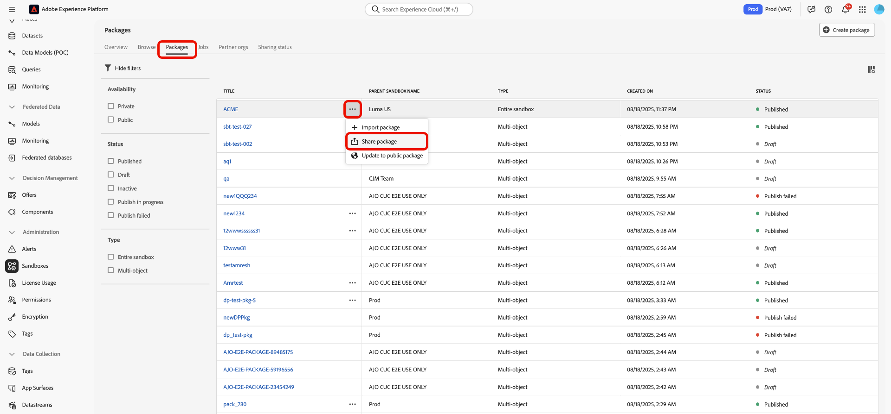

# Compartilhar pacotes entre organizações usando as ferramentas de sandbox

Melhore a precisão da configuração em sandboxes e exporte e importe configurações de sandbox facilmente entre sandboxes em diferentes organizações com o recurso de ferramenta sandbox. Este documento aborda como usar ferramentas de sandbox no Adobe Experience Platform para compartilhar pacotes em diferentes organizações. Há dois tipos de pacotes compartilhados:

- **Pacote privado**

[Pacotes privados](#private-packages) só podem ser compartilhados com organizações que aprovaram a solicitação de compartilhamento da organização de origem.

- **Pacote público**

[Pacotes públicos](#public-packages) estão disponíveis para importação sem nenhuma aprovação adicional. Esses pacotes podem ser compartilhados no site, blog ou plataforma de um parceiro. A carga do pacote permite que os pacotes sejam copiados e colados desses canais na organização de destino.

## Pacotes privados {#private-packages}

>[!NOTE]
>
>Para iniciar e aprovar uma solicitação de compartilhamento e compartilhar pacotes entre organizações, será necessário ter a permissão de controle de acesso baseado em função **compartilhamento de pacotes**.

Use o recurso Sandbox Tooling para criar parcerias, rastrear estatísticas de solicitação de parceria, gerenciar parcerias existentes e compartilhar pacotes com organizações parceiras.

### Criar uma solicitação de parceria de organização

Para criar uma solicitação de parceria de organização, navegue até a guia **[!UICONTROL Sandboxes]** **[!UICONTROL Organizações de parceiros]**. Em seguida, selecione **[!UICONTROL Gerenciar organizações do parceiro]**.

Na caixa de diálogo [!UICONTROL Gerenciamento de parceiro de pacote], digite a ID da organização em **[!UICONTROL Digite a ID da Organização]** e pressione Enter (Windows) ou Return (Mac). A ID da organização é mostrada na seção **[!UICONTROL IDs de organização selecionadas]** abaixo. Depois de adicionar as IDs, selecione **[!UICONTROL Confirmar]**.

>[!TIP]
>
>Várias IDs de organização podem ser inseridas por vez usando listas separadas por vírgulas ou inserindo cada ID de organização seguida por inserir.

A solicitação de compartilhamento foi enviada com êxito para a organização parceira, e você retornou à guia [!UICONTROL Sandboxes] **[!UICONTROL Organizações do parceiro]**, que exibe a **[!UICONTROL Solicitação de saída]**.

### Autorizar uma solicitação de parceria {#authorize-request}

Para autorizar uma solicitação de parceria de organização, navegue até a guia [!UICONTROL Sandboxes] **[!UICONTROL Organizações de parceiros]**. Em seguida, selecione **[!UICONTROL Solicitação de entrada]**.

O **[!UICONTROL Status]** atual da solicitação, neste estágio, é **Pendente**. Para aprovar a solicitação, selecione as reticências (`...`) ao lado da solicitação selecionada e selecione **[!UICONTROL Aprovar]** na lista suspensa.

A caixa de diálogo **[!UICONTROL Revisar solicitação de organização do parceiro]** exibe detalhes sobre a solicitação de parceria da organização. Insira um [!UICONTROL Motivo] para aprovação e selecione **[!UICONTROL Aprovar]**.

Você retornou à página [!UICONTROL Solicitação de entrada] e o status da solicitação foi atualizado para **[!UICONTROL Aprovado]**.

Use esse fluxo de trabalho/processo para compartilhar pacotes entre sua organização e a organização de origem.

### Compartilhar pacotes para organizações parceiras {#share-package}

>[!NOTE]
>
>Somente pacotes com o status **Publicado** podem ser compartilhados.

#### Compartilhar pacotes de vários objetos {#multi-object-packages}

Para compartilhar um pacote de vários objetos com uma organização parceira aprovada, navegue até a guia [!UICONTROL Sandboxes] **[!UICONTROL Pacotes]**. Em seguida, selecione as reticências (`...`) ao lado do pacote e selecione **[!UICONTROL Compartilhar pacote]** no menu suspenso.

Na caixa de diálogo **[!UICONTROL Compartilhar pacote]**, selecione as organizações com as quais compartilhar o pacote na lista suspensa **[!UICONTROL Configurações de compartilhamento]** e selecione **[!UICONTROL Confirmar]**.

>[!TIP]
>
>É possível selecionar mais de uma organização. As organizações selecionadas aparecerão abaixo da lista suspensa [!UICONTROL Configurações de compartilhamento].

#### Compartilhar pacotes completos de sandbox {#entire-sandbox-packages}

Para compartilhar um pacote inteiro de sandbox com uma organização parceira aprovada, navegue até a guia [!UICONTROL Sandboxes] **[!UICONTROL Pacotes]**. Em seguida, selecione as reticências (`...`) ao lado do pacote e selecione **[!UICONTROL Compartilhar pacote]** no menu suspenso.

Na caixa de diálogo **[!UICONTROL Compartilhar pacote]**, selecione as organizações com as quais compartilhar o pacote na lista suspensa **[!UICONTROL Configurações de compartilhamento]** e selecione **[!UICONTROL Confirmar]**.

>[!TIP]
>
>É possível selecionar mais de uma organização. As organizações selecionadas aparecerão abaixo da lista suspensa [!UICONTROL Configurações de compartilhamento].

## Pacotes públicos {#public-packages}

Use o recurso Sandbox Tooling para criar pacotes públicos compartilháveis que não exigem aprovação adicional e são facilmente importados com o uso da carga do pacote.

### Atualizar a disponibilidade do pacote para público {#update-package}

Para atualizar o tipo de disponibilidade de um pacote, navegue até a guia [!UICONTROL Sandboxes] **[!UICONTROL Pacotes]**. Em seguida, selecione as reticências (`...`) ao lado do pacote e selecione **[!UICONTROL Atualizar para pacote público]** no menu suspenso.

Na caixa de diálogo **[!UICONTROL Alterar disponibilidade do pacote para público]**, verifique se o nome do pacote está correto e selecione **[!UICONTROL Confirmar]**.

>[!IMPORTANT]
>
> Depois que um pacote é tornado público, ele não pode ser alterado para privado.

### Compartilhar pacotes usando a carga do pacote

Para compartilhar o pacote público, selecione as reticências (`...`) ao lado do pacote e selecione **[!UICONTROL Copiar carga do pacote]**.

A caixa de diálogo **[!UICONTROL Copiar carga do pacote]** exibe o nome e a carga do pacote. Selecione **[!UICONTROL Copiar carga do pacote]** para copiar a carga associada ao pacote.

### Criar um novo pacote usando uma carga de pacote

Para criar um pacote usando uma carga de pacote, navegue até a guia [!UICONTROL Sandboxes] **[!UICONTROL Pacotes]**. Em seguida, selecione **[!UICONTROL Criar pacote]**.

Na caixa de diálogo **[!UICONTROL Criar pacote]**, selecione a opção para **[!UICONTROL Colar carga do pacote]** e selecione **[!UICONTROL Selecionar]**.

Cole a carga do pacote copiado no campo de texto e selecione **[!UICONTROL Criar]**.

Para exibir o status atual da sua solicitação de compartilhamento, navegue até o **[!UICONTROL Status de compartilhamento]**. O status atual da solicitação é mostrado na coluna **[!UICONTROL Status de compartilhamento]**.

## Próximas etapas {#next-steps}

Este documento demonstrou como usar o recurso de ferramenta Sandbox para compartilhar pacotes em diferentes organizações. Para obter mais informações, consulte o [guia de ferramentas da sandbox](../ui/sandbox-tooling.md).

Para saber como executar operações diferentes usando a API de sandbox, consulte o [guia do desenvolvedor da sandbox](../api/getting-started.md). Para obter uma visão geral de alto nível das sandboxes no Experience Platform, consulte a [documentação de visão geral](../home.md).
