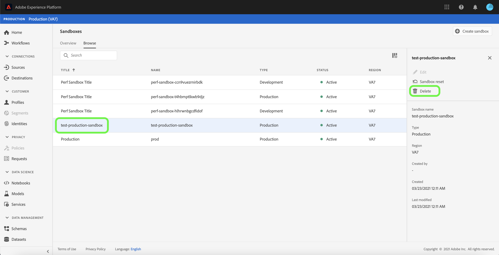

# Guia da interface do usuário do Sandbox

Este documento fornece etapas sobre como executar várias operações relacionadas a sandboxes na interface do usuário do Adobe Experience Platform.

## Exibir sandboxes

Na interface do usuário do Experience Platform, selecione **[!UICONTROL Sandboxes]** na navegação à esquerda para abrir o painel **[!UICONTROL Sandboxes]**. O painel lista todas as sandboxes disponíveis para sua organização, incluindo o tipo de sandbox (produção ou desenvolvimento) e o estado (ativo, criação, excluído ou com falha).

## Alternar entre sandboxes

O controle **sandbox switcher** na parte superior esquerda da tela exibe a sandbox atualmente ativa.

Para alternar entre sandboxes, selecione o alternador de sandbox e selecione a sandbox desejada na lista suspensa.

Depois que uma sandbox é selecionada, a tela é atualizada com a sandbox selecionada e agora aparece no alternador de sandbox.

## Procurar uma sandbox

Você pode navegar pela lista de sandboxes disponíveis usando a função de pesquisa do menu sandbox switcher. Digite o nome da sandbox que deseja acessar para filtrar por meio de todas as sandboxes disponíveis para a organização.

## Criar uma nova sandbox

Use o vídeo a seguir para obter uma visão geral rápida sobre como usar sandboxes no Experience Platform.

>[!VIDEO](https://video.tv.adobe.com/v/29838/?quality=12&learn=on)

Para criar uma nova sandbox na interface do usuário, selecione o botão **[!UICONTROL Create Sandbox]** no lado superior direito da tela.

A caixa de diálogo **[!UICONTROL Create Sandbox]** é exibida, solicitando que você forneça um título de exibição e um nome para a sandbox. O **título de exibição** deve ser legível por humanos e deve ser descritivo o suficiente para ser facilmente identificável. A sandbox **[!UICONTROL Name]** é um identificador em letras minúsculas para uso em chamadas de API e, portanto, deve ser exclusiva e concisa. A sandbox **[!UICONTROL Name]** deve consistir apenas em caracteres alfanuméricos e hifens **(-)**, deve começar com uma letra e tem no máximo 256 caracteres.

Quando terminar, selecione **[!UICONTROL Create]**.

>[!NOTE]
>
>Como você está restrito a criar apenas tipos de sandbox de não produção, a opção **[!UICONTROL type]** é bloqueada em &quot;Não produção&quot; e não pode ser manipulada.

Quando terminar de criar a sandbox, atualize a página e a nova sandbox aparecerá no painel **[!UICONTROL Sandboxes]** com o status &quot;[!UICONTROL Creating]&quot;. As novas sandboxes levam aproximadamente 15 minutos para serem provisionadas pelo sistema, depois o status muda para &quot;[!UICONTROL Active]&quot;.

## Redefinir uma sandbox

>[!NOTE]
>
>Essa funcionalidade só está disponível para sandboxes de não produção. As sandboxes de produção não podem ser redefinidas.

A redefinição de uma sandbox de não produção exclui todos os recursos associados a ela (esquemas, conjuntos de dados e assim por diante), mantendo o nome da sandbox e as permissões associadas. Essa sandbox &quot;limpa&quot; continua disponível com o mesmo nome para usuários que têm acesso a ela.

Para redefinir uma sandbox na interface do usuário, selecione **[!UICONTROL Sandboxes]** na navegação à esquerda e selecione a sandbox que deseja redefinir. Na caixa de diálogo exibida no lado direito da tela, selecione **[!UICONTROL Reset Sandbox]**.

Uma caixa de diálogo é exibida solicitando que você confirme sua escolha. Selecione **[!UICONTROL Reset]** para continuar.

Uma mensagem de confirmação é exibida e o estado da sandbox muda para &quot;**[!UICONTROL Resetting]&quot;**. Depois de provisionado pelo sistema, seu estado será atualizado para **&quot;[!UICONTROL Active]&quot;** ou **&quot;[!UICONTROL Failed]&quot;**.

## Excluir uma sandbox

>[!NOTE]
>
>Essa funcionalidade só está disponível para sandboxes de não produção. As sandboxes de produção não podem ser excluídas.

A exclusão de uma sandbox de não produção remove permanentemente todos os recursos associados a essa sandbox, incluindo permissões.

Para excluir uma sandbox na interface do usuário, selecione **[!UICONTROL Sandboxes]** na navegação à esquerda e selecione a sandbox que deseja excluir. Na caixa de diálogo exibida no lado direito da tela, selecione **[!UICONTROL Delete Sandbox]**.

Uma caixa de diálogo é exibida solicitando que você confirme sua escolha. Selecione **[!UICONTROL Delete]** para continuar.

Uma mensagem de confirmação é exibida e a sandbox é removida do espaço de trabalho **[!UICONTROL Sandboxes]**.

## Próximas etapas

Este documento demonstrou como gerenciar sandboxes na interface do usuário do Experience Platform. Para obter informações sobre como gerenciar sandboxes usando a API Sandbox, consulte o [guia do desenvolvedor sandbox](../api/getting-started.md).