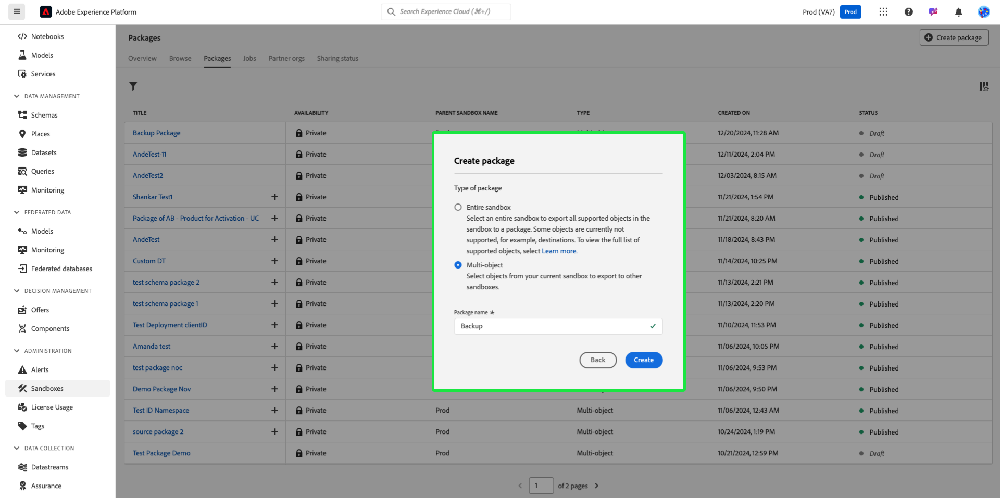

# Fazer backup de configurações de objeto usando ferramentas de sandbox

Para redefinir sandboxes com segurança e adicionar suporte ao controle de versão, faça backup das configurações de objeto (ou metadados) usando pacotes de ferramentas de sandbox. Os pacotes de backup evitam a perda de configurações críticas, como esquemas, conjuntos de dados e públicos-alvo, especialmente durante iterações de desenvolvimento.

{zoomable="yes"}

## Por que considerar este caso de uso {#why-this-use-case}

A criação de um pacote de backup usando ferramentas de sandbox garante que suas configurações de objeto sejam armazenadas e protegidas. As sandboxes de desenvolvimento podem ser preenchidas rapidamente à medida que você experimenta e cria, enquanto a criação de uma sandbox do zero após a redefinição pode ser demorada e deixar espaço para erros. Com o poder das ferramentas de sandbox, você pode importar um pacote de backup em uma sandbox recém-redefinida para retornar imediatamente suas configurações ideais e continuar o desenvolvimento.

Os pacotes de backup também permitem que você dê suporte ao controle de versão em todo o processo de desenvolvimento. Conforme sua sandbox muda, crie pacotes de backup adicionais juntamente com seus pacotes anteriores para que você possa restaurar facilmente sua sandbox para qualquer uma das configurações.

## Pré-requisitos e planejamento {#prerequisites-and-planning}

Ao planejar criar seu próprio pacote de backup na empresa, considere os seguintes pré-requisitos no processo de planejamento:

- Avalie os usos atuais das sandboxes em sua organização. Existem sandboxes de não produção se aproximando ou excedendo seu direito de licença?
- Qual é o escopo dos metadados dos quais você deseja fazer backup? Você pode considerar fazer backup de uma sandbox completa ou parcial, dependendo do caso de uso.
- Dependendo dos metadados do escopo do qual deseja fazer backup, verifique se você entende como [adicionar objetos manualmente a um pacote](../ui/sandbox-tooling.md#add-object-to-a-new-package) ou como [exportar uma sandbox inteira](../ui/sandbox-tooling.md#export-an-entire-sandbox).
- Verifique se você tem acesso às ferramentas de sandbox em sua organização com as permissões corretas.

### Funcionalidade da interface, componentes da Platform e produtos da Experience Cloud que serão usados {#ui-functionality-and-elements}

Para implementar com êxito esse caso de uso, você deve usar várias áreas do Adobe Experience Platform. Verifique se você tem as [permissões de controle de acesso baseadas em atributos](../../access-control/abac/overview.md) necessárias para todas essas áreas ou peça ao administrador do sistema para conceder as permissões necessárias.

- [Ferramentas de sandbox](../ui/sandbox-tooling.md)
- [Gerenciamento de sandbox](../ui/user-guide.md)
- [Painel de uso da licença](../../landing/license-usage-and-guardrails/license-usage-dashboard.md)
- [Conjuntos de dados](../../catalog/datasets/overview.md)
- [Esquemas](../../xdm//home.md)
- [Públicos-alvo](../../segmentation/home.md)
- [Jornadas do Adobe Journey Optimizer](https://experienceleague.adobe.com/en/docs/journey-optimizer/using/orchestrate-journeys/journey)

## Como atingir o caso de uso: visão geral de alto nível {#achieve-the-use-case-high-level}

1. Defina o escopo dos metadados dos quais deseja fazer backup.
2. Use a interface de usuário das ferramentas de sandbox para exportar os objetos desejados para um pacote de backup.
3. Crie regularmente novas versões do pacote de backup para garantir que as sandboxes permaneçam alinhadas com as configurações atuais.
4. Verifique seu uso atual no painel de uso de licença em relação aos seus direitos para sandboxes de não produção.
5. Redefina sandboxes de não produção para estar em conformidade com os direitos ou para liberar recursos e armazenamento de dados desnecessários.
6. Importe o pacote de backup para sua sandbox depois de redefini-la para restaurar as configurações de objeto.

## Como atingir o caso de uso: instruções passo a passo {#step-by-step-instructions}

Leia as seções abaixo, que incluem links para documentação adicional, para concluir cada uma das etapas da visão geral de alto nível acima.

### Definir o escopo de metadados

Antes de começar a criar seu pacote de backup, considere o caso de uso do pacote. Dependendo das suas necessidades, talvez você queira fazer backup de uma sandbox completa ou selecionar objetos específicos para adicionar ao seu pacote, como mencionado no [pré-requisitos](#prerequisites-and-planning).

>[!NOTE]
>
> Se estiver pensando em fazer backup da sandbox para redefini-la, esteja ciente das [limitações](../ui/user-guide.md#reset-a-sandbox) que cercam a redefinição de sandboxes.

### Exportar os metadados escolhidos para um pacote

Nesse momento, você está pronto para fazer backup da sandbox usando a interface de usuário de ferramentas de sandbox. Essa etapa abrange o backup de uma sandbox inteira e o backup de objetos específicos.

>[!NOTE]
>
> Nem todos os objetos são compatíveis com as ferramentas de sandbox. Consulte o guia [objetos com suporte para ferramentas de sandbox](../ui/sandbox-tooling.md#objects-supported-for-sandbox-tooling) para obter uma lista abrangente de objetos permitidos.

#### Exportar uma sandbox completa

Para fazer backup de sua sandbox por completo, siga o [guia de ferramentas de sandbox](../ui/sandbox-tooling.md#export-an-entire-sandbox) para criar e publicar um novo pacote contendo as configurações de toda a sandbox.

#### Exportar objetos individuais

Você pode fazer backup de objetos individuais em um pacote de qualquer uma das seguintes maneiras. Embora esses guias se concentrem na adição de um esquema no pacote, as mesmas etapas se aplicam a outros objetos, como conjuntos de dados, públicos-alvo ou jornadas.

- Adicione um objeto individual a um novo pacote, seguindo o [guia de adição de objetos](../ui/sandbox-tooling.md#add-object-to-a-new-package) da ferramenta sandbox.
- Adicione um objeto individual a um pacote de backup existente, seguindo o [guia de ferramentas da sandbox](../ui/sandbox-tooling.md#add-an-object-to-an-existing-package-and-publish), certificando-se de publicar suas alterações.
- Crie um pacote de vários objetos vazio para adicionar objetos, seguindo o guia abaixo.

##### Criação de um pacote de vários objetos

No Experience Platform, selecione **[!UICONTROL Sandboxes]** na navegação à esquerda e, em seguida, selecione **[!UICONTROL Pacotes]**. Para começar a criar um novo pacote, selecione **[!UICONTROL Criar pacote]** no canto superior direito.

A caixa de diálogo **[!UICONTROL Criar pacote]** é exibida. Escolha **[!UICONTROL Selecionar objetos]** e selecione **[!UICONTROL Selecionar]**.

Selecione a opção **[!UICONTROL Vários objetos]**. Agora, é necessário fornecer um nome para o novo pacote. Insira o nome desejado no campo de texto **[!UICONTROL Nome do pacote]**. Depois de concluído, selecione **[!UICONTROL Criar]**.

Seu novo pacote de vários objetos foi criado e está disponível no painel [!UICONTROL Pacotes]. Selecione o pacote na lista.

As informações e o conteúdo do pacote são exibidos. No momento, não há objetos em nosso novo pacote. Para começar a adicionar objetos, siga o guia em [adicionando objetos a um pacote existente](../ui/sandbox-tooling.md#add-object-to-a-new-package).

### Crie novas versões do pacote de backup conforme necessário

Agora que você criou o primeiro pacote de backup para sua sandbox, convém criar novas versões do pacote de backup conforme as alterações nas configurações da sandbox.

Embora seja possível adicionar novos objetos ao pacote de backup existente, é recomendável criar novos pacotes para dar suporte ao controle de versão na sandbox. Isso garante que você possa redefinir e importar facilmente qualquer versão anterior de suas sandboxes enquanto continua desenvolvendo.

### Verificar os usos atuais em relação aos direitos de licença

Agora que seu pacote de backup está pronto, você pode redefinir sua sandbox para redefinir seu uso. Você deve monitorar regularmente o uso para ajustar os direitos de licença ou redefinir a sandbox conforme necessário. Você pode consultar o [guia de uso de licença](../../dashboards/guides/license-usage.md) para saber mais sobre o painel de uso de licença.

### Redefinir sua sandbox

Nesse ponto, você pode redefinir com segurança sua sandbox, supondo que ela atenda aos parâmetros necessários. Siga o [guia Redefinir uma sandbox](../ui/user-guide.md#reset-a-sandbox) para começar a redefinir sua sandbox, lendo os casos de listagem de avisos que podem impedir a redefinição da sandbox.

### Importe o pacote de backup recém-criado para a sandbox de redefinição

Agora que redefiniu sua sandbox, você pode usar o pacote de backup criado. Siga o [guia de ferramentas da sandbox](../ui/sandbox-tooling.md#import-a-package-to-a-target-sandbox) para obter um processo passo a passo sobre como importar um pacote para a sandbox de destino.

## Outros casos de uso obtidos com ferramentas de sandbox: {#other-use-cases}

Veja mais casos de uso habilitados com ferramentas de sandbox:

- [Possibilite um centro de excelência usando ferramentas de sandbox](./center-of-excellence.md)
