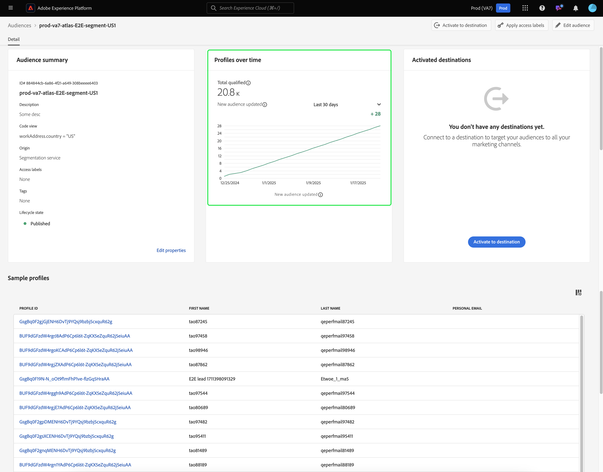

# Guia de segmentação de borda

A segmentação do Edge é a capacidade de avaliar definições de segmento no Adobe Experience Platform instantaneamente [na borda](../../landing/edge-and-hub-comparison.md), habilitando casos de uso de personalização da mesma página e da próxima página.

>[!IMPORTANT]
>
> Os dados de borda serão armazenados em um local de servidor de borda mais próximo de onde foram coletados. Esses dados também podem ser armazenados em um local diferente daquele designado como data center principal da Adobe Experience Platform.
>
> Além disso, o mecanismo de segmentação de borda só respeitará solicitações na borda em que há **uma** identidade principal marcada, que é consistente com identidades principais não baseadas em borda.

## Tipos de consulta de segmentação do Edge {#query-types}

Uma consulta pode ser avaliada com segmentação de borda se atender a qualquer um dos critérios descritos na tabela a seguir.

>[!NOTE]
>
>Se a consulta corresponder a qualquer um dos tipos de consulta na tabela a seguir, ela será avaliada automaticamente usando a segmentação de borda. O sistema determina essa capacidade automaticamente com base na expressão de consulta.
>
>Além disso, se o público-alvo **only** contiver atributos de perfil, ele será avaliado diariamente. Se você quiser que seu público seja avaliado em tempo real, será necessário adicionar dados do evento ao público.

| Tipo de consulta | Detalhes | Consulta | Exemplo |
| ---------- | ------- | ----- | ------- |
| Evento único em uma janela de tempo de menos de 24 horas | Qualquer definição de segmento que se refira a um único evento recebido em uma janela de tempo de menos de 24 horas. | `CHAIN(xEvent, timestamp, [C0: WHAT(eventType.equals("commerce.checkouts", false)) WHEN(today)])` | {zoomable="yes"} |
| Somente perfil | Qualquer definição de segmento que se refere apenas a um atributo de perfil. | `homeAddress.country.equals("US", false)` | {zoomable="yes"} |
| Evento único com um atributo de perfil em uma janela de tempo relativa de menos de 24 horas | Qualquer definição de segmento que se refere a um único evento recebido, com um ou mais atributos de perfil, e ocorre em uma janela de tempo relativa de menos de 24 horas. | `workAddress.country.equals("US", false) and CHAIN(xEvent, timestamp, [C0: WHAT(eventType.equals("commerce.checkouts", false)) WHEN(today)])` | {zoomable="yes"} |
| Segmento de segmentos | Qualquer definição de segmento que contenha um ou mais segmentos de lote ou de borda. **Observação:** se um segmento de segmentos for usado, a desqualificação de perfis ocorrerá **a cada 24 horas**. | `inSegment("a730ed3f-119c-415b-a4ac-27c396ae2dff") and inSegment("8fbbe169-2da6-4c9d-a332-b6a6ecf559b9")` | {zoomable="yes"} |

Além disso, a definição de segmento **deve** estar vinculada a uma política de mesclagem que esteja ativa na borda. Para obter mais informações sobre políticas de mesclagem, leia o [guia de políticas de mesclagem](../../profile/api/merge-policies.md).

Uma definição de segmento **não** estará qualificada para segmentação de borda no seguinte cenário:

- A definição de segmento inclui uma combinação de um único evento e um evento `inSegment`.
   - No entanto, se a definição de segmento contida no evento `inSegment` for somente perfil, a definição de segmento **será habilitada para segmentação de borda.**
- A definição do segmento usa &quot;Ignorar ano&quot; como parte de suas restrições de tempo.

## Criar público-alvo {#create-audience}

Você pode criar um público-alvo que seja avaliado usando a segmentação de borda usando a API de serviço de segmentação ou o Audience Portal na interface.

Uma definição de segmento pode ser habilitada para borda se corresponder a um dos [tipos de consulta qualificados](#eligible-query-types).

>[!BEGINTABS]

>[!TAB API do serviço de segmentação]

**Formato da API**

```http
POST /segment/definitions
```

**Solicitação**

+++ Um exemplo de solicitação para criar uma definição de segmento que esteja habilitada para segmentação de borda

```shell
curl -X POST https://platform.adobe.io/data/core/ups/segment/definitions
 -H 'Authorization: Bearer {ACCESS_TOKEN}' \
 -H 'Content-Type: application/json' \
 -H 'x-gw-ims-org-id: {ORG_ID}' \
 -H 'x-api-key: {API_KEY}' \
 -H 'x-sandbox-name: {SANDBOX_NAME}'
 -d '{
        "name": "People in the USA",
        "description: "An audience that looks for people who live in the USA",
        "expression": {
            "type": "PQL",
            "format": "pql/text",
            "value": "homeAddress.country = \"US\""
        },
        "evaluationInfo": {
            "batch": {
                "enabled": false
            },
            "continuous": {
                "enabled": false
            },
            "synchronous": {
                "enabled": true
            }
        },
        "schema": {
            "name": "_xdm.context.profile"
        }
     }'
```

+++

**Resposta**

Uma resposta bem-sucedida retorna o status HTTP 200 com detalhes da definição de segmento recém-criada.

+++Um exemplo de resposta ao criar uma definição de segmento.

```json
{
    "id": "4afe34ae-8c98-4513-8a1d-67ccaa54bc05",
    "schema": {
        "name": "_xdm.context.profile"
    },
    "profileInstanceId": "ups",
    "imsOrgId": "{ORG_ID}",
    "sandbox": {
        "sandboxId": "28e74200-e3de-11e9-8f5d-7f27416c5f0d",
        "sandboxName": "prod",
        "type": "production",
        "default": true
    },
    "name": "People in the USA",
    "description": "An audience that looks for people who live in the USA",
    "expression": {
        "type": "PQL",
        "format": "pql/text",
        "value": "homeAddress.country = \"US\""
    },
    "evaluationInfo": {
        "batch": {
            "enabled": false
        },
        "continuous": {
            "enabled": false
        },
        "synchronous": {
            "enabled": true
        }
    },
    "dataGovernancePolicy": {
        "excludeOptOut": true
    },
    "creationTime": 0,
    "updateEpoch": 1579292094,
    "updateTime": 1579292094000
}
```

+++

Mais informações sobre como usar este ponto de extremidade podem ser encontradas no [manual do ponto de extremidade de definição de segmento](../api/segment-definitions.md).

>[!TAB Portal de público-alvo]

No Portal de Público, selecione **[!UICONTROL Criar público-alvo]**.

{zoomable="yes"}

Um popover é exibido. Selecione **[!UICONTROL Regras de compilação]** para entrar no Construtor de segmentos.

{zoomable="yes"}

No Construtor de segmentos, crie uma definição de segmento que corresponda a um dos [tipos de consulta qualificados](#eligible-query-types). Se a definição de segmento se qualificar para segmentação de borda, você poderá selecionar **[!UICONTROL Edge]** como o **[!UICONTROL método de avaliação]**.

{zoomable="yes"}

Para saber mais sobre como criar definições de segmento, leia o [Guia do Construtor de segmentos](../ui/segment-builder.md)

>[!ENDTABS]

## Recuperar públicos avaliados usando a segmentação de borda {#retrieve-audiences}

Você pode recuperar todos os públicos-alvo avaliados por meio da segmentação de borda, usando a API de serviço de segmentação ou o Audience Portal na interface do usuário.

>[!BEGINTABS]

>[!TAB API do serviço de segmentação]

Recupere uma lista de todas as definições de segmento avaliadas usando a segmentação de borda em sua organização fazendo uma solicitação GET para o ponto de extremidade `/segment/definitions`.

**Formato da API**

Você deve incluir o parâmetro de consulta `evaluationInfo.synchronous.enabled=true` no caminho da solicitação para recuperar definições de segmento avaliadas usando a segmentação de borda.

```http
GET /segment/definitions?evaluationInfo.synchronous.enabled=true
```

**Solicitação**

+++ Uma solicitação de amostra para listar todas as definições de segmento habilitadas para borda

```shell
curl -X GET \
  'https://platform.adobe.io/data/core/ups/segment/definitions?evaluationInfo.synchronous.enabled=true' \
  -H 'Authorization: Bearer {ACCESS_TOKEN}' \
  -H 'x-api-key: {API_KEY}' \
  -H 'x-gw-ims-org-id: {ORG_ID}' \
  -H 'x-sandbox-name: {SANDBOX_NAME}'
```

+++

**Resposta**

Uma resposta bem-sucedida retorna o status HTTP 200 com uma matriz de definições de segmento na organização que estão habilitadas para segmentação de borda.

+++ Um exemplo de resposta que contém uma lista de todas as definições de segmento habilitadas para segmentação de borda na sua organização

```json
{
    "segments": [
        {
            "id": "15063cb-2da8-4851-a2e2-bf59ddd2f004",
            "schema": {
                "name": "_xdm.context.profile"
            },
            "imsOrgId": "{ORG_ID}",
            "sandbox": {
                "sandboxId": "",
                "sandboxName": "",
                "type": "production",
                "default": true
            },
            "name": " People who are NOT on their homepage ",
            "expression": {
                "type": "PQL",
                "format": "pql/text",
                "value": "select var1 from xEvent where var1._experience.analytics.endUser.firstWeb.webPageDetails.isHomePage = false"
            },
            "evaluationInfo": {
                "batch": {
                    "enabled": false
                },
                "continuous": {
                    "enabled": false
                },
                "synchronous": {
                    "enabled": true
                }
            },
            "creationTime": 1572029711000,
            "updateEpoch": 1572029712000,
            "updateTime": 1572029712000
        },
        {
            "id": "f15063cb-2da8-4851-a2e2-bf59ddd2f004",
            "schema": {
                "name": "_xdm.context.profile"
            },
            "imsOrgId": "{ORG_ID}",
            "sandbox": {
                "sandboxId": "",
                "sandboxName": "",
                "type": "production",
                "default": true
            },
            "name": "Homepage_continuous",
            "description": "People who are on their homepage - continuous",
            "expression": {
                "type": "PQL",
                "format": "pql/text",
                "value": "select var1 from xEvent where var1._experience.analytics.endUser.firstWeb.webPageDetails.isHomePage = true"
            },
            "evaluationInfo": {
                "batch": {
                    "enabled": false
                },
                "continuous": {
                    "enabled": false
                },
                "synchronous": {
                    "enabled": true
                }
            },
            "creationTime": 1572021085000,
            "updateEpoch": 1572021086000,
            "updateTime": 1572021086000
        }
    ],
    "page": {
        "totalCount": 2,
        "totalPages": 1,
        "sortField": "creationTime",
        "sort": "desc",
        "pageSize": 2,
        "limit": 100
    },
    "link": {}
}
```

Informações mais detalhadas sobre a definição de segmento retornada podem ser encontradas no [manual de ponto de extremidade de definições de segmento](../api/segment-definitions.md).

+++

>[!TAB Portal de público-alvo]

Você pode recuperar todos os públicos-alvo que estão ativados para segmentação de borda na organização usando filtros no Portal de público-alvo. Selecione o ícone  para exibir a lista de filtros.

{zoomable="yes"}

Nos filtros disponíveis, vá para **Atualizar frequência** e selecione &quot;Edge&quot;. O uso desse filtro exibe todos os públicos-alvo na sua organização que são avaliados usando a segmentação de borda.

{zoomable="yes"}

Para saber mais sobre como exibir públicos-alvo no Experience Platform, leia o [Guia do Portal de Público-Alvo](../ui/audience-portal.md).

>[!ENDTABS]

## Detalhes do público-alvo {#audience-details}

Você pode exibir detalhes de um público-alvo específico avaliado usando a segmentação de borda ao selecioná-la no Audience Portal.

Depois de selecionar um público no Audience Portal, a página de detalhes do público é exibida. Isso exibe informações sobre o público-alvo, incluindo um resumo dos detalhes do público-alvo, a quantidade de perfis qualificados ao longo do tempo, bem como os destinos para os quais o público-alvo foi ativado.


Para públicos habilitados para borda, o cartão **[!UICONTROL Perfis ao longo do tempo]** é exibido, mostrando o total de métricas qualificadas e o novo público atualizado.

A métrica **[!UICONTROL Total qualificado]** representa o número total de públicos qualificados, com base nas avaliações de borda desse público.

A métrica **[!UICONTROL Novo público atualizado]** é representada por um gráfico de linhas que mostra a alteração no tamanho do público-alvo por meio da segmentação de borda. Você pode ajustar a lista suspensa para mostrar as últimas 24 horas, a última semana ou os últimos 30 dias.

{zoomable="yes"}

Para obter mais detalhes sobre detalhes do público-alvo, leia a [Visão geral do Portal de público-alvo](../ui/audience-portal.md#audience-details).

## Próximas etapas

Este guia explica o que é a segmentação de borda, bem como criar uma definição de segmento que possa ser avaliada usando a segmentação de borda no Adobe Experience Platform.

Para saber mais sobre como usar a interface do usuário do Experience Platform, leia o [Guia do usuário de segmentação](./overview.md).

Para perguntas frequentes sobre a segmentação de borda, leia a [seção segmentação de borda das Perguntas frequentes](../faq.md#edge-segmentation).

