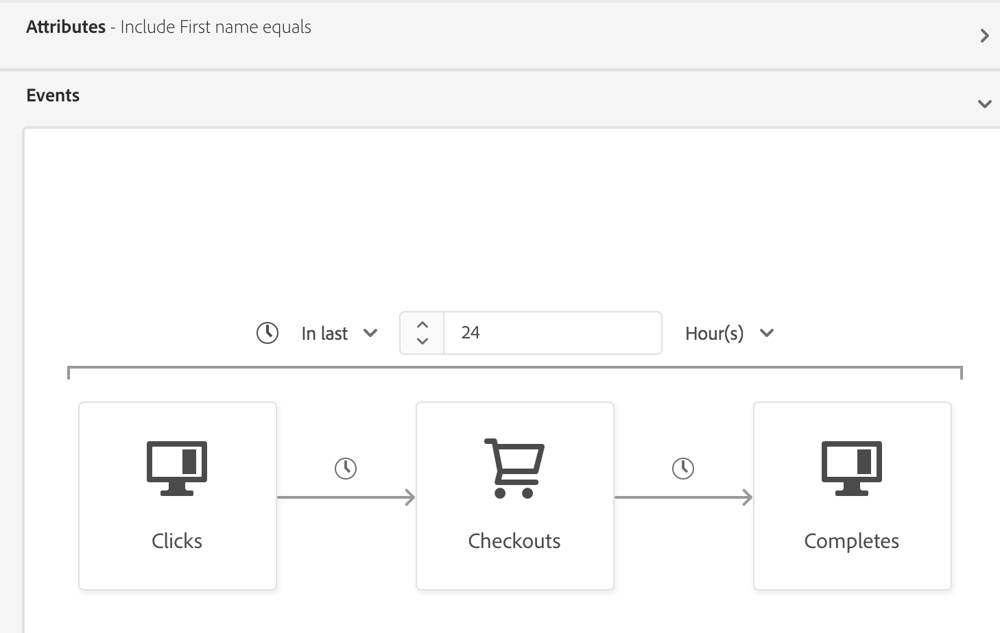
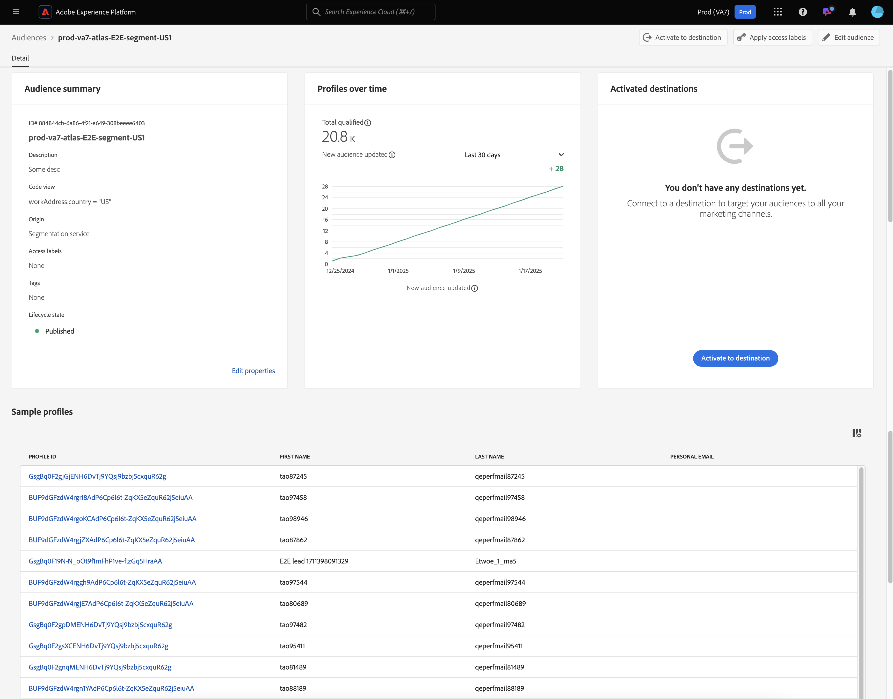

# Guia de segmentação de transmissão

A segmentação de transmissão é a capacidade de avaliar públicos-alvo no Adobe Experience Platform em tempo quase real, concentrando-se na riqueza de dados.

Com a segmentação por transmissão, a qualificação de público-alvo agora acontece à medida que os dados de transmissão chegam ao Experience Platform, reduzindo a necessidade de agendar e executar trabalhos de segmentação. Isso permite avaliar os dados conforme eles são transmitidos para o Experience Platform, permitindo que a associação do público-alvo seja mantida atualizada automaticamente.

## Tipos de consulta elegíveis {#query-types}

Uma consulta será qualificada para segmentação por transmissão se atender a qualquer um dos critérios descritos na tabela a seguir.

>[!NOTE]
>
>Para que a segmentação por transmissão funcione, é necessário habilitar a segmentação agendada para a organização. Para obter detalhes sobre como habilitar a segmentação agendada, consulte [a visão geral do Portal de público-alvo](../ui/audience-portal.md#scheduled-segmentation).

| Tipo de consulta | Detalhes | Consulta | Exemplo |
| ---------- | ------- | ----- | ------- |
| Evento único em uma janela de tempo de menos de 24 horas | Qualquer definição de segmento que se refira a um único evento recebido em uma janela de tempo de menos de 24 horas. | `CHAIN(xEvent, timestamp, [C0: WHAT(eventType.equals("commerce.checkouts", false)) WHEN(today)])` |  |
| Somente perfil | Qualquer definição de segmento que se refere apenas a um atributo de perfil. | `homeAddress.country.equals("US", false)` |  |
| Evento único com um atributo de perfil em uma janela de tempo relativa de menos de 24 horas | Qualquer definição de segmento que se refere a um único evento recebido, com um ou mais atributos de perfil, e ocorre em uma janela de tempo relativa de menos de 24 horas. | `workAddress.country.equals("US", false) and CHAIN(xEvent, timestamp, [C0: WHAT(eventType.equals("commerce.checkouts", false)) WHEN(today)])` |  |
| Segmento de segmentos | Qualquer definição de segmento que contenha um ou mais segmentos em lote ou de fluxo. **Observação:** se um segmento de segmentos for usado, a desqualificação de perfis ocorrerá **a cada 24 horas**. | `inSegment("a730ed3f-119c-415b-a4ac-27c396ae2dff") and inSegment("8fbbe169-2da6-4c9d-a332-b6a6ecf559b9")` |  |
| Vários eventos com um atributo de perfil | Qualquer definição de segmento que se refere a vários eventos **nas últimas 24 horas** e (opcionalmente) tem um ou mais atributos de perfil. | `workAddress.country.equals("US", false) and CHAIN(xEvent, timestamp, [C0: WHAT(eventType.equals("directMarketing.emailClicked", false)) WHEN(today), C1: WHAT(eventType.equals("commerce.checkouts", false)) WHEN(today)])` |  |

Uma definição de segmento **não** estará qualificada para segmentação por transmissão nos seguintes cenários:

- A definição do segmento inclui segmentos ou características do Adobe Audience Manager (AAM).
- A definição do segmento inclui várias entidades (consultas de várias entidades).
- A definição de segmento inclui uma combinação de um único evento e um evento `inSegment`.
   - No entanto, se a definição de segmento contida no evento `inSegment` for somente perfil, a definição de segmento **será** habilitada para segmentação por transmissão.
- A definição do segmento usa &quot;Ignorar ano&quot; como parte de suas restrições de tempo.

Observe as diretrizes a seguir que se aplicam às consultas de segmentação por transmissão:

| Tipo de consulta | Diretriz |
| ---------- | -------- |
| Consulta de evento único | Não há limites para a janela de retrospectiva. |
| Consulta com histórico de eventos | <ul><li>A janela de pesquisa é limitada a **um dia**.</li><li>Uma condição estrita de ordenação de tempo **deve** existe entre os eventos.</li><li>Há suporte para consultas com pelo menos um evento negado. No entanto, o evento inteiro **não pode** ser uma negação.</li></ul> |

Se uma definição de segmento for modificada para não atender mais aos critérios de segmentação por transmissão, a definição de segmento mudará automaticamente de &quot;Transmissão&quot; para &quot;Lote&quot;.

Além disso, a desqualificação de segmentos, semelhante à qualificação de segmentos, acontece em tempo real. Como resultado, se um público-alvo não se qualificar mais para um segmento, ele será imediatamente desqualificado. Por exemplo, se a definição do segmento solicitar &quot;Todos os usuários que compraram sapatos vermelhos nas últimas três horas&quot;, após três horas, todos os perfis que se qualificaram inicialmente para a definição do segmento serão desqualificados.

## Criar público-alvo {#create-audience}

Você pode criar um público-alvo que seja avaliado usando a segmentação por transmissão usando a API do Serviço de segmentação ou o Audience Portal na interface.

Uma definição de segmento pode ser habilitada para streaming se corresponder a um dos [tipos de consulta qualificados](#eligible-query-types).

>[!BEGINTABS]

>[!TAB API do serviço de segmentação]

**Formato da API**

```http
POST /segment/definitions
```

**Solicitação**

+++ Um exemplo de solicitação para criar uma definição de segmento habilitada para segmentação por transmissão

```shell
curl -X POST https://platform.adobe.io/data/core/ups/segment/definitions
 -H 'Authorization: Bearer {ACCESS_TOKEN}' \
 -H 'Content-Type: application/json' \
 -H 'x-gw-ims-org-id: {ORG_ID}' \
 -H 'x-api-key: {API_KEY}' \
 -H 'x-sandbox-name: {SANDBOX_NAME}'
 -d '{
        "name": "People in the USA",
        "description: "An audience that looks for people who live in the USA",
        "expression": {
            "type": "PQL",
            "format": "pql/text",
            "value": "homeAddress.country = \"US\""
        },
        "evaluationInfo": {
            "batch": {
                "enabled": false
            },
            "continuous": {
                "enabled": true
            },
            "synchronous": {
                "enabled": false
            }
        },
        "schema": {
            "name": "_xdm.context.profile"
        }
     }'
```

+++

**Resposta**

Uma resposta bem-sucedida retorna o status HTTP 200 com detalhes da definição de segmento recém-criada.

+++Uma resposta de amostra ao criar uma definição de segmento.

```json
{
    "id": "4afe34ae-8c98-4513-8a1d-67ccaa54bc05",
    "schema": {
        "name": "_xdm.context.profile"
    },
    "profileInstanceId": "ups",
    "imsOrgId": "{ORG_ID}",
    "sandbox": {
        "sandboxId": "28e74200-e3de-11e9-8f5d-7f27416c5f0d",
        "sandboxName": "prod",
        "type": "production",
        "default": true
    },
    "name": "People in the USA",
    "description": "An audience that looks for people who live in the USA",
    "expression": {
        "type": "PQL",
        "format": "pql/text",
        "value": "homeAddress.country = \"US\""
    },
    "evaluationInfo": {
        "batch": {
            "enabled": false
        },
        "continuous": {
            "enabled": true
        },
        "synchronous": {
            "enabled": false
        }
    },
    "dataGovernancePolicy": {
        "excludeOptOut": true
    },
    "creationTime": 0,
    "updateEpoch": 1579292094,
    "updateTime": 1579292094000
}
```

+++

Mais informações sobre como usar este ponto de extremidade podem ser encontradas no [manual do ponto de extremidade de definição de segmento](../api/segment-definitions.md).

>[!TAB Portal de público-alvo]

No Portal de Público, selecione **[!UICONTROL Criar público-alvo]**.


Um popover é exibido. Selecione **[!UICONTROL Regras de compilação]** para entrar no Construtor de segmentos.


No Construtor de segmentos, crie uma definição de segmento que corresponda a um dos [tipos de consulta qualificados](#eligible-query-types). Se a definição do segmento se qualificar para segmentação por transmissão, você poderá selecionar **[!UICONTROL Streaming]** como o **[!UICONTROL Método de avaliação]**.


Para saber mais sobre como criar definições de segmento, leia o [Guia do Construtor de segmentos](../ui/segment-builder.md)

>[!ENDTABS]

## Recuperar públicos-alvo {#retrieve-audiences}

Você pode recuperar todos os públicos-alvo avaliados por meio da segmentação por transmissão usando a API do serviço de segmentação ou o Audience Portal na interface do usuário.

>[!BEGINTABS]

>[!TAB API do serviço de segmentação]

Recupere uma lista de todas as definições de segmento que são avaliadas usando a segmentação por transmissão na organização fazendo uma solicitação GET para o ponto de extremidade `/segment/definitions`.

**Formato da API**

Você deve incluir o parâmetro de consulta `evaluationInfo.synchronous.enabled=true` no caminho da solicitação para recuperar definições de segmento avaliadas usando a segmentação de transmissão.

```http
GET /segment/definitions?evaluationInfo.continuous.enabled=true
```

**Solicitação**

+++ Um exemplo de solicitação para listar todas as definições de segmento habilitadas para streaming

```shell
curl -X GET 'https://platform.adobe.io/data/core/ups/segment/definitions?evaluationInfo.continuous.enabled=true' \
  -H 'Authorization: Bearer {ACCESS_TOKEN}' \
  -H 'Content-Type: application/json' \
  -H 'x-api-key: {API_KEY}' \
  -H 'x-gw-ims-org-id: {ORG_ID}' \
  -H 'x-sandbox-name: {SANDBOX_NAME}'
```

+++

**Resposta**

Uma resposta bem-sucedida retorna o status HTTP 200 com uma matriz de definições de segmento na organização que estão habilitadas para segmentação por transmissão.

+++Uma resposta de amostra que contém uma lista de todas as definições de segmento habilitadas para segmentação por transmissão na organização

```json
{
    "segments": [
        {
            "id": "15063cb-2da8-4851-a2e2-bf59ddd2f004",
            "schema": {
                "name": "_xdm.context.profile"
            },
            "ttlInDays": 30,
            "imsOrgId": "{ORG_ID}",
            "sandbox": {
                "sandboxId": "",
                "sandboxName": "",
                "type": "production",
                "default": true
            },
            "name": " People who are NOT on their homepage ",
            "expression": {
                "type": "PQL",
                "format": "pql/text",
                "value": "select var1 from xEvent where var1._experience.analytics.endUser.firstWeb.webPageDetails.isHomePage = false"
            },
            "evaluationInfo": {
                "batch": {
                    "enabled": false
                },
                "continuous": {
                    "enabled": true
                },
                "synchronous": {
                    "enabled": false
                }
            },
            "creationTime": 1572029711000,
            "updateEpoch": 1572029712000,
            "updateTime": 1572029712000
        },
        {
            "id": "f15063cb-2da8-4851-a2e2-bf59ddd2f004",
            "schema": {
                "name": "_xdm.context.profile"
            },
            "ttlInDays": 30,
            "imsOrgId": "{ORG_ID}",
            "sandbox": {
                "sandboxId": "",
                "sandboxName": "",
                "type": "production",
                "default": true
            },
            "name": "Homepage_continuous",
            "description": "People who are on their homepage - continuous",
            "expression": {
                "type": "PQL",
                "format": "pql/text",
                "value": "select var1 from xEvent where var1._experience.analytics.endUser.firstWeb.webPageDetails.isHomePage = true"
            },
            "evaluationInfo": {
                "batch": {
                    "enabled": true
                },
                "continuous": {
                    "enabled": true
                },
                "synchronous": {
                    "enabled": false
                }
            },
            "creationTime": 1572021085000,
            "updateEpoch": 1572021086000,
            "updateTime": 1572021086000
        }
    ],
    "page": {
        "totalCount": 2,
        "totalPages": 1,
        "sortField": "creationTime",
        "sort": "desc",
        "pageSize": 2,
        "limit": 100
    },
    "link": {}
}
```

Informações mais detalhadas sobre a definição de segmento retornada podem ser encontradas no [manual de ponto de extremidade de definições de segmento](../api/segment-definitions.md).

+++

>[!TAB Portal de público-alvo]

Você pode recuperar todos os públicos-alvo que estão ativados para segmentação por transmissão na organização usando filtros no Portal de público-alvo. Selecione o ícone  para exibir a lista de filtros.


Nos filtros disponíveis, vá para **[!UICONTROL Atualizar frequência]** e selecione &quot;[!UICONTROL Streaming]&quot;. Usar esse filtro exibe todos os públicos-alvo em sua organização que são avaliados usando a segmentação por transmissão.


Para saber mais sobre como exibir públicos-alvo no Experience Platform, leia o [Guia do Portal de Público-Alvo](../ui/audience-portal.md).

>[!ENDTABS]

## Detalhes do público-alvo {#audience-details}

Você pode exibir detalhes de um público-alvo específico avaliado usando a segmentação por transmissão ao selecioná-lo no Portal de público-alvo.

Depois de selecionar um público no Audience Portal, a página de detalhes do público é exibida. Isso exibe informações sobre o público-alvo, incluindo um resumo dos detalhes do público-alvo, a quantidade de perfis qualificados ao longo do tempo, bem como os destinos para os quais o público-alvo foi ativado.



Para públicos habilitados para transmissão, o cartão **[!UICONTROL Perfis ao longo do tempo]** é exibido, mostrando o total de métricas qualificadas e o novo público atualizado.

A métrica **[!UICONTROL Total qualificado]** representa o número total de públicos qualificados, com base nas avaliações em lote e de fluxo para esse público.

A métrica **[!UICONTROL Novo público atualizado]** é representada por um gráfico de linha que mostra a alteração no tamanho do público-alvo por meio da segmentação por transmissão. Você pode ajustar a lista suspensa para mostrar as últimas 24 horas, a última semana ou os últimos 30 dias.


Para obter mais detalhes sobre detalhes do público-alvo, leia a [Visão geral do Portal de público-alvo](../ui/audience-portal.md#audience-details).

## Próximas etapas

Este guia explica como as definições de segmento habilitadas para streaming funcionam no Adobe Experience Platform e como monitorar definições de segmento habilitadas para streaming.

Para saber mais sobre como usar a interface do usuário do Adobe Experience Platform, leia o [Guia do usuário de segmentação](./overview.md).

Para perguntas frequentes sobre a segmentação por transmissão, leia a [seção segmentação por transmissão das Perguntas frequentes](../faq.md#streaming-segmentation).
