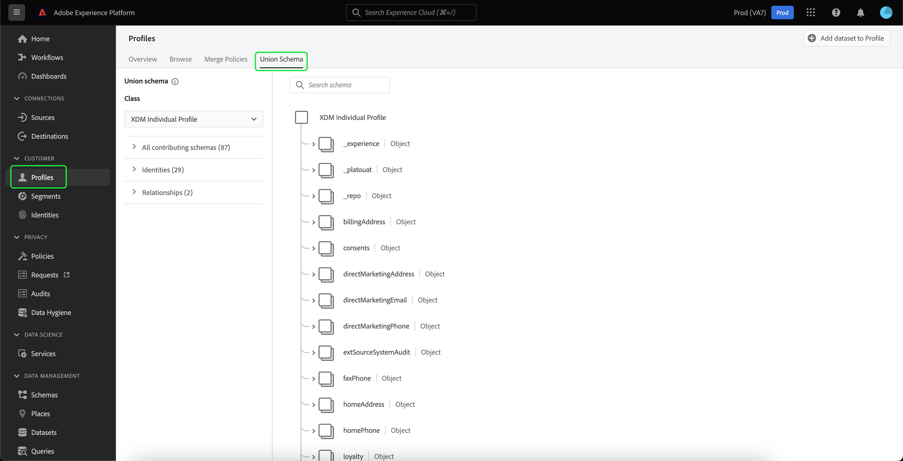
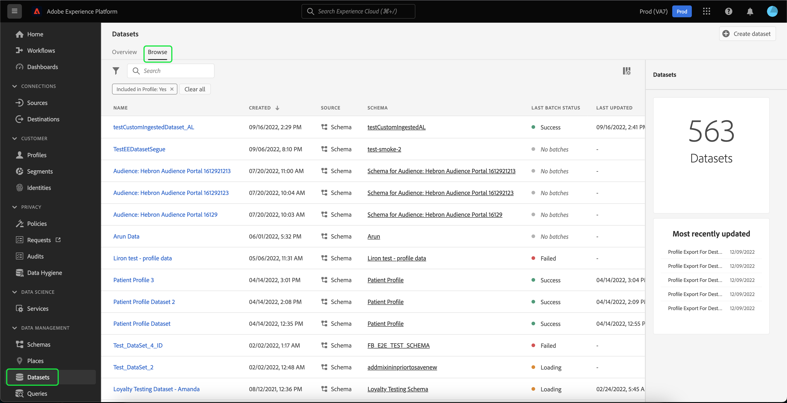

# Criar um conjunto de dados para exportar um segmento de público-alvo

[!DNL Adobe Experience Platform] O permite segmentar perfis de clientes em públicos-alvo com base em atributos específicos. Depois que um segmento é criado, você pode exportar esse público para um conjunto de dados, onde ele pode ser acessado e tratado. Para que a exportação seja bem-sucedida, o conjunto de dados deve ser configurado corretamente.

Este tutorial percorre as etapas necessárias para criar um conjunto de dados que pode ser usado para exportar um segmento de público-alvo usando a interface [!DNL Experience Platform].

Este tutorial está diretamente relacionado às etapas descritas no tutorial sobre a [avaliação e acesso aos resultados do segmento](./evaluate-a-segment.md). O tutorial de avaliação de segmento fornece etapas para a criação de um conjunto de dados usando a API [!DNL Catalog Service], enquanto este tutorial descreve etapas para criar um conjunto de dados usando a interface [!DNL Experience Platform].

## Introdução

Para exportar um segmento, o conjunto de dados deve ser baseado no [!DNL XDM Individual Profile Union Schema]. Um schema de união é um schema somente leitura gerado pelo sistema que agrega os campos de todos os esquemas que compartilham a mesma classe. Para obter mais informações sobre schemas de união, consulte o guia sobre [as noções básicas da composição do schema](../../xdm/schema/composition.md#union).

Para exibir esquemas de união na interface do usuário, selecione **[!UICONTROL Profiles]** na navegação à esquerda e selecione **[!UICONTROL Union Schema]** conforme mostrado abaixo.

## Espaço de trabalho Conjuntos de dados

O espaço de trabalho [!UICONTROL Datasets] permite visualizar e gerenciar todos os conjuntos de dados da sua organização.

Selecione **[!UICONTROL Datasets]** na navegação à esquerda para acessar o espaço de trabalho e selecione **[!UICONTROL Browse]**. Essa guia exibe uma lista de conjuntos de dados e seus detalhes. Dependendo da largura de cada coluna, talvez seja necessário rolar a tela para a esquerda ou para a direita para ver todas as colunas.

>[!NOTE]
>
>Selecione o ícone de filtro ao lado da barra de pesquisa para usar os recursos de filtragem para exibir apenas os conjuntos de dados habilitados para [!DNL Real-time Customer Profile].

## Criar um conjunto de dados

Para criar um conjunto de dados, selecione **[!UICONTROL Criar conjunto de dados]**.

Na próxima tela, selecione **[!UICONTROL Criar conjunto de dados do esquema]**.

## Selecionar Esquema de União de Perfil Individual XDM

Para selecionar o [!DNL XDM Individual Profile Union Schema] para usar em seu conjunto de dados, encontre o esquema &quot;[!UICONTROL Perfil individual XDM]&quot; na tela **[!UICONTROL Selecionar esquema]**. Depois de selecionar o schema, você pode confirmar se ele é o schema de união em **[!UICONTROL Uso da API]** no painel direito. Se o caminho [!UICONTROL Schema] terminar com `_union`, é um schema de união.

>[!NOTE]
>
>Apesar do fato de que os esquemas de união participam do Perfil do cliente em tempo real por definição, eles são listados como &quot;Não ativado&quot; porque não estão habilitados para o Perfil da mesma forma que os esquemas tradicionais.

Selecione o botão de opção ao lado de **[!UICONTROL Perfil individual XDM]** e selecione **[!UICONTROL Próximo]**.

## Configurar conjunto de dados

Na próxima tela, você deve dar um nome ao seu conjunto de dados. Você também pode adicionar uma descrição opcional.

**Observações sobre os nomes dos conjuntos de dados:**
* Os nomes dos conjuntos de dados devem ser curtos e descritivos para que o conjunto de dados possa ser facilmente encontrado na biblioteca posteriormente.
* Os nomes do conjunto de dados devem ser exclusivos, o que significa que também devem ser específicos o suficiente para que não sejam reutilizados no futuro.
* É uma prática recomendada fornecer informações adicionais sobre o conjunto de dados usando o campo de descrição, pois pode ajudar outros usuários a diferenciar os conjuntos de dados no futuro.

Depois que o conjunto de dados tiver um nome e uma descrição, selecione **[!UICONTROL Finish]**.

## Atividade do conjunto de dados

Depois que o conjunto de dados for criado, você receberá a página de atividade desse conjunto de dados. Você deve ver o nome do conjunto de dados no canto superior esquerdo do espaço de trabalho, juntamente com uma notificação de que &quot;Nenhum lote foi adicionado&quot;. Isso é esperado, pois você ainda não adicionou nenhum lote a esse conjunto de dados.

O painel direito contém informações relacionadas ao novo conjunto de dados, como ID do conjunto de dados, nome, descrição, esquema e muito mais. Anote o **[!UICONTROL Dataset ID]**, pois esse valor é necessário para concluir o fluxo de trabalho de exportação do segmento de público-alvo.

## Próximas etapas

Agora que você criou um conjunto de dados com base em [!DNL XDM Individual Profile Union Schema], é possível usar a ID do conjunto de dados para continuar o tutorial [avaliar e acessar os resultados do segmento](./evaluate-a-segment.md).

No momento, retorne ao tutorial de resultados do segmento de avaliação e escolha na etapa [gerar perfis para membros do público-alvo](./evaluate-a-segment.md#generate-profiles) do fluxo de trabalho de exportação de segmento.
