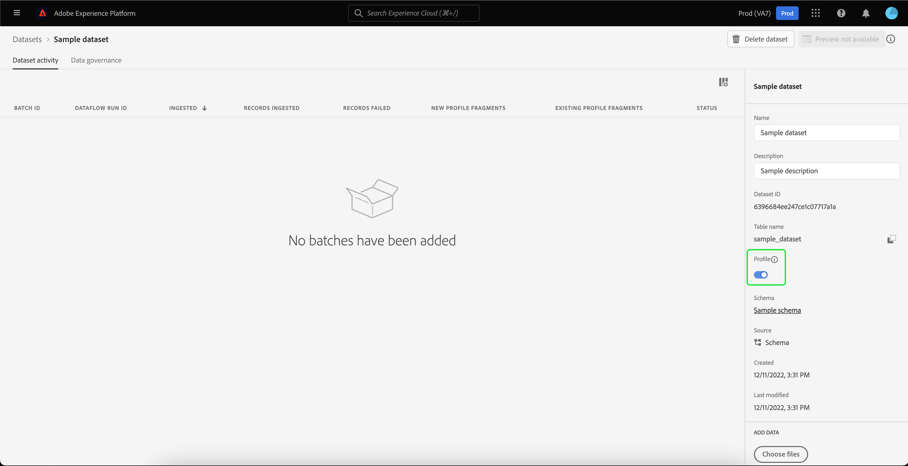

# Importação e uso de públicos externos

O Adobe Experience Platform oferece suporte à capacidade de importar público externo, que pode ser usado posteriormente como componentes para uma nova definição de segmento. Este documento fornece um tutorial para configurar o Experience Platform para importar e usar públicos externos.

## Introdução

Este tutorial requer uma compreensão funcional das várias [!DNL Adobe Experience Platform] serviços envolvidos na criação de segmentos de público-alvo. Antes de iniciar este tutorial, reveja a documentação dos seguintes serviços:

- [Serviço de segmentação](../home.md): Permite criar segmentos de público-alvo a partir de dados do Perfil do cliente em tempo real.
- [Perfil do cliente em tempo real](../../profile/home.md): Fornece um perfil de consumidor unificado e em tempo real com base em dados agregados de várias fontes.
- [Experience Data Model (XDM)](../../xdm/home.md): A estrutura padronizada pela qual a Platform organiza os dados de experiência do cliente. Para utilizar melhor a Segmentação, verifique se os dados são assimilados como perfis e eventos de acordo com a variável [práticas recomendadas para modelagem de dados](../../xdm/schema/best-practices.md).
- [Conjuntos de dados](../../catalog/datasets/overview.md): A construção de armazenamento e gerenciamento para a persistência de dados no Experience Platform.
- [Assimilação de fluxo](../../ingestion/streaming-ingestion/overview.md): Como o Experience Platform assimila e armazena dados de dispositivos cliente e servidor em tempo real.

### Dados do segmento versus metadados do segmento

Antes de começar a importar e usar públicos externos, é importante entender a diferença entre os dados do segmento e os metadados do segmento.

Os dados do segmento se referem aos perfis que atendem aos critérios de qualificação de segmento e, portanto, fazem parte do público-alvo.

Os metadados do segmento são informações sobre o próprio segmento, que incluem o nome, a descrição, a expressão (se aplicável), a data de criação, a data da última modificação e uma ID. A ID vincula os metadados do segmento aos perfis individuais que atendem à qualificação de segmento e fazem parte do público-alvo resultante.

| Segmentar dados | Metadados do segmento |
| ------------ | ---------------- |
| Perfis que atendem à qualificação de segmentos | Informações sobre o próprio segmento |

## Criar um namespace de identidade para o público externo

A primeira etapa para usar públicos externos é criar um namespace de identidade. Os namespaces de identidade permitem que a Platform associe o local de origem de um segmento.

Para criar um namespace de identidade, siga as instruções em [guia do namespace de identidade](../../identity-service/namespaces.md#manage-namespaces). Ao criar seu namespace de identidade, adicione os detalhes da origem ao namespace de identidade e marque sua [!UICONTROL Tipo] como **[!UICONTROL Identificador de não pessoas]**.


>[!NOTE]
>
>Para começar a usar namespaces personalizados com públicos externos, será necessário criar um tíquete de suporte. Entre em contato com o representante do Adobe para obter mais detalhes.

## Criar um esquema para os metadados do segmento

Depois de criar um namespace de identidade, é necessário criar um novo schema para o segmento que você criará.

Para começar a compor um schema, primeiro selecione **[!UICONTROL Esquemas]** na barra de navegação esquerda, seguida pela variável **[!UICONTROL Criar esquema]** no canto superior direito do espaço de trabalho Esquemas. Aqui, selecione **[!UICONTROL Procurar]** para ver uma seleção completa dos tipos de Esquema disponíveis.


Como você está criando uma definição de segmento, que é uma classe predefinida, selecione **[!UICONTROL Usar classe existente]**. Em seguida, selecione o **[!UICONTROL Definição de segmento]** classe , seguida de **[!UICONTROL Atribuir classe]**.


Agora que o esquema foi criado, será necessário especificar qual campo conterá a ID do segmento. Esse campo deve ser marcado como a identidade primária e atribuído aos namespaces criados anteriormente.


Depois de marcar a `_id` como a identidade primária, selecione o título do esquema, seguido pelo botão rotulado **[!UICONTROL Perfil]**. Selecionar **[!UICONTROL Habilitar]** para ativar o schema de [!DNL Real-time Customer Profile].


Agora, esse esquema é ativado para o Perfil, com a identificação primária atribuída ao namespace de identidade de não pessoa que você criou. Como resultado, isso significa que os metadados de segmento importados para a plataforma usando esse esquema serão assimilados no Perfil sem serem unidos aos dados de perfil relacionados a pessoas.

## Criar um conjunto de dados para o esquema

Após configurar o esquema, será necessário criar um conjunto de dados para os metadados do segmento.

Para criar um conjunto de dados, siga as instruções em [guia do usuário do conjunto de dados](../../catalog/datasets/user-guide.md#create). Você deve seguir o **[!UICONTROL Criar conjunto de dados a partir do esquema]** , usando o schema criado anteriormente.


Depois de criar o conjunto de dados, continue seguindo as instruções em [guia do usuário do conjunto de dados](../../catalog/datasets/user-guide.md#enable-profile) para ativar esse conjunto de dados no Perfil do cliente em tempo real.



## Configurar e importar dados do público

Com o conjunto de dados ativado, agora os dados podem ser enviados para a Platform por meio da interface do usuário ou usando as APIs do Experience Platform. Você pode assimilar esses dados por meio de uma conexão de lote ou de transmissão.

### Assimilar dados usando uma conexão em lote

Para criar uma conexão em lote, siga as instruções em [guia da interface do usuário de upload de arquivo local](../../sources/tutorials/ui/create/local-system/local-file-upload.md). Para obter uma lista completa das fontes disponíveis com as quais você pode usar os dados de assimilação, leia o [visão geral das fontes](../../sources/home.md).

### Assimilar dados usando uma conexão de transmissão

Para criar uma conexão de transmissão, siga as instruções em [Tutorial de API](../../sources/tutorials/api/create/streaming/http.md) ou [Tutorial da interface do usuário](../../sources/tutorials/ui/create/streaming/http.md).

Depois de criar a conexão de transmissão, você terá acesso ao seu endpoint de transmissão exclusivo para o qual poderá enviar seus dados. Para saber como enviar dados para esses endpoints, leia o [tutorial sobre dados de registro de transmissão](../../ingestion/tutorials/streaming-record-data.md#ingest-data).


## Estrutura de metadados do público-alvo

Depois de criar uma conexão, você pode assimilar seus dados na Platform.

Uma amostra dos metadados de carga de público-alvo externo pode ser vista abaixo:

```json
{
    "header": {
        "schemaRef": {
            "id": "https://ns.adobe.com/{TENANT_ID}/schemas/{SCHEMA_ID}",
            "contentType": "application/vnd.adobe.xed-full+json;version=1"
        },
        "imsOrgId": "{IMS_ORG}",
        "datasetId": "{DATASET_ID}",
        "source": {
            "name": "Sample External Audience"
        }
    },
    "body": {
        "xdmMeta": {
            "schemaRef": {
                "id": "https://ns.adobe.com/{TENANT_ID}/schemas/{SCHEMA_ID}",
                "contentType": "application/vnd.adobe.xed-full+json;version=1"
            }
        },
        "xdmEntity": {
            "_id": "{SEGMENT_ID}",
            "description": "Sample description",
            "identityMap": {
                "{IDENTITY_NAMESPACE}": [{
                    "id": "{}"
                }]
            },
            "segmentName" : "{SEGMENT_NAME}",
            "segmentStatus": "ACTIVE",
            "version": "1.0"
        }
    }
}
```

| Propriedade | Descrição |
| -------- | ----------- |
| `schemaRef` | O schema **must** consulte o schema criado anteriormente para os metadados do segmento. |
| `datasetId` | A ID do conjunto de dados **must** consulte o conjunto de dados criado anteriormente para o schema que você acabou de criar. |
| `xdmEntity._id` | A ID **must** consulte a mesma ID de segmento que você está usando como público externo. |
| `xdmEntity.identityMap` | Esta seção **must** contém o rótulo de identidade usado ao criar o namespace criado anteriormente. |
| `{IDENTITY_NAMESPACE}` | Esse é o rótulo do namespace de identidade criado anteriormente. Assim, por exemplo, se você chamasse seu namespace de identidade de &quot;externalAudience&quot;, você o usaria como a chave do array. |
| `segmentName` | O nome do segmento pelo qual você deseja que o público externo seja segmentado. |

## Criação de segmentos usando públicos importados

Depois que os públicos importados forem configurados, eles poderão ser usados como parte do processo de segmentação. Para encontrar públicos externos, acesse o Construtor de segmentos e selecione **[!UICONTROL Públicos-alvo]** na guia no **[!UICONTROL Campos]** seção.


## Próximas etapas

Agora que você pode usar públicos externos em seus segmentos, pode usar o Construtor de segmentos para criar segmentos. Para saber como criar segmentos, leia o [tutorial sobre a criação de segmentos](./create-a-segment.md).

## Apêndice

Além de usar metadados de público-alvo externo importados e usá-los para criar segmentos, também é possível importar associações de segmento externo para a Platform.

### Configurar um esquema de destino de associação de segmento externo

Para começar a compor um schema, primeiro selecione **[!UICONTROL Esquemas]** na barra de navegação esquerda, seguida pela variável **[!UICONTROL Criar esquema]** no canto superior direito do espaço de trabalho Esquemas. Aqui, selecione **[!UICONTROL Perfil individual XDM]**.


Agora que o schema foi criado, será necessário adicionar o grupo de campos de associação de segmento como parte do schema . Para fazer isso, selecione [!UICONTROL Detalhes da associação ao segmento], seguida de [!UICONTROL Adicionar grupos de campos].


Além disso, verifique se o esquema está marcado para **[!UICONTROL Perfil]**. Para fazer isso, será necessário marcar um campo como a identidade primária.


### Configurar o conjunto de dados

Depois de criar o esquema, será necessário criar um conjunto de dados.

Para criar um conjunto de dados, siga as instruções em [guia do usuário do conjunto de dados](../../catalog/datasets/user-guide.md#create). Você deve seguir o **[!UICONTROL Criar conjunto de dados a partir do esquema]** , usando o schema criado anteriormente.


Depois de criar o conjunto de dados, continue seguindo as instruções em [guia do usuário do conjunto de dados](../../catalog/datasets/user-guide.md#enable-profile) para ativar esse conjunto de dados no Perfil do cliente em tempo real.


## Configurar e importar dados externos de associação do público

Com o conjunto de dados ativado, agora os dados podem ser enviados para a Platform por meio da interface do usuário ou usando as APIs do Experience Platform. Você pode assimilar esses dados por meio de uma conexão de lote ou de transmissão.

### Assimilar dados usando uma conexão em lote

Para criar uma conexão em lote, siga as instruções em [guia da interface do usuário de upload de arquivo local](../../sources/tutorials/ui/create/local-system/local-file-upload.md). Para obter uma lista completa das fontes disponíveis com as quais você pode usar os dados de assimilação, leia o [visão geral das fontes](../../sources/home.md).

### Assimilar dados usando uma conexão de transmissão

Para criar uma conexão de transmissão, siga as instruções em [Tutorial de API](../../sources/tutorials/api/create/streaming/http.md) ou [Tutorial da interface do usuário](../../sources/tutorials/ui/create/streaming/http.md).

Depois de criar a conexão de transmissão, você terá acesso ao seu endpoint de transmissão exclusivo para o qual poderá enviar seus dados. Para saber como enviar dados para esses endpoints, leia o [tutorial sobre dados de registro de transmissão](../../ingestion/tutorials/streaming-record-data.md#ingest-data).


## Estrutura de associação de segmentos

Depois de criar uma conexão, você pode assimilar seus dados na Platform.

Uma amostra da carga de associação de público-alvo externo pode ser vista abaixo:

```json
{
    "header": {
        "schemaRef": {
            "id": "https://ns.adobe.com/{TENANT_ID}/schemas/{SCHEMA_ID}",
            "contentType": "application/vnd.adobe.xed-full+json;version=1"
        },
        "imsOrgId": "{IMS_ORG}",
        "datasetId": "{DATASET_ID}",
        "source": {
            "name": "Sample External Audience Membership"
        }
    },
    "body": {
        "xdmMeta": {
            "schemaRef": {
                "id": "https://ns.adobe.com/{TENANT_ID}/schemas/{SCHEMA_ID}",
                "contentType": "application/vnd.adobe.xed-full+json;version=1"
            }
        },
        "xdmEntity": {
            "_id": "{UNIQUE_ID}",
            "description": "Sample description",
            "{TENANT_NAME}": {
                "identities": {
                    "{SCHEMA_IDENTITY}": "sample-id"
                }
            },
            "personId" : "sample-name",
            "segmentMembership": {
                "{IDENTITY_NAMESPACE}": {
                    "{EXTERNAL_IDENTITY}": {
                        "status": "realized",
                        "lastQualificationTime": "2022-03-14T:00:00:00Z"
                    }
                }
            }
        }
    }
}
```

| Propriedade | Descrição |
| -------- | ----------- |
| `schemaRef` | O schema **must** consulte o schema criado anteriormente para os dados de associação de segmento. |
| `datasetId` | A ID do conjunto de dados **must** consulte o conjunto de dados criado anteriormente para o schema de associação que você acabou de criar. |
| `xdmEntity._id` | Uma ID adequada usada para identificar exclusivamente o registro no conjunto de dados. |
| `{TENANT_NAME}.identities` | Esta seção é usada para conectar o grupo de campos das identidades personalizadas com os usuários importados anteriormente. |
| `segmentMembership.{IDENTITY_NAMESPACE}` | Esse é o rótulo do namespace de identidade personalizado criado anteriormente. Assim, por exemplo, se você chamasse seu namespace de identidade de &quot;externalAudience&quot;, você o usaria como a chave do array. |