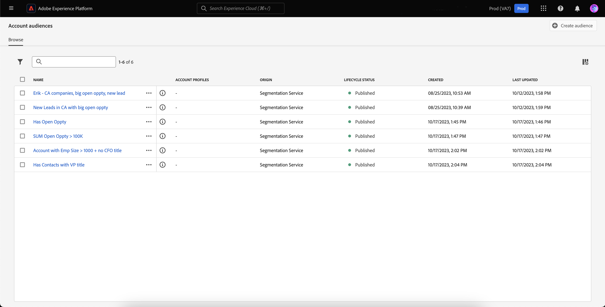
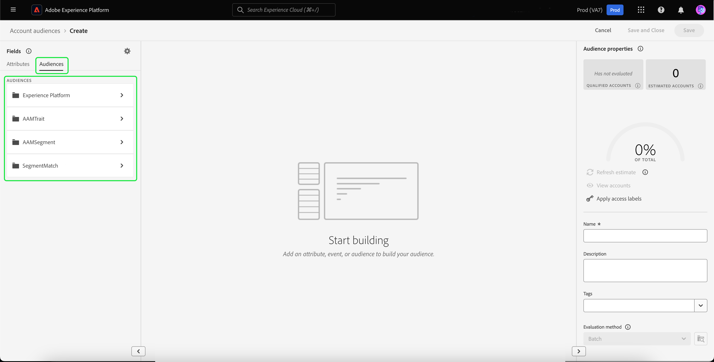
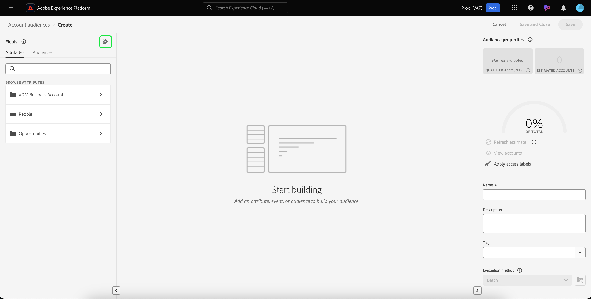

# Públicos-alvo da conta

>[!AVAILABILITY]
>
>Os públicos da conta só estão disponíveis no [B2B edition do Real-Time Customer Data Platform](../../rtcdp/overview.md#rtcdp-b2b) e na [B2P Edition do Real-Time Customer Data Platform](../../rtcdp/overview.md#rtcdp-b2p).

Com a segmentação de conta, o Adobe Experience Platform permite que você ofereça a total facilidade e sofisticação da experiência de segmentação de marketing de públicos com base em pessoas para públicos com base em conta.

Os públicos da conta podem ser usados como uma entrada para destinos baseados em conta, permitindo direcionar as pessoas nessas contas nos serviços downstream. Por exemplo, você pode usar públicos baseados em conta para recuperar registros de todas as contas que **não** têm informações de contato de qualquer pessoa com o título Diretor de Operações (COO) ou Diretor de Marketing (CMO).

>[!NOTE]
>
>Como parte da atualização da arquitetura B2B, as estimativas de tamanho do público-alvo para públicos-alvo com entidades B2B agora são calculadas com precisão exata. Essas estimativas estão disponíveis durante a pré-visualização e fornecem insights mais precisos e confiáveis para públicos-alvo que envolvem relacionamentos B2B complexos.  Para obter mais informações, leia a [visão geral das atualizações da arquitetura do Real-Time CDP B2B edition](../../rtcdp/b2b-architecture-upgrade.md).

## Terminologia {#terminology}

Antes de começar a usar públicos-alvo de conta, analise as diferenças entre os diferentes tipos de público-alvo:

- **Públicos-alvo da conta**: um público-alvo da conta é um público-alvo criado por meio dos dados de perfil da **conta**. Os dados do perfil da conta podem ser usados para criar públicos-alvo que segmentem as pessoas nas contas downstream. Para obter mais informações sobre perfis de conta, leia a [visão geral do perfil da conta](../../rtcdp/accounts/account-profile-overview.md).
- **Públicos-alvo de pessoas**: um público-alvo de pessoas é um público-alvo criado pelos dados de perfil do **cliente**. Os dados do perfil do cliente podem ser usados para criar públicos-alvo que direcionem a clientela da sua empresa. Para obter mais informações sobre perfis de clientes, leia a [Visão geral do Perfil do cliente em tempo real](../../profile/home.md).
- **Públicos-alvo de prospecto**: um público-alvo de prospecto é um público-alvo criado com os dados de perfil do **prospecto**. Os dados de perfil de cliente potencial podem ser usados para criar públicos-alvo de usuários não autenticados. Para obter mais informações sobre perfis de clientes potenciais, leia a [visão geral do perfil de clientes potenciais](../../profile/ui/prospect-profile.md).

## Acesso {#access}

Para acessar públicos-alvo da conta, selecione **[!UICONTROL Audiences]** na seção **[!UICONTROL Accounts]**.

A página [!UICONTROL Browse] é exibida, mostrando uma lista de todos os públicos-alvo da conta da organização.

Essa exibição lista informações sobre o público-alvo, incluindo nome, contagem de perfis, origem, status do ciclo de vida, data de criação e data da última atualização.

Você também pode usar a funcionalidade de pesquisa e filtragem para pesquisar e classificar rapidamente por públicos-alvo específicos da conta. Mais informações sobre este recurso podem ser encontradas na [Visão geral do Portal de Público](../ui/audience-portal.md#manage-audiences).

## Criar público-alvo {#create}

>[!NOTE]
>
>Os públicos-alvo da conta são avaliados usando a segmentação **batch** e serão avaliados a cada 24 horas.

Para criar um público-alvo para a conta, selecione **[!UICONTROL Create audience]** na página [!UICONTROL Browse].

![O botão [!UICONTROL Create audience] está realçado na página de navegação do público-alvo da conta.](../images/types/account/select-create-audience.png)

O Construtor de segmentos é exibido. Os atributos e os públicos-alvo da conta são exibidos na barra de navegação esquerda. Na guia [!UICONTROL Attributes], é possível adicionar atributos criados e personalizados pela Experience Platform.

Na guia [!UICONTROL Audiences], é possível adicionar públicos-alvo com base em pessoas criados anteriormente para serem construídos ao criar o público-alvo da sua própria conta.

Para obter mais informações sobre como usar o Construtor de segmentos, leia o [Guia da interface do Construtor de segmentos](../ui/segment-builder.md).

### Estabelecer relacionamentos {#relationships}

Por padrão, para públicos-alvo da conta, a interface do construtor de segmentos exibe o relacionamento direto entre uma conta e uma pessoa. No entanto, outros tipos de relacionamento estão disponíveis para públicos-alvo da conta.

Para usar tipos de relações alternativas, selecione .

Na guia [!UICONTROL Settings], selecione **[!UICONTROL Show relationship selectors]** na seção **[!UICONTROL Relationship of fields]**.

Selecione  novamente para retornar à guia [!UICONTROL Fields]. Agora você pode ver a seção **[!UICONTROL Establish relationships]**, que permite estabelecer como a conta está conectada à pessoa e como a pessoa está conectada à oportunidade.

Ao conectar a conta à pessoa, você pode escolher entre as seguintes opções:

| Opção | Descrição |
| ------ | ----------- |
| Relacionamento direto | A conexão direta entre a conta e a pessoa. Especifica a quais contas cada pessoa está vinculada por meio da matriz de valores `accountID` na matriz `personComponents` no esquema de pessoa. Este caminho é o mais usado. |
| Relação conta-pessoa | A relação entre a conta e a pessoa, que é definida pelo objeto `accountPersonRelation`. Esse caminho também permite que cada pessoa seja conectada a várias contas. É usada quando sua organização define uma tabela de relação explícita a partir dos dados de origem. |
| Relação oportunidade-pessoa | A relação entre a oportunidade e a pessoa, que é definida pelo objeto `opportunityPersonRelation`. Isso conecta a pessoa a uma conta indo da oportunidade-pessoa para a oportunidade para a conta. Isso permite descrever em quais empresas a pessoa está associada às oportunidades. |

Ao conectar a oportunidade à pessoa, você pode escolher entre as seguintes opções:

| Opção | Descrição |
| ------ | ----------- |
| Conta | A conexão direta entre a conta e a oportunidade. Quando você usa isso em um público-alvo de conta, esse caminho conecta todas as pessoas na empresa à oportunidade. |
| Relação oportunidade-pessoa | A relação entre a oportunidade e a pessoa, que se baseia no objeto oportunidade-pessoa. Esse caminho conecta somente as pessoas que foram especificamente identificadas como envolvidas em uma oportunidade a essa oportunidade. |

Depois de estabelecer o relacionamento desejado, é possível adicionar os públicos-alvo de pessoas necessários à definição do segmento.

## Ativar público-alvo {#activate}

>[!NOTE]
>
>Somente um número limitado de destinos oferece suporte a públicos-alvo de contas. Verifique se o destino que você deseja ativar é compatível com os públicos-alvo da conta antes de continuar esse processo.

Depois de criar o público-alvo da sua conta, você pode ativá-lo para outros serviços downstream.

Selecione o público-alvo que você deseja ativar, seguido de **[!UICONTROL Activate to destination]**.

![O botão [!UICONTROL Activate to destination] está realçado no menu de ações rápidas para o público-alvo selecionado.](../images/types/account/activate.png)

A página [!UICONTROL Activate destination] é exibida. Para obter mais informações sobre o processo de ativação, incluindo destinos com suporte e detalhes sobre mapeamentos de campos, leia o tutorial [ativar públicos-alvo da conta](/help/destinations/ui/activate-account-audiences.md).

## Próximas etapas {#next-steps}

Depois de ler este guia, você compreenderá melhor como criar e usar os públicos-alvo da sua conta no Adobe Experience Platform. Para saber como usar outros tipos de público-alvo no Experience Platform, leia a [visão geral sobre o tipo de público-alvo](./overview.md).

## Apêndice {#appendix}

A seção a seguir fornece informações adicionais sobre os públicos-alvo da conta.

### Validação da segmentação de conta {#validation}

>[!CONTEXTUALHELP]
>id="platform_audiences_account_constraint_eventLookbackWindow"
>title="Janela de retrospectiva"
>abstract="Use a janela de retrospectiva para exibir o histórico completo de eventos no nível da pessoa."

>[!CONTEXTUALHELP]
>id="platform_audiences_account_constraint_combinationMaxDepth"
>title="Erro de profundidade máxima de container aninhado"
>abstract="A profundidade máxima de containers aninhados é de **5**. Isso significa que você **não pode** ter mais de cinco containers aninhados ao criar seu público-alvo."

>[!CONTEXTUALHELP]
>id="platform_audiences_account_constraint_combinationMaxBreadth"
>title="Erro de valor máximo de regras"
>abstract="O número máximo de regras em um único container é **5**. Isso significa que você **não pode** ter mais de cinco regras em um único container ao criar seu público-alvo."

>[!CONTEXTUALHELP]
>id="platform_audiences_account_constraint_crossEntityMaxDepth"
>title="Erro de valor máximo de entidade cruzada"
>abstract="O número máximo de entidades cruzadas que podem ser usadas em um único público-alvo é **5**. Uma entidade cruzada é quando você altera entre entidades diferentes no seu público-alvo. Por exemplo, ir de uma Conta para uma Pessoa e de lá para uma Lista de marketing."

>[!CONTEXTUALHELP]
>id="platform_audiences_account_constraint_allowCustomEntity"
>title="Erro de entidade personalizada"
>abstract="Entidades personalizadas **não** são permitidas."

>[!CONTEXTUALHELP]
>id="platform_audiences_account_constraint_b2bBuiltInEntities"
>title="Erro de entidade B2B inválida"
>abstract="Somente as seguintes entidades B2B podem ser usadas: `_xdm.context.account`, `_xdm.content.opportunity`, `_xdm.context.profile`, `_xdm.context.experienceevent`, `_xdm.context.account-person`, `_xdm.classes.opportunity-person`, `_xdm.classes.marketing-list-member`, `_xdm.classes.marketing-list`, `_xdm.context.campaign-member` e `_xdm.classes.campaign`."

>[!CONTEXTUALHELP]
>id="platform_audiences_account_constraint_rhsMaxOptions"
>title="Erro de valores máximos"
>abstract="O número máximo de valores que podem ser verificados para um único campo é **50**."

>[!CONTEXTUALHELP]
>id="platform_audiences_account_constraint_allowInSegmentByReference"
>title="Erro de evento inSegment"
>abstract="Eventos inSegment **não** são permitidos."

>[!CONTEXTUALHELP]
>id="platform_audiences_account_constraint_allowInSegmentByValue"
>title="Erro de evento inSegment"
>abstract="Eventos inSegment **não** são permitidos."

>[!CONTEXTUALHELP]
>id="platform_audiences_account_constraint_allowSequentialEvents"
>title="Erro de eventos sequenciais"
>abstract="Eventos sequenciais **não** são permitidos."

>[!CONTEXTUALHELP]
>id="platform_audiences_account_constraint_allowMaps"
>title="Erro de propriedade do tipo mapa"
>abstract="Propriedades do tipo mapa **não** são permitidas."

>[!CONTEXTUALHELP]
>id="platform_audiences_account_constraint_maxNestedAggregationDepth"
>title="Erro de profundidade máxima de entidade aninhada"
>abstract="A profundidade máxima de matrizes aninhadas é **5**."

>[!CONTEXTUALHELP]
>id="platform_audiences_account_constraint_maxObjectNestingLevel"
>title="Erro de quantidade máxima de objetos aninhados"
>abstract="O número máximo de objetos aninhados permitido é **10**."

>[!CONTEXTUALHELP]
>id="platform_audiences_account_constraint_generic"
>title="Violação de restrição"
>abstract="O público-alvo viola uma restrição. Leia o documento vinculado para obter mais detalhes."

Ao usar públicos da conta, o público-alvo **deve** estar em conformidade com as seguintes restrições:

- A profundidade máxima de contêineres aninhados é **5**.
   - Isso significa que você **não pode** ter mais de cinco containers aninhados ao criar seu público-alvo.
- O número máximo de regras em um único contêiner é **5**.
   - Isso significa que seu público-alvo **não pode** ter mais de cinco regras que compõem seu público-alvo.
- O número máximo de entidades cruzadas que podem ser usadas é **5**.
   - Uma entidade cruzada é quando você altera entre entidades diferentes no seu público-alvo. Por exemplo, ir de uma Conta para uma Pessoa e de lá para uma Lista de marketing.
- O número máximo de valores que podem ser verificados para um único campo é **50**.
   - Por exemplo, se você tiver um campo de &quot;Nome da cidade&quot;, será possível verificar esse valor em relação a 50 nomes de cidade.
- Públicos-alvo da conta **não podem** usar mapas.
- Públicos-alvo da conta **não podem** usar eventos.
- A profundidade máxima de matrizes aninhadas é **5**.
- O número máximo de objetos aninhados é **10**.

<!-- - The maximum lookback window for Experience Events is **30 days**. -->
<!-- - Account audiences **cannot** use `inSegment` events. -->
<!-- - Custom entities **cannot** be used. -->