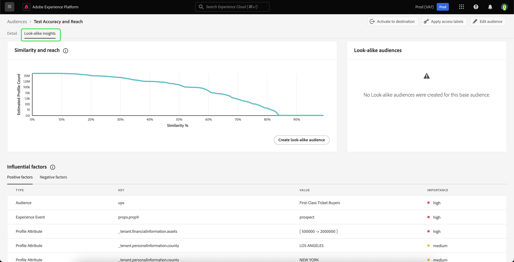

# Guia de públicos-alvo semelhantes

>[!IMPORTANT]
>
>Insights semelhantes e públicos semelhantes são desativados automaticamente para ambientes que mostram baixo uso. Baixa utilização é definida como não visualizar insights semelhantes nos últimos três meses ou não criar um novo público-alvo semelhante para os últimos seis meses.
>
>Se os Insights semelhantes estiverem desativados para o seu ambiente, você poderá solicitar acesso enviando um email para a equipe de Atendimento ao cliente da Adobe, incluindo a ID da organização e os detalhes do ambiente na mensagem.
>
>Depois de receber a confirmação do Atendimento ao cliente da Adobe, insights e públicos semelhantes serão ativados em todas as sandboxes em seu ambiente.

No Adobe Experience Platform, os públicos-alvo semelhantes fornecem insights inteligentes sobre cada um dos públicos-alvo, aproveitando insights baseados em aprendizado de máquina para identificar e direcionar clientes de alto valor com suas campanhas de marketing.

Com Públicos-alvo semelhantes, você pode criar públicos-alvo expandidos que direcionem clientes semelhantes aos seus públicos-alvo de alto desempenho ou clientes-alvo semelhantes aos públicos-alvo convertidos anteriormente.

## Terminologia {#terminology}

Antes de começar a usar públicos-alvo semelhantes, compreenda os seguintes conceitos:

- **Público-alvo base**: o público-alvo base é aquele sobre o qual você deseja obter mais informações. Este é o público no qual o modelo semelhante é **baseado**.
- **Modelo semelhante**: um modelo semelhante é um modelo de aprendizado de máquina treinado em cada público-alvo qualificado sem nenhuma entrada do cliente. Cada modelo semelhante cria os fatores influentes e gráficos de similaridade. Um modelo semelhante **não** recebe pontuação.
- **Público-alvo semelhante**: um público-alvo semelhante é aquele criado quando um modelo semelhante com um limite de similaridade selecionado é aplicado ao público-alvo básico. Você pode criar vários públicos-alvo semelhantes usando o mesmo modelo semelhante. O público-alvo semelhante é o que recebe a pontuação.
- **Tamanho total do público-alvo endereçável**: o tamanho total do público-alvo endereçável é o número total de perfis nos últimos 30 dias menos a população base do público-alvo nos últimos 30 dias. Por exemplo, se um cliente tiver 10 milhões de perfis nos últimos 30 dias e o público base tiver 1 milhão de perfis nos últimos 30 dias, o tamanho total do público endereçável será de 9 milhões de perfis.

## Elegibilidade {#eligibility}

Para usar insights semelhantes, o público base **deve** atender aos seguintes critérios de qualificação:

- A audiência base **deve** ser criada no Experience Platform.
   - Públicos gerados externamente **não** qualificados para insights semelhantes.
- O público-alvo base **deve** estar na política de mesclagem padrão.
- O público base **deve** não usar campos restritos pela governança de dados.

## Detalhes do modelo semelhante {#details}

>[!CONTEXTUALHELP]
>id="platform_audiences_lookAlike_notEligible"
>title="Não elegível"
>abstract="No momento, esse público-alvo não está elegível para insights semelhantes, pois pode ter menos do que o número mínimo de perfis necessários para treinamento ou a exportação de perfis ainda não foi acionada."

>[!CONTEXTUALHELP]
>id="platform_audiences_lookAlike_processing"
>title="Processamento"
>abstract="Este público-alvo está sendo processado. O modelo pode levar até 24 horas para concluir o processamento. Verifique novamente mais tarde."

>[!CONTEXTUALHELP]
>id="platform_audiences_lookAlike_error"
>title="Erro"
>abstract="Ocorreu um erro ao processar este modelo. Exclua e recrie esse modelo ou tente novamente mais tarde."

No Adobe Experience Platform, o modelo semelhante consome três tipos diferentes de pontos de dados:

- Associação de público-alvo nos últimos 30 dias
- Eventos de experiência dos últimos 30 dias que foram assimilados no Perfil do cliente em tempo real
- Atributos de perfil nos últimos 30 dias que foram assimilados no Perfil do cliente em tempo real

Todos esses pontos de dados são transformados em pares de valores principais que são alimentados no modelo semelhante. Somente os pares de valores principais com uma porcentagem significativa de perfis correspondentes serão mantidos.

No momento, o modelo semelhante é executado a cada 24 horas, criando e recriando os fatores influentes e gráficos de similaridade para os públicos-alvo básicos. A pontuação para públicos-alvo semelhantes também é executada com frequência.

## Direitos {#entitlements}

Os seguintes direitos se aplicam ao uso de públicos-alvo semelhantes:

- Os clientes do Real-Time CDP Prime têm direito a **5** públicos semelhantes ativos em sandboxes de produção
- Os clientes do Real-Time CDP Ultimate têm direito a **20** públicos semelhantes ativos em sandboxes de produção
- As sandboxes de desenvolvimento estão limitadas a **5** públicos semelhantes para todos os clientes do Real-Time CDP

Os pacotes complementares, que estarão disponíveis posteriormente, aumentam os direitos para sandboxes de produção em 20 públicos semelhantes por pacote.

## Acesso {#access}

Para confirmar se você tem acesso a públicos-alvo semelhantes, selecione qualquer público-alvo no Portal de público-alvo e verifique se a guia **[!UICONTROL Look-alike insights]** está visível.

## Exibir insights semelhantes {#view}

Os insights semelhantes são incorporados à página de detalhes do público-alvo. Para analisar os insights semelhantes de um público, selecione **[!UICONTROL Audiences]** na barra de navegação à esquerda, seguido por **[!UICONTROL Browse]**, e o público para o qual deseja exibir os insights.

A página de detalhes do público-alvo é exibida. Selecione a guia **[!UICONTROL Look-alike insights]** para exibir os insights semelhantes do público-alvo. A página **[!UICONTROL Look-alike insights]** é exibida. Esta página tem três elementos principais: o gráfico de similaridade e alcance, os públicos semelhantes e os fatores influentes.

### Similaridade e alcance {#similarity-and-reach}

>[!CONTEXTUALHELP]
>id="platform_audiences_lookAlike_similarityAndReach"
>title="Similaridade e alcance"
>abstract="O gráfico de similaridade e alcance representa o alcance esperado de um Público-alvo semelhante que consiste em perfis acima de uma pontuação de similaridade fornecida. É possível passar o mouse sobre um ponto específico do gráfico para exibir a porcentagem de similaridade e a contagem de perfis esperada para o ponto destacado no momento."

A seção similaridade e alcance exibe um gráfico que representa o alcance esperado de um público-alvo semelhante que consiste em perfis acima de uma pontuação de similaridade fornecida. A pontuação de similaridade representa a **distância** de similaridade entre o perfil básico do público-alvo e o perfil semelhante do insight.

Nesse gráfico, o eixo x mede a porcentagem de similaridade entre um perfil e os membros do público-alvo selecionado. A pontuação de similaridade varia de 0% a 100%, com uma pontuação de similaridade maior indicando que um perfil está mais próximo, em termos de valores de fatores influentes, dos membros do público selecionado.

O eixo y mostra a contagem esperada de perfis com o percentual de similaridade que corresponde ao valor correspondente do eixo x. Essa contagem esperada de perfis varia de 0 ao tamanho total do público-alvo endereçável ou 25 milhões de perfis, o que for menor. Este eixo é medido em uma **escala logarítmica** para melhorar a legibilidade do gráfico.

Observe que o gráfico é **cumulativo** da direita para a esquerda. Isso significa que em qualquer ponto do gráfico, o valor do eixo y é o número de perfis que têm uma similaridade **acima** do limite de similaridade. Por exemplo, se o eixo x estiver em 60% e o eixo y estiver em 10 milhões, isso significa que há 10 milhões de perfis com uma similaridade em ou acima de 60% para o público base.

É possível passar o mouse sobre um ponto específico do gráfico para exibir a porcentagem de similaridade e a contagem de perfis esperada para o ponto destacado no momento.

### Públicos-alvo semelhantes {#list}

A seção Públicos-alvo semelhantes exibe uma lista de todos os públicos-alvo semelhantes criados anteriormente para o público-alvo básico selecionado.

### Fatores influentes {#influential-factors}

>[!CONTEXTUALHELP]
>id="platform_audiences_lookAlike_influentialFactors"
>title="Fatores influentes"
>abstract="Fatores influentes são atributos, eventos e associações de público-alvo que são importantes para explicar a similaridade de um perfil aos membros do público-alvo básico. Políticas e rótulos de uso de dados podem ser usados para impedir que determinados dados sejam considerados como fatores influentes em modelos semelhantes."
>additional-url="https://experienceleague.adobe.com/docs/experience-platform/segmentation/types/lookalike-audiences.html?lang=pt-BR#exclude" text="Excluir dados"

A seção Fatores influentes exibe os 100 principais fatores que influenciam o modelo semelhante para o público-alvo básico selecionado. Esses fatores influentes são os atributos do perfil, os eventos de experiência e as associações de público-alvo que são os mais importantes para explicar as semelhanças no público-alvo básico. Compreender os principais fatores influentes permite personalizar melhor seu conteúdo de marketing para esse público-alvo e qualquer público semelhante que você criar a partir dele. Observe que nem todos os fatores influentes que afetam o modelo semelhante serão exibidos.

Para fatores influentes que são numéricos, os pares de valores principais podem ser colocados em compartimentos, dependendo do número de valores diferentes que a chave tem. Por exemplo, se você tiver uma chave de `income`, provavelmente haverá muitos valores únicos. Como resultado, os pares de valores principais serão colocados em compartimentos que podem se parecer com `income=[0 -> 30000]`, `income=[30000 -> 50000]` e `income=[50000 -> 100000]`.

Esses buckets são recalculados regularmente para garantir que os dados sejam mantidos atualizados.

>[!NOTE]
>
>Os fatores influentes são ordenados por ordem de importância e são independentes uns dos outros.

| Campo | Descrição |
| ----- | ----------- |
| Tipo | O tipo de dados do qual o fator influente é derivado. Pode ser um atributo de perfil, um evento de experiência ou uma associação de público-alvo. |
| Chave | O nome do campo de dados. Para chaves do tipo de associação de público, esse valor representa o **namespace** do público-alvo de onde os dados vêm. Os valores possíveis incluem `ups` (Serviço de segmentação) e `AO` (Orquestração de público). Para chaves de outros tipos, esse valor representa o caminho do campo XDM. Por exemplo, se a empresa Luma tiver um campo personalizado chamado receita, a chave será `_luma.income` |
| Valor | O valor varia dependendo do fator influente que ele representa. Para atributos de perfil ou eventos de experiência, esse campo representa o valor ou o intervalo de valores do campo de dados que indica a similaridade com os membros do público-alvo base. O intervalo de valores é gravado no formato `[A -> B]`, onde `A` representa o intervalo inferior, enquanto `B` representa o intervalo superior. Para associações de público, esse campo é o nome do público. |
| Importância | O nível relativo de importância do fator influente. Pode ser alto, médio ou baixo. |

## Criar um público-alvo semelhante {#create}

>[!IMPORTANT]
>
>Você **não pode** usar um público-alvo semelhante como o público-alvo base de outro público semelhante. Ou seja, você **não** pode criar públicos semelhantes encadeados.

Para criar um público-alvo semelhante, será necessário selecionar o público-alvo do qual deseja basear o público semelhante. Para acessar sua lista de públicos disponíveis, selecione **[!UICONTROL Audiences]** na barra de navegação esquerda, seguido por **[!UICONTROL Browse]**. A lista de públicos-alvo é exibida. Nesta página, você pode selecionar o público-alvo que deseja usar como público-alvo base.

Na página de detalhes do público-alvo, selecione **[!UICONTROL Create look-alike audience]** para iniciar o processo de criação de um público-alvo semelhante.

![O botão [!UICONTROL Create look-alike audience] está realçado.](../images/types/lookalike/create-look-alike-audience.png)

O popover **[!UICONTROL Create a look-alike audience]** é exibido. Nessa página, é possível definir a porcentagem de similaridade para o público-alvo semelhante.

![O popover [!UICONTROL Create a look-alike audience] é exibido.](../images/types/lookalike/create-audience.png)

Você pode definir essa porcentagem de similaridade de três maneiras diferentes:

- Mova o controle deslizante para definir a porcentagem de similaridade
- Digite a porcentagem de similaridade na caixa de entrada numérica ao lado do controle deslizante
- Passe o mouse sobre o gráfico e selecione o local desejado para definir a porcentagem de similaridade

Você também pode atualizar detalhes sobre o público-alvo semelhante, incluindo o nome e a descrição. Por padrão, o nome do público-alvo semelhante será gerado com base no nome do público-alvo base e na porcentagem de similaridade especificada anteriormente.

![As informações básicas estão realçadas no popover [!UICONTROL Create a look-alike audience].](../images/types/lookalike/basic-info.png)

Selecione **[!UICONTROL Create]** para concluir a criação do seu público-alvo semelhante.

![O botão Criar está realçado dentro do popover [!UICONTROL Create a look-alike audience].](../images/types/lookalike/create-audience.png)

O público-alvo semelhante recém-criado pode ser acessado na seção **[!UICONTROL Look-alike audiences]** da página de detalhes do público-alvo e também está disponível no Portal de público-alvo e para outros usos downstream. Observe que levará algum tempo para que o público-alvo semelhante seja pontuado. Até que seja pontuada, a contagem de perfis parecerá ser 0.

## Exibir detalhes do público-alvo semelhante {#view-details}

Para exibir detalhes de um público-alvo semelhante, selecione-o na seção **[!UICONTROL Look-alike audiences]** do público-alvo base.

A página de detalhes do público-alvo é exibida. Para obter mais informações sobre esta página, leia a [seção de detalhes do público-alvo da visão geral do Portal de público](../ui/audience-portal.md#audience-details).

## Excluir campos de dados da modelagem semelhante {#exclude}

>[!IMPORTANT]
>
> **Você** é responsável por garantir que os dados, incluindo os dados confidenciais, sejam rotulados adequadamente e que as políticas de uso de dados tenham sido definidas e habilitadas para cumprir as obrigações legais e regulamentares sob as quais você opera. Você também deve estar ciente de que os campos de dados ou associações de segmento que **não** estão diretamente correlacionados com campos de dados normalmente associados a tipos de dados confidenciais ou protegidos podem ser uma fonte de potencial viés. **Você** é responsável pela análise dos seus dados para identificar, rotular e aplicar as políticas de uso de dados apropriadas aos seus dados, incluindo todos os campos de dados que possam servir de proxy para tipos de dados confidenciais ou protegidos e devem ser excluídos da modelagem.

Os públicos-alvo semelhantes podem ser configurados para excluir campos de dados restritos para a ação de marketing &quot;Ciência de dados&quot; aplicando os rótulos e as políticas de uso de dados relevantes. Os dados rotulados como restritos de uso para ciência de dados serão removidos da consideração ao treinar um modelo de público-alvo semelhante e ao gerar um público semelhante do modelo treinado. 

>[!NOTE]
>
>As alterações nos rótulos de uso de dados no público-alvo base podem levar até 48 horas para entrarem em vigor.

O rótulo &quot;C9&quot; padrão pode ser usado para rotular dados que não devem ser usados para ciência de dados e pode ser aplicado ativando a política &quot;Restringir ciência de dados&quot; padrão. Você também pode criar políticas adicionais para restringir o uso de dados com outros rótulos, incluindo rótulos confidenciais, para ciência de dados. Para obter mais informações sobre como gerenciar políticas de uso de dados, leia o [guia da interface do usuário de políticas de uso de dados](../../data-governance/policies/user-guide.md). Para obter mais informações sobre como gerenciar rótulos de uso de dados, leia o [guia da interface do usuário de rótulos de uso de dados](../../data-governance/labels/user-guide.md).

Por padrão, se um público-alvo base não tiver rótulos de contrato, o processo de modelagem de públicos-alvo semelhantes excluirá **qualquer** campo, conjunto de dados ou público-alvo com base na política de privacidade habilitada para sua organização.

## Próximas etapas

Depois de ler este guia, você aprendeu a visualizar insights semelhantes e criar públicos semelhantes com base nesses insights. Para obter mais informações sobre públicos na interface do Adobe Experience Platform, leia o [Guia da interface do usuário do Serviço de segmentação](./overview.md).
