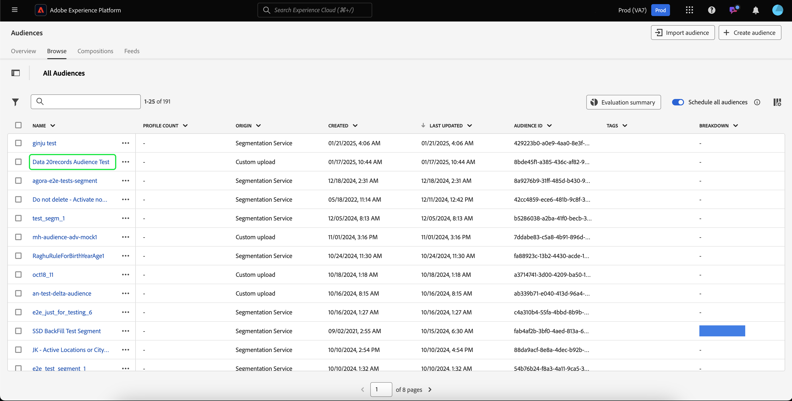

# Guia de públicos-alvo de pessoas

No Adobe Experience Platform, públicos com base em pessoas permitem que você direcione grupos específicos de pessoas para suas campanhas de marketing.

Os públicos-alvo do usam os dados de perfil do cliente para direcionar mercados específicos, permitindo direcionar melhor os dados demográficos específicos que você deseja anunciar.

## Terminologia {#terminology}

Antes de começar a usar o público-alvo de pessoas, analise as diferenças entre os diferentes tipos de público-alvo:

- **Públicos-alvo da conta**: um público-alvo da conta é um público-alvo criado por meio dos dados de perfil da **conta**. Os dados do perfil da conta podem ser usados para criar públicos-alvo que segmentem as pessoas nas contas downstream. Para obter mais informações sobre os públicos-alvo da conta, leia a [visão geral do público-alvo da conta](./account-audiences.md).
- **Públicos-alvo de pessoas**: um público-alvo de pessoas é um público-alvo criado pelos dados de perfil do **cliente**. Os dados do perfil do cliente podem ser usados para criar públicos-alvo que direcionem a clientela da sua empresa.
- **Públicos-alvo de prospecto**: um público-alvo de prospecto é um público-alvo criado com os dados de perfil do **prospecto**. Os dados de perfil de cliente potencial podem ser usados para criar públicos-alvo de usuários não autenticados. Para obter mais informações sobre públicos-alvo de clientes potenciais, leia a [visão geral sobre públicos-alvo de clientes potenciais](./prospect-audiences.md).

## Acesso {#access}

Para acessar públicos de pessoas, selecione **[!UICONTROL Públicos-alvo]** na seção **[!UICONTROL Clientes]**.

O Portal de público-alvo é exibido, mostrando uma lista de todos os públicos-alvo de pessoas da organização.

Essa exibição lista informações sobre o público-alvo, incluindo nome, contagem de perfis, origem, status do ciclo de vida, data de criação e data da última atualização.

Você também pode usar a funcionalidade de pesquisa e filtragem para pesquisar e classificar rapidamente por públicos-alvo específicos da conta. Mais informações sobre este recurso podem ser encontradas na [Visão geral do Portal de Público](../ui/audience-portal.md#manage-audiences).

## Detalhes do público-alvo {#details}

Para exibir detalhes sobre um público-alvo de pessoas específico, selecione um público-alvo no Audience Portal.

A página de detalhes do público-alvo é exibida. As informações, incluindo descrição, origem e estado do ciclo de vida, são exibidas.

Para obter mais informações sobre a página de detalhes do público, leia a [seção de detalhes do público-alvo da visão geral do Portal de público](../ui/audience-portal.md#audience-details).

## Criar público-alvo {#create}

Você pode criar um público-alvo de pessoas usando o Audience Composer ou o Construtor de segmentos. Para começar a criar um público-alvo de pessoas, selecione Criar público-alvo no Portal de público-alvo.

Um popover é exibido, permitindo que você escolha entre compor um público-alvo ou criar regras.

Para obter informações mais detalhadas sobre como criar públicos, leia a [Visão geral do Portal de público-alvo](../ui/audience-portal.md#create-audience).

## Ativar público-alvo {#activate}

Depois de criar seu público-alvo de pessoas, você pode ativá-lo para outros serviços downstream.

Selecione o público que você deseja ativar, seguido por **[!UICONTROL Ativar para destino]**.

A página [!UICONTROL Ativar destino] é exibida, com a lista de destinos disponíveis dependendo da frequência de atualização do público-alvo. Para obter mais informações sobre o processo de ativação, leia a [visão geral da ativação](../../destinations/ui/activation-overview.md).

## Próximas etapas

Depois de ler este guia, você sabe como criar e gerenciar públicos-alvo de pessoas no Adobe Experience Platform. Para saber mais sobre os diferentes tipos de públicos, leia a [visão geral sobre tipos de públicos-alvo](./overview.md).
