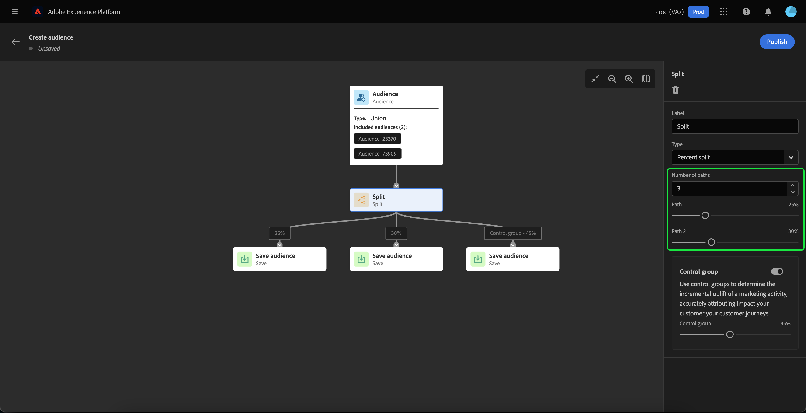

# Guia da interface do usuário do Audience Builder

>[!IMPORTANT]
>
>O Audience Builder está atualmente na versão beta e não está disponível para todos os usuários. A documentação e a funcionalidade estão sujeitas a alterações.

O Audience Builder fornece um espaço de trabalho para criar e editar públicos, usando blocos usados para representar ações diferentes.

A tela de composição do público-alvo é composta por cinco tipos diferentes de blocos: **[[!UICONTROL Público]](#audience-block)**, **[[!UICONTROL Excluir]](#exclude-block)**, **[[!UICONTROL Associar-se]](#join-block)**, **[[!UICONTROL Classificação]](#rank-block)** e **[[!UICONTROL Split]](#split-block)**.

## [!UICONTROL Público-alvo] {#audience-block}

O **[!UICONTROL Público]** O tipo de bloco permite adicionar os subpúblicos-alvo que você deseja compor ao novo público-alvo maior. Por padrão, uma **[!UICONTROL Público]** é incluído na parte superior da tela de composição.

Ao selecionar a variável **[!UICONTROL Público]** , o painel direito exibe controles para rotular e adicionar públicos ao bloco.

Depois de selecionar **[!UICONTROL Adicionar público-alvo]**, uma lista de públicos-alvo é exibida. Selecione os públicos que deseja incluir, seguido de **[!UICONTROL Adicionar]** para anexá-los ao bloco de público-alvo.

Seus públicos-alvo selecionados agora aparecem no painel direito quando a variável **[!UICONTROL Público]** estiver selecionado. A partir daqui, você pode alterar o tipo de mesclagem dos públicos-alvo combinados.

| Tipo de mesclagem | Descrição |
| ---------- | ----------- |
| [!UICONTROL União] | Os públicos-alvo são combinados em um único público-alvo. Isso seria equivalente a uma operação OR. |
| [!UICONTROL Interseção] | Os públicos-alvo são combinados, somente com os públicos-alvo compartilhados em **all** dos quais foram adicionados. Isso seria equivalente a uma operação AND. |
| [!UICONTROL Excluir sobreposição] | Os públicos-alvo são combinados, somente com os públicos-alvo compartilhados em **um, mas não todos** dos quais foram adicionados. Isso seria equivalente a uma operação XOR. |

## [!UICONTROL Excluir] {#exclude-block}

O **[!UICONTROL Excluir]** O tipo de bloco permite excluir subpúblicos ou atributos especificados do novo público-alvo maior.

Para adicionar uma **[!UICONTROL Excluir]** , selecione o **+** ícone, seguido por **[!UICONTROL Excluir]**.

O **[!UICONTROL Excluir]** é adicionado. Quando este bloco é selecionado, os detalhes sobre a exclusão são exibidos no painel direito. Isso inclui o rótulo do bloco e o tipo de exclusão. Você pode excluir [por público](#exclude-audience) ou [por atributo](#exclude-attribute).

### Excluir por público-alvo {#exclude-audience}

Se você excluir por público-alvo, é possível selecionar quais públicos deseja excluir selecionando **[!UICONTROL Adicionar público-alvo]**.

Uma lista de públicos-alvo é exibida. Selecionar **[!UICONTROL Adicionar]** para adicionar os públicos-alvo que deseja excluir ao seu bloco de exclusão.

### Excluir por atributo {#exclude-attribute}

Se você excluir por atributo, é possível selecionar quais atributos deseja excluir selecionando o  no ícone **[!UICONTROL Regra de exclusão]** seção.

Uma lista de atributos de perfil é exibida. Selecione o tipo de atributo que deseja excluir, seguido de **[!UICONTROL Selecionar]** para adicioná-las ao bloco de exclusão.

## [!UICONTROL Ingressar] {#join-block}

O **[!UICONTROL Associar-se]** tipo de bloco permite adicionar públicos externos a partir de conjuntos de dados que ainda não foram processados pelo Adobe Experience Platform.

Para adicionar uma **[!UICONTROL Associar-se]** , selecione o **+** ícone, seguido por **[!UICONTROL Associar-se]**.

Ao selecionar o bloco, os detalhes sobre a associação são mostrados no painel direito, incluindo o rótulo do bloco e a opção para adicionar públicos ao conjunto de dados de enriquecimento.

Depois de selecionar **[!UICONTROL Adicionar público-alvo]**, uma lista de públicos-alvo é exibida. Selecione os públicos que deseja incluir, seguido de **[!UICONTROL Adicionar]** para adicioná-las ao bloco de associação.

Seus públicos-alvo selecionados agora aparecem no painel direito quando a variável **[!UICONTROL Associar-se]** estiver selecionado.

## [!UICONTROL Classificação] {#rank-block}

O **[!UICONTROL Classificação]** O tipo de bloco permite classificar e classificar os públicos-alvo antes que o novo público-alvo seja publicado.

Para adicionar uma **[!UICONTROL Classificação]** , selecione o **+** ícone, seguido por **[!UICONTROL Classificação]**.

Ao selecionar o bloco, os detalhes sobre a classificação são mostrados no painel direito, incluindo o rótulo do bloco, o atributo para classificar, a ordem de classificação e um botão para limitar o número de perfis a serem classificados.

Para selecionar qual atributo deve ser classificado pelos públicos-alvo, selecione o  ícone .

Uma lista de atributos de perfil é exibida. Nesse caso, você pode selecionar o tipo de atributo pelo qual deseja classificar seu público-alvo. Selecionar **[!UICONTROL Selecionar]** para adicioná-lo ao bloco de classificação. Observe que o atributo selecionado pode **only** ser do tipo `int`.

Após selecionar o atributo, você pode selecionar a ordem para classificá-lo. Isso é em ordem crescente (do mais baixo ao mais alto) ou decrescente (do mais alto ao mais baixo).

Além disso, é possível limitar o número de públicos-alvo retornados ao ativar a **[!UICONTROL Adicionar limite de perfil]** alternar. Quando essa alternância estiver ativada, você poderá definir o número máximo de públicos-alvo retornados na variável **[!UICONTROL Perfis incluídos]** campo.

## [!UICONTROL Dividir] {#split-block}

O **[!UICONTROL Split]** tipo de bloco permite dividir o novo público em vários subpúblicos. Você pode dividir esse público-alvo com base na porcentagem ou por um atributo.

Para adicionar uma **[!UICONTROL Split]** , selecione o **+** ícone, seguido por **[!UICONTROL Split]**.

### Dividir por porcentagem {#split-percentage}

Ao dividir por porcentagem, os públicos-alvo serão divididos aleatoriamente, com base no número de caminhos e porcentagens fornecidas.

Por exemplo, você pode ter três caminhos, cada um com uma porcentagem diferente de perfis.

Além disso, você pode marcar um dos públicos-alvo divididos para ser o grupo de controle.

### Dividir por atributo {#split-attribute}

Ao dividir por atributo, os públicos-alvo serão divididos com base nos atributos fornecidos. Para selecionar o atributo que será dividido por, selecione o **[!UICONTROL Split]** , seguido pelo  ícone .

Uma lista de atributos de perfil é exibida. Selecione o tipo de atributo, seguido por **[!UICONTROL Selecionar]** para adicioná-lo ao bloco dividido.

Após selecionar o atributo , você pode escolher quais perfis pertencerão a qual subpúblico-alvo, adicionando os valores em **[!UICONTROL Valores]** campo.

Além disso, é possível ativar a variável **[!UICONTROL Outros perfis]** alterne para criar um subpúblico-alvo que inclua todos os perfis não selecionados.

## Publicar seu público

Depois de compor seu público-alvo, você pode salvá-lo e publicá-lo selecionando **[!UICONTROL Publicar]**.

Se houver erros na criação do público-alvo, será exibido um alerta informando como resolver o problema.

## Próximas etapas

O Audience Builder fornece um fluxo de trabalho avançado que permite criar públicos-alvo a partir de diferentes tipos de blocos. Para saber mais sobre outras partes da interface do usuário do serviço de segmentação, leia o [Guia do usuário do Serviço de segmentação](./overview.md).