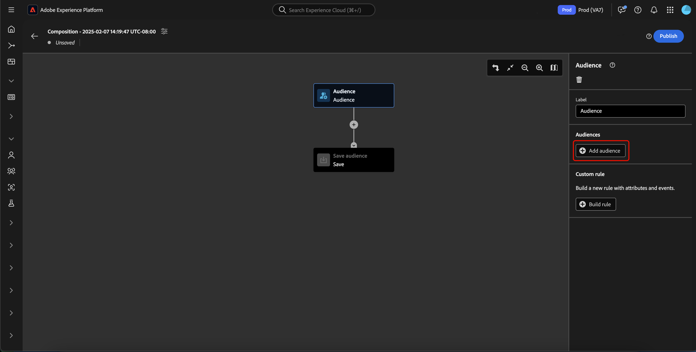
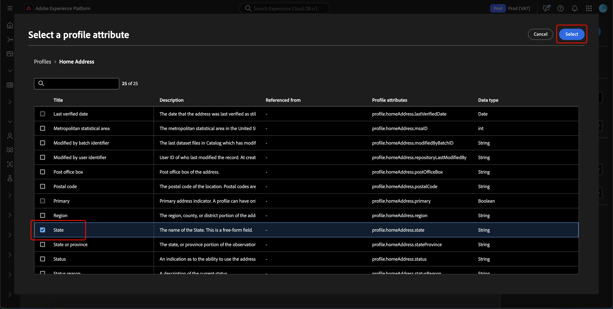
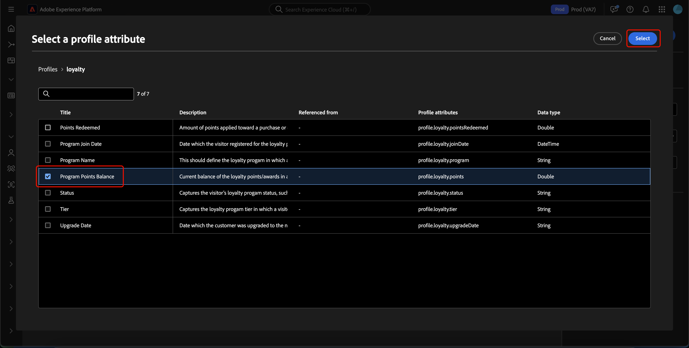
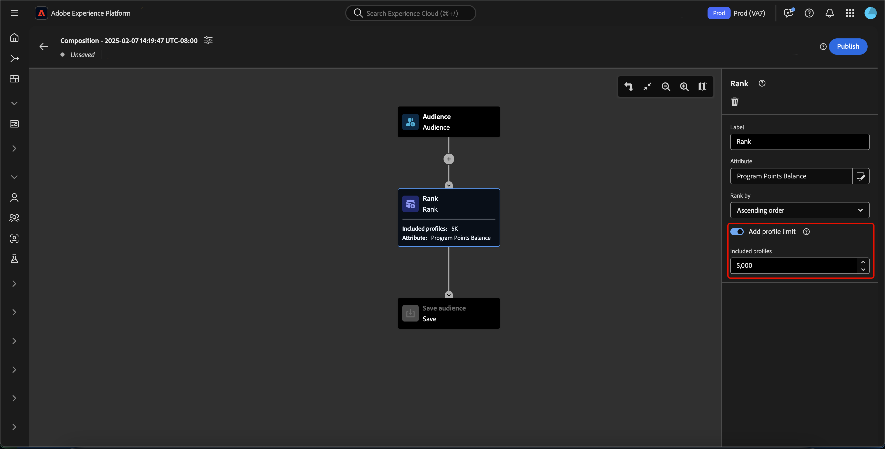
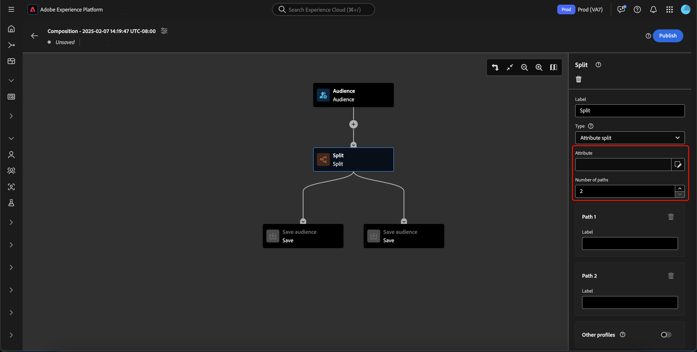
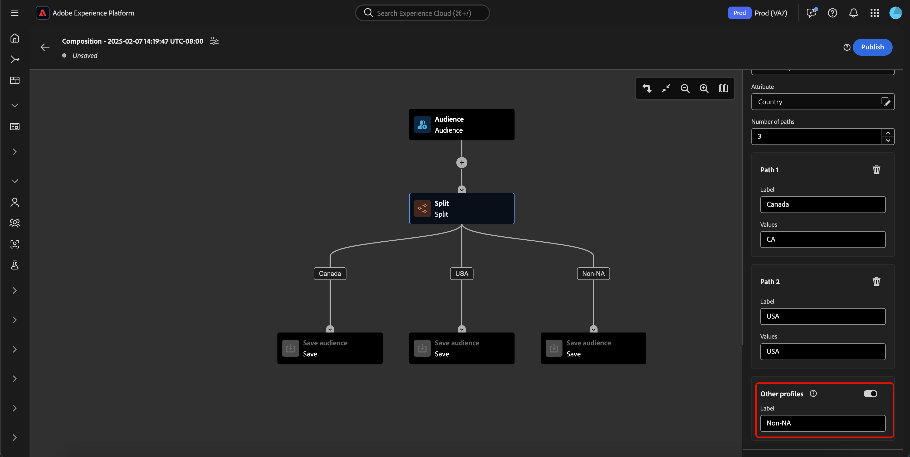

# Guia da interface do usuário da Composição de público-alvo

>[!BEGINSHADEBOX]

Se você for um cliente do Adobe Journey Optimizer, leia o [guia de composição de público-alvo](https://experienceleague.adobe.com/docs/journey-optimizer/using/audiences-profiles-identities/audiences/audience-orchestration/get-started-audience-orchestration.html?lang=pt-BR) na documentação do Adobe Journey Optimizer para obter mais informações sobre como trabalhar com a composição de público-alvo nesse contexto.

>[!ENDSHADEBOX]

>[!AVAILABILITY]
>
>Para usar esse recurso, você deve ter as seguintes permissões:
>
>- Gerenciar segmentos
>- Gerenciar perfis
>- Gerenciar políticas de mesclagem
>
>Mais informações sobre permissões no Experience Platform podem ser encontradas na [visão geral do controle de acesso](../../access-control/home.md#permissions).

>[!NOTE]
>
>Este guia explica como criar públicos-alvo usando a Composição de público-alvo. Para saber como criar públicos-alvo por meio de definições de segmento usando o Construtor de segmentos, leia o [guia da interface do Construtor de segmentos](./segment-builder.md).

A Composição de público-alvo fornece um espaço de trabalho para criar e editar públicos-alvo, usando blocos usados para representar ações diferentes.

Para alterar os detalhes da composição, incluindo o título e a descrição, selecione o botão .

O popover **[!UICONTROL Composition properties]** é exibido. Você pode inserir detalhes da sua composição, incluindo o título e a descrição aqui.

>[!NOTE]
>
>Se você **não** der um título à sua composição, ela terá um título de &quot;Composição&quot; seguido pela data e hora de criação por padrão. Além disso, cada composição **deve** ter seu próprio nome exclusivo.

Depois de atualizar os detalhes da sua composição, selecione **[!UICONTROL Save]** para confirmar essas atualizações. A tela de composição do público-alvo é exibida novamente.

A tela de composição de público é composta por quatro tipos diferentes de blocos: **[[!UICONTROL Audience]](#audience-block)**, **[[!UICONTROL Exclude]](#exclude-block)**, **[[!UICONTROL Rank]](#rank-block)** e **[[!UICONTROL Split]](#split-block)**.

## [!UICONTROL Audience] {#audience-block}

>[!CONTEXTUALHELP]
>id="platform_segmentation_ao_audience"
>title="Bloco de público-alvo"
>abstract="O bloco de público-alvo permite adicionar os públicos-alvo secundários que você deseja usar para compor seu novo público-alvo."

>[!CONTEXTUALHELP]
>id="platform_segmentation_ao_merge_types"
>title="Tipos de mesclagem"
>abstract="Os tipos de mesclagem determinam como os públicos-alvo secundários selecionados são combinados. Os valores compatíveis incluem União, Intersecção e Excluir sobreposição."

O tipo de bloco **[!UICONTROL Audience]** permite adicionar os subpúblicos que você deseja usar para compor seu novo público-alvo maior. Por padrão, um bloco **[!UICONTROL Audience]** é incluído na parte superior da tela de composição.

Ao selecionar o bloco **[!UICONTROL Audience]**, o painel direito exibe controles para rotular o público-alvo, adicionar públicos-alvo ao bloco, bem como criar regras personalizadas para o bloco de público-alvo.

>[!NOTE]
>
>Você pode adicionar públicos-alvo **ou** criar uma regra personalizada. Estas duas funcionalidades **não podem** ser usadas juntas.

### [!UICONTROL Add audience] {#add-audience}

Para adicionar públicos-alvo ao bloco Público-alvo. selecione **[!UICONTROL Add Audience]**.

>[!IMPORTANT]
>
>Observe que **somente** públicos-alvo definidos com a política de mesclagem padrão serão exibidos.
>
>Além disso, somente **públicos-alvo** publicados criados com o Construtor de segmentos podem ser usados. Públicos criados usando a Composição de público-alvo e públicos gerados externamente estão **não** disponíveis.

Uma lista de públicos-alvo é exibida. Selecione os públicos que você deseja incluir, seguido por **[!UICONTROL Add]** para anexá-los ao seu bloco de público.

Os públicos selecionados agora aparecem no painel direito quando o bloco **[!UICONTROL Audience]** é selecionado. Aqui, é possível alterar o tipo de mesclagem dos públicos-alvo combinados.

| Tipo de mesclagem | Descrição |
| ---------- | ----------- |
| [!UICONTROL Union] | Os públicos são combinados em um único público. Isso seria equivalente a uma operação OR. |
| [!UICONTROL Intersection] | Os públicos são combinados, com apenas os públicos compartilhados em **todos** sendo adicionados. Isso seria equivalente a uma operação AND. |
| [!UICONTROL Exclude overlap] | Os públicos são combinados, com apenas os públicos compartilhados em **um, mas não todos** adicionados. Isso seria o equivalente a uma operação XOR. |

### [!UICONTROL Build rule] {#build-rule}

>[!CONTEXTUALHELP]
>id="platform_segmentation_ao_rule_builder"
>title="Construtor de segmentos"
>abstract="Use o Construtor de segmentos para adicionar uma regra personalizada à sua composição."

Para adicionar uma regra personalizada ao bloco de público-alvo, selecione **[!UICONTROL Build rule]**.

O Construtor de segmentos é exibido. Você pode usar o Construtor de segmentos para criar uma regra personalizada a ser seguida pelo público-alvo. Mais informações sobre como usar o Construtor de segmentos podem ser encontradas no [guia do Construtor de segmentos](./segment-builder.md).

Depois de adicionar uma regra personalizada, selecione **[!UICONTROL Save]** para adicionar a regra ao seu público.

## [!UICONTROL Exclude] {#exclude-block}

>[!CONTEXTUALHELP]
>id="platform_segmentation_ao_exclude"
>title="Excluir bloco"
>abstract="A opção Excluir bloco permite excluir públicos-alvo ou atributos específicos da composição."

>[!CONTEXTUALHELP]
>id="platform_segmentation_ao_exclude_type"
>title="Excluir tipo"
>abstract="É possível excluir perfis que pertencem a um público-alvo específico (Excluir por público-alvo) ou excluir perfis com base em um atributo específico (Excluir por atributo)."

O tipo de bloco **[!UICONTROL Exclude]** permite excluir um subpúblico ou atributos especificados de seu novo público-alvo maior.

Para adicionar um bloco **[!UICONTROL Exclude]**, selecione o ícone **+**, seguido por **[!UICONTROL Exclude]**.

O bloco **[!UICONTROL Exclude]** foi adicionado. Quando esse bloco for selecionado, os detalhes sobre a exclusão aparecerão no painel direito. Isso inclui o rótulo do bloco e o tipo de exclusão. Você pode excluir [por público](#exclude-audience) ou [por atributo](#exclude-attribute).

### Excluir por público {#exclude-audience}

Se você excluir por público, poderá selecionar qual público deseja excluir selecionando **[!UICONTROL Add Audience]**.

![O botão [!UICONTROL Add audience] está selecionado, o que permite escolher qual público-alvo você deseja excluir.](../images/ui/audience-composition/add-excluded-audience.png)

>[!IMPORTANT]
>
>Somente **públicos-alvo** publicados criados com o Construtor de segmentos podem ser usados. Públicos criados usando a Composição de público-alvo e públicos gerados externamente estão **não** disponíveis.

Uma lista de públicos-alvo é exibida. Selecione **[!UICONTROL Add]** para adicionar o público-alvo que deseja excluir ao bloco de exclusão.

### Excluir por atributo {#exclude-attribute}

>[!CONTEXTUALHELP]
>id="platform_segmentation_ao_exclude_attribute"
>title="Excluir por atributo"
>abstract="Ao excluir por atributo, você pode excluir perfis específicos com base nos atributos selecionados para que eles não apareçam em sua composição."

Se você excluir por atributo, poderá selecionar quais atributos deseja excluir selecionando o ícone  na seção **[!UICONTROL Exclusion rule]**. Excluir o atributo permite excluir qualquer perfil que contenha esse atributo do público-alvo resultante.

Uma lista de atributos de perfil é exibida. Selecione o tipo de atributo que deseja excluir, seguido por **[!UICONTROL Select]** para adicioná-lo ao bloco de exclusão.

>[!IMPORTANT]
>
>Ao excluir por atributo, você só pode especificar **um** valor para excluir. Usar qualquer tipo de separador, como vírgula ou ponto e vírgula, resultará apenas na exclusão desse valor exato. Por exemplo, definir o valor como `red, blue` resultará na exclusão do termo `red, blue` do atributo, mas **não** resultará na exclusão do termo `red` ou `blue`.

## [!UICONTROL Enrich] {#enrich-block}

>[!CONTEXTUALHELP]
>id="platform_segmentation_ao_enrich"
>title="Enriquecer bloco"
>abstract="A opção Enriquecer bloco permite enriquecer o público-alvo com atributos adicionais provenientes de conjuntos de dados da Adobe Experience Platform."

>[!CONTEXTUALHELP]
>id="platform_segmentation_ao_dataset"
>title="Conjunto de dados de enriquecimento"
>abstract="O conjunto de dados de enriquecimento contém os dados que você deseja associar à composição."

>[!CONTEXTUALHELP]
>id="platform_segmentation_ao_enrich_criteria"
>title="Critérios de enriquecimento"
>abstract="Os critérios de enriquecimento incluem a chave de associação de origem e a chave de associação do conjunto de dados de enriquecimento. Essas duas chaves reconciliam o conjunto de dados de origem e o conjunto de dados de enriquecimento."

>[!CONTEXTUALHELP]
>id="platform_segmentation_ao_enrich_attributes"
>title="Atributos de enriquecimento"
>abstract="Os atributos de enriquecimento são os atributos que você deseja associar à composição."

>[!IMPORTANT]
>
>Neste momento, os atributos de enriquecimento podem **somente** ser usados em cenários de downstream do Adobe Journey Optimizer.

O tipo de bloco **[!UICONTROL Enrich]** permite enriquecer o público com atributos adicionais de um conjunto de dados. Você pode usar esses atributos em casos de uso de personalização.

Para adicionar um bloco **[!UICONTROL Enrich]**, selecione o ícone **+**, seguido por **[!UICONTROL Enrich]**.

![A opção [!UICONTROL Enrich] está selecionada.](../images/ui/audience-composition/add-enrich-block.png)

O bloco **[!UICONTROL Enrich]** foi adicionado. Quando esse bloco for selecionado, os detalhes sobre o enriquecimento aparecerão no painel direito. Isso inclui o rótulo do bloco e o conjunto de dados de enriquecimento.

Para selecionar o conjunto de dados com o qual o público será enriquecido, selecione o ícone .

![O botão de filtro está realçado. Selecionar isso leva ao popover [!UICONTROL Select dataset].](../images/ui/audience-composition/enrich-select-dataset.png)

O popover **[!UICONTROL Select dataset]** é exibido. Selecione o conjunto de dados que deseja adicionar para enriquecimento, seguido de **[!UICONTROL Select]** para adicionar o conjunto de dados para enriquecimento.

>[!IMPORTANT]
>
>O conjunto de dados selecionado **deve** atender aos seguintes critérios:
>
>- O conjunto de dados **deve** ser do tipo de registro.
>   - O conjunto de dados **não pode** ser do tipo de evento, ser gerado pelo sistema ou ser marcado para Perfil.
>- O conjunto de dados **deve** ter 1 GB ou menos.

A seção **[!UICONTROL Enrichment criteria]** agora aparece no painel direito. Nesta seção, você pode selecionar o **[!UICONTROL Source join key]** e o **[!UICONTROL Enrichment dataset join key]**, que permite vincular o conjunto de dados de enriquecimento ao público-alvo que você está tentando criar.

![A área [!UICONTROL Enrichment criteria] está realçada.](../images/ui/audience-composition/enrichment-criteria.png)

Para selecionar o **[!UICONTROL Source join key]**, selecione o ícone .

O popover **[!UICONTROL Select a profile attribute]** é exibido. Selecione o atributo de perfil que você deseja usar como chave de junção de origem, seguido por **[!UICONTROL Select]** para escolher esse atributo como sua chave de junção de origem.

Para selecionar o **[!UICONTROL Enrichment dataset join key]**, selecione o ícone .

O popover **[!UICONTROL Enrichment attributes]** é exibido. Selecione o atributo que deseja usar como chave de junção do conjunto de dados de enriquecimento, seguido por **[!UICONTROL Select]** para escolher esse atributo como sua chave de junção do conjunto de dados de enriquecimento.

Agora que você adicionou ambas as chaves de ingresso, a seção **[!UICONTROL Enrichment attributes]** é exibida. Agora você pode adicionar o atributo com o qual deseja aprimorar seu público-alvo. Para adicionar esses atributos, selecione **[!UICONTROL Add attribute]**.

O popover **[!UICONTROL Enrichment attributes]** é exibido. Você pode selecionar os atributos do conjunto de dados com os quais enriquecer seu público, seguido de **[!UICONTROL Select]** para adicionar os atributos ao seu público.

<!-- ## [!UICONTROL Join] {#join-block}

The **[!UICONTROL Join]** block type allows you to add in external audiences from datasets that have not yet been processed by Adobe Experience Platform.

To add a **[!UICONTROL Join]** block, select the **+** icon, followed by **[!UICONTROL Join]**.

When you select the block, details about the join are shown in the right rail, including the block's label and the option to add audiences to the enrichment dataset.

After selecting **[!UICONTROL Add Audience]**, a list of audiences appears. Select the audiences you want to include, followed by **[!UICONTROL Add]** to add them to your join block.

Your selected audiences now appear within the right rail when the **[!UICONTROL Join]** block is selected. 

 -->

## [!UICONTROL Rank] {#rank-block}

>[!CONTEXTUALHELP]
>id="platform_segmentation_ao_ranking"
>title="Classificar bloco"
>abstract="A opção Classificar bloco permite classificar perfis com base em um atributo específico e incluí-los na composição."

>[!CONTEXTUALHELP]
>id="platform_segmentation_ao_rank_profilelimit_text"
>title="Adicionar limite de perfil"
>abstract="O botão de alternância Adicionar limite de perfil permite especificar um número máximo de perfis a serem incluídos como parte do processo de classificação."

O tipo de bloco **[!UICONTROL Rank]** permite classificar e classificar perfis com base em um atributo especificado e incluir esses perfis classificados na sua composição.

Para adicionar um bloco **[!UICONTROL Rank]**, selecione o ícone **+**, seguido por **[!UICONTROL Rank]**.

Ao selecionar o bloco, os detalhes sobre a classificação são mostrados no painel direito, incluindo o rótulo do bloco, o atributo para classificar, a ordem de classificação e um botão para limitar o número de perfis a serem classificados.

Para selecionar por qual atributo classificar os públicos-alvo, selecione o ícone .

Uma lista de atributos de perfil é exibida. Nesse popover, você pode selecionar o tipo de atributo pelo qual deseja classificar seu público-alvo. Selecione **[!UICONTROL Select]** para adicioná-lo ao seu bloco de classificação. Observe que o atributo selecionado pode **ser apenas** números.

Depois de selecionar o atributo, você pode selecionar a ordem pela qual ele será classificado. É em ordem crescente (do mais baixo para o mais alto) ou decrescente (do mais alto para o mais baixo).

Além disso, você pode limitar o número de perfis retornados habilitando a alternância **[!UICONTROL Add profile limit]**. Quando esta opção estiver habilitada, você poderá definir o número máximo de perfis retornados no campo **[!UICONTROL Included profiles]**.

## [!UICONTROL Split] {#split-block}

>[!CONTEXTUALHELP]
>id="platform_segmentation_ao_split"
>title="Dividir bloco"
>abstract="A opção Dividir bloco permite dividir a composição em vários caminhos."

>[!CONTEXTUALHELP]
>id="platform_segmentation_ao_split_type"
>title="Tipo de divisão"
>abstract="É possível dividir a composição por porcentagem ou atributo. A divisão de porcentagem divide aleatoriamente os perfis em vários caminhos. A divisão de atributos permite dividir perfis com base em um atributo específico."

>[!CONTEXTUALHELP]
>id="platform_segmentation_ao_split_otherprofiles_text"
>title="Outros perfis"
>abstract="O botão de alternância Outros perfis permite criar um caminho adicional com os perfis restantes que não correspondem a nenhuma das condições específicas dos outros caminhos."

>[!NOTE]
>
>Para usar o bloco **[!UICONTROL Split]**, você **deve** ter pelo menos 10 perfis no público-alvo.

O tipo de bloco **[!UICONTROL Split]** permite dividir o novo público em vários subpúblicos. Você pode dividir esse público com base na porcentagem ou por um atributo.

Para adicionar um bloco **[!UICONTROL Split]**, selecione o ícone **+**, seguido por **[!UICONTROL Split]**.

Ao dividir o público, você pode dividir por porcentagem ou dividir por atributo.

### Dividir por porcentagem {#split-percentage}

>[!CONTEXTUALHELP]
>id="platform_segmentation_ao_split_percentage"
>title="Dividir por porcentagem"
>abstract="É possível dividir aleatoriamente o público-alvo em vários públicos-alvo com base no número de caminhos e porcentagens fornecidos."

>[!CONTEXTUALHELP]
>id="platform_segmentation_ao_split_persistent"
>title="Divisão persistente"
>abstract="Para tornar a divisão de porcentagem persistente, habilite essa opção e selecione um namespace de identidade."

Ao dividir por porcentagem, os públicos-alvo serão divididos aleatoriamente, com base no número de caminhos e porcentagens fornecidos.

Como alternativa, você também pode fornecer uma identidade, que tornaria a divisão baseada em porcentagem persistente. Os tipos de identidade disponíveis incluem todos os namespaces de identidade disponíveis em sua organização.

### Dividir por atributo {#split-attribute}

Ao dividir por atributo, os públicos-alvo serão divididos com base nos atributos fornecidos. Para selecionar o atributo para divisão, selecione o bloco **[!UICONTROL Split]**, seguido pelo ícone .

Uma lista de atributos de perfil é exibida. Selecione o tipo de atributo, seguido por **[!UICONTROL Select]** para adicioná-lo ao seu bloco dividido.

Depois de selecionar o atributo, você pode escolher quais perfis pertencerão a qual subpúblico-alvo adicionando os valores no campo **[!UICONTROL Values]**.

Além disso, você pode habilitar o botão de alternância **[!UICONTROL Other profiles]** para criar um subpúblico-alvo que inclua todos os perfis não selecionados.

## Publicação do público-alvo {#publish}

>[!CONTEXTUALHELP]
>id="platform_segmentation_ao_publish"
>title="Publicação"
>abstract="Publique sua composição para criar os públicos-alvo resultantes na Adobe Experience Platform."

>[!IMPORTANT]
>
>Ao publicar sua composição de público-alvo, observe que pode levar até 48 horas para que ela seja avaliada e ativada para uso em serviços downstream, como um destino do Real-Time CDP ou canal do Adobe Journey Optimizer.

Depois de criar sua composição, você pode salvá-la e publicá-la selecionando **[!UICONTROL Publish]**.

Se houver erros ao criar o público-alvo, um alerta será exibido, informando como resolver o problema.

## Próximas etapas

A Composição de público-alvo fornece um fluxo de trabalho avançado que permite criar composições a partir dos diferentes tipos de blocos. Para saber mais sobre outras partes da interface do usuário do Serviço de segmentação, leia o [Guia do usuário do Serviço de segmentação](./overview.md).
