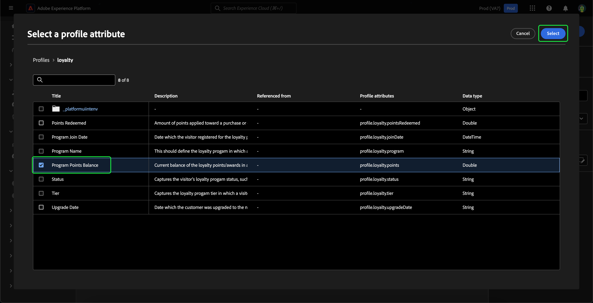
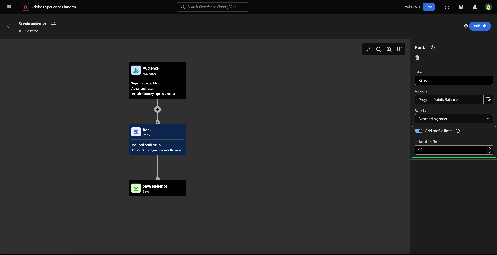

# Guia da interface do usuário da Composição de público-alvo

A Composição de público-alvo fornece um espaço de trabalho para criar e editar públicos-alvo, usando blocos usados para representar ações diferentes.

Para alterar os detalhes da composição, incluindo o título e a descrição, selecione o  botão.

A variável **[!UICONTROL Propriedades de composição]** popover é exibido. Você pode inserir detalhes da sua composição, incluindo o título e a descrição aqui.

>[!NOTE]
>
>Se você fizer **não** Dê um título à sua composição, ela terá um título de &quot;Composição&quot; seguido pela data e hora de criação por padrão.

Depois de atualizar os detalhes da sua composição, selecione **[!UICONTROL Salvar]** para confirmar essas atualizações. A tela de composição do público-alvo é exibida novamente.

A tela de composição de público-alvo é composta por quatro tipos diferentes de blocos: **[[!UICONTROL Público]](#audience-block)**, **[[!UICONTROL Excluir]](#exclude-block)**, **[[!UICONTROL Classificação]](#rank-block)**, e **[[!UICONTROL Split]](#split-block)**.

## [!UICONTROL Público-alvo] {#audience-block}

A variável **[!UICONTROL Público]** O tipo de bloco permite adicionar os subpúblicos que você deseja compor para seu novo público-alvo maior. Por padrão, uma variável **[!UICONTROL Público]** bloco é incluído na parte superior da tela de composição.

Ao selecionar a variável **[!UICONTROL Público]** , o painel direito exibe controles para rotular o público-alvo, adicionar públicos-alvo ao bloco, bem como criar regras personalizadas para o bloco de público-alvo.

>[!NOTE]
>
>Você pode adicionar públicos-alvo **ou** criar uma regra personalizada. Estas duas funcionalidades **não é possível** ser utilizados em conjunto.

### [!UICONTROL Adicionar público-alvo] {#add-audience}

Para adicionar públicos-alvo ao bloco Público-alvo. selecionar **[!UICONTROL Adicionar público-alvo]**.

Uma lista de públicos-alvo é exibida. Selecione os públicos que deseja incluir, seguido por **[!UICONTROL Adicionar]** para anexá-los ao bloco de público-alvo.

Os públicos-alvo selecionados agora aparecem no painel direito quando a **[!UICONTROL Público]** for selecionado. Aqui, é possível alterar o tipo de mesclagem dos públicos-alvo combinados.

| Tipo de mesclagem | Descrição |
| ---------- | ----------- |
| [!UICONTROL União] | Os públicos são combinados em um único público. Isso seria equivalente a uma operação OR. |
| [!UICONTROL Interseção] | Os públicos-alvo são combinados, com apenas os públicos-alvo compartilhados no **all** delas sendo adicionadas. Isso seria equivalente a uma operação AND. |
| [!UICONTROL Excluir sobreposição] | Os públicos-alvo são combinados, com apenas os públicos-alvo compartilhados no **um, mas não todos** delas sendo adicionadas. Isso seria o equivalente a uma operação XOR. |

### [!UICONTROL Criar regra] {#build-rule}

Para adicionar uma regra personalizada ao bloco Público-alvo, selecione **[!UICONTROL Criar regra]**.

O Construtor de segmentos é exibido. Você pode usar o Construtor de segmentos para criar uma regra personalizada a ser seguida pelo público-alvo. Mais informações sobre como usar o Construtor de segmentos podem ser encontradas no [Guia do Construtor de segmentos](./segment-builder.md).

Depois de adicionar uma regra personalizada, selecione **[!UICONTROL Salvar]** para adicionar a regra ao público-alvo.

## [!UICONTROL Excluir] {#exclude-block}

A variável **[!UICONTROL Excluir]** o tipo de bloco permite excluir subpúblicos-alvo ou atributos especificados do novo público-alvo maior.

Para adicionar um **[!UICONTROL Excluir]** selecione o **+** ícone, seguido por **[!UICONTROL Excluir]**.

A variável **[!UICONTROL Excluir]** bloco é adicionado. Quando esse bloco for selecionado, os detalhes sobre a exclusão aparecerão no painel direito. Isso inclui o rótulo do bloco e o tipo de exclusão. Você pode excluir [por público-alvo](#exclude-audience) ou [por atributo](#exclude-attribute).

### Excluir por público {#exclude-audience}

Se excluir por público, você pode selecionar quais públicos deseja excluir selecionando **[!UICONTROL Adicionar público-alvo]**.

![A variável [!UICONTROL Adicionar público-alvo] for selecionado, o que permite escolher qual público-alvo você deseja excluir.](../images/ui/audience-composition/add-excluded-audience.png)

Uma lista de públicos-alvo é exibida. Selecionar **[!UICONTROL Adicionar]** para adicionar os públicos-alvo que você deseja excluir ao bloco excluir.

### Excluir por atributo {#exclude-attribute}

Se você excluir por atributo, poderá selecionar quais atributos deseja excluir selecionando o  ícone dentro do **[!UICONTROL Regra de exclusão]** seção.

Uma lista de atributos de perfil é exibida. Selecione o tipo de atributo que deseja excluir, seguido por **[!UICONTROL Selecionar]** para adicioná-los ao bloco excluir.

## [!UICONTROL Enriquecer] {#enrich-block}

>[!IMPORTANT]
>
>Nesse momento, os atributos de enriquecimento podem **somente** ser usados em cenários downstream do Adobe Journey Optimizer.

A variável **[!UICONTROL Enriquecer]** O tipo de bloco permite enriquecer seu público-alvo com atributos adicionais de um conjunto de dados. Você pode usar esses atributos em casos de uso de personalização.

Para adicionar um **[!UICONTROL Enriquecer]** selecione o **+** ícone, seguido por **[!UICONTROL Enriquecer]**.

![A variável [!UICONTROL Enriquecer] for selecionada.](../images/ui/audience-composition/add-enrich-block.png)

A variável **[!UICONTROL Enriquecer]** bloco é adicionado. Quando esse bloco for selecionado, os detalhes sobre o enriquecimento aparecerão no painel direito. Isso inclui o rótulo do bloco e o conjunto de dados de enriquecimento.

Para selecionar o conjunto de dados com o qual enriquecer o público-alvo, selecione o  ícone.

![O botão de filtro é realçado. Selecionar isso levará você ao [!UICONTROL Selecionar conjunto de dados] popover.](../images/ui/audience-composition/enrich-select-dataset.png)

A variável **[!UICONTROL Selecionar conjunto de dados]** popover é exibido. Selecione o conjunto de dados que deseja adicionar para enriquecimento, seguido de **[!UICONTROL Selecionar]** para adicionar o conjunto de dados para enriquecimento.

>[!IMPORTANT]
>
>O conjunto de dados selecionado **deve** satisfazem os seguintes critérios:
>
>- O conjunto de dados **deve** ser do tipo de registro.
>   - O conjunto de dados **não é possível** ser do tipo de evento, ser gerado pelo sistema ou ser marcado para Perfil.
>- O conjunto de dados **deve** ser de 1 GB ou menor.

A variável **[!UICONTROL Critérios de enriquecimento]** agora é exibida no painel direito. Nesta seção, você pode selecionar a variável **[!UICONTROL Chave de associação de origem]** e a variável **[!UICONTROL Chave de junção do conjunto de dados de enriquecimento]**, que permite vincular o conjunto de dados de enriquecimento ao público-alvo que você está tentando criar.

![A variável [!UICONTROL Critérios de enriquecimento] é realçada.](../images/ui/audience-composition/enrichment-criteria.png)

Para selecionar o **[!UICONTROL Chave de associação de origem]**, selecione o  ícone.

![O ícone de filtro para a variável [!UICONTROL Chave de associação de origem] é realçado.](../images/ui/audience-composition/enrich-select-source-join-key.png)

A variável **[!UICONTROL Selecionar um atributo de perfil]** popover é exibido. Selecione o atributo de perfil que você deseja usar como chave de junção de origem, seguido por **[!UICONTROL Selecionar]** para escolher esse atributo como sua chave de join de origem.

Para selecionar o **[!UICONTROL Chave de junção do conjunto de dados de enriquecimento]**, selecione o  ícone.

![O ícone de filtro para a variável [!UICONTROL Chave de junção do conjunto de dados de enriquecimento] é realçado.](../images/ui/audience-composition/enrich-select-enrichment-dataset-join-key.png)

A variável **[!UICONTROL Atributos de enriquecimento]** popover é exibido. Selecione o atributo que deseja usar como chave de junção do conjunto de dados de enriquecimento, seguido de **[!UICONTROL Selecionar]** para escolher esse atributo como sua chave de junção do conjunto de dados de enriquecimento.

Agora que você adicionou ambas as chaves de associação, a variável **[!UICONTROL Atributos de enriquecimento]** é exibida. Agora você pode adicionar o atributo com o qual deseja aprimorar seu público-alvo. Para adicionar esses atributos, selecione **[!UICONTROL Adicionar atributo]**.

![A variável [!UICONTROL Adicionar atributo] é realçado.](../images/ui/audience-composition/enrich-select-add-attribute.png)

A variável **[!UICONTROL Atributos de enriquecimento]** popover é exibido. Você pode selecionar os atributos do conjunto de dados com os quais enriquecer seu público-alvo, seguido de **[!UICONTROL Selecionar]** para adicionar os atributos ao público-alvo.

<!-- ## [!UICONTROL Join] {#join-block}

The **[!UICONTROL Join]** block type allows you to add in external audiences from datasets that have not yet been processed by Adobe Experience Platform.

To add a **[!UICONTROL Join]** block, select the **+** icon, followed by **[!UICONTROL Join]**.

When you select the block, details about the join are shown in the right rail, including the block's label and the option to add audiences to the enrichment dataset.

After selecting **[!UICONTROL Add Audience]**, a list of audiences appears. Select the audiences you want to include, followed by **[!UICONTROL Add]** to add them to your join block.

Your selected audiences now appear within the right rail when the **[!UICONTROL Join]** block is selected. 

 -->

## [!UICONTROL Classificação] {#rank-block}

A variável **[!UICONTROL Classificação]** o tipo de bloco permite classificar e classificar perfis com base em um atributo especificado e incluir esses perfis classificados na sua composição.

Para adicionar um **[!UICONTROL Classificação]** selecione o **+** ícone, seguido por **[!UICONTROL Classificação]**.

Ao selecionar o bloco, os detalhes sobre a classificação são mostrados no painel direito, incluindo o rótulo do bloco, o atributo para classificar, a ordem de classificação e um botão para limitar o número de perfis a serem classificados.

Para selecionar por atributo classificar os públicos, selecione o  ícone.

Uma lista de atributos de perfil é exibida. Nesse popover, você pode selecionar o tipo de atributo pelo qual deseja classificar seu público-alvo. Selecionar **[!UICONTROL Selecionar]** para adicioná-lo ao bloco de classificação. Observe que o atributo selecionado pode **somente** ser números.

Depois de selecionar o atributo, você pode selecionar a ordem pela qual ele será classificado. É em ordem crescente (do mais baixo para o mais alto) ou decrescente (do mais alto para o mais baixo).

Além disso, é possível limitar o número de públicos-alvo retornados ativando o **[!UICONTROL Adicionar limite de perfil]** alternar. Quando essa opção estiver ativada, você poderá definir o número máximo de públicos-alvo retornados na variável **[!UICONTROL Perfis incluídos]** campo.

## [!UICONTROL Dividir] {#split-block}

A variável **[!UICONTROL Split]** o tipo de bloco permite dividir o novo público em vários subpúblicos. Você pode dividir esse público com base na porcentagem ou por um atributo.

Para adicionar um **[!UICONTROL Split]** selecione o **+** ícone, seguido por **[!UICONTROL Split]**.

Ao dividir o público, você pode dividir por porcentagem ou dividir por atributo.

### Dividir por porcentagem {#split-percentage}

Ao dividir por porcentagem, os públicos-alvo serão divididos aleatoriamente, com base no número de caminhos e porcentagens fornecidos.

Por exemplo, você pode ter três caminhos, cada um com uma porcentagem diferente de perfis.

### Dividir por atributo {#split-attribute}

Ao dividir por atributo, os públicos-alvo serão divididos com base nos atributos fornecidos. Para selecionar o atributo pelo qual dividir, selecione o **[!UICONTROL Split]** bloco, seguido pelo  ícone.

Uma lista de atributos de perfil é exibida. Selecione o tipo de atributo, seguido por **[!UICONTROL Selecionar]** para adicioná-lo ao bloco dividido.

Depois de selecionar o atributo, escolha a quais perfis pertencerão cada subpúblico-alvo adicionando os valores em **[!UICONTROL Valores]** campo.

Além disso, você pode ativar a variável **[!UICONTROL Outros perfis]** alterne para criar um subpúblico-alvo que inclua todos os perfis não selecionados.

## Publicar seu público

Depois de compor o público-alvo, você pode salvá-lo e publicá-lo selecionando **[!UICONTROL Publish]**.

Se houver erros ao criar o público-alvo, um alerta será exibido, informando como resolver o problema.

## Próximas etapas

A Composição do público-alvo fornece um fluxo de trabalho avançado que permite criar públicos-alvo a partir de diferentes tipos de blocos. Para saber mais sobre outras partes da interface do usuário do Serviço de segmentação, leia o [Guia do usuário do Serviço de segmentação](./overview.md).
