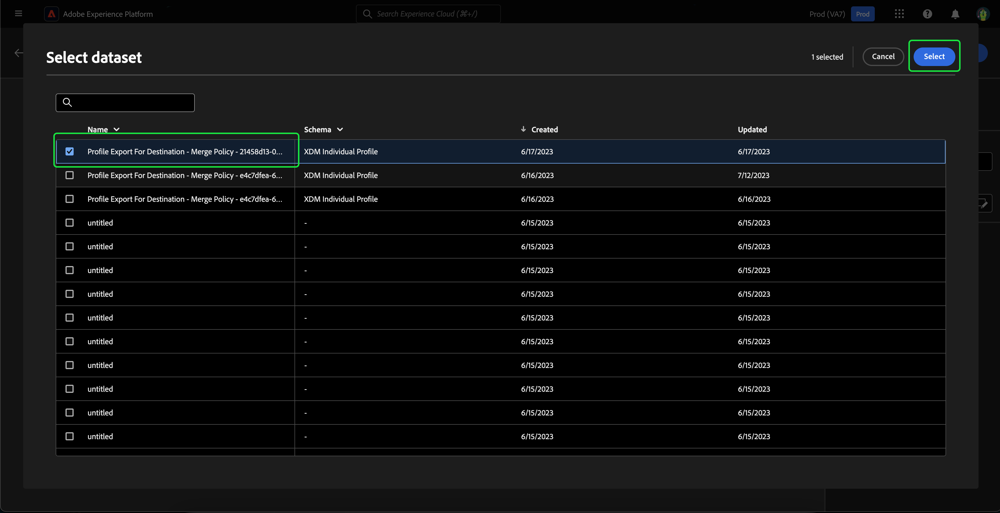

# Guia da interface do usuário da Composição de público-alvo

>[!NOTE]
>
>Este guia explica como criar públicos-alvo usando a Composição de público-alvo. Para saber como criar públicos-alvo por meio de definições de segmento usando o Construtor de segmentos, leia o [guia da interface do Construtor de segmentos](./segment-builder.md).

A Composição de público-alvo fornece um espaço de trabalho para criar e editar públicos-alvo, usando blocos usados para representar ações diferentes.

Para alterar os detalhes da composição, incluindo o título e a descrição, selecione o botão .

O popover **[!UICONTROL Propriedades de composição]** é exibido. Você pode inserir detalhes da sua composição, incluindo o título e a descrição aqui.

>[!NOTE]
>
>Se você **não** der um título à sua composição, ela terá um título de &quot;Composição&quot; seguido pela data e hora de criação por padrão. Além disso, cada composição **deve** ter seu próprio nome exclusivo.

Depois de atualizar os detalhes da sua composição, selecione **[!UICONTROL Salvar]** para confirmar essas atualizações. A tela de composição do público-alvo é exibida novamente.

A tela de composição de público é composta por quatro tipos diferentes de blocos: **[[!UICONTROL Público-alvo]](#audience-block)**, **[[!UICONTROL Excluir]](#exclude-block)**, **[[!UICONTROL Classificação]](#rank-block)** e **[[!UICONTROL Divisão]](#split-block)**.

## [!UICONTROL Público-alvo] {#audience-block}

O tipo de bloco **[!UICONTROL Público]** permite adicionar os subpúblicos que você deseja compor para seu novo público maior. Por padrão, um bloco **[!UICONTROL Público-alvo]** está incluído na parte superior da tela de composição.

Ao selecionar o bloco **[!UICONTROL Público-alvo]**, o painel direito exibe controles para rotular o público-alvo, adicionar públicos-alvo ao bloco, bem como criar regras personalizadas para o bloco de público-alvo.

>[!NOTE]
>
>Você pode adicionar públicos-alvo **ou** criar uma regra personalizada. Estas duas funcionalidades **não podem** ser usadas juntas.

### [!UICONTROL Adicionar público-alvo] {#add-audience}

Para adicionar públicos-alvo ao bloco Público-alvo. selecione **[!UICONTROL Adicionar público-alvo]**.

>[!IMPORTANT]
>
>Observe que **somente** públicos-alvo definidos com a política de mesclagem padrão serão exibidos.
>
>Além disso, somente **públicos-alvo** publicados criados com o Construtor de segmentos podem ser usados. Públicos criados usando a Composição de público-alvo e públicos gerados externamente estão **não** disponíveis.

Uma lista de públicos-alvo é exibida. Selecione os públicos que você deseja incluir, seguido por **[!UICONTROL Adicionar]** para anexá-los ao seu bloco de público.

Os públicos selecionados agora aparecem no painel direito quando o bloco **[!UICONTROL Público]** é selecionado. Aqui, é possível alterar o tipo de mesclagem dos públicos-alvo combinados.

| Tipo de mesclagem | Descrição |
| ---------- | ----------- |
| [!UICONTROL União] | Os públicos são combinados em um único público. Isso seria equivalente a uma operação OR. |
| [!UICONTROL Interseção] | Os públicos são combinados, com apenas os públicos compartilhados em **todos** sendo adicionados. Isso seria equivalente a uma operação AND. |
| [!UICONTROL Excluir sobreposição] | Os públicos são combinados, com apenas os públicos compartilhados em **um, mas não todos** adicionados. Isso seria o equivalente a uma operação XOR. |

### [!UICONTROL Regra de compilação] {#build-rule}

Para adicionar uma regra personalizada ao bloco Público-alvo, selecione **[!UICONTROL Criar regra]**.

O Construtor de segmentos é exibido. Você pode usar o Construtor de segmentos para criar uma regra personalizada a ser seguida pelo público-alvo. Mais informações sobre como usar o Construtor de segmentos podem ser encontradas no [guia do Construtor de segmentos](./segment-builder.md).

Depois de adicionar uma regra personalizada, selecione **[!UICONTROL Salvar]** para adicionar a regra ao seu público-alvo.

## [!UICONTROL Excluir] {#exclude-block}

O tipo de bloco **[!UICONTROL Excluir]** permite excluir um subpúblico ou atributos especificados de seu novo público-alvo maior.

Para adicionar um bloco **[!UICONTROL Excluir]**, selecione o ícone **+**, seguido por **[!UICONTROL Excluir]**.

O bloco **[!UICONTROL Excluir]** foi adicionado. Quando esse bloco for selecionado, os detalhes sobre a exclusão aparecerão no painel direito. Isso inclui o rótulo do bloco e o tipo de exclusão. Você pode excluir [por público](#exclude-audience) ou [por atributo](#exclude-attribute).

### Excluir por público {#exclude-audience}

Se você excluir por público-alvo, poderá selecionar qual público-alvo deseja excluir selecionando **[!UICONTROL Adicionar público-alvo]**.

![O botão [!UICONTROL Adicionar público-alvo] está selecionado, o que permite escolher qual público-alvo você deseja excluir.](../images/ui/audience-composition/add-excluded-audience.png)

>[!IMPORTANT]
>
>Somente **públicos-alvo** publicados criados com o Construtor de segmentos podem ser usados. Públicos criados usando a Composição de público-alvo e públicos gerados externamente estão **não** disponíveis.

Uma lista de públicos-alvo é exibida. Selecione **[!UICONTROL Adicionar]** para adicionar o público-alvo que você deseja excluir ao bloco de exclusão.

### Excluir por atributo {#exclude-attribute}

Se você excluir por atributo, poderá selecionar quais atributos deseja excluir selecionando o ícone  na seção **[!UICONTROL Regra de exclusão]**.

Uma lista de atributos de perfil é exibida. Selecione o tipo de atributo que deseja excluir, seguido por **[!UICONTROL Selecionar]** para adicioná-los ao bloco de exclusão.

>[!IMPORTANT]
>
>Ao excluir por atributo, você só pode especificar **um** valor para excluir. Usar qualquer tipo de separador, como vírgula ou ponto e vírgula, resultará apenas na exclusão desse valor exato. Por exemplo, definir o valor como `red, blue` resultará na exclusão do termo `red, blue` do atributo, mas **não** resultará na exclusão do termo `red` ou `blue`.

## [!UICONTROL Enriquecer] {#enrich-block}

>[!IMPORTANT]
>
>Neste momento, os atributos de enriquecimento podem **somente** ser usados em cenários de downstream do Adobe Journey Optimizer.

O tipo de bloco **[!UICONTROL Enrich]** permite enriquecer o público com atributos adicionais de um conjunto de dados. Você pode usar esses atributos em casos de uso de personalização.

Para adicionar um bloco **[!UICONTROL Enrich]**, selecione o ícone **+**, seguido por **[!UICONTROL Enrich]**.

![A opção [!UICONTROL Enriquecer] está selecionada.](../images/ui/audience-composition/add-enrich-block.png)

O bloco **[!UICONTROL Enrich]** foi adicionado. Quando esse bloco for selecionado, os detalhes sobre o enriquecimento aparecerão no painel direito. Isso inclui o rótulo do bloco e o conjunto de dados de enriquecimento.

Para selecionar o conjunto de dados com o qual o público será enriquecido, selecione o ícone .

![O botão de filtro está realçado. Selecionar isso leva ao popover [!UICONTROL Selecionar conjunto de dados].](../images/ui/audience-composition/enrich-select-dataset.png)

O popover **[!UICONTROL Selecionar conjunto de dados]** é exibido. Selecione o conjunto de dados que você deseja adicionar para enriquecimento, seguido de **[!UICONTROL Selecionar]** para adicionar o conjunto de dados para enriquecimento.

>[!IMPORTANT]
>
>O conjunto de dados selecionado **deve** atender aos seguintes critérios:
>
>- O conjunto de dados **deve** ser do tipo de registro.
>   - O conjunto de dados **não pode** ser do tipo de evento, ser gerado pelo sistema ou ser marcado para Perfil.
>- O conjunto de dados **deve** ter 1 GB ou menos.

A seção **[!UICONTROL Critérios de enriquecimento]** agora aparece no painel direito. Nesta seção, você pode selecionar a **[!UICONTROL Chave de junção do Source]** e a **[!UICONTROL Chave de junção do conjunto de dados de enriquecimento]**, que permite vincular o conjunto de dados de enriquecimento ao público que você está tentando criar.

![A área [!UICONTROL Critérios de enriquecimento] está realçada.](../images/ui/audience-composition/enrichment-criteria.png)

Para selecionar a **[!UICONTROL chave de junção do Source]**, selecione o ícone .

![O ícone de filtro da [!UICONTROL chave de junção do Source] está realçado.](../images/ui/audience-composition/enrich-select-source-join-key.png)

O popover **[!UICONTROL Selecionar um atributo de perfil]** é exibido. Selecione o atributo de perfil que você deseja usar como chave de junção de origem, seguido por **[!UICONTROL Selecionar]** para escolher esse atributo como sua chave de junção de origem.

Para selecionar a chave de junção do conjunto de dados de **[!UICONTROL Enriquecimento]**, selecione o ícone .

![O ícone de filtro da [!UICONTROL Chave de junção do conjunto de dados de Enriquecimento] está realçado.](../images/ui/audience-composition/enrich-select-enrichment-dataset-join-key.png)

O popover **[!UICONTROL Atributos de enriquecimento]** é exibido. Selecione o atributo que deseja usar como chave de junção do conjunto de dados de enriquecimento, seguido por **[!UICONTROL Selecionar]** para escolher esse atributo como sua chave de junção do conjunto de dados de enriquecimento.

Agora que você adicionou ambas as chaves de junção, a seção **[!UICONTROL Atributos de enriquecimento]** é exibida. Agora você pode adicionar o atributo com o qual deseja aprimorar seu público-alvo. Para adicionar esses atributos, selecione **[!UICONTROL Adicionar atributo]**.

![O botão [!UICONTROL Adicionar atributo] está realçado.](../images/ui/audience-composition/enrich-select-add-attribute.png)

O popover **[!UICONTROL Atributos de enriquecimento]** é exibido. Você pode selecionar os atributos do conjunto de dados com os quais enriquecer seu público, seguido de **[!UICONTROL Selecionar]** para adicionar os atributos ao seu público.

<!-- ## [!UICONTROL Join] {#join-block}

The **[!UICONTROL Join]** block type allows you to add in external audiences from datasets that have not yet been processed by Adobe Experience Platform.

To add a **[!UICONTROL Join]** block, select the **+** icon, followed by **[!UICONTROL Join]**.

When you select the block, details about the join are shown in the right rail, including the block's label and the option to add audiences to the enrichment dataset.

After selecting **[!UICONTROL Add Audience]**, a list of audiences appears. Select the audiences you want to include, followed by **[!UICONTROL Add]** to add them to your join block.

Your selected audiences now appear within the right rail when the **[!UICONTROL Join]** block is selected. 

 -->

## [!UICONTROL Classificação] {#rank-block}

O tipo de bloco **[!UICONTROL Rank]** permite classificar e classificar perfis com base em um atributo especificado e incluir esses perfis classificados na sua composição.

Para adicionar um bloco **[!UICONTROL Rank]**, selecione o ícone **+**, seguido por **[!UICONTROL Rank]**.

Ao selecionar o bloco, os detalhes sobre a classificação são mostrados no painel direito, incluindo o rótulo do bloco, o atributo para classificar, a ordem de classificação e um botão para limitar o número de perfis a serem classificados.

Para selecionar por qual atributo classificar os públicos-alvo, selecione o ícone .

Uma lista de atributos de perfil é exibida. Nesse popover, você pode selecionar o tipo de atributo pelo qual deseja classificar seu público-alvo. Selecione **[!UICONTROL Selecionar]** para adicioná-lo ao bloco de classificação. Observe que o atributo selecionado pode **ser apenas** números.

Depois de selecionar o atributo, você pode selecionar a ordem pela qual ele será classificado. É em ordem crescente (do mais baixo para o mais alto) ou decrescente (do mais alto para o mais baixo).

Além disso, é possível limitar o número de perfis retornados habilitando a opção **[!UICONTROL Adicionar limite de perfil]**. Quando esta opção estiver habilitada, você poderá definir o número máximo de perfis retornados no campo **[!UICONTROL Perfis incluídos]**.

## [!UICONTROL Split] {#split-block}

O tipo de bloco **[!UICONTROL Split]** permite dividir o novo público em vários subpúblicos. Você pode dividir esse público com base na porcentagem ou por um atributo. Ao dividir o público em subpúblicos, essa divisão é **não** persistente. Isso significa que os perfis podem estar em subpúblicos diferentes para cada avaliação.

Para adicionar um bloco **[!UICONTROL Split]**, selecione o ícone **+**, seguido por **[!UICONTROL Split]**.

Ao dividir o público, você pode dividir por porcentagem ou dividir por atributo.

### Dividir por porcentagem {#split-percentage}

Ao dividir por porcentagem, os públicos-alvo serão divididos aleatoriamente, com base no número de caminhos e porcentagens fornecidos.

Por exemplo, você pode ter três caminhos, cada um com uma porcentagem diferente de perfis.

### Dividir por atributo {#split-attribute}

Ao dividir por atributo, os públicos-alvo serão divididos com base nos atributos fornecidos. Para selecionar o atributo para divisão, selecione o bloco **[!UICONTROL Split]**, seguido pelo ícone .

Uma lista de atributos de perfil é exibida. Selecione o tipo de atributo, seguido por **[!UICONTROL Selecionar]** para adicioná-lo ao bloco dividido.

Após selecionar o atributo, você pode escolher quais perfis pertencerão a qual subpúblico-alvo adicionando os valores no campo **[!UICONTROL Valores]**.

Além disso, você pode habilitar a opção **[!UICONTROL Outros perfis]** para criar um subpúblico-alvo que inclua todos os perfis não selecionados.

## Publicar seu público

>[!IMPORTANT]
>
>Ao publicar sua composição de público-alvo, observe que pode levar até 48 horas para que ela seja avaliada e ativada para uso em serviços downstream, como um destino do Real-Time CDP ou canal do Adobe Journey Optimizer.

Depois de criar sua composição, você pode salvá-la e publicá-la selecionando **[!UICONTROL Publish]**.

Se houver erros ao criar o público-alvo, um alerta será exibido, informando como resolver o problema.

## Próximas etapas

A Composição de público-alvo fornece um fluxo de trabalho avançado que permite criar composições a partir dos diferentes tipos de blocos. Para saber mais sobre outras partes da interface do usuário do Serviço de segmentação, leia o [Guia do usuário do Serviço de segmentação](./overview.md).
