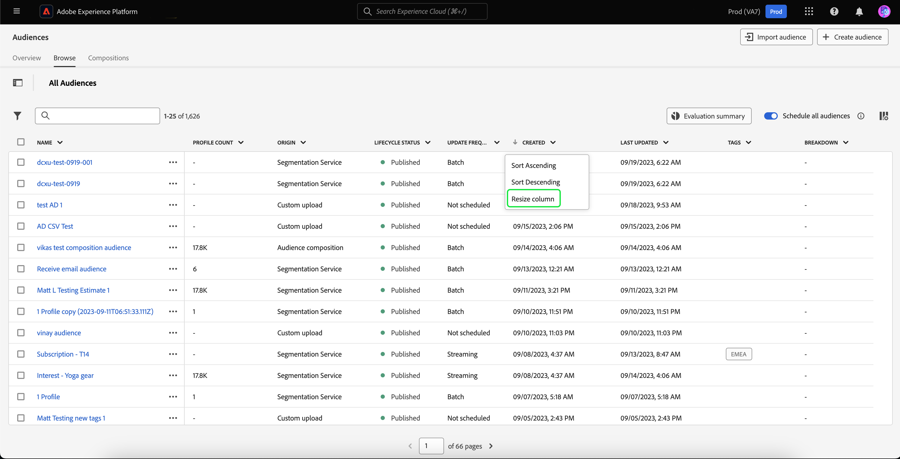
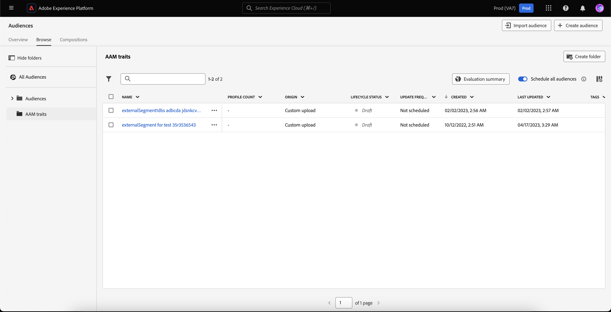
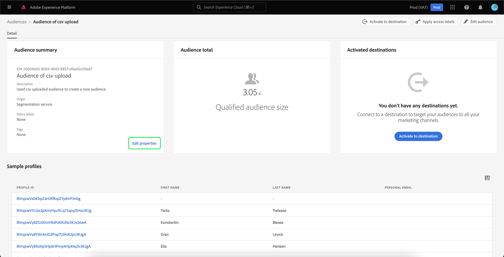
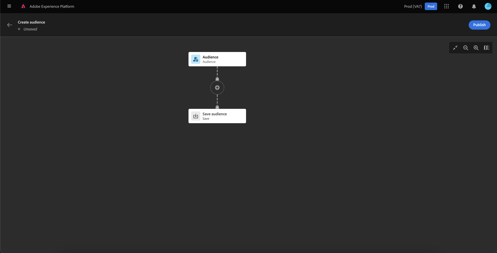

# Visão geral do portal de público

O Portal de público-alvo é um hub central, no Adobe Experience Platform, que permite exibir, gerenciar e criar públicos-alvo.

No Audience Portal, você pode realizar as seguintes tarefas:

- [Exibir uma lista de públicos](#audience-list)
   - [Usar ações rápidas nos seus públicos](#quick-actions)
   - [Personalize as propriedades exibidas na lista de públicos-alvo](#customize)
   - [Use filtros, pastas e tags para organizar seus públicos](#manage-audiences)
- [Exibir detalhes sobre seu público](#audience-details)
   - [Exibir um resumo sobre seu público](#audience-summary)
- [Ativar os públicos para a segmentação agendada](#scheduled-segmentation)
- [Criar um público-alvo](#create-audience)
   - [Usar o Construtor de segmentos para criar um público-alvo](#segment-builder)
   - [Usar composição de público-alvo para criar um público-alvo](#audience-composition)
- [Importar públicos gerados externamente](#import-audience)

Para abrir o Portal de público-alvo, selecione a variável **[!UICONTROL Procurar]** na seção Segmentação.

## Lista de público-alvo {#list}

>[!CONTEXTUALHELP]
>id="platform_segments_browse_churncolumnname"
>title="Churn"
>abstract="O churn representa a porcentagem de perfis que estão mudando em um público-alvo em comparação à última vez que a tarefa do segmento foi executada."

>[!CONTEXTUALHELP]
>id="platform_segments_browse_evaluationmethodcolumnname"
>title="Método de avaliação"
>abstract="Os métodos de avaliação de públicos-alvo incluem lote, transmissão e borda."

Por padrão, o Portal de público-alvo exibe uma lista de todos os públicos-alvo da sua organização e sandbox, incluindo a contagem de perfis, a origem, a data de criação, a data da última modificação, as tags e o detalhamento.

### Ações rápidas {#quick-actions}

Ao lado de cada público há um ícone de reticências. Selecionar essa opção exibe uma lista de ações rápidas disponíveis para o público-alvo. Essa lista de ações é diferente com base na origem do público-alvo.

![A lista de ações rápidas é exibida para públicos-alvo com a origem de [!UICONTROL Composição de público].](../images/ui/audience-portal/browse-audience-composition-details.png)

| Ação | Origens | Descrição |
| ------ | ------- | ----------- |
| [!UICONTROL Editar] | Serviço de segmentação | Abre o Construtor de segmentos para editar o público-alvo. Observe que, se o público-alvo foi criado por meio da API, você **não** poder editá-lo usando o Construtor de segmentos. Para obter mais informações sobre como usar o Construtor de segmentos, leia as [Guia da interface do usuário do Construtor de segmentos](./segment-builder.md). |
| [!UICONTROL Abrir composição] | Composição de público-alvo | Abre a composição de Público-alvo para ver seu público-alvo. Para obter mais informações sobre a composição do público-alvo, leia a [guia da interface de composição de público-alvo](./audience-composition.md). |
| [!UICONTROL Ativar para destino] | Serviço de segmentação | Ativa o público-alvo para um destino. Para obter informações mais detalhadas sobre como ativar um público-alvo para um destino, leia o [visão geral da ativação](../../destinations/ui/activation-overview.md). |
| [!UICONTROL Compartilhar com parceiros] | Composição de público-alvo, Upload personalizado, Serviço de segmentação | Compartilha seu público-alvo com outros usuários da Platform. Para obter mais informações sobre esse recurso, leia a [Visão geral da correspondência de segmentos](./segment-match/overview.md). |
| [!UICONTROL Gerenciar tags] | Composição de público-alvo, Upload personalizado, Serviço de segmentação | Gerencia as tags definidas pelo usuário que pertencem ao público. Para obter mais informações sobre esse recurso, leia a seção sobre [filtragem e marcação](#manage-audiences). |
| [!UICONTROL Mover para a pasta] | Composição de público-alvo, Upload personalizado, Serviço de segmentação | Gerencia a pasta à qual o público-alvo pertence. Para obter mais informações sobre esse recurso, leia a seção sobre [filtragem e marcação](#manage-audiences). |
| [!UICONTROL Copiar] | Serviço de segmentação | Duplica o público selecionado. Mais informações sobre esta função podem ser encontradas no [Perguntas frequentes sobre segmentação](../faq.md#copy). |
| [!UICONTROL Aplicar rótulos de acesso] | Composição de público-alvo, Upload personalizado, Serviço de segmentação | Gerencia os rótulos de acesso que pertencem ao público. Para obter mais informações sobre rótulos de acesso, leia a documentação em [gerenciamento de rótulos](../../access-control/abac/ui/labels.md). |
| [!UICONTROL Publish] | Upload personalizado, Serviço de segmentação | Publica o público selecionado. Para obter mais informações sobre o gerenciamento do status do ciclo de vida, leia a [seção estado do ciclo de vida das Perguntas frequentes sobre segmentação](../faq.md#lifecycle-states). |
| [!UICONTROL Desativar] | Upload personalizado, Serviço de segmentação | Desativa o público selecionado. Para obter mais informações sobre o gerenciamento do status do ciclo de vida, leia a [seção estado do ciclo de vida das Perguntas frequentes sobre segmentação](../faq.md#lifecycle-states). |
| [!UICONTROL Excluir] | Composição de público-alvo, Upload personalizado, Serviço de segmentação | Exclui o público selecionado. Públicos-alvo usados em destinos downstream ou que são dependentes de outros públicos-alvo **não é possível** ser excluídos. Para obter mais informações sobre exclusão de público-alvo, leia a [perguntas frequentes sobre segmentação](../faq.md#lifecycle-states). |
| [!UICONTROL Adicionar ao pacote] | Composição de público-alvo, Upload personalizado, Serviço de segmentação | Move o público-alvo entre sandboxes. Para obter mais informações sobre esse recurso, leia a [guia de ferramentas de sandbox](../../sandboxes/ui/sandbox-tooling.md). |

>[!IMPORTANT]
>
>Antes de excluir o público-alvo, verifique se ele está **não** usado como um componente em um público-alvo baseado em conta ou usado no Adobe Journey Optimizer.

Na parte superior da página há opções para adicionar todos os públicos-alvo a um agendamento, importar um público-alvo, criar um novo público-alvo e exibir um resumo da avaliação do público-alvo.

Alternando **[!UICONTROL Agendar todos os públicos-alvo]** habilitará a segmentação agendada. Mais informações sobre segmentação agendada podem ser encontradas na [seção segmentação programada deste guia do usuário](#scheduled-segmentation).

Selecionar **[!UICONTROL Importar público]** O permitirá importar um público-alvo gerado externamente. Para saber mais sobre como importar públicos, leia a seção sobre [importação de um público no guia do usuário](#import-audience).

Selecionar **[!UICONTROL Criar público]** O permitirá a criação de um público-alvo. Para saber mais sobre como criar públicos-alvo, leia a seção sobre [criação de um público-alvo no guia do usuário](#create-audience).

É possível selecionar **[!UICONTROL Resumo da avaliação]** para exibir um gráfico de pizza que mostra um resumo das avaliações de público-alvo.

O gráfico de pizza é exibido, mostrando um detalhamento dos públicos-alvo por avaliação de público-alvo. O gráfico exibe o número total de públicos-alvo no meio e o tempo diário de avaliação do lote em UTC na parte inferior. Se você passar o mouse sobre as diferentes partes do público-alvo, ele exibirá o número de públicos-alvo que pertencem a cada tipo de frequência de atualização.

### Personalizar {#customize}

Você pode adicionar campos extras ao Portal de público selecionando . Esses campos adicionais incluem status do ciclo de vida, frequência de atualização, última atualização por, descrição, criado por e rótulos de acesso.

| Campo | Descrição |
| ----- | ----------- |
| [!UICONTROL Nome] | O nome do público. |
| [!UICONTROL Contagem de perfis] | O número total de perfis qualificados para o público-alvo. |
| [!UICONTROL Origem] | A origem do público. Isso indica de onde o público-alvo vem. Os valores possíveis incluem Serviço de segmentação, Upload personalizado, Composição de público-alvo e Audience Manager. |
| [!UICONTROL Status do ciclo de vida] | O status do público. Os valores possíveis para esse campo incluem `Draft`, `Inactive`, e `Published`. Mais informações sobre os status do ciclo de vida, incluindo o que significam os diferentes estados e como mover públicos para diferentes estados do ciclo de vida, leia a [seção status do ciclo de vida das Perguntas frequentes sobre segmentação](../faq.md#lifecycle-status). |
| [!UICONTROL Frequência das atualizações] | Um valor que indica a frequência com que os dados do público-alvo são atualizados. Os valores possíveis para esse campo incluem [!UICONTROL Lote], [!UICONTROL Streaming], [!UICONTROL Edge], e [!UICONTROL Não Agendado]. |
| [!UICONTROL Última atualização realizada por] | O nome da última pessoa que atualizou o público. |
| [!UICONTROL Criado] | A data e a hora, em UTC, em que o público-alvo foi criado. |
| [!UICONTROL Última atualização] | A data e a hora, em UTC, em que o público-alvo foi atualizado pela última vez. |
| [!UICONTROL Tags] | As tags definidas pelo usuário que pertencem ao público. Mais informações sobre essas tags podem ser encontradas no [seção sobre tags](#tags). |
| [!UICONTROL Descrição] | A descrição do público. |
| [!UICONTROL Criado por] | O nome da pessoa que criou o público-alvo. |
| [!UICONTROL Acessar rótulos] | Os rótulos de acesso do público-alvo. Os rótulos de acesso permitem categorizar conjuntos de dados e campos de acordo com as políticas de uso que se aplicam a esses dados. Esses rótulos podem ser aplicados a qualquer momento, fornecendo flexibilidade na maneira como você escolhe controlar os dados. Para obter mais informações sobre rótulos de acesso, leia a documentação em [gerenciamento de rótulos](../../access-control/abac/ui/labels.md). |
| [!UICONTROL Detalhamento] | O detalhamento do status do perfil para o público-alvo. Uma descrição mais detalhada desse detalhamento do status do perfil pode ser encontrada abaixo. |

Se a opção de detalhamento estiver selecionada, a tela mostrará um gráfico de barras descrevendo a porcentagem de perfis que pertencem a cada um dos seguintes status de perfil calculados: [!UICONTROL Realizado], [!UICONTROL Existente], e [!UICONTROL Saindo]. Além disso, a discriminação mostrada na [!UICONTROL Procurar] é o detalhamento mais preciso do status de definição do segmento. Se este número for diferente do indicado no [!UICONTROL Visão geral] , você deve usar os números no [!UICONTROL Procurar] guia como a fonte correta de informações, já que a variável [!UICONTROL Visão geral] os números de guia são atualizados apenas uma vez por dia.

| Status | Descrição |
| ------ | ----------- |
| [!UICONTROL Realizado] | A contagem de perfis que **qualificado** para o segmento nas últimas 24 horas desde a execução do último trabalho de segmento em lote. |
| [!UICONTROL Existente] | A contagem de perfis que **permaneceu** no segmento nas últimas 24 horas desde a execução do último trabalho de segmento em lote. |
| [!UICONTROL Saindo] | A contagem de perfis que **encerrado** o segmento nas últimas 24 horas desde a execução do último trabalho de segmento em lote. |

Após selecionar os campos que deseja exibir, você também pode redimensionar a largura das colunas exibidas. Você pode fazer isso arrastando a área entre as colunas ou selecionando o  da coluna que você deseja redimensionar, seguida de **[!UICONTROL Redimensionar coluna]**.

### Filtragem, pastas e marcação {#manage-audiences}

Para melhorar a eficiência do trabalho, você pode pesquisar públicos existentes, adicionar tags definidas pelo usuário a públicos, colocar públicos em pastas e filtrar os públicos exibidos.

#### Pesquisa {#search}

Você pode pesquisar seus públicos-alvo existentes em até 9 idiomas diferentes com [!DNL Unified Search].

Para usar [!DNL Unified Search], adicione o termo que deseja pesquisar na barra de pesquisa destacada.

Para obter mais informações sobre [!DNL Unified Search], incluindo os recursos compatíveis, leia o [Documentação de pesquisa unificada](https://experienceleague.adobe.com/docs/core-services/interface/services/search-experience-cloud.html).

#### Tags {#tags}

Você pode adicionar tags definidas pelo usuário para descrever, localizar e gerenciar melhor seus públicos-alvo.

Para adicionar uma tag, selecione **[!UICONTROL Gerenciar tags]** no público-alvo que você deseja marcar.

![A variável [!UICONTROL Gerenciar tags] for selecionado para um público-alvo especificado.](../images/ui/audience-portal/browse-manage-tags.png)

A variável **[!UICONTROL Gerenciar tags]** popover é exibido. Nesse pop-over, você pode selecionar uma tag categorizada ou uma tag não categorizada.

| Tipo de tag | Descrição |
| -------- | ----------- |
| Categorizado | Uma tag criada e gerenciada pelos administradores da organização. |
| Sem categoria | Uma tag criada no [!UICONTROL Gerenciar tags] popover. Qualquer pessoa pode criar ou gerenciar esses tipos de tags. |

![A variável [!UICONTROL Gerenciar tags] o popover é exibido. As opções para escolher um categorizado ou não categorizado são destacadas.](../images/ui/audience-portal/create-tag.png)

Depois de adicionar todas as tags que deseja anexar ao público-alvo, selecione **[!UICONTROL Salvar]**.

![No [!UICONTROL Gerenciar tags] popover, as tags adicionadas serão realçadas.](../images/ui/audience-portal/created-tags.png)

Para obter mais informações sobre criação e gerenciamento de tags, leia a [Guia de gerenciamento de tags](../../administrative-tags/ui/managing-tags.md).

#### Pastas {#folders}

Você pode colocar públicos-alvo em pastas para melhorar o gerenciamento do público-alvo.

Para mover um público para uma pasta, selecione **[!UICONTROL Mover para a pasta]** no público-alvo que você deseja mover.

![A variável [!UICONTROL Mover para a pasta] for selecionado para um público-alvo específico.](../images/ui/audience-portal/browse-move-to-folder.png)

A variável **Mover público para a pasta** popover é exibido. Selecione a pasta para a qual deseja mover o público-alvo e selecione **[!UICONTROL Salvar]**.

Quando o público-alvo estiver em uma pasta, você poderá optar por exibir somente os públicos-alvo que pertencem a uma pasta específica.

#### Filtro {#filter}

Você também pode filtrar seus públicos com base em várias configurações.

Para filtrar os públicos disponíveis, selecione a variável .

A lista de filtros disponíveis é exibida.

| Filtro | Descrição |
| ------ | ----------- |
| [!UICONTROL Origem] | Permite filtrar com base na origem do público-alvo. As opções disponíveis incluem Serviço de segmentação, Upload personalizado, Composição de público-alvo e Audience Manager. |
| [!UICONTROL Tem qualquer tag] | Permite filtrar por tags. Você pode selecionar entre **[!UICONTROL Tem qualquer tag]** e **[!UICONTROL Tem todas as tags]**. Quando **[!UICONTROL Tem qualquer tag]** for selecionada, os públicos-alvo filtrados incluirão **qualquer** das tags adicionadas. Quando **[!UICONTROL Tem todas as tags]** for selecionada, os públicos-alvo filtrados deverão incluir **all** das tags adicionadas. |
| [!UICONTROL Status do ciclo de vida] | Permite filtrar com base no status do ciclo de vida do público-alvo. As opções disponíveis incluem [!UICONTROL Excluído], [!UICONTROL Rascunho], [!UICONTROL Inativo], e [!UICONTROL Publicado]. |
| [!UICONTROL Frequência das atualizações] | Permite filtrar com base na frequência de atualização do público-alvo (método de avaliação). As opções disponíveis incluem [!UICONTROL Agendado], [!UICONTROL Contínuo], e [!UICONTROL Por demanda]. |
| [!UICONTROL Criado por] | Permite filtrar com base na pessoa que criou o público. |
| [!UICONTROL Data de criação] | Permite filtrar com base na data de criação do público-alvo. Você pode escolher um intervalo de datas para filtrar quando o público-alvo foi criado. |
| [!UICONTROL Data de modificação] | Permite filtrar com base na data da última modificação do público-alvo. Você pode escolher um intervalo de datas para filtrar quando o público-alvo foi modificado pela última vez. |

#### Ações em massa {#bulk-actions}

Além disso, você pode selecionar até 25 públicos diferentes e executar várias ações nesses públicos. Essas ações incluem [mover para uma pasta](#folders), [edição ou aplicação de uma tag](#tags), [aplicação de rótulos de acesso](../../access-control/abac/ui/labels.md), e [excluindo](#browse).

Quando você aplica ações em massa a esses públicos, as seguintes condições se aplicam:

- Você **pode** selecione públicos-alvo de páginas diferentes.
- Você **não é possível** exclua um público-alvo que esteja sendo usado em uma ativação de destino.
- Se você selecionar um filtro, os públicos selecionados **irá** redefinir.

## Detalhes do público-alvo {#audience-details}

Para ver mais detalhes sobre um público específico, selecione o nome de um público na **[!UICONTROL Procurar]** guia.

A página de detalhes do público-alvo é exibida. Na parte superior, há um resumo do público-alvo, informações sobre o tamanho do público-alvo qualificado, bem como destinos para os quais o segmento é ativado.

### Resumo do público-alvo {#audience-summary}

A variável **[!UICONTROL Resumo do público]** fornece informações como ID, nome, descrição, origem e detalhes dos atributos.

Além disso, você tem a opção de ativar o público para um destino, aplicar rótulos de acesso ou editar/atualizar o público.

Selecionar **[!UICONTROL Ativar para destino]** permite ativar o público-alvo para um destino. Para obter informações mais detalhadas sobre como ativar um público-alvo para um destino, leia o [visão geral da ativação](../../destinations/ui/activation-overview.md).

Selecionar **[!UICONTROL Aplicar rótulos de acesso]** permite gerenciar os rótulos de acesso que pertencem ao público-alvo. Para obter mais informações sobre rótulos de acesso, leia a documentação em [gerenciamento de rótulos](../../access-control/abac/ui/labels.md).

>[!BEGINTABS]

>[!TAB Composição do público-alvo]

![A página de detalhes do público-alvo é exibida, com a tag [!UICONTROL Abrir composição] botão realçado.](../images/ui/audience-portal/audience-details-open-composition.png)

Selecionar **[!UICONTROL Abrir composição]** permite que você visualize seu público-alvo na Composição de público-alvo. Para obter mais informações sobre a Composição do público-alvo, leia a [Guia da interface do usuário da Composição de público-alvo](./audience-composition.md).

>[!TAB Upload personalizado]

![A página de detalhes do público-alvo é exibida, com a tag [!UICONTROL Atualizar público] botão realçado.](../images/ui/audience-portal/audience-details-update-audience.png)

Selecionar **[!UICONTROL Atualizar público]** permite recarregar um público gerado externamente. Para obter mais informações sobre como importar um público gerado externamente, leia a seção sobre [importação de um público](#import-audience).

>[!TAB Serviço de segmentação]

![A página de detalhes do público-alvo é exibida, com a tag [!UICONTROL Editar público] botão realçado.](../images/ui/audience-portal/audience-details-edit-audience.png)

Selecionar **[!UICONTROL Editar público]** permite editar o público-alvo no Construtor de segmentos. Para obter informações mais detalhadas sobre o uso do [!DNL Segment Builder] espaço de trabalho, leia o [[!DNL Segment Builder] guia do usuário](./segment-builder.md).

>[!ENDTABS]

Selecionar **[!UICONTROL Editar propriedades]** O permite editar os detalhes básicos do público-alvo, como nome, descrição e tags.

### Total de público {#audience-total}

A variável **[!UICONTROL Total de público]** mostra o número total de perfis qualificados para o público-alvo.

As estimativas são geradas usando um tamanho de amostra dos dados de amostra desse dia. Se houver menos de 1 milhão de entidades no armazenamento do Perfil, o conjunto de dados completo será usado; para entre 1 e 20 milhões de entidades, será usado 1 milhão de entidades; e para mais de 20 milhões de entidades, será usado 5% do total de entidades. Mais informações sobre a geração de estimativas podem ser encontradas na [seção geração de estimativa](../tutorials/create-a-segment.md#estimate-and-preview-an-audience) do tutorial de criação de público-alvo.

### Destinos ativados {#activated-destinations}

A variável **[!UICONTROL Destinos ativados]** mostra os destinos para os quais esse público-alvo está ativado.

>[!NOTE]
>
> Os destinos são um recurso disponível com o [!DNL Adobe Real-Time Customer Data Platform]e permitem exportar dados para plataformas externas. Para obter mais informações sobre destinos, leia a [visão geral dos destinos](../../destinations/home.md). Para saber como ativar um segmento para um destino, consulte [visão geral da ativação](../../destinations/ui/activation-overview.md).

### Amostras de perfil {#profile-samples}

Abaixo está uma amostra de perfis qualificados para o segmento, detalhando informações, incluindo a [!DNL Profile] ID, nome, sobrenome e email pessoal.

A maneira como a amostragem de dados é acionada depende do método de assimilação.

Para assimilação em lote, o Armazenamento de perfis é automaticamente verificado a cada quinze minutos para ver se um novo lote foi assimilado com êxito desde que o último trabalho de amostragem foi executado. Se esse for o caso, o armazenamento de perfil será digitalizado posteriormente para ver se houve pelo menos uma alteração de 5% no número de registros. Se essas condições forem atendidas, um novo trabalho de amostragem será acionado.

Para a assimilação de streaming, o armazenamento de perfil é automaticamente verificado a cada hora para ver se houve pelo menos 5% de alteração no número de registros. Se essa condição for atendida, um novo trabalho de amostragem será acionado.

O tamanho da amostra da verificação depende do número geral de entidades no armazenamento de perfis. Esses tamanhos de amostra são representados na tabela a seguir:

| Entidades no armazenamento de perfis | Tamanho da amostra |
| ------------------------- | ----------- |
| Menos de 1 milhão | Conjunto de dados completo |
| 1 a 20 milhões | 1 milhão |
| Mais de 20 milhões | 5% do total |

Informações mais detalhadas sobre cada [!DNL Profile] pode ser visto selecionando o [!DNL Profile] ID. Para saber mais sobre os detalhes de um perfil, leia o [[!DNL Real-Time Customer Profile] guia do usuário](../../profile/ui/user-guide.md#profile-detail).

## Segmentação programada {#scheduled-segmentation}

>[!CONTEXTUALHELP]
>id="platform_segments_browse_addallsegmentstoschedule"
>title="Adicionar todos os públicos-alvo à programação"
>abstract="Permite incluir todos os públicos-alvo avaliados usando a segmentação em lote na atualização diária programada. Desabilite para remover todos os públicos-alvo da atualização programada."

Depois que os públicos-alvo forem criados, você poderá avaliá-los por meio de uma avaliação sob demanda ou agendada (contínua). Avaliação significa mudança [!DNL Real-Time Customer Profile] por meio de trabalhos de segmento para produzir públicos correspondentes. Depois de criados, os públicos-alvo são salvos e armazenados para que possam ser exportados usando [!DNL Experience Platform] APIs.

A avaliação sob demanda envolve o uso da API para executar a avaliação e criar públicos-alvo, conforme necessário, enquanto a avaliação agendada (também conhecida como &quot;segmentação agendada&quot;) permite criar um agendamento recorrente para avaliar públicos-alvo em um horário específico (no máximo, uma vez por dia).

### Ativar segmentação programada {#enable-scheduled-segmentation}

A habilitação dos públicos para avaliação agendada pode ser feita usando a interface ou a API. Na interface do usuário, retorne à **[!UICONTROL Procurar]** guia no **[!UICONTROL Públicos-alvo]** e ativar **[!UICONTROL Agendar todos os públicos-alvo]**. Isso fará com que todos os públicos-alvo sejam avaliados com base no agendamento definido por sua organização.

>[!NOTE]
>
>A avaliação agendada pode ser ativada para sandboxes com um máximo de cinco (5) políticas de mesclagem para [!DNL XDM Individual Profile]. Se sua organização tiver mais de cinco políticas de mesclagem para [!DNL XDM Individual Profile] em um único ambiente de sandbox, não será possível usar a avaliação programada.

Atualmente, os cronogramas só podem ser criados usando a API. Para obter etapas detalhadas sobre como criar, editar e trabalhar com agendamentos usando a API, siga o tutorial para avaliar e acessar resultados de segmentação, especificamente a seção sobre [avaliação agendada usando a API](../tutorials/evaluate-a-segment.md#scheduled-evaluation).

## Criação de um público {#create-audience}

É possível selecionar **[!UICONTROL Criar público]** para criar um público-alvo.

Um popover é exibido, permitindo que você escolha entre compor um público-alvo ou criar regras.

### Composição de público-alvo {#audience-composition}

Selecionar **[!UICONTROL Compor públicos]** leva você à Composição de público-alvo. Esse espaço de trabalho fornece controles intuitivos para criar e editar públicos, como arrastar e soltar blocos usados para representar ações diferentes. Para saber mais sobre como criar públicos-alvo, leia o [Guia de composição de público-alvo](./audience-composition.md).

### Construtor de segmentos {#segment-builder}

Selecionar **[!UICONTROL Criar regra]** direciona você ao Construtor de segmentos. Esse espaço de trabalho fornece controles intuitivos para criar e editar definições de segmento, como blocos de arrastar e soltar usados para representar propriedades de dados. Para saber mais sobre como criar definições de segmento, leia a [Guia do Construtor de segmentos](./segment-builder.md)

## Importação de um público-alvo {#import-audience}

>[!IMPORTANT]
>
>Para importar um público gerado externamente, você **deve** têm as seguintes permissões: [!UICONTROL Exibir segmentos], [!UICONTROL Gerenciar segmentos], e [!UICONTROL Importar público]. Para obter mais informações sobre essas permissões, leia a [visão geral do controle de acesso](../../access-control/home.md#permissions).

É possível selecionar **[!UICONTROL Importar público]** para importar um público gerado externamente.

A variável **[!UICONTROL Importar CSV de público-alvo]** workflow aparece. Você pode selecionar um arquivo CSV para importar como um público-alvo gerado externamente.

![No [!UICONTROL Importar CSV de público-alvo] workflow, a variável [!UICONTROL Arrastar e soltar arquivos] é realçada, mostrando onde você pode fazer upload do público-alvo gerado externamente.](../images/ui/audience-portal/import-audience-csv.png)

>[!NOTE]
>
>O público gerado externo **deve** estar no formato CSV, ter uma **máximo** 25 colunas e ser inferior a 1 GB.

Depois de selecionar o arquivo CSV a ser importado, uma lista de dados de amostra é mostrada para esse público-alvo gerado externamente. Depois de confirmar que os dados de amostra estão corretos, selecione **[!UICONTROL Próxima]**.

A variável **[!UICONTROL Detalhes do público]** é exibida. Você pode adicionar informações sobre o público-alvo, incluindo nome, descrição, identidade principal e valor do namespace de identidade.

Ao importar o público gerado externamente, você deve selecionar uma das colunas para ser o campo de identidade principal e especificar o valor do namespace. Observe que todos os campos restantes serão considerados **atributos de carga**. Esses atributos são considerados **não durável**, pois eles só serão associados a esse público-alvo para fins de personalização, e serão **não** conectado ao perfil.

![A variável [!UICONTROL Detalhes do público] é exibida.](../images/ui/audience-portal/import-audience-audience-details.png)

Opcionalmente, também é possível adicionar alguns detalhes extras ao público-alvo gerado externamente, incluindo fornecer uma ID, definir a política de mesclagem ou editar o tipo de dados da coluna.

>[!NOTE]
>
>Se você usar uma ID de público-alvo externa personalizada, ela deverá seguir as seguintes diretrizes:
>
> - É **deve** comece com uma letra (a-z ou A-Z), um sublinhado (_) ou um cifrão ($).
> - Todos os caracteres subsequentes podem ser alfanuméricos (a-z, A-Z, 0-9), sublinhados (_) ou cifrões ($).

Depois de preencher os detalhes do público-alvo, selecione **[!UICONTROL Próxima]**.

![A variável [!UICONTROL Próxima] O botão está realçado no link [!UICONTROL Detalhes do público] página.](../images/ui/audience-portal/import-audience-filled-details.png)

A variável **[!UICONTROL Revisão]** é exibida. Você pode revisar os detalhes do público-alvo recém-importado gerado externamente.

![A variável [!UICONTROL Revisão] será exibida, mostrando os detalhes do público recém-importado gerado externamente.](../images/ui/audience-portal/import-audience-review-details.png)

Depois de confirmar que os detalhes estão corretos, selecione **[!UICONTROL Concluir]** para importar o público gerado externamente para a Adobe Experience Platform.

>[!IMPORTANT]
>
>Por padrão, os públicos-alvo gerados externamente têm uma expiração de dados de 30 dias. A expiração dos dados é redefinida se o público-alvo for atualizado ou modificado de alguma forma.
>
>Além disso, se o público-alvo gerado externamente contiver informações confidenciais e/ou relacionadas à assistência médica, você **deve** aplique os rótulos de uso de dados necessários antes de ativá-los em qualquer destino. Para obter mais informações sobre como aplicar rótulos de uso de dados, leia a documentação em [gerenciamento de rótulos](../../access-control/abac/ui/labels.md).

## Próximas etapas

Depois de ler esta visão geral, você deve conseguir usar o Audience Portal para gerenciar, criar e importar públicos com eficiência para o Adobe Experience Platform.

Para obter mais informações sobre como usar a interface do usuário do Serviço de segmentação, leia a [Visão geral da interface do usuário do serviço de segmentação](./overview.md).

Para saber as perguntas frequentes sobre o Audience Portal, leia o [perguntas frequentes](../faq.md).
