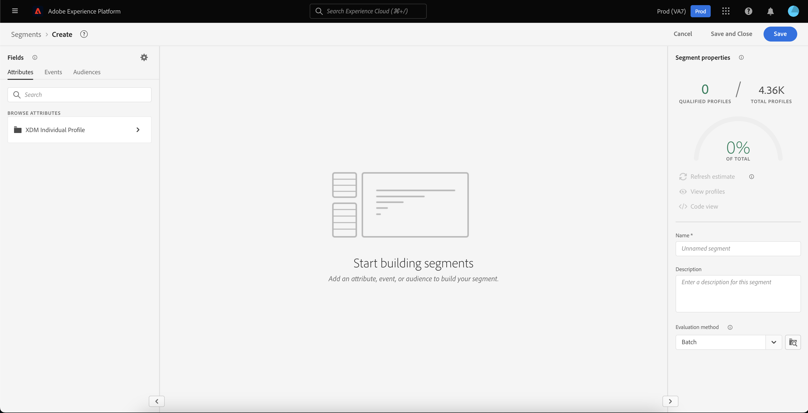

# Visão geral do portal de público

O Portal de público-alvo é um hub central, no Adobe Experience Platform, que permite exibir, gerenciar e criar públicos-alvo.

No Audience Portal, você pode realizar as seguintes tarefas:

>[!BEGINSHADEBOX]

- [Exibir uma lista de públicos](#list)
   - [Usar ações rápidas nos seus públicos](#quick-actions)
   - [Personalize as propriedades exibidas na lista de públicos-alvo](#customize)
   - [Use filtros, pastas e tags para organizar seus públicos](#manage-audiences)
- [Exibir detalhes sobre seu público](#audience-details)
   - [Exibir um resumo sobre seu público](#audience-summary)
- [Ativar os públicos para a segmentação agendada](#scheduled-segmentation)
- [Criar um público-alvo](#create-audience)
   - [Usar o Construtor de segmentos para criar um público-alvo](#segment-builder)
   - [Usar composição de público-alvo para criar um público-alvo](#audience-composition)
   - [Use a Federated Audience Composition para criar um público-alvo usando dados de seu data warehouse existente](#fac)
   - [Usar o Data Distiller para criar um público-alvo](#data-distiller)
- [Importar públicos gerados externamente](#import-audience)

>[!ENDSHADEBOX]

Para abrir o Portal de público-alvo, selecione a guia **[!UICONTROL Browse]** na seção Segmentação.

## Lista de públicos-alvo {#list}

>[!CONTEXTUALHELP]
>id="platform_segments_browse_churncolumnname"
>title="Churn"
>abstract="O churn representa a porcentagem de perfis que estão mudando em um público-alvo em comparação à última vez que a tarefa do segmento foi executada."

>[!CONTEXTUALHELP]
>id="platform_segments_browse_evaluationmethodcolumnname"
>title="Método de avaliação"
>abstract="Os métodos de avaliação de públicos-alvo incluem lote, transmissão e borda."

Por padrão, o Portal de público-alvo exibe uma lista de todos os públicos-alvo da sua organização e sandbox, incluindo a contagem de perfis, a origem, a data de criação, a data da última modificação, as tags e o detalhamento.

### Ações rápidas {#quick-actions}

Ao lado de cada público há um ícone de reticências. Selecionar essa opção exibe uma lista de ações rápidas disponíveis para o público-alvo. Essa lista de ações é diferente com base na origem do público-alvo.

![A lista de ações rápidas é exibida para públicos-alvo com a origem de [!UICONTROL Audience composition].](../images/ui/audience-portal/browse-audience-composition-details.png)

| Ação | Origens | Descrição |
| ------ | ------- | ----------- |
| [!UICONTROL Edit] | Serviço de segmentação | Abre o Construtor de segmentos para editar o público-alvo. Observe que, se o público-alvo foi criado por meio da API, você **não** poderá editá-lo usando o Construtor de segmentos. Para obter mais informações sobre como usar o Construtor de segmentos, leia o [Guia da interface do Construtor de segmentos](./segment-builder.md). |
| [!UICONTROL Open composition] | Composição de público-alvo | Abre a composição de Público-alvo para ver seu público-alvo. Para obter mais informações sobre a Composição de público, leia o [guia da interface da composição de público](./audience-composition.md). |
| [!UICONTROL Activate to destination] | Serviço de segmentação | Ativa o público-alvo para um destino. Para obter informações mais detalhadas sobre como ativar um público para um destino, leia a [visão geral da ativação](../../destinations/ui/activation-overview.md). |
| [!UICONTROL Share with partners] | Composição de público-alvo, Upload personalizado, Serviço de segmentação | Compartilha o público com outros usuários do Experience Platform. Para obter mais informações sobre este recurso, leia a [Visão geral da correspondência de segmentos](./segment-match/overview.md). |
| [!UICONTROL Manage tags] | Composição de público-alvo, Upload personalizado, Serviço de segmentação | Gerencia as tags definidas pelo usuário que pertencem ao público. Para obter mais informações sobre este recurso, leia a seção sobre [filtragem e marcação](#manage-audiences). |
| [!UICONTROL Move to folder] | Composição de público-alvo, Upload personalizado, Serviço de segmentação | Gerencia a pasta à qual o público-alvo pertence. Para obter mais informações sobre este recurso, leia a seção sobre [filtragem e marcação](#manage-audiences). |
| [!UICONTROL Copy] | Serviço de segmentação | Duplica o público selecionado. Mais informações sobre esta função podem ser encontradas nas [Perguntas frequentes sobre segmentação](../faq.md#copy). |
| [!UICONTROL Apply access labels] | Composição de público-alvo, Upload personalizado, Serviço de segmentação | Gerencia os rótulos de acesso que pertencem ao público. Para obter mais informações sobre rótulos de acesso, leia a documentação em [gerenciando rótulos](../../access-control/abac/ui/labels.md). |
| [!UICONTROL Publish] | Upload personalizado, Serviço de segmentação | Publica o público selecionado. Para obter mais informações sobre o gerenciamento do status do ciclo de vida, leia a seção [estado do ciclo de vida das Perguntas frequentes sobre segmentação](../faq.md#lifecycle-states). |
| [!UICONTROL Deactivate] | Upload personalizado, Serviço de segmentação | Desativa o público selecionado. Observe que para desativar um público-alvo, ele **não pode** ser ativado em **qualquer** destino (incluindo destinos que não sejam da Experience Platform) ou fazer parte de **qualquer** outros públicos-alvo. Para obter mais informações sobre o gerenciamento do status do ciclo de vida, leia a seção [estado do ciclo de vida das Perguntas frequentes sobre segmentação](../faq.md#lifecycle-states). |
| [!UICONTROL Delete] | Composição de público-alvo, Upload personalizado, Serviço de segmentação | Exclui o público selecionado. Públicos-alvo que são usados em destinos downstream ou que são dependentes de outros públicos-alvo **não podem** ser excluídos. Para obter mais informações sobre exclusão de público, leia as [perguntas frequentes sobre segmentação](../faq.md#lifecycle-states). |
| [!UICONTROL Add to package] | Composição de público-alvo, Upload personalizado, Serviço de segmentação | Move o público-alvo entre sandboxes. Para obter mais informações sobre este recurso, leia o [guia de ferramentas da sandbox](../../sandboxes/ui/sandbox-tooling.md). |

>[!IMPORTANT]
>
>Antes de excluir seu público-alvo, verifique se ele é **não** usado como componente em um público-alvo baseado em conta ou usado na Adobe Journey Optimizer.

Na parte superior da página há opções para adicionar todos os públicos-alvo a um agendamento, importar um público-alvo, criar um novo público-alvo e exibir um resumo da avaliação do público-alvo.

Alternar **[!UICONTROL Schedule all audiences]** habilitará a segmentação agendada. Mais informações sobre a segmentação agendada podem ser encontradas na [seção segmentação agendada deste guia do usuário](#scheduled-segmentation).

Selecionar **[!UICONTROL Import audience]** permitirá importar um público gerado externamente. Para saber mais sobre como importar públicos, leia a seção sobre [importação de um público no guia do usuário](#import-audience).

Selecionar **[!UICONTROL Create audience]** permitirá criar um público-alvo. Para saber mais sobre como criar públicos-alvo, leia a seção sobre [criação de um público-alvo no guia do usuário](#create-audience).

Você pode selecionar **[!UICONTROL Evaluation summary]** para exibir um gráfico de pizza que mostre um resumo das avaliações de público-alvo.

O gráfico de pizza é exibido, mostrando um detalhamento dos públicos-alvo por avaliação de público-alvo. O gráfico exibe o número total de públicos-alvo no meio e o tempo diário de avaliação do lote em UTC na parte inferior. Se você passar o mouse sobre as diferentes partes do público-alvo, ele exibirá o número de públicos-alvo que pertencem a cada tipo de frequência de atualização.

### Personalizar {#customize}

Você pode adicionar outros campos ao Portal de público selecionando . Esses campos adicionais incluem status do ciclo de vida, frequência de atualização, última atualização por, descrição, criado por e rótulos de acesso.

| Campo | Descrição |
| ----- | ----------- |
| [!UICONTROL Name] | O nome do público. |
| [!UICONTROL Profile count] | O número total de perfis qualificados para o público-alvo. |
| [!UICONTROL Origin] | A origem do público. Isso indica de onde o público-alvo vem. Os valores possíveis incluem [Serviço de segmentação](#segment-builder), [Carregamento personalizado](#import-audience), [Composição de público-alvo](#audience-composition), [Audience Manager](https://experienceleague.adobe.com/pt-br/docs/audience-manager/user-guide/aam-home), [Público-alvo semelhante](../types/lookalike-audiences.md), [Composição de público federado](#fac), [Customer Journey Analytics](https://experienceleague.adobe.com/pt-br/docs/analytics-platform/using/cja-overview/cja-overview), [Data Distiller](#data-distiller), [AJO B2B](https://experienceleague.adobe.com/pt-br/docs/journey-optimizer-b2b/user/guide-overview) e [Real-Time CDP Collaboration](https://experienceleague.adobe.com/pt-br/docs/real-time-cdp-collaboration/using/destinations/experience-platform#audience-portal). |
| [!UICONTROL Lifecycle status] | O status do público. Os valores possíveis para este campo incluem `Draft`, `Inactive` e `Published`. Mais informações sobre os status do ciclo de vida, incluindo o que significam os diferentes estados e como mover públicos para diferentes estados do ciclo de vida, leia a [seção status do ciclo de vida das Perguntas frequentes sobre segmentação](../faq.md#lifecycle-status). |
| [!UICONTROL Update frequency] | Um valor que indica a frequência com que os dados do público-alvo são atualizados. Os valores possíveis para este campo incluem [!UICONTROL Batch], [!UICONTROL Streaming], [!UICONTROL Edge] e [!UICONTROL Not Scheduled]. |
| [!UICONTROL Last updated by] | O nome da última pessoa que atualizou o público. |
| [!UICONTROL Created] | A data e a hora, em UTC, em que o público-alvo foi criado. |
| [!UICONTROL Last updated] | A data e a hora, em UTC, em que o público-alvo foi atualizado pela última vez. |
| [!UICONTROL Tags] | As tags definidas pelo usuário que pertencem ao público. Mais informações sobre essas marcas podem ser encontradas na [seção sobre marcas](#tags). |
| [!UICONTROL Description] | A descrição do público. |
| [!UICONTROL Created by] | O nome da pessoa que criou o público-alvo. |
| [!UICONTROL Access labels] | Os rótulos de acesso do público-alvo. Os rótulos de acesso permitem categorizar conjuntos de dados e campos de acordo com as políticas de uso que se aplicam a esses dados. Esses rótulos podem ser aplicados a qualquer momento, fornecendo flexibilidade na maneira como você escolhe controlar os dados. Para obter mais informações sobre rótulos de acesso, leia a documentação em [gerenciando rótulos](../../access-control/abac/ui/labels.md). |
| [!UICONTROL Breakdown] | O detalhamento do status do perfil para o público-alvo. Uma descrição mais detalhada desse detalhamento do status do perfil pode ser encontrada abaixo. |

Se o detalhamento for selecionado, a exibição mostrará um gráfico de barras descrevendo a porcentagem de perfis que pertencem a cada um dos seguintes status de perfil calculado: [!UICONTROL Realized], [!UICONTROL Existing] e [!UICONTROL Exiting]. Além disso, o detalhamento mostrado na guia [!UICONTROL Browse] é o detalhamento mais preciso do status de definição de segmento. Se esse número for diferente do declarado na guia [!UICONTROL Overview], você deverá usar os números na guia [!UICONTROL Browse] como a fonte correta de informações, já que os números de guia [!UICONTROL Overview] são atualizados apenas uma vez por dia.

| Status | Descrição |
| ------ | ----------- |
| [!UICONTROL Realized] | A contagem de perfis que **qualificaram** para o público nas últimas 24 horas desde a execução do último trabalho de segmento em lote. |
| [!UICONTROL Existing] | A contagem de perfis que **permaneceram** no público nas últimas 24 horas desde a execução do último trabalho de segmento em lote. Este campo é **calculado** e não aparece no [`segmentMembership` objeto](../../xdm/field-groups/profile/segmentation.md). |
| [!UICONTROL Exiting] | A contagem de perfis que **saiu** do público-alvo nas últimas 24 horas desde a execução do último trabalho de segmento em lote. |

Após selecionar os campos que deseja exibir, você também pode redimensionar a largura das colunas exibidas. Você pode fazer isso arrastando a área entre as colunas ou selecionando o  da coluna que deseja redimensionar, seguido de **[!UICONTROL Resize column]**.

### Filtragem, pastas e marcação {#manage-audiences}

Para melhorar a eficiência do trabalho, você pode pesquisar públicos existentes, adicionar tags definidas pelo usuário a públicos, colocar públicos em pastas e filtrar os públicos exibidos.

#### Pesquisa {#searching}

Você pode pesquisar seus públicos existentes em até 9 idiomas diferentes com o [!DNL Unified Search].

Para usar [!DNL Unified Search], adicione o termo que você deseja pesquisar na barra de pesquisa realçada.

Para obter mais informações sobre [!DNL Unified Search], incluindo os recursos com suporte, leia a [documentação de Pesquisa Unificada](https://experienceleague.adobe.com/docs/core-services/interface/services/search-experience-cloud.html?lang=pt-BR).

#### Tags {#tags}

Você pode adicionar tags definidas pelo usuário para descrever, localizar e gerenciar melhor seus públicos-alvo.

Para adicionar uma marca, selecione **[!UICONTROL Manage tags]** no público que deseja marcar.

![O botão [!UICONTROL Manage tags] está selecionado para um público-alvo especificado.](../images/ui/audience-portal/browse-manage-tags.png)

O popover **[!UICONTROL Manage tags]** é exibido. Nesse pop-over, você pode selecionar uma tag categorizada ou uma tag não categorizada.

| Tipo de tag | Descrição |
| -------- | ----------- |
| Categorizado | Uma tag criada e gerenciada pelos administradores da organização. |
| Sem categoria | Uma tag criada no popover [!UICONTROL Manage tags]. Qualquer pessoa pode criar ou gerenciar esses tipos de tags. |

![O popover [!UICONTROL Manage tags] é exibido. As opções para escolher um categorizado ou não categorizado são realçadas.](../images/ui/audience-portal/create-tag.png)

Depois de adicionar todas as tags que você deseja anexar ao público-alvo, selecione **[!UICONTROL Save]**.

![No popover [!UICONTROL Manage tags], as marcas adicionadas são realçadas.](../images/ui/audience-portal/created-tags.png)

Para obter mais informações sobre como criar e gerenciar tags, leia o [Guia de Gerenciamento de Tags](../../administrative-tags/ui/managing-tags.md).

#### Pastas {#folders}

Você pode colocar públicos-alvo em pastas para melhorar o gerenciamento do público-alvo.

Para criar uma pasta para armazenar seus públicos, selecione **[!UICONTROL Create folder]**.

>[!NOTE]
>
>Você só pode criar uma pasta se estiver em outra pasta. Isso significa que você **não pode** criar uma pasta se **[!UICONTROL All Audiences]** estiver selecionado na barra de navegação à esquerda.

Uma janela pop-up é exibida, permitindo nomear a pasta recém-criada. Selecione **[!UICONTROL Save]** depois de nomear sua pasta para concluir a criação da pasta. Observe que os nomes **deve** ser exclusivos para a pasta pai.

Para mover um público-alvo para uma pasta, selecione **[!UICONTROL Move to folder]** no público-alvo que deseja mover.

![O botão [!UICONTROL Move to folder] está selecionado para um público-alvo específico.](../images/ui/audience-portal/browse-move-to-folder.png)

O popover **Mover público-alvo para pasta** é exibido. Selecione a pasta para onde deseja mover o público-alvo e selecione **[!UICONTROL Save]**.

Quando o público-alvo estiver em uma pasta, você poderá optar por exibir somente os públicos-alvo que pertencem a uma pasta específica.

#### Filtro {#filter}

Você também pode filtrar seus públicos com base em várias configurações.

Para filtrar os públicos disponíveis, selecione o .

A lista de filtros disponíveis é exibida.

| Filtro | Descrição |
| ------ | ----------- |
| [!UICONTROL Origin] | Permite filtrar com base na origem do público-alvo. Os valores possíveis incluem [Serviço de segmentação](#segment-builder), [Carregamento personalizado](#import-audience), [Composição de público-alvo](#audience-composition), [Audience Manager](https://experienceleague.adobe.com/pt-br/docs/audience-manager/user-guide/aam-home), [Público-alvo semelhante](../types/lookalike-audiences.md), [Composição de público federado](#fac), [Customer Journey Analytics](https://experienceleague.adobe.com/pt-br/docs/analytics-platform/using/cja-overview/cja-overview), [Data Distiller](#data-distiller), [AJO B2B](https://experienceleague.adobe.com/pt-br/docs/journey-optimizer-b2b/user/guide-overview) e [Real-Time CDP Collaboration](https://experienceleague.adobe.com/pt-br/docs/real-time-cdp-collaboration/using/destinations/experience-platform#audience-portal). |
| [!UICONTROL Has any tag] | Permite filtrar por tags. Você pode selecionar entre **[!UICONTROL Has any tag]** e **[!UICONTROL Has all tags]**. Quando **[!UICONTROL Has any tag]** for selecionado, os públicos filtrados incluirão **qualquer** das marcas adicionadas. Quando **[!UICONTROL Has all tags]** é selecionado, os públicos filtrados devem incluir **todos** das marcas adicionadas. |
| [!UICONTROL Lifecycle status] | Permite filtrar com base no status do ciclo de vida do público-alvo. As opções disponíveis incluem [!UICONTROL Deleted], [!UICONTROL Draft], [!UICONTROL Inactive] e [!UICONTROL Published]. |
| [!UICONTROL Update frequency] | Permite filtrar com base na frequência de atualização do público-alvo (método de avaliação). As opções disponíveis incluem [!UICONTROL Batch], [!UICONTROL Streaming] e [!UICONTROL Edge] |
| [!UICONTROL Created by] | Permite filtrar com base na pessoa que criou o público. |
| [!UICONTROL Creation date] | Permite filtrar com base na data de criação do público-alvo. Você pode escolher um intervalo de datas para filtrar quando o público-alvo foi criado. |
| [!UICONTROL Modified date] | Permite filtrar com base na data da última modificação do público-alvo. Você pode escolher um intervalo de datas para filtrar quando o público-alvo foi modificado pela última vez. |

### Ações em massa {#bulk-actions}

Além disso, você pode selecionar até 25 públicos diferentes e executar várias ações nesses públicos. Essas ações incluem [mover para uma pasta](#folders), [editar ou aplicar uma marca](#tags), [avaliar públicos](#flexible-audience-evaluation), [aplicar rótulos de acesso](../../access-control/abac/ui/labels.md) e [excluir](#browse).

Quando você aplica ações em massa a públicos, as seguintes condições se aplicam:

- Você **pode** selecionar públicos-alvo de páginas diferentes.
- Você **não pode** excluir um público-alvo que está sendo usado em uma ativação de destino.
- Se você selecionar um filtro, os públicos selecionados **serão** redefinidos.

#### Avaliação flexível do público {#flexible-audience-evaluation}

A avaliação flexível do público-alvo permite executar um trabalho de segmentação sob demanda. Para saber mais sobre a avaliação de público-alvo flexível, leia o [guia de avaliação de público-alvo flexível](../methods/flexible-audience-evaluation.md).

## Detalhes do público-alvo {#audience-details}

Para ver mais detalhes sobre um público-alvo específico, selecione o nome de um público na guia **[!UICONTROL Browse]**.

A página de detalhes do público-alvo é exibida. Na parte superior, há um resumo do público-alvo, informações sobre o tamanho do público-alvo qualificado, bem como destinos para os quais o segmento é ativado.

### Resumo do público-alvo {#audience-summary}

A seção **[!UICONTROL Audience summary]** fornece informações como ID, nome, descrição, origem e detalhes dos atributos.

Além disso, você tem a opção de ativar o público para um destino, aplicar rótulos de acesso ou editar/atualizar o público.

Selecionar **[!UICONTROL Activate to destination]** permite ativar o público-alvo para um destino. Para obter informações mais detalhadas sobre como ativar um público para um destino, leia a [visão geral da ativação](../../destinations/ui/activation-overview.md).

Selecionar **[!UICONTROL Apply access labels]** permite gerenciar os rótulos de acesso que pertencem ao público. Para obter mais informações sobre rótulos de acesso, leia a documentação em [gerenciando rótulos](../../access-control/abac/ui/labels.md).

>[!BEGINTABS]

>[!TAB Composição de público-alvo]

![A página de detalhes do público-alvo é exibida, com o botão [!UICONTROL Open composition] realçado.](../images/ui/audience-portal/audience-details-open-composition.png)

Selecionar **[!UICONTROL Open composition]** permite que você visualize seu público na Composição de Público-Alvo. Para obter mais informações sobre a Composição de público, leia o [guia da interface do usuário de Composição de público](./audience-composition.md).

>[!TAB Upload personalizado]

![A página de detalhes do público-alvo é exibida, com o botão [!UICONTROL Update audience] realçado.](../images/ui/audience-portal/audience-details-update-audience.png)

Selecionar **[!UICONTROL Update audience]** permite que você carregue novamente um público gerado externamente. Para obter mais informações sobre como importar um público gerado externamente, leia a seção sobre [como importar um público](#import-audience).

>[!TAB Serviço de segmentação]

![A página de detalhes do público-alvo é exibida, com o botão [!UICONTROL Edit audience] realçado.](../images/ui/audience-portal/audience-details-edit-audience.png)

Selecionar **[!UICONTROL Edit audience]** permite editar o público-alvo no Construtor de segmentos. Para obter informações mais detalhadas sobre como usar o espaço de trabalho [!DNL Segment Builder], leia o [[!DNL Segment Builder] guia do usuário](./segment-builder.md).

>[!ENDTABS]

Selecionar **[!UICONTROL Edit properties]** permitirá que você edite os detalhes básicos do público, como nome, descrição e tags.

### Total de público {#audience-total}

Para públicos-alvo e composições geradas pela Experience Platform, a seção **[!UICONTROL Audience total]** mostra o número total de perfis qualificados para o público-alvo.

>[!NOTE]
>
>Pode levar até 30 minutos para que a contagem total do público-alvo seja atualizada após a conclusão do trabalho de exportação.

As estimativas são geradas usando um tamanho de amostra dos dados de amostra desse dia. Se houver menos de 1 milhão de entidades no armazenamento do Perfil, o conjunto de dados completo será usado; para entre 1 e 20 milhões de entidades, será usado 1 milhão de entidades; e para mais de 20 milhões de entidades, será usado 5% do total de entidades. Mais informações sobre a geração de estimativas podem ser encontradas na [seção de geração de estimativas](../tutorials/create-a-segment.md#estimate-and-preview-an-audience) do tutorial de criação de público-alvo.

### Detalhes de ingestão {#ingestion-details}

Para públicos-alvo com uma origem de **[!UICONTROL Custom upload]**, a seção **[!UICONTROL Ingestion details]** mostra o total do perfil, bem como detalhes do conjunto de dados em que o público-alvo gerado externamente foi assimilado.

>[!NOTE]
>
>Pode levar até 30 minutos após o trabalho de exportação para que a contagem de perfis do público-alvo seja totalmente atualizada.

| Propriedade | Descrição |
| -------- | ----------- |
| Contagem de perfis | O número total de perfis qualificados para o público-alvo. |
| Nome do conjunto de dados | O nome do conjunto de dados em que o público-alvo foi assimilado. É possível selecionar o nome do conjunto de dados para obter mais informações sobre ele. Para saber mais sobre conjuntos de dados, leia o [manual da interface do conjunto de dados](../../catalog/datasets/user-guide.md). |
| Lote do conjunto de dados | A ID do conjunto de dados em que o público-alvo foi assimilado. Você pode selecionar a ID do lote para obter mais informações sobre o lote. Para saber mais sobre lotes, leia o [guia de assimilação de dados de monitoramento](../../ingestion/quality/monitor-data-ingestion.md#viewing-batches). |
| Lote de perfis | A ID do lote que criou os perfis no Experience Platform. Você pode selecionar a ID do lote para obter mais informações sobre o lote. Para saber mais sobre lotes, leia o [guia de assimilação de dados de monitoramento](../../ingestion/quality/monitor-data-ingestion.md#viewing-batches). |
| Esquema | O nome do esquema ao qual o público-alvo pertence. Você pode selecionar o nome do schema para exibir informações sobre a estrutura do schema e aplicar rótulos de uso de dados. Para obter mais informações, leia o [guia de gerenciamento de uso de dados](../../xdm/tutorials/labels.md). |
| Registros assimilados | O número de registros assimilados no conjunto de dados. |
| Registros com falha | O número de registros que não puderam ser assimilados no conjunto de dados. |
| Novos fragmentos de perfil | O número de novos perfis criados. |
| Fragmentos de perfil existentes | O número de perfis existentes que foram atualizados. |

>[!NOTE]
>
>Aplicar rótulos de uso de dados ao esquema é a prática recomendada. Você **não pode** aplicar um rótulo de uso de dados diretamente ao público-alvo.

### Destinos ativados {#activated-destinations}

A seção **[!UICONTROL Activated destinations]** mostra os destinos para os quais esse público-alvo está ativado.

>[!NOTE]
>
> Os destinos são um recurso disponível com o [!DNL Adobe Real-Time Customer Data Platform] e permitem exportar dados para plataformas externas. Para obter mais informações sobre destinos, leia a [visão geral sobre destinos](../../destinations/home.md). Para saber como ativar um segmento para um destino, consulte [visão geral da ativação](../../destinations/ui/activation-overview.md).

### Amostras de perfil {#profile-samples}

Abaixo há uma amostra de perfis qualificados para o segmento, detalhando informações como a ID do [!DNL Profile], o nome, o sobrenome e o email pessoal.

A maneira como a amostragem de dados é acionada depende do método de assimilação.

Para assimilação em lote, o Armazenamento de perfis é automaticamente verificado a cada quinze minutos para ver se um novo lote foi assimilado com êxito desde que o último trabalho de amostragem foi executado. Se esse for o caso, o armazenamento de perfil será digitalizado posteriormente para ver se houve pelo menos uma alteração de 3% no número de registros. Se essas condições forem atendidas, um novo trabalho de amostragem será acionado.

Para a assimilação de streaming, o armazenamento de perfil é automaticamente verificado a cada hora para ver se houve pelo menos 3% de alteração no número de registros. Se essa condição for atendida, um novo trabalho de amostragem será acionado.

O tamanho da amostra da verificação depende do número geral de entidades no armazenamento de perfis. Esses tamanhos de amostra são representados na tabela a seguir:

| Entidades no armazenamento de perfis | Tamanho da amostra |
| ------------------------- | ----------- |
| Menos de 1 milhão | Conjunto de dados completo |
| 1 a 20 milhões | 1 milhão |
| Mais de 20 milhões | 5% do total |

Para obter informações mais detalhadas sobre cada [!DNL Profile], selecione a ID [!DNL Profile]. Para saber mais sobre os detalhes de um perfil, leia o [[!DNL Real-Time Customer Profile] guia do usuário](../../profile/ui/user-guide.md#profile-detail).

## Segmentação programada {#scheduled-segmentation}

>[!CONTEXTUALHELP]
>id="platform_segments_browse_addallsegmentstoschedule"
>title="Adicionar todos os públicos-alvo à programação"
>abstract="Permite incluir todos os públicos-alvo avaliados usando a segmentação em lote na atualização diária programada. Desabilite para remover todos os públicos-alvo da atualização programada."

Depois que os públicos-alvo forem criados, você poderá avaliá-los por meio de uma avaliação sob demanda ou agendada (contínua). A avaliação significa mover dados de [!DNL Real-Time Customer Profile] por meio de trabalhos de segmento para produzir públicos correspondentes. Após criado, os públicos-alvo são salvos e armazenados para que possam ser exportados usando as APIs [!DNL Experience Platform].

A avaliação sob demanda envolve o uso da API para executar a avaliação e criar públicos-alvo, conforme necessário, enquanto a avaliação agendada (também conhecida como &quot;segmentação agendada&quot;) permite criar um agendamento recorrente para avaliar públicos-alvo em um horário específico (no máximo, uma vez por dia).

### Ativar segmentação programada {#enable-scheduled-segmentation}

A habilitação dos públicos para avaliação agendada pode ser feita usando a interface ou a API. Na interface, retorne à guia **[!UICONTROL Browse]** em **[!UICONTROL Audiences]** e alterne para **[!UICONTROL Schedule all audiences]**. Isso fará com que todos os públicos-alvo sejam avaliados com base no agendamento definido por sua organização.

>[!NOTE]
>
>A avaliação agendada pode ser habilitada para sandboxes com um máximo de cinco (5) políticas de mesclagem para [!DNL XDM Individual Profile]. Se sua organização tiver mais de cinco políticas de mesclagem para [!DNL XDM Individual Profile] em um único ambiente de sandbox, você não poderá usar a avaliação agendada.

Atualmente, os cronogramas só podem ser criados usando a API. Para obter etapas detalhadas sobre como criar, editar e trabalhar com agendamentos usando a API, siga o tutorial para avaliar e acessar resultados de segmentação, especificamente a seção sobre [avaliação agendada usando a API](../tutorials/evaluate-a-segment.md#scheduled-evaluation).

## Criação de um público {#create-audience}

Você pode selecionar **[!UICONTROL Create audience]** para criar uma audiência.

Um popover é exibido, permitindo que você escolha entre compor um público-alvo ou criar regras.

### Composição de público-alvo {#audience-composition}

Ao selecionar **[!UICONTROL Compose audiences]**, você será direcionado para a Composição do público-alvo. Esse espaço de trabalho fornece controles intuitivos para criar e editar públicos, como arrastar e soltar blocos usados para representar ações diferentes. Para saber mais sobre como criar públicos-alvo, leia o [Guia de Composição de Público-alvo](./audience-composition.md).

### Construtor de segmentos {#segment-builder}

Selecionar **[!UICONTROL Build rule]** leva você ao Construtor de segmentos. Esse espaço de trabalho fornece controles intuitivos para criar e editar definições de segmento, como blocos de arrastar e soltar usados para representar propriedades de dados. Para saber mais sobre como criar definições de segmento, leia o [Guia do Construtor de segmentos](./segment-builder.md)

### Composição de público-alvo federado {#fac}

Você pode usar a Composição de público federado do Adobe para criar novos públicos-alvo a partir de conjuntos de dados corporativos sem copiar dados subjacentes e armazenar esses públicos-alvo no Portal de público-alvo da Adobe Experience Platform.

Você também pode enriquecer os públicos-alvo existentes no Adobe Experience Platform utilizando dados de público-alvo compostos que foram federados a partir do data warehouse corporativo. Leia o guia em [Composição de Público-Alvo Federado](https://experienceleague.adobe.com/pt-br/docs/federated-audience-composition/using/home).

### Destilador de dados {#data-distiller}

Você pode usar a extensão SQL do Data Distiller para criar públicos-alvo a partir do data lake. Esses dados incluem entidades de dimensão existentes, como atributos do cliente ou informações do produto.

Mais informações sobre o Data Distiller podem ser encontradas na [criação de públicos-alvo usando o guia SQL](../../query-service/data-distiller-audiences/overview.md).

## Importação de um público-alvo {#import-audience}

>[!CONTEXTUALHELP]
>id="platform_segmentation_importaudience_dataexpiration"
>title="Vencimento dos dados"
>abstract="O número de dias até o vencimento da associação do público-alvo. Esse valor pode ser definido de 1 a 90 dias. Quando a associação de público-alvo expirar, a avaliação será interrompida e todos os perfis sairão da associação de público-alvo. É possível atualizar a janela de expiração quando houver menos de 7 dias restantes na associação de público-alvo. No entanto, quando houver 0 dias restantes, não será possível atualizá-la."

>[!IMPORTANT]
>
>Para importar um público gerado externamente, você **deve** ter as seguintes permissões: [!UICONTROL View segments], [!UICONTROL Manage segments] e [!UICONTROL Import audience]. Para obter mais informações sobre essa permissão, leia a [visão geral do controle de acesso](../../access-control/home.md#permissions).

Você pode selecionar **[!UICONTROL Import audience]** para importar um público gerado externamente.

O fluxo de trabalho **[!UICONTROL Import audience CSV]** é exibido. Você pode selecionar um arquivo CSV para importar como um público-alvo gerado externamente.

![No fluxo de trabalho [!UICONTROL Import audience CSV], a caixa [!UICONTROL Drag and drop files] é realçada, mostrando onde você pode carregar seu público gerado externamente.](../images/ui/audience-portal/import-audience-csv.png)

>[!NOTE]
>
>O público-alvo gerado externo **deve** estar no formato CSV, ter **no máximo** de 25 colunas e ter menos de 1 GB.
>
>Além disso, você **não pode** usar espaços ou traços na primeira linha ou nas colunas associadas do CSV.
>
>Por exemplo, o valor da primeira linha pode ser &quot;FirstName&quot; ou &quot;First_Name&quot;, mas não pode ser &quot;First Name&quot; ou &quot;First-Name&quot;.

Depois de selecionar o arquivo CSV a ser importado, uma lista de dados de amostra é mostrada para esse público-alvo gerado externamente. Depois de confirmar que os dados de exemplo estão corretos, selecione **[!UICONTROL Next]**.

A página **[!UICONTROL Audience details]** é exibida. Você pode adicionar informações sobre o público-alvo, incluindo nome, descrição, identidade principal e valor do namespace de identidade.

Ao importar o público gerado externamente, você deve selecionar uma das colunas para ser o campo de identidade principal e especificar o valor do namespace. Observe que todos os campos restantes serão considerados **atributos de carga**. Estes atributos são considerados **não duráveis**, pois somente serão associados a este público-alvo para fins de personalização, e **não** estão conectados ao perfil.

![A página [!UICONTROL Audience details] é exibida.](../images/ui/audience-portal/import-audience-audience-details.png)

Opcionalmente, também é possível adicionar alguns detalhes extras ao público-alvo gerado externamente, incluindo fornecer uma ID externa, definir a política de mesclagem, editar o tipo de dados da coluna ou aplicar uma expiração de dados personalizada.

+++ ID de público-alvo externo personalizada

>[!NOTE]
>
>Se você usar uma ID de público-alvo externa personalizada, ela deverá seguir as seguintes diretrizes:
>
> - Ele **deve** começar com uma letra (a-z ou A-Z), um sublinhado (_) ou um cifrão ($).
> - Todos os caracteres subsequentes podem ser alfanuméricos (a-z, A-Z, 0-9), sublinhados (_) ou cifrões ($).

+++

>[!NOTE]
>
>A expiração de dados personalizados define o número de dias que os perfis **permanecerão** na associação de público-alvo. Depois que a expiração dos dados terminar, os perfis sairão da associação de público-alvo. Esse valor pode ser definido de 1 a 90 dias.

Depois de preencher os detalhes do público-alvo, selecione **[!UICONTROL Next]**.

![O botão [!UICONTROL Next] está realçado na página [!UICONTROL Audience details].](../images/ui/audience-portal/import-audience-filled-details.png)

A página **[!UICONTROL Review]** é exibida. Você pode revisar os detalhes do público-alvo recém-importado gerado externamente.

![A página [!UICONTROL Review] é exibida, mostrando detalhes do público recém-importado gerado externamente.](../images/ui/audience-portal/import-audience-review-details.png)

Depois de confirmar que os detalhes estão corretos, selecione **[!UICONTROL Finish]** para importar o público gerado externamente para a Adobe Experience Platform.

>[!IMPORTANT]
>
>Por padrão, os públicos-alvo gerados externamente têm uma expiração de dados de 30 dias. A expiração dos dados é redefinida se o público-alvo for atualizado ou modificado de alguma forma.
>
>Além disso, se o público-alvo gerado externamente contiver informações confidenciais e/ou relacionadas à saúde, você **deverá** aplicar os rótulos de uso de dados necessários antes de ativá-las para qualquer destino. Como as variáveis de públicos geradas externamente são armazenadas no data lake em vez de no Perfil do cliente em tempo real, você deve **não** incluir dados de consentimento no arquivo CSV.
>
>Para obter mais informações sobre como aplicar rótulos de uso de dados, leia a documentação em [gerenciando rótulos](../../access-control/abac/ui/labels.md). Para saber mais sobre os rótulos de uso de dados na Experience Platform em geral, leia a [visão geral dos rótulos de uso de dados](../../data-governance/labels/overview.md). Para saber como o consentimento funciona em públicos gerados externamente, leia as [Perguntas frequentes sobre públicos-alvo](../faq.md#consent).

## Próximas etapas

Depois de ler esta visão geral, você deve conseguir usar o Audience Portal para gerenciar, criar e importar públicos com eficiência para o Adobe Experience Platform.

Para obter mais informações sobre como usar a interface do usuário do Serviço de segmentação, leia a [Visão geral da interface do usuário do serviço de segmentação](./overview.md).

Para saber mais sobre o Audience Portal, leia as [perguntas frequentes](../faq.md).
