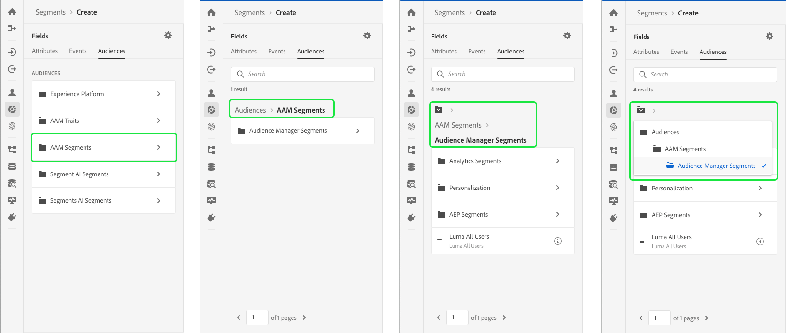
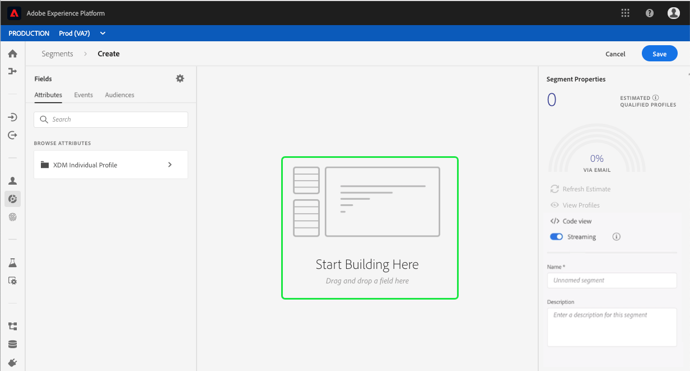
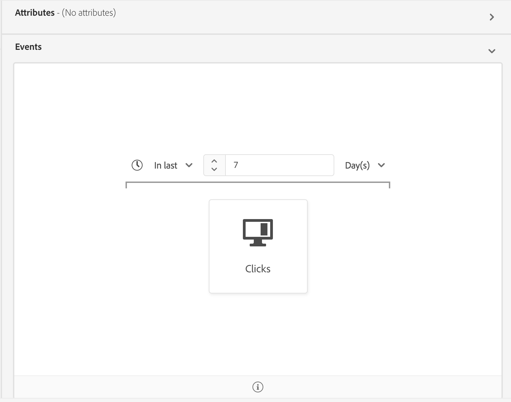
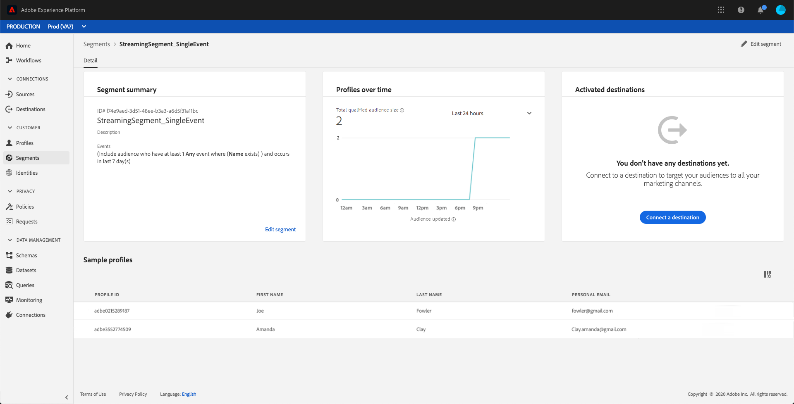

# [!DNL Segment Builder] guia do usuário

[!DNL Adobe Experience Platform Segmentation Service] fornece uma API RESTful e uma interface de usuário para criar definições de segmentos a partir de [!DNL Real-time Customer Profile] dados.

## Introdução

Trabalhar com definições de segmento requer uma compreensão dos vários [!DNL Experience Platform] serviços envolvidos com a segmentação. Antes de ler este guia do usuário, consulte a documentação dos seguintes serviços:

- [!DNL Segmentation Service](../home.md): O Serviço de segmentação permite dividir os dados armazenados em [!DNL Experience Platform] que se relacionam a indivíduos (como clientes, prospectos, usuários ou organizações) em grupos menores que compartilham características semelhantes e responderão de forma semelhante às estratégias de marketing.
- [!DNL Real-time Customer Profile](../../profile/home.md): Fornece um perfil unificado e em tempo real para o consumidor, com base em dados agregados de várias fontes.
- [!DNL Identity Service](../../identity-service/home.md): Habilita [!DNL Real-time Customer Profile] a união de identidades de fontes de dados diferentes no Platform.
- [!DNL Experience Data Model (XDM)](../../xdm/home.md): A estrutura padronizada pela qual [!DNL Platform] organiza os dados de experiência do cliente.

Também é importante saber dois termos chave que são usados por meio desse documento e entender a diferença entre eles:
- **Definição** do segmento: O conjunto de regras usado para descrever as principais características ou comportamentos de uma audiência de público alvo.
- **Audiência**: O conjunto resultante de perfis que atendem aos critérios de uma definição de segmento.

## Acessar definições de segmento

Para começar a trabalhar com definições de segmentos no [!DNL Adobe Experience Platform], clique em **[!UICONTROL Segmentos]** na navegação à esquerda. Para ver todas as definições de segmento para sua organização, clique na guia *[!UICONTROL Procurar]* . Essa visualização lista informações sobre a definição do segmento, incluindo o método de avaliação, a data de criação e a data da última modificação.

O método de avaliação pode ser streaming ou lote. Segmentos de transmissão são constantemente avaliados à medida que os dados entram no sistema. Os segmentos de lote são avaliados de acordo com uma programação definida.

Os segmentos de lote têm informações adicionais exibidas, mostrando a última data de avaliação e a próxima data de avaliação do lote.

Clicar em **[!UICONTROL Criar segmento]** no canto superior direito abre a área de trabalho do Construtor de segmentos, onde você pode começar a criar uma definição de segmento.

## [!DNL Segment Builder] espaço de trabalho

[!DNL Segment Builder] fornece uma área de trabalho avançada que permite interagir com elementos [!DNL Profile] de dados. A área de trabalho fornece controles intuitivos para criar e editar regras, como os blocos de arrastar e soltar usados para representar propriedades de dados.

## Elementos básicos para definição de segmento

Os elementos básicos das definições de segmentos são **[!UICONTROL Atributos]** e **[!UICONTROL Eventos]**. Além disso, os atributos e eventos contidos nas **[!UICONTROL Audiências]** existentes também podem ser usados como componentes para novas definições.

É possível ver esses blocos de construção na seção *[!UICONTROL Campos]* no lado esquerdo da [!DNL Segment Builder] área de trabalho. *[!UICONTROL Os campos]* contêm uma guia para cada um dos blocos de construção principais: **[!UICONTROL Atributos]**, **[!UICONTROL Eventos]** e **[!UICONTROL Audiências]**.

### Atributos

A guia **[!UICONTROL Atributos]** permite navegar pelos [!DNL Profile] atributos pertencentes à [!DNL XDM Individual Profile] classe. Cada pasta pode ser expandida para revelar atributos adicionais, onde cada atributo é um bloco que pode ser arrastado para a tela do construtor de regras no centro da área de trabalho. A tela [do construtor de](#rule-builder-canvas) regras é discutida com mais detalhes posteriormente neste guia.

### Eventos

A guia **[!UICONTROL Eventos]** permite que você crie uma audiência com base em eventos ou ações realizadas usando elementos de dados XDM ExperienceEvent. Você também pode encontrar Tipos de evento na guia **[!UICONTROL Eventos]** , que são uma coleção de eventos usados com frequência para permitir que você crie seus segmentos mais rapidamente.

Além de poder procurar [!DNL ExperienceEvent] elementos, também é possível procurar Tipos de evento. Os Tipos de evento usam a mesma lógica de codificação [!DNL ExperienceEvents], sem exigir que você pesquise pela [!DNL XDM ExperienceEvent] classe procurando pelo evento correto. Por exemplo, usar a barra de pesquisa para pesquisar &quot;carrinho&quot; retorna os Tipos de evento &quot;[!UICONTROL AddCart]&quot; e &quot;[!UICONTROL RemoveCart]&quot;, que são duas ações de carrinho muito usadas ao criar definições de segmentos.

Qualquer tipo de componente pode ser pesquisado digitando seu nome na barra de pesquisa, que usa a sintaxe [de pesquisa de](https://docs.microsoft.com/en-us/azure/search/query-lucene-syntax)Lucene. Os resultados da pesquisa começam a ser preenchidos à medida que palavras inteiras são inseridas. Por exemplo, para criar uma regra baseada no campo XDM `ExperienceEvent.commerce.productViews`, digite &quot;visualizações de produto&quot; no start de pesquisa. Depois que a palavra &quot;produto&quot; é digitada, os resultados da pesquisa começam a ser exibidos. Cada resultado inclui a hierarquia de objetos à qual pertence.

>[!NOTE]
>
>Os campos de schema personalizados definidos pela sua organização podem levar até 24 horas para serem exibidos e se tornarem disponíveis para uso nas regras de criação.

Você pode arrastar e soltar facilmente [!DNL ExperienceEvents] e [!UICONTROL Tipos de evento] na definição do segmento.

Por padrão, somente os campos de schema preenchidos do armazenamento de dados são exibidos. Isso inclui [!UICONTROL Tipos de evento]. Se a lista de [!UICONTROL Tipos de evento] não estiver visível, ou se você só puder selecionar &quot;[!UICONTROL Qualquer]&quot; como um [!UICONTROL Tipo de evento], clique no ícone de engrenagem ao lado de *[!UICONTROL Campos]* e selecione **[!UICONTROL Mostrar schema]** ** XDM completo em Campos disponíveis. Clique no ícone de engrenagem novamente para voltar à guia *[!UICONTROL Campos]* e agora você pode visualização em vários [!UICONTROL Tipos de evento] e campos de schema, independentemente de conterem ou não dados.

### Audiences

A guia **[!UICONTROL Audiência]** lista todas as audiências importadas de fontes externas, como Adobe Audience Manager, bem como as audiências criadas dentro [!DNL Experience Platform].

Na guia [!UICONTROL Audiência] , é possível visualizar todas as fontes disponíveis como um grupo de pastas. À medida que você clica nessas pastas, as subpastas e audiências disponíveis podem ser vistas. Além disso, você pode clicar no ícone de pasta (como mostrado na imagem da extrema direita) para visualização da estrutura de pastas (uma marca de seleção indica a pasta em que você está atualmente) e navegar facilmente de volta pelas pastas clicando no nome de uma pasta na árvore.

Você pode passar o mouse sobre a ⓘ ao lado de uma audiência para visualização com informações sobre a audiência, incluindo sua ID, descrição e hierarquia de pastas para localizar a audiência.

Você também pode pesquisar [!UICONTROL Audiências] usando a barra de pesquisa, que utiliza a sintaxe [de pesquisa de](https://docs.microsoft.com/en-us/azure/search/query-lucene-syntax)Lucene. Na guia *[!UICONTROL Audiência]* , selecionar uma pasta de nível superior faz com que a barra de pesquisa apareça, permitindo que você pesquise dentro dessa pasta. Os resultados da pesquisa só começam a ser preenchidos depois que palavras inteiras são inseridas. Por exemplo, para localizar uma [!UICONTROL Audiência] chamada `Online Shoppers`, start digitando &quot;Online&quot; na barra de pesquisa. Depois que a palavra &quot;Online&quot; for digitada na íntegra, os resultados da pesquisa contendo a palavra &quot;Online&quot; serão exibidos.

## Tela do construtor de regras {#rule-builder-canvas}

Uma definição de segmento é uma coleção de regras usadas para descrever as principais características ou comportamento de uma audiência de público alvo. Essas regras são criadas usando a tela *[!UICONTROL do construtor de]* regras, localizada no centro de [!DNL Segment Builder].

Para adicionar uma nova regra à definição do segmento, arraste um bloco da guia *[!UICONTROL Campos]* e solte-o na tela do construtor de regras. Você receberá então opções específicas de contexto, de acordo com o tipo de dados que está sendo adicionado. Os tipos de dados disponíveis incluem: sequências de caracteres, datas, [!DNL ExperienceEvents], [!UICONTROL Tipos de evento]e [!UICONTROL Audiências].

### Adicionar audiências

Você pode arrastar e soltar uma audiência da guia *[!UICONTROL Audiência]* na tela do construtor de regras para fazer referência à associação de audiência na nova definição de segmento. Isso permite que você inclua ou exclua a associação de audiência como um atributo na nova regra de segmento.

Para [!DNL Platform] audiências criadas usando [!DNL Segment Builder], você recebe a opção de converter a audiência no conjunto de regras que foram usadas na definição de segmento para essa audiência. Essa conversão faz uma cópia da lógica da regra, que pode ser modificada sem afetar a definição do segmento original. Certifique-se de ter salvo alterações recentes na definição do segmento antes de convertê-lo para a lógica da regra.

>[!NOTE]
>
>Ao adicionar uma audiência de uma fonte externa, somente a associação de audiência é referenciada. Não é possível converter a audiência em regras e, portanto, as regras usadas para criar a audiência original não podem ser modificadas na nova definição de segmento.

Se surgirem conflitos ao converter audiências em regras, [!DNL Segment Builder] tentará preservar ao máximo as opções existentes.

### visualização de código

Como alternativa, você pode visualização uma versão baseada em código de uma regra criada no [!DNL Segment Builder]. Depois de criar sua regra na tela do construtor de regras, você pode selecionar visualização **[!UICONTROL de]** código para ver seu segmento como PQL.

A visualização de código fornece um botão que permite copiar o valor do segmento a ser usado em chamadas de API. Para obter a versão mais recente do segmento, certifique-se de ter salvo as alterações mais recentes no segmento.

## Contêineres

As regras de segmento são avaliadas na ordem em que são listadas. Os Container permitem o controle da ordem de execução por meio do uso de query aninhados.

Depois de adicionar pelo menos um bloco à tela do construtor de regras, você pode começar a adicionar container. Para criar um novo container, clique nas elipses (...) no canto superior direito do bloco e clique em **[!UICONTROL Adicionar container]**.

Um novo container é exibido como filho do primeiro container, mas você pode ajustar a hierarquia arrastando e movendo os container. O comportamento padrão de um container é &quot;[!UICONTROL Incluir]&quot; o atributo, o evento ou a audiência fornecida. Você pode definir a regra como &quot;[!UICONTROL Excluir]&quot; perfis que correspondem aos critérios do container clicando em **[!UICONTROL Incluir]** no canto superior esquerdo do bloco e selecionando &quot;[!UICONTROL Excluir]&quot;.

Um container filho também pode ser extraído e adicionado em linha ao container pai clicando em &quot;desvincular container&quot; no container filho. Clique nas elipses (...) no canto superior direito do container filho para acessar essa opção.

Depois de clicar em **[!UICONTROL Desvincular container]** , o container filho será removido e os critérios aparecerão em linha.

>[!NOTE]
>
>Ao desvincular container, tenha cuidado para que a lógica continue a atender à definição de segmento desejada.

## Mesclar políticas

[!DNL Experience Platform] permite que você reúna dados de várias fontes e os combine para ver uma visualização completa de cada um de seus clientes individuais. Ao reunir esses dados, as políticas de mesclagem são as regras que [!DNL Platform] usam para determinar como os dados serão priorizados e quais dados serão combinados para criar um perfil.

Você pode selecionar uma política de mesclagem que corresponda à sua finalidade de marketing para essa audiência ou usar a política de mesclagem padrão fornecida por [!DNL Platform]. Você pode criar várias políticas de mesclagem exclusivas da sua organização, incluindo a criação de sua própria política de mesclagem padrão. Para obter instruções passo a passo sobre como criar políticas de mesclagem para sua organização, consulte o tutorial sobre como [trabalhar com políticas de mesclagem usando a interface do usuário](../../profile/ui/merge-policies.md).

Para selecionar uma política de mesclagem para a definição do segmento, clique no ícone de engrenagem na guia *[!UICONTROL Campos]* e use o menu *[!UICONTROL suspenso Política]de *mesclagem para selecionar a política de mesclagem que deseja usar.

## Propriedades do segmento

Ao criar uma definição de segmento, a seção Propriedades *[!UICONTROL do]* segmento no lado direito do espaço de trabalho exibe uma estimativa do tamanho do segmento resultante, permitindo que você ajuste sua definição de segmento conforme necessário antes de criar a própria audiência.

A seção Propriedades *[!UICONTROL do]* segmento também é onde você pode especificar informações importantes sobre a definição do segmento, incluindo o *[!UICONTROL Nome]* e a *[!UICONTROL Descrição]*. Os nomes de definição de segmento são usados para identificar seu segmento entre aqueles definidos pela organização e, portanto, devem ser descritivos, concisos e exclusivos.

À medida que você continua a criar sua definição de segmento, é possível visualização uma pré-visualização paginada da audiência selecionando Perfis **[!UICONTROL de]** Visualização.

>[!NOTE]
>
>As estimativas de Audiência são geradas usando um tamanho de amostra dos dados de amostra desse dia. Se houver menos de 1 milhão de entidades em sua loja de perfis, o conjunto de dados completo será usado; para entre 1 e 20 milhões de entidades, são utilizadas 1 milhão de entidades; e para mais de 20 milhões de entidades, são utilizados 5% do total de entidades. Mais informações sobre a geração de estimativas de segmentos podem ser encontradas na seção [de geração de](../tutorials/create-a-segment.md#estimate-and-preview-an-audience) estimativas do tutorial de criação de segmentos.

## Ativar a segmentação programada {#enable-scheduled-segmentation}

Depois que as definições de segmento forem criadas, você poderá avaliá-las por meio de uma avaliação sob demanda ou programada (contínua). Avaliação significa mover [!DNL Real-time Customer Profile] dados através de definições de segmento para produzir audiências correspondentes. Depois de criadas, as audiências são salvas e armazenadas para que possam ser exportadas usando [!DNL Experience Platform] APIs.

A avaliação sob demanda envolve o uso da API para realizar a avaliação e criar audiências conforme necessário, enquanto a avaliação programada (também conhecida como &quot;segmentação programada&quot;) permite criar um agendamento recorrente para avaliar definições de segmentos em um horário específico (no máximo, uma vez por dia).

A ativação das definições de segmento para avaliação programada pode ser feita usando a interface do usuário ou a API. Na interface do usuário, volte para a guia *[!UICONTROL Procurar]* em **[!UICONTROL Segmentos]** e alterne para **[!UICONTROL Avaliar todos os segmentos]**. Isso fará com que todos os segmentos sejam avaliados com base na programação definida pela sua organização.

>[!NOTE]
>
>A avaliação agendada pode ser ativada para caixas de proteção com um máximo de cinco (5) políticas de mesclagem para [!DNL XDM Individual Profile]. Se sua organização tiver mais de cinco políticas de mesclagem para [!DNL XDM Individual Profile] dentro de um único ambiente de sandbox, você não poderá usar a avaliação agendada.

No momento, os agendamentos só podem ser criados usando a API. Para obter etapas detalhadas sobre como criar, editar e trabalhar com programações usando a API, siga o tutorial para avaliar e acessar os resultados do segmento, especificamente a seção sobre avaliação [programada usando a API](../tutorials/evaluate-a-segment.md#scheduled-evaluation).

## Segmentação em streaming {#streaming-segmentation}

>[!NOTE]
>
>Para que a segmentação de fluxo funcione, o cliente precisará ativar a segmentação programada para a organização. Para obter detalhes sobre como ativar a segmentação programada, consulte [a seção anterior neste guia](#enable-scheduled-segmentation)do usuário.

Um query será avaliado automaticamente com a segmentação de streaming se atender a qualquer um dos seguintes critérios:

| Tipo de Query | Detalhes | Exemplo |
| ---------- | ------- | ------- |
| Ocorrência recebida | Qualquer definição de segmento que se refere a um único evento recebido sem nenhuma restrição de tempo. |  |
| Ocorrência recebida dentro de uma janela de tempo relativa | Qualquer definição de segmento que se refere a um único evento recebido **nos últimos sete dias**. |  |
| Ocorrência recebida que se refere a um perfil | Qualquer definição de segmento que se refere a um único evento recebido, sem restrição de tempo, e um ou mais atributos de perfil. |  |
| Ocorrência recebida que se refere a um perfil dentro de uma janela de tempo relativa | Qualquer definição de segmento que se refere a um único evento recebido e um ou mais atributos do perfil, **nos últimos sete dias**. |  |
| Vários eventos que se referem a um perfil | Qualquer definição de segmento que se refere a vários eventos **nas últimas 24 horas** e (opcionalmente) tem um ou mais atributos de perfil. |  |

A seção a seguir lista exemplos de definição de segmento que **não** serão ativados para a segmentação de streaming.

| Tipo de Query | Detalhes |
| ---------- | ------- | 
| Ocorrência recebida dentro de uma janela de tempo relativa | Se a definição do segmento se refere a um evento recebido **não** dentro do **último período** de sete dias. Por exemplo, nas **últimas duas semanas**. |  |
| Ocorrência recebida que se refere a um perfil em uma janela relativa | As seguintes opções **não** suportam a segmentação de streaming:<ul><li>Um evento recebido **não** dentro dos **últimos sete dias**.</li><li>Uma definição de segmento que inclui [!DNL Adobe Audience Manager (AAM)] segmentos ou características.</li></ul> |  |
| Vários eventos que se referem a um perfil | As seguintes opções **não** suportam a segmentação de streaming:<ul><li>Um evento que **não** ocorre dentro **das últimas 24 horas**.</li><li>Uma definição de segmento que inclui segmentos ou características de Adobe Audience Manager (AAM).</li></ul> |  |
| query de várias entidades | Os query de várias entidades **não** são suportados pela segmentação de streaming. |  |

Além disso, algumas diretrizes se aplicam ao fazer a segmentação de streaming:

| Tipo de Query | Orientação |
| ---------- | -------- |
| query de evento único | A janela de retrospectiva é limitada a **sete dias**. |
| Query com histórico de eventos | <ul><li>A janela de retrospectiva é limitada a **um dia**.</li><li>Uma condição de pedido de tempo estrita **deve** existir entre os eventos.</li><li>Somente pedidos de tempo simples (antes e depois) entre os eventos são permitidos.</li><li>Os eventos individuais **não podem** ser negados. Entretanto, todo o query **pode** ser negado.</li></ul> |

### Monitoramento da segmentação em streaming

Depois de criar um segmento habilitado para streaming, você pode monitorar os detalhes desse segmento.

Especificamente, os detalhes sobre o tamanho ** total da audiência qualificada são mostrados. Se um trabalho tiver sido executado nas últimas 24 horas, o Tamanho **[!UICONTROL de Audiência]** total do trabalho será mostrado, além de um gráfico de linha para a audiência adicionada. Caso contrário, o Tamanho **[!UICONTROL de Audiência]** estimado será exibido, além de uma linha de tendência de visualização.

Informações adicionais sobre a última avaliação de segmento podem ser encontradas clicando na bolha de informações.

### Demonstração de vídeo de segmentação contínua

O vídeo a seguir é destinado a suportar sua compreensão da segmentação de streaming. Mostra um exemplo de experiência do cliente seguido de um rápido tour dos principais recursos na [!DNL Platform] interface.

>[!VIDEO](https://video.tv.adobe.com/v/36184?quality=12&learn=on)

## Violações da política DULE

>[!NOTE]
>
>As violações da política DULE só se aplicam se você estiver criando um segmento que foi atribuído a um destino.

Depois que você terminar de criar seu segmento, ele será analisado [!DNL Data Governance] para garantir que não haja violações de política dentro do segmento. Para obter detalhes sobre DULE e violações de política, consulte a visão geral [do rótulo de uso de](../../data-governance/labels/overview.md)dados.

## Próximos passos e recursos adicionais {#next-steps}

O Construtor de segmentos fornece um fluxo de trabalho avançado que permite isolar audiências comercializáveis dos [!DNL Real-time Customer Profile] dados. Depois de ler este guia, você pode:

- Crie definições de segmento usando uma combinação de atributos, eventos e audiências existentes como blocos de construção.
- Use a tela e os container do construtor de regras para controlar a ordem na qual as regras de segmento são executadas.
- Estimativas de Visualização de sua audiência potencial, permitindo que você ajuste suas definições de segmento conforme necessário.
- Ative todas as definições de segmento para segmentação programada.
- Habilitar definições de segmento especificadas para a segmentação de streaming.

Para saber mais sobre [!DNL Segmentation Service], continue lendo a documentação e complemente sua aprendizagem assistindo aos vídeos abaixo. Para obter instruções passo a passo sobre como trabalhar com [!DNL Segmentation Service] a [!DNL Segmentation Service] API, consulte o tutorial de [criação de segmentos de audiência usando APIs](../tutorials/create-a-segment.md) .

>[!WARNING]
>
> A [!DNL Platform] interface do usuário exibida nos vídeos a seguir está desatualizada. Consulte a documentação acima para obter as capturas de tela e a funcionalidade mais recentes da interface do usuário.

**Criar um segmento:**

>[!VIDEO](https://video.tv.adobe.com/v/27254?quality=12&learn=on)

**Criar um segmento dinâmico:**

>[!VIDEO](https://video.tv.adobe.com/v/27428?quality=12&learn=on)
