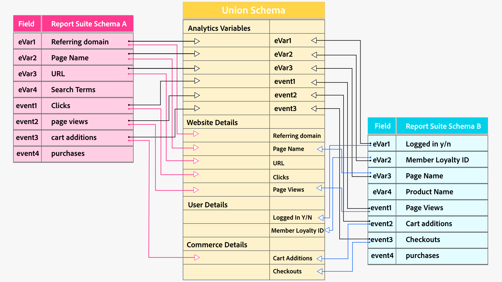
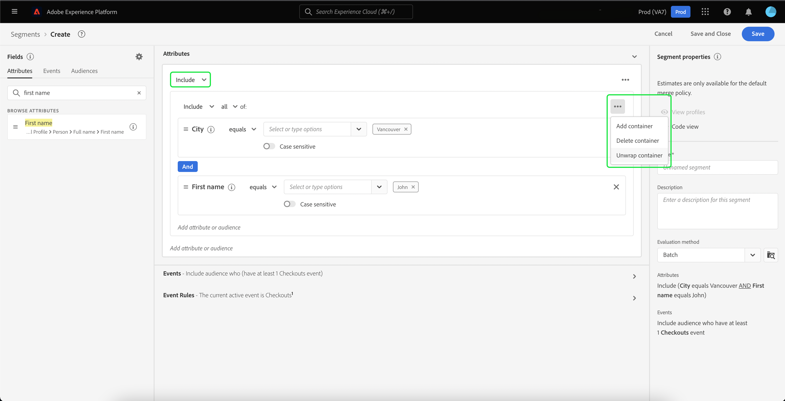

# [!DNL Segment Builder] Guia da interface do usuário

[!DNL Segment Builder] O fornece um espaço de trabalho avançado com o qual você pode interagir [!DNL Profile] elementos de dados. O espaço de trabalho oferece controles intuitivos para criar e editar regras, como blocos de arrastar e soltar usados para representar propriedades de dados.

## Elementos básicos da definição de segmentos

Os elementos básicos das definições de segmento são atributos e eventos. Além disso, os atributos e eventos contidos nos públicos-alvo existentes também podem ser usados como componentes para novas definições.

Você pode ver esses elementos fundamentais no **[!UICONTROL Campos]** no lado esquerdo do [!DNL Segment Builder] espaço de trabalho. **[!UICONTROL Campos]** contém uma guia para cada um dos blocos fundamentais: &quot;[!UICONTROL Atributos]&quot;, &quot;[!UICONTROL Eventos]&quot;, e &quot;[!UICONTROL Públicos-alvo]&quot;.

### Atributos

O **[!UICONTROL Atributos]** permite navegar [!DNL Profile] atributos pertencentes ao [!DNL XDM Individual Profile] classe . Cada pasta pode ser expandida para revelar atributos adicionais, onde cada atributo é um bloco que pode ser arrastado para a tela do construtor de regras no centro do espaço de trabalho. O [tela do construtor de regras](#rule-builder-canvas) O é discutido com mais detalhes posteriormente neste guia.

### Eventos

O **[!UICONTROL Eventos]** permite criar um público-alvo com base em eventos ou ações que ocorreram usando [!DNL XDM ExperienceEvent] elementos de dados. Você também pode encontrar Tipos de evento na seção **[!UICONTROL Eventos]** , que são uma coleção de eventos comumente usados para permitir que você crie seus segmentos mais rapidamente.

Além de poder procurar por [!DNL ExperienceEvent] , você também pode pesquisar por Tipos de evento. Os Tipos de evento usam a mesma lógica de codificação que [!DNL ExperienceEvents], sem exigir que você pesquise no [!DNL XDM ExperienceEvent] classe que procura o evento correto. Por exemplo, usar a barra de pesquisa para pesquisar &quot;carrinho&quot; retorna os Tipos de evento &quot;[!UICONTROL AddCart]&quot; e &quot;[!UICONTROL RemoverCarrinho]&quot;, que são duas ações de carrinho muito usadas ao criar definições de segmento.

Qualquer tipo de componente pode ser pesquisado digitando seu nome na barra de pesquisa, que usa [Sintaxe de pesquisa de Lucene](https://docs.microsoft.com/en-us/azure/search/query-lucene-syntax). Os resultados da pesquisa começam a ser preenchidos à medida que palavras inteiras são inseridas. Por exemplo, para criar uma regra baseada no campo XDM `ExperienceEvent.commerce.productViews`, comece digitando &quot;visualizações de produto&quot; no campo de pesquisa. Depois que a palavra &quot;produto&quot; é digitada, os resultados da pesquisa começam a aparecer. Cada resultado inclui a hierarquia de objeto à qual pertence.

>[!NOTE]
>
>Os campos de esquema personalizados definidos pela organização podem levar até 24 horas para serem exibidos e ficarem disponíveis para uso na criação de regras.

Você pode arrastar e soltar facilmente [!DNL ExperienceEvents] e &quot;[!UICONTROL Tipos de evento]&quot; na definição do seu segmento.

Por padrão, somente os campos de esquema preenchidos do armazenamento de dados são mostrados. Isso inclui &quot;[!UICONTROL Tipos de evento]&quot;. Se a variável[!UICONTROL Tipos de evento]&quot; lista não está visível ou você só pode selecionar &quot;[!UICONTROL Qualquer]&quot; como um &quot;[!UICONTROL Tipo de evento]&quot;, selecione o **ícone de engrenagem** ao lado de **[!UICONTROL Campos]**, em seguida selecione **[!UICONTROL Mostrar esquema XDM completo]** under **[!UICONTROL Campos disponíveis]**. Selecione o **ícone de engrenagem** novamente para retornar ao **[!UICONTROL Campos]** e agora você deve ser capaz de exibir vários &quot;[!UICONTROL Tipos de evento]&quot; e campos de esquema, independentemente de conterem ou não dados.

#### Conjuntos de dados do conjunto de relatórios Adobe Analytics

Você pode usar dados de um único ou vários conjuntos de relatórios do Adobe Analytics como eventos na segmentação.

Ao usar dados de um único conjunto de relatórios do Analytics, a Platform adicionará automaticamente descritores e nomes amigáveis às eVars, facilitando a localização desses campos em [!DNL Segment Builder].

Ao usar dados de vários conjuntos de relatórios do Analytics, a Platform **cannot** adicione descritores ou nomes amigáveis automaticamente a eVars. Como resultado, antes de usar os dados dos conjuntos de relatórios do Analytics, é necessário mapear para campos XDM. Mais informações sobre o mapeamento de variáveis do Analytics para XDM podem ser encontradas no [Guia de conexão de origem do Adobe Analytics](../../sources/tutorials/ui/create/adobe-applications/analytics.md#mapping).

Por exemplo, considere uma situação em que você tinha dois conjuntos de relatórios com as seguintes variáveis:

| Campo | Esquema A do conjunto de relatórios | Esquema B do conjunto de relatórios |
| ----- | --------------------- | --------------------- |
| eVar1 | Domínio de referência | Logon em S/N |
| eVar2 | Nome da página | ID de Fidelidade do Membro |
| eVar3 | URL | Nome da página |
| eVar4 | Pesquisar termos | Nome do produto |
| evento 1 | Cliques | Page Views |
| evento 2 | Exibições de página | Adições ao carrinho |
| event3 | Adições ao carrinho | Finalizações |
| event4 | Compras | Compras |

Nesse caso, você pode mapear os dois conjuntos de relatórios com o seguinte schema:

>[!NOTE]
>
>Embora os valores de eVar genéricos ainda sejam preenchidos, você deve **not** use-as nas definições do segmento (se possível), já que os valores podem ter significados diferentes daqueles originalmente presentes nos relatórios.

Depois que os conjuntos de relatórios tiverem sido mapeados, você poderá usar esses campos recém-mapeados em seus fluxos de trabalho e segmentação relacionados ao perfil.

| Cenário | Experiência do Esquema de União | Variável genérica de segmentação | Variável mapeada de segmentação |
| -------- | ----------------------- | ----------------------------- | ---------------------------- |
| Conjunto de relatórios único | O descritor de nome amigável é incluído com variáveis genéricas.   **Exemplo:** Nome da página (eVar2) | <ul><li>Descritor de nome amigável incluído com variáveis genéricas</li><li>As consultas usam dados do conjunto de dados específico, pois é o único</li></ul> | As consultas podem usar dados do Adobe Analytics e, possivelmente, outras fontes. |
| Vários conjuntos de relatórios | Nenhum descritor de nome simples é incluído nas variáveis genéricas.   **Exemplo:** eVar2 | <ul><li>Qualquer campo com vários descritores é exibido como genérico. Isso significa que nenhum nome amigável é exibido na interface do usuário.</li><li>As consultas podem usar dados de qualquer conjunto de dados que contenha o eVar, o que pode resultar em resultados mistos ou incorretos.</li></ul> | As consultas usam resultados combinados corretamente de vários conjuntos de dados. |

### Públicos-alvo

O **[!UICONTROL Públicos-alvo]** lista todos os públicos-alvo importados de fontes externas, como o Adobe Audience Manager, e os públicos-alvo criados no [!DNL Experience Platform].

No **[!UICONTROL Públicos-alvo]** , é possível ver todas as fontes disponíveis como um grupo de pastas. À medida que você seleciona as pastas, as subpastas e os públicos-alvo disponíveis podem ser vistos. Além disso, é possível selecionar o ícone de pasta (como mostrado na imagem da extrema direita) para visualizar a estrutura de pastas (uma marca de seleção indica a pasta em que você está no momento) e navegar facilmente de volta pelas pastas selecionando o nome de uma pasta na árvore.

Você pode passar o mouse sobre a ⓘ ao lado de um público-alvo para exibir as informações sobre ele, incluindo a ID, a descrição e a hierarquia de pastas para localizar o público-alvo.

Você também pode pesquisar públicos-alvo usando a barra de pesquisa, que utiliza [Sintaxe de pesquisa de Lucene](https://docs.microsoft.com/en-us/azure/search/query-lucene-syntax). No **[!UICONTROL Públicos-alvo]** , selecionar uma pasta de nível superior faz com que a barra de pesquisa apareça, permitindo pesquisar dentro dessa pasta. Os resultados da pesquisa só começam a ser preenchidos depois que palavras inteiras são inseridas. Por exemplo, para encontrar um público-alvo chamado `Online Shoppers`, comece digitando &quot;Online&quot; na barra de pesquisa. Quando a palavra &quot;Online&quot; tiver sido digitada na íntegra, os resultados da pesquisa contendo a palavra &quot;Online&quot; serão exibidos.

## Tela do construtor de regras {#rule-builder-canvas}

Uma definição de segmento é uma coleção de regras usadas para descrever as principais características ou o comportamento de um público-alvo. Essas regras são criadas usando a tela do construtor de regras, localizada no centro de [!DNL Segment Builder].

Para adicionar uma nova regra à definição do segmento, arraste um bloco do **[!UICONTROL Campos]** e solte-a na tela do construtor de regras. Em seguida, você verá opções específicas do contexto de acordo com o tipo de dados que está sendo adicionado. Os tipos de dados disponíveis incluem: cadeias de caracteres, datas, [!DNL ExperienceEvents], &quot;[!UICONTROL Tipos de evento]&quot; e públicos-alvo.

>[!IMPORTANT]
>
>As alterações mais recentes no Adobe Experience Platform atualizaram o uso da variável `OR` e `AND` operadores lógicos entre eventos. Essas atualizações não afetarão os segmentos existentes. No entanto, todas as atualizações subsequentes de segmentos existentes e novas criações de segmentos serão afetadas por essas alterações. Leia o [atualização das constantes de tempo](./segment-refactoring.md) para obter mais informações.

### Adição de públicos-alvo

Você pode arrastar e soltar um público-alvo da variável **[!UICONTROL Público]** na tela do construtor de regras para fazer referência à associação do público-alvo na nova definição de segmento. Isso permite incluir ou excluir a associação do público-alvo como um atributo na nova regra de segmento.

Para [!DNL Platform] públicos-alvo criados com [!DNL Segment Builder], você tem a opção de converter o público-alvo no conjunto de regras que foram usadas na definição do segmento para esse público-alvo. Essa conversão faz uma cópia da lógica da regra, que pode ser modificada sem afetar a definição do segmento original. Certifique-se de ter salvo as alterações recentes na definição do segmento antes de convertê-lo para a lógica da regra.

>[!NOTE]
>
>Ao adicionar um público-alvo de uma fonte externa, somente a associação de público-alvo é referenciada. Não é possível converter o público-alvo em regras e, portanto, as regras usadas para criar o público-alvo original não podem ser modificadas na nova definição de segmento.

Se surgirem conflitos ao converter públicos-alvo em regras, [!DNL Segment Builder] O tentará preservar ao máximo as opções existentes.

### Visualização de código

Como alternativa, você pode exibir uma versão baseada em código de uma regra criada na [!DNL Segment Builder]. Depois de criar sua regra na tela do construtor de regras, você pode selecionar **[!UICONTROL Visualização de código]** para ver seu segmento como PQL.

A Visualização de código fornece um botão que permite copiar o valor do segmento para usar em chamadas de API. Para obter a versão mais recente do segmento, certifique-se de ter salvo suas alterações mais recentes no segmento.

### Funções de agregação

Um agregado em [!DNL Segment Builder] é um cálculo em um grupo de atributos XDM cujo tipo de dados é um número (um número duplo ou um inteiro). As quatro funções de agregação compatíveis no Construtor de segmentos são SUM, MÉDIA, MIN e MAX.

Para criar uma função de agregação, selecione um evento no painel esquerdo e insira-o no [!UICONTROL Eventos] contêiner.

Depois de colocar o evento no contêiner Eventos, selecione o ícone elipses (...), seguido por **[!UICONTROL Agregado]**.

A agregação agora é adicionada. Agora é possível selecionar a função de agregação, escolher qual atributo agregar, a função de igualdade e o valor. Para o exemplo abaixo, esse segmento qualificaria qualquer perfil que tivesse uma soma de valores comprados maior que $100, mesmo se cada compra individual fosse menor que $100.

### Funções de contagem {#count-functions}

Funções de contagem no Construtor de segmentos são usadas para procurar eventos específicos e contar o número de vezes que foram feitas. As funções de contagem compatíveis no Construtor de segmentos são &quot;No mínimo&quot;, &quot;No máximo&quot;, &quot;Exatamente&quot;, &quot;Entre&quot; e &quot;Todos&quot;.

Para criar uma função de contagem, selecione um evento no painel esquerdo e insira-o no [!UICONTROL Eventos] contêiner.

Depois de colocar o evento no contêiner de Eventos, selecione o [!UICONTROL Pelo menos 1] botão.

A função de contagem agora é adicionada. Agora é possível selecionar a função de contagem e o valor da função . O exemplo abaixo seria incluir qualquer evento que tenha pelo menos um clique.

## Contêineres

As regras de segmento são avaliadas na ordem em que são listadas. Os containers permitem controlar a ordem de execução por meio do uso de consultas aninhadas.

Depois de ter adicionado pelo menos um bloco à tela do construtor de regras, você pode começar a adicionar contêineres. Para criar um novo contêiner, selecione os elipses (..) no canto superior direito do bloco e selecione **[!UICONTROL Adicionar contêiner]**.

Um novo contêiner é exibido como filho do primeiro contêiner, mas você pode ajustar a hierarquia arrastando e movendo os contêineres. O comportamento padrão de um contêiner é &quot;[!UICONTROL Incluir]&quot; o atributo, evento ou público-alvo fornecido. É possível definir a regra como &quot;[!UICONTROL Excluir]&quot; perfis que correspondem aos critérios do contêiner ao selecionar **[!UICONTROL Incluir]** no canto superior esquerdo do bloco e selecionando &quot;[!UICONTROL Excluir]&quot;.

Um contêiner filho também pode ser extraído e adicionado em linha ao contêiner pai ao selecionar &quot;cancelar o contêiner&quot; no contêiner filho. Selecione as reticências (...) no canto superior direito do contêiner filho para acessar essa opção.

Depois de selecionar **[!UICONTROL Desenrolar contêiner]** o contêiner filho é removido e os critérios são exibidos em linha.

>[!NOTE]
>
>Ao desvincular contêineres, tenha cuidado para que a lógica continue a atender à definição de segmento desejada.

## Mesclar políticas

[!DNL Experience Platform] O permite reunir dados de várias fontes e combiná-los para ver uma visualização completa de cada um dos clientes individuais. Ao unir esses dados, as políticas de mesclagem são as regras que [!DNL Platform] O usa o para determinar como os dados serão priorizados e quais dados serão combinados para criar um perfil.

Você pode selecionar uma política de mesclagem que corresponda à sua finalidade de marketing para esse público-alvo ou usar a política de mesclagem padrão fornecida por [!DNL Platform]. É possível criar várias políticas de mesclagem exclusivas de sua organização, incluindo a criação de sua própria política de mesclagem padrão. Para obter instruções passo a passo sobre como criar políticas de mesclagem para sua organização, comece lendo o [visão geral das políticas de mesclagem](../../profile/merge-policies/overview.md).

Para selecionar uma política de mesclagem para a definição do seu segmento, selecione o ícone de engrenagem na **[!UICONTROL Campos]** , em seguida, use a **[!UICONTROL Política de Mesclagem]** menu suspenso para selecionar a política de mesclagem que deseja usar.

## Propriedades do segmento

Ao criar uma definição de segmento, a variável **[!UICONTROL Propriedades do segmento]** A seção no lado direito do espaço de trabalho exibe uma estimativa do tamanho do segmento resultante, permitindo ajustar a definição do segmento, conforme necessário, antes de criar o próprio público-alvo.

O **[!UICONTROL Propriedades do segmento]** também é onde você pode especificar informações importantes sobre a definição do segmento, incluindo o nome e a descrição. Os nomes de definição de segmento são usados para identificar seu segmento entre aqueles definidos pela organização e, portanto, devem ser descritivos, concisos e exclusivos.

À medida que você continua a criar a definição do segmento, é possível visualizar uma visualização paginada do público-alvo selecionando **[!UICONTROL Exibir perfis]**.

>[!NOTE]
>
>As estimativas de público-alvo são geradas usando um tamanho de amostra dos dados de amostra desse dia. Se houver menos de 1 milhão de entidades em seu armazenamento de perfil, o conjunto de dados completo será usado; para entre 1 e 20 milhões de entidades, são utilizadas 1 milhão de entidades; e para mais de 20 milhões de entidades, são utilizados 5% do total de entidades. Mais informações sobre a geração de estimativas de segmento podem ser encontradas na seção [seção de geração de estimativa](../tutorials/create-a-segment.md#estimate-and-preview-an-audience) do tutorial de criação de segmentos.

## Próximas etapas {#next-steps}

O Construtor de segmentos fornece um fluxo de trabalho avançado que permite isolar públicos comercializáveis do [!DNL Real-time Customer Profile] dados. Após a leitura deste guia, você deve ser capaz de:

- Crie definições de segmento usando uma combinação de atributos, eventos e públicos-alvo existentes como blocos de construção.
- Use a tela e os contêineres do construtor de regras para controlar a ordem em que as regras de segmento são executadas.
- Visualize estimativas do seu público-alvo potencial, permitindo ajustar as definições do segmento, conforme necessário.
- Ativar todas as definições de segmento para segmentação agendada.
- Ativar definições de segmento especificadas para a segmentação de fluxo.

Para saber mais sobre [!DNL Segmentation Service], continue lendo a documentação e complemente seu aprendizado assistindo aos vídeos relacionados. Para saber mais sobre as outras partes do [!DNL Segmentation Service] Por favor, leia a [[!DNL Segmentation Service] guia do usuário](./overview.md)
