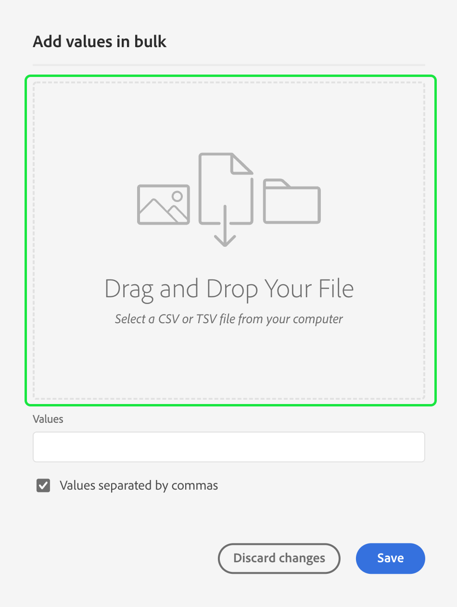
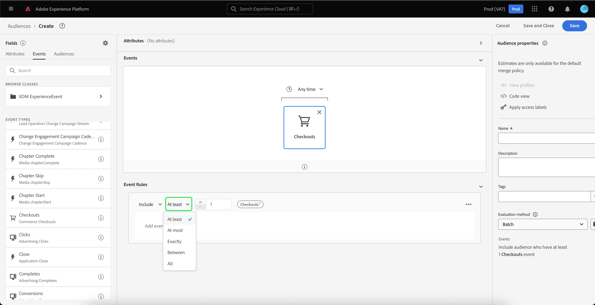

# [!DNL Segment Builder] Guia da interface do usuário

[!DNL Segment Builder] O fornece um espaço de trabalho avançado que permite a você interagir com o [!DNL Profile] elementos de dados. O espaço de trabalho fornece controles intuitivos para criar e editar regras, como arrastar e soltar blocos usados para representar propriedades de dados.

## Blocos de construção de definição de segmento {#building-blocks}

>[!CONTEXTUALHELP]
>id="platform_segments_createsegment_segmentbuilder_fields"
>title="Campos"
>abstract="Os três tipos de campo que compõem uma definição de segmento são atributos, eventos e públicos-alvo. Os atributos permitem usar atributos de perfil que pertencem à classe de perfil individual XDM, os eventos permitem criar um público com base em ações ou eventos que ocorrem usando elementos de dados XDM ExperienceEvent e os públicos permitem usar públicos importados de fontes externas."

Os blocos fundamentais das definições de segmento são atributos e eventos. Além disso, os atributos e eventos contidos nos públicos-alvo existentes podem ser usados como componentes para novas definições.

Você pode ver esses blocos fundamentais na **[!UICONTROL Campos]** no lado esquerdo da [!DNL Segment Builder] espaço de trabalho. **[!UICONTROL Campos]** contém uma guia para cada um dos blocos de construção principais: &quot;[!UICONTROL Atributos]&quot;, &quot;[!UICONTROL Eventos]&quot;, e &quot;[!UICONTROL Públicos-alvo]&quot;.

### Atributos

A variável **[!UICONTROL Atributos]** permite navegar [!DNL Profile] atributos pertencentes ao [!DNL XDM Individual Profile] classe. Cada pasta pode ser expandida para revelar atributos adicionais, em que cada atributo é um bloco que pode ser arrastado para a tela do construtor de regras no centro do espaço de trabalho. A variável [tela do construtor de regras](#rule-builder-canvas) O é abordado com mais detalhes posteriormente neste guia.

### Eventos

A variável **[!UICONTROL Eventos]** permite criar um público-alvo com base em eventos ou ações que ocorreram usando [!DNL XDM ExperienceEvent] elementos de dados. Você também pode encontrar Tipos de evento na **[!UICONTROL Eventos]** , que são uma coleção de eventos comumente usados para permitir que você crie suas definições de segmento mais rapidamente.

Além de poder navegar por [!DNL ExperienceEvent] elementos, você também pode pesquisar por Tipos de evento. Os Tipos de evento usam a mesma lógica de codificação que [!DNL ExperienceEvents], sem exigir que você pesquise no [!DNL XDM ExperienceEvent] classe procurando o evento correto. Por exemplo, usar a barra de pesquisa para pesquisar &quot;carrinho&quot; retorna os Tipos de evento &quot;[!UICONTROL AddCart]&quot; e &quot;[!UICONTROL Remover carrinho]&quot;, que são duas ações de carrinho muito usadas ao criar definições de segmento.

Qualquer tipo de componente pode ser pesquisado digitando seu nome na barra de pesquisa, que usa [Sintaxe de pesquisa do Lucene](https://docs.microsoft.com/en-us/azure/search/query-lucene-syntax). Os resultados da pesquisa começam a ser preenchidos à medida que palavras inteiras são inseridas. Por exemplo, para criar uma regra com base no campo XDM `ExperienceEvent.commerce.productViews`, comece digitando &quot;visualizações de produto&quot; no campo de pesquisa. Após digitar a palavra &quot;produto&quot;, os resultados da pesquisa começam a aparecer. Cada resultado inclui a hierarquia de objetos à qual ele pertence.

>[!NOTE]
>
>Os campos de esquema personalizados definidos por sua organização podem levar até 24 horas para serem exibidos e disponibilizados para uso nas regras de criação.

Em seguida, é possível arrastar e soltar facilmente [!DNL ExperienceEvents] e &quot;[!UICONTROL Tipos de evento]&quot; na definição do segmento.

Por padrão, somente os campos de esquema preenchidos no armazenamento de dados são mostrados. Isso inclui &quot;[!UICONTROL Tipos de evento]&quot;. Se a variável &quot;[!UICONTROL Tipos de evento]A lista &quot;não está visível ou você só pode selecionar&quot;[!UICONTROL Qualquer]&quot; como um &quot;[!UICONTROL Tipo de evento]&quot;, selecione a variável **ícone de engrenagem** ao lado de **[!UICONTROL Campos]** e selecione **[!UICONTROL Mostrar esquema XDM completo]** em **[!UICONTROL Campos disponíveis]**. Selecione o **ícone de engrenagem** novamente para retornar ao **[!UICONTROL Campos]** e agora você poderá exibir vários &quot;[!UICONTROL Tipos de evento]&quot; e campos de esquema, independentemente de conterem ou não dados.

#### Conjuntos de dados do conjunto de relatórios do Adobe Analytics

Você pode usar dados de um único conjunto de relatórios do Adobe Analytics ou de vários conjuntos de relatórios como eventos dentro da segmentação.

Ao usar dados de um único conjunto de relatórios do Analytics, a Platform adicionará automaticamente descritores e nomes amigáveis às eVars, facilitando a localização desses campos no [!DNL Segment Builder].

Ao usar dados de vários conjuntos de relatórios do Analytics, a Platform **não é possível** adicionar descritores ou nomes amigáveis automaticamente às eVars. Como resultado, antes de usar os dados dos conjuntos de relatórios do Analytics, você deve mapear para campos XDM. Mais informações sobre como mapear variáveis do Analytics para o XDM podem ser encontradas na [Guia de conexão de origem do Adobe Analytics](../../sources/tutorials/ui/create/adobe-applications/analytics.md#mapping).

Por exemplo, considere uma situação em que você tinha dois conjuntos de relatórios com as seguintes variáveis:

| Campo | Esquema A do conjunto de relatórios | Esquema B do conjunto de relatórios |
| ----- | --------------------- | --------------------- |
| eVar1 | Domínio de referência | Conectado em S/N |
| eVar2 | Nome da página | ID de fidelidade do membro |
| eVar3 | URL | Nome da página |
| eVar4 | Pesquisar termos | Nome do produto |
| evento 1 | Cliques | Page Views |
| evento 2 | Page Views | Adições ao carrinho |
| event3 | Adições ao carrinho | Finalizações |
| event4 | Compras | Compras |

Nesse caso, você pode mapear os dois conjuntos de relatórios com o seguinte esquema:

>[!NOTE]
>
>Embora os valores de eVar genéricos ainda sejam preenchidos, você deve **não** use-os nas definições de segmento (se possível), já que os valores podem ter significados diferentes do que eram originalmente em seus relatórios.

Depois que os conjuntos de relatórios forem mapeados, você poderá usar esses campos recém-mapeados em seus fluxos de trabalho e segmentação relacionados ao perfil.

| Cenário | Experiência do esquema de união | Variável genérica de segmentação | Variável mapeada de segmentação |
| -------- | ----------------------- | ----------------------------- | ---------------------------- |
| Conjunto de relatórios único | O descritor de nome amigável está incluído nas variáveis genéricas.   **Exemplo:** Nome da página (eVar 2) | <ul><li>Descritor de nome amigável incluído com variáveis genéricas</li><li>Os queries usam dados do conjunto de dados específico, pois ele é o único</li></ul> | Os queries podem usar dados do Adobe Analytics e possivelmente outras fontes. |
| Vários conjuntos de relatórios | Nenhum descritor de nome simples é incluído com variáveis genéricas.   **Exemplo:** EVAR 2 | <ul><li>Qualquer campo com vários descritores é exibido como genérico. Isso significa que nenhum nome amigável é exibido na interface do usuário.</li><li>Os queries podem usar dados de qualquer conjunto de dados que contenha o eVar, o que pode resultar em resultados mistos ou incorretos.</li></ul> | As consultas usam os resultados combinados corretamente de vários conjuntos de dados. |

### Públicos-alvo

A variável **[!UICONTROL Públicos-alvo]** A guia lista todos os públicos-alvo importados de fontes externas, como o Adobe Audience Manager, bem como os públicos-alvo criados no [!DNL Experience Platform].

No **[!UICONTROL Públicos-alvo]** você pode ver todas as fontes disponíveis como um grupo de pastas. À medida que você seleciona as pastas, as subpastas e os públicos-alvo disponíveis podem ser vistos. Além disso, você pode selecionar o ícone de pasta (como mostrado na imagem à direita) para visualizar a estrutura de pastas (uma marca de seleção indica a pasta em que você está no momento) e navegar facilmente de volta pelas pastas selecionando o nome de uma pasta na árvore.

Você pode passar o mouse sobre a ⓘ ao lado de um público-alvo para ver informações sobre ele, incluindo a ID, a descrição e a hierarquia de pastas para localizá-lo.

Você também pode pesquisar públicos-alvo usando a barra de pesquisa, que utiliza [Sintaxe de pesquisa do Lucene](https://docs.microsoft.com/en-us/azure/search/query-lucene-syntax). No **[!UICONTROL Públicos-alvo]** , selecionando uma pasta de nível superior faz com que a barra de pesquisa apareça, permitindo pesquisar dentro dessa pasta. Os resultados da pesquisa só começam a ser preenchidos depois que palavras inteiras são inseridas. Por exemplo, para encontrar um público-alvo chamado `Online Shoppers`, comece digitando &quot;Online&quot; na barra de pesquisa. Quando a palavra &quot;on-line&quot; tiver sido digitada na íntegra, os resultados da pesquisa contendo a palavra &quot;on-line&quot; serão exibidos.

## Tela do construtor de regras {#rule-builder-canvas}

Uma definição de segmento é uma coleção de regras usadas para descrever as principais características ou comportamento de um público-alvo. Essas regras são criadas usando a tela do construtor de regras, localizada no centro de [!DNL Segment Builder].

Para adicionar uma nova regra à definição do segmento, arraste um bloco da **[!UICONTROL Campos]** e solte-a na tela do construtor de regras. Serão apresentadas opções específicas do contexto de acordo com o tipo de dados que está sendo adicionado. Os tipos de dados disponíveis incluem: strings, datas, [!DNL ExperienceEvents], &quot;[!UICONTROL Tipos de evento]&quot; e públicos-alvo.

>[!IMPORTANT]
>
>As alterações mais recentes no Adobe Experience Platform atualizaram o uso do `OR` e `AND` operadores lógicos entre eventos. Essas atualizações não afetarão as definições de segmento existentes. No entanto, todas as atualizações subsequentes nas definições de segmento existentes e nas definições de segmento recém-criadas serão afetadas por essas alterações. Leia as [atualização das constantes de tempo](./segment-refactoring.md) para obter mais informações.

Ao selecionar um valor para o atributo, você verá uma lista de valores de enumeração que o atributo pode ser.

Se selecionar um valor desta lista de enumerações, o valor será contornado com uma borda sólida. No entanto, para campos que usam `meta:enum` (soft) enums, você também pode selecionar um valor que seja **não** da lista de enums. Se você criar seu próprio valor, ele será contornado com uma borda pontilhada, juntamente com um aviso de que esse valor não está na lista de enumerações.

Se estiver criando vários valores, é possível adicionar todos eles de uma só vez usando o upload em massa. Selecione o  para mostrar a **[!UICONTROL Adicionar valores em massa]** popover.

No **[!UICONTROL Adicionar valores em massa]** popover, é possível carregar um arquivo CSV ou TSV.

Como alternativa, você pode adicionar manualmente valores separados por vírgula.

Observe que há um máximo de 250 valores permitidos. Se você exceder esse valor, será necessário remover alguns valores antes de adicionar mais.

### Adição de públicos

Você pode arrastar e soltar um público-alvo da **[!UICONTROL Público]** acesse a tela construtor de regras para fazer referência à associação de público-alvo na nova definição de segmento. Isso permite incluir ou excluir a associação de público-alvo como um atributo nas novas regras de definição de segmento.

Para [!DNL Platform] públicos-alvo criados usando [!DNL Segment Builder], você tem a opção de converter o público-alvo no conjunto de regras que foram usadas na definição de segmento desse público-alvo. Essa conversão faz uma cópia da lógica da regra, que pode ser modificada sem afetar a definição do segmento original. Certifique-se de ter salvo as alterações recentes na definição do segmento antes de convertê-lo na lógica da regra.

>[!NOTE]
>
>Ao adicionar um público-alvo de uma fonte externa, somente a associação do público-alvo é referenciada. Não é possível converter o público-alvo em regras e, portanto, as regras usadas para criar o público-alvo original não podem ser modificadas na nova definição de segmento.

Se surgirem conflitos ao converter públicos-alvo em regras, [!DNL Segment Builder] O tentará preservar as opções existentes o melhor possível.

### Visualização de código

Como alternativa, é possível exibir uma versão baseada em código de uma regra criada no [!DNL Segment Builder]. Depois de criar a regra na tela do construtor de regras, você pode selecionar **[!UICONTROL Visualização de código]** para ver a definição do segmento como PQL.

A visualização de código fornece um botão que permite copiar o valor da definição de segmento para usar em chamadas de API. Para obter a versão mais recente da definição de segmento, salve as alterações mais recentes na definição de segmento.

### Funções de agregação

Uma agregação em [!DNL Segment Builder] é um cálculo em um grupo de atributos XDM cujo tipo de dados é um número (duplo ou inteiro). As quatro funções de agregação compatíveis com o Construtor de segmentos são SUM, AVERAGE, MIN e MAX.

Para criar uma função de agregação, selecione um evento no painel esquerdo e insira-o na [!UICONTROL Eventos] recipiente.

Depois de colocar o evento no contêiner Eventos, selecione o ícone de reticências (...), seguido por **[!UICONTROL Agregado]**.

A agregação agora é adicionada. Agora você pode selecionar a função de agregação, escolher qual atributo agregar, a função de igualdade, e o valor. No exemplo abaixo, essa definição de segmento qualificaria qualquer perfil que tenha uma soma de valores comprados superior a US$ 100, mesmo se cada compra individual for inferior a US$ 100.

### Contar funções {#count-functions}

As funções de contagem no Construtor de segmentos são usadas para procurar eventos especificados e contar o número de vezes que eles são concluídos. As funções de contagem compatíveis no Construtor de segmentos são &quot;No mínimo&quot;, &quot;No máximo&quot;, &quot;Exatamente&quot;, &quot;Entre&quot; e &quot;Todos&quot;.

Para criar uma função de contagem, selecione um evento no painel esquerdo e insira-o na [!UICONTROL Eventos] recipiente.

Depois de colocar o evento no contêiner Eventos, selecione o [!UICONTROL No mínimo 1] botão.

A função count agora é adicionada. Agora você pode selecionar a função count e o valor da função. O exemplo abaixo seria para incluir qualquer evento que tenha pelo menos um clique.

## Contêineres

As regras de segmento são avaliadas na ordem em que são listadas. Os containers permitem controlar a ordem de execução por meio do uso de consultas aninhadas.

Depois de adicionar pelo menos um bloco à tela do construtor de regras, você pode começar a adicionar contêineres. Para criar um novo contêiner, selecione as reticências (...) no canto superior direito do bloco e selecione **[!UICONTROL Adicionar contêiner]**.

Um novo contêiner é exibido como filho do primeiro contêiner, mas você pode ajustar a hierarquia arrastando e movendo os contêineres. O comportamento padrão de um container é &quot;[!UICONTROL Incluir]&quot; o atributo, evento ou público-alvo fornecido. Você pode definir a regra como &quot;[!UICONTROL Excluir]&quot; perfis que correspondem aos critérios do contêiner, selecionando **[!UICONTROL Incluir]** no canto superior esquerdo do bloco e selecionando &quot;[!UICONTROL Excluir]&quot;.

Um contêiner filho também pode ser extraído e adicionado em linha ao contêiner pai selecionando &quot;Decodificar contêiner&quot; no contêiner filho. Selecione as reticências (...) no canto superior direito do container filho para acessar essa opção.

Depois de selecionar **[!UICONTROL Decodificar contêiner]** o contêiner filho é removido e os critérios são exibidos em linha.

>[!NOTE]
>
>Ao desempacotar contêineres, tenha cuidado para que a lógica continue atendendo à definição de segmento desejada.

## Políticas de mesclagem

>[!CONTEXTUALHELP]
>id="platform_segmentation_createSegment_segmentBuilder_mergePolicies"
>title="Políticas de mesclagem"
>abstract="Uma política de mesclagem permite mesclar diferentes conjuntos de dados para formar o perfil. A Platform forneceu uma política de mesclagem padrão ou você pode criar uma nova política de mesclagem padrão em Perfis. Escolha uma política de mesclagem que corresponda à sua finalidade de marketing para este público-alvo."

[!DNL Experience Platform] O permite reunir dados de várias fontes e combiná-los para obter uma visualização completa de cada cliente individual. Ao reunir esses dados, as políticas de mesclagem são as regras que [!DNL Platform] O usa o para determinar como os dados serão priorizados e quais dados serão combinados para criar um perfil.

Você pode selecionar uma política de mesclagem que corresponda à sua finalidade de marketing para este público ou usar a política de mesclagem padrão fornecida por [!DNL Platform]. É possível criar várias políticas de mesclagem exclusivas para sua organização, incluindo a criação de sua própria política de mesclagem padrão. Para obter instruções passo a passo sobre como criar políticas de mesclagem para sua organização, comece lendo o [visão geral das políticas de mesclagem](../../profile/merge-policies/overview.md).

Para selecionar uma política de mesclagem para a definição do segmento, selecione o ícone de engrenagem na **[!UICONTROL Campos]** , em seguida, use a **[!UICONTROL Política de mesclagem]** para selecionar a política de mesclagem que deseja usar.

## Propriedades de definição de segmento {#segment-properties}

>[!CONTEXTUALHELP]
>id="platform_segments_createsegment_segmentbuilder_segmentproperties"
>title="Propriedades de definição de segmento"
>abstract="A seção de propriedades da definição de segmento exibe uma estimativa do tamanho da definição de segmento resultante, exibindo o número de perfis qualificados em comparação ao número total de perfis. Isso permite ajustar a definição do segmento, conforme necessário, antes de criar o público."

>[!CONTEXTUALHELP]
>id="platform_segments_createsegment_segmentbuilder_refreshestimate"
>title="Atualizar estimativas"
>abstract="É possível atualizar as estimativas da definição de segmento para visualizar imediatamente quantos perfis se qualificariam para a definição de segmento proposta. As estimativas de público são geradas usando um tamanho de amostra dos dados de amostra desse dia."
>additional-url="https://experienceleague.adobe.com/docs/experience-platform/segmentation/tutorials/create-a-segment.html?lang=en#estimate-and-preview-an-audience" text="Estimar e visualizar um público"

Ao criar uma definição de segmento, a variável **[!UICONTROL Propriedades do segmento]** no lado direito do espaço de trabalho exibe uma estimativa do tamanho da definição de segmento resultante, permitindo ajustar a definição do segmento conforme necessário antes de criar o público-alvo em si.

A variável **[!UICONTROL Propriedades do segmento]** é também onde você pode especificar informações importantes sobre a definição do segmento, incluindo nome, descrição e tipo de avaliação. Os nomes de definição de segmento são usados para identificar sua definição de segmento entre os definidos pela organização e, portanto, devem ser descritivos, concisos e exclusivos.

À medida que você continua a criar a definição do segmento, pode visualizar uma visualização paginada do público-alvo selecionando **[!UICONTROL Exibir perfis]**.

>[!NOTE]
>
>As estimativas de público são geradas usando um tamanho de amostra dos dados de amostra desse dia. Se houver menos de 1 milhão de entidades no armazenamento de perfil, o conjunto de dados completo será usado; para entre 1 e 20 milhões de entidades, será usado 1 milhão de entidades; e para mais de 20 milhões de entidades, será usado 5% do total de entidades. Mais informações sobre como gerar estimativas para definições de segmento podem ser encontradas no [seção geração de estimativa](../tutorials/create-a-segment.md#estimate-and-preview-an-audience) do tutorial de criação de definição de segmento.

Você também pode selecionar seu método de avaliação. Se você souber qual método de avaliação deseja usar, poderá selecionar o método de avaliação desejado usando a lista suspensa. Se quiser saber para quais tipos de avaliação essa definição de segmento se qualifica, é possível selecionar o ícone procurar  para ver uma lista dos métodos de avaliação de definição de segmento disponíveis.

A variável [!UICONTROL Elegibilidade do método de avaliação] popover é exibido. Esse popover exibe os métodos de avaliação disponíveis, que são batch, streaming e edge. O popover mostra quais métodos de avaliação são elegíveis e inelegíveis. Dependendo dos parâmetros usados na definição do segmento, ele pode não se qualificar para determinados métodos de avaliação. Para obter mais informações sobre os requisitos de cada método de avaliação, leia a [segmentação por transmissão](./streaming-segmentation.md#query-types) ou o [segmentação de borda](./edge-segmentation.md#query-types) visões gerais.

Se você selecionar um método de avaliação inválido, será solicitado a alterar as regras de definição de segmento ou o método de avaliação.

Mais informações sobre os diferentes métodos de avaliação de definição de segmento podem ser encontradas na [visão geral da segmentação](../home.md#evaluate-segments).

## Próximas etapas {#next-steps}

O Construtor de segmentos fornece um fluxo de trabalho avançado que permite isolar públicos comercializáveis do [!DNL Real-Time Customer Profile] dados. Depois de ler este guia, você deverá ser capaz de:

- Crie definições de segmento usando uma combinação de atributos, eventos e públicos-alvo existentes como blocos de construção.
- Use a tela e os contêineres do construtor de regras para controlar a ordem em que as regras de segmento são executadas.
- Visualize estimativas de seu público-alvo em potencial, permitindo ajustar as definições de segmento, conforme necessário.
- Ative todas as definições de segmento para a segmentação programada.
- Ative as definições de segmento especificadas para a segmentação por transmissão.

Para saber mais sobre [!DNL Segmentation Service], continue lendo a documentação e complemente seu aprendizado assistindo aos vídeos relacionados. Para saber mais sobre as outras partes do [!DNL Segmentation Service] Interface do usuário do, leia as [[!DNL Segmentation Service] guia do usuário](./overview.md)
