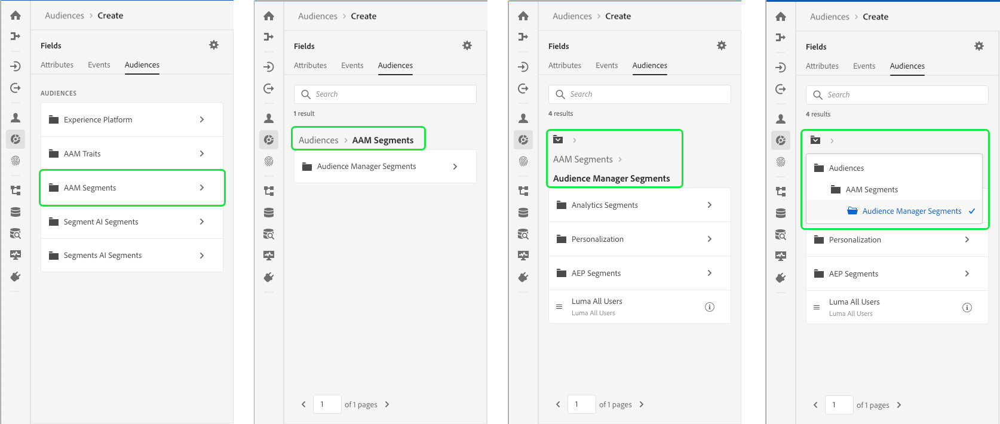

# [!DNL Segment Builder] guia do usuário

[!DNL Segment Builder] fornece uma área de trabalho avançada que permite interagir com elementos [!DNL Profile] de dados. A área de trabalho fornece controles intuitivos para criar e editar regras, como os blocos de arrastar e soltar usados para representar propriedades de dados.

## Elementos básicos para definição de segmento

Os elementos básicos das definições de segmentos são **[!UICONTROL Atributos]** e **[!UICONTROL Eventos]**. Além disso, os atributos e eventos contidos nas **[!UICONTROL Audiências]** existentes também podem ser usados como componentes para novas definições.

É possível ver esses blocos de construção na seção **[!UICONTROL Campos]** no lado esquerdo da [!DNL Segment Builder] área de trabalho. **[!UICONTROL Os campos]** contêm uma guia para cada um dos blocos de construção principais: **[!UICONTROL Atributos]**, **[!UICONTROL Eventos]** e **[!UICONTROL Audiências]**.

### Atributos

A guia **[!UICONTROL Atributos]** permite navegar pelos [!DNL Profile] atributos pertencentes à [!DNL XDM Individual Profile] classe. Cada pasta pode ser expandida para revelar atributos adicionais, onde cada atributo é um bloco que pode ser arrastado para a tela do construtor de regras no centro da área de trabalho. A tela [do construtor de](#rule-builder-canvas) regras é discutida com mais detalhes posteriormente neste guia.

### Eventos

A guia **[!UICONTROL Eventos]** permite criar uma audiência com base em eventos ou ações realizadas usando elementos [!DNL XDM ExperienceEvent] de dados. Você também pode encontrar Tipos de evento na guia **[!UICONTROL Eventos]** , que são uma coleção de eventos usados com frequência para permitir que você crie seus segmentos mais rapidamente.

Além de poder procurar [!DNL ExperienceEvent] elementos, também é possível procurar Tipos de evento. Os tipos de evento usam a mesma lógica de codificação [!DNL ExperienceEvents], sem exigir que você pesquise pela [!DNL XDM ExperienceEvent] classe procurando pelo evento correto. Por exemplo, usar a barra de pesquisa para pesquisar &quot;carrinho&quot; retorna os Tipos de evento &quot;[!UICONTROL AddCart]&quot; e &quot;[!UICONTROL RemoveCart]&quot;, que são duas ações de carrinho muito usadas ao criar definições de segmentos.

Qualquer tipo de componente pode ser pesquisado digitando seu nome na barra de pesquisa, que usa a sintaxe [de pesquisa de](https://docs.microsoft.com/en-us/azure/search/query-lucene-syntax)Lucene. Os resultados da pesquisa começam a ser preenchidos à medida que palavras inteiras são inseridas. Por exemplo, para criar uma regra baseada no campo XDM `ExperienceEvent.commerce.productViews`, digite &quot;visualizações de produto&quot; no start de pesquisa. Depois que a palavra &quot;produto&quot; é digitada, os resultados da pesquisa começam a ser exibidos. Cada resultado inclui a hierarquia de objetos à qual pertence.

>[!NOTE]
>
>Os campos de schema personalizados definidos pela sua organização podem levar até 24 horas para serem exibidos e se tornarem disponíveis para uso nas regras de criação.

Você pode arrastar e soltar facilmente [!DNL ExperienceEvents] e [!UICONTROL Tipos de evento] na definição do segmento.

Por padrão, somente os campos de schema preenchidos do armazenamento de dados são exibidos. Isso inclui [!UICONTROL Tipos de evento]. Se a lista de [!UICONTROL Tipos de evento] não estiver visível ou você só puder selecionar &quot;[!UICONTROL Qualquer]&quot; como um [!UICONTROL Tipo de evento], selecione o ícone de engrenagem ao lado de **[!UICONTROL Campos]** e, em seguida, selecione **[!UICONTROL Mostrar schema]** **** XDM completo em Campos disponíveis. Selecione o ícone de engrenagem novamente para retornar à guia **[!UICONTROL Campos]** e agora você deve ser capaz de visualização de vários [!UICONTROL Tipos de evento] e campos de schema, independentemente de conterem ou não dados.

### Audiences

A guia **[!UICONTROL Audiência]** lista todas as audiências importadas de fontes externas, como o Adobe Audience Manager, bem como as audiências criadas dentro [!DNL Experience Platform].

Na guia **[!UICONTROL Audiência]** , é possível visualizar todas as fontes disponíveis como um grupo de pastas. À medida que você seleciona as pastas, as subpastas e audiências disponíveis podem ser vistas. Além disso, você pode selecionar o ícone de pasta (como mostrado na imagem da extrema direita) para visualização da estrutura de pastas (uma marca de seleção indica a pasta em que você está atualmente) e navegar facilmente de volta pelas pastas selecionando o nome de uma pasta na árvore.

Você pode passar o mouse sobre a ⓘ ao lado de uma audiência para visualização com informações sobre a audiência, incluindo sua ID, descrição e hierarquia de pastas para localizar a audiência.

Você também pode pesquisar [!UICONTROL Audiências] usando a barra de pesquisa, que utiliza a sintaxe [de pesquisa de](https://docs.microsoft.com/en-us/azure/search/query-lucene-syntax)Lucene. Na guia **[!UICONTROL Audiência]** , selecionar uma pasta de nível superior faz com que a barra de pesquisa apareça, permitindo que você pesquise dentro dessa pasta. Os resultados da pesquisa só começam a ser preenchidos depois que palavras inteiras são inseridas. Por exemplo, para localizar uma [!UICONTROL Audiência] chamada `Online Shoppers`, start digitando &quot;Online&quot; na barra de pesquisa. Depois que a palavra &quot;Online&quot; for digitada na íntegra, os resultados da pesquisa contendo a palavra &quot;Online&quot; serão exibidos.

## Tela do construtor de regras {#rule-builder-canvas}

Uma definição de segmento é uma coleção de regras usadas para descrever as principais características ou comportamento de uma audiência de público alvo. Essas regras são criadas usando a tela do construtor de regras, localizada no centro de [!DNL Segment Builder].

Para adicionar uma nova regra à definição do segmento, arraste um bloco da guia **[!UICONTROL Campos]** e solte-o na tela do construtor de regras. Você receberá então opções específicas de contexto, de acordo com o tipo de dados que está sendo adicionado. Os tipos de dados disponíveis incluem: sequências de caracteres, datas, [!DNL ExperienceEvents], [!UICONTROL Tipos de evento]e [!UICONTROL Audiências].

### Adicionar audiências

Você pode arrastar e soltar uma audiência da guia **[!UICONTROL Audiência]** na tela do construtor de regras para fazer referência à associação de audiência na nova definição de segmento. Isso permite que você inclua ou exclua a associação de audiência como um atributo na nova regra de segmento.

Para [!DNL Platform] audiências criadas usando [!DNL Segment Builder], você recebe a opção de converter a audiência no conjunto de regras que foram usadas na definição de segmento para essa audiência. Essa conversão faz uma cópia da lógica da regra, que pode ser modificada sem afetar a definição do segmento original. Certifique-se de ter salvo alterações recentes na definição do segmento antes de convertê-lo para a lógica da regra.

>[!NOTE]
>
>Ao adicionar uma audiência de uma fonte externa, somente a associação de audiência é referenciada. Não é possível converter a audiência em regras e, portanto, as regras usadas para criar a audiência original não podem ser modificadas na nova definição de segmento.

Se surgirem conflitos ao converter audiências em regras, [!DNL Segment Builder] tentará preservar ao máximo as opções existentes.

### Visualização de código

Como alternativa, você pode visualização uma versão baseada em código de uma regra criada no [!DNL Segment Builder]. Depois de criar sua regra na tela do construtor de regras, você pode selecionar visualização **[!UICONTROL de]** código para ver seu segmento como PQL.

A visualização de código fornece um botão que permite copiar o valor do segmento a ser usado em chamadas de API. Para obter a versão mais recente do segmento, certifique-se de ter salvo as alterações mais recentes no segmento.

## Contêineres

As regras de segmento são avaliadas na ordem em que são listadas. Os container permitem o controle da ordem de execução por meio do uso de query aninhados.

Depois de adicionar pelo menos um bloco à tela do construtor de regras, você pode começar a adicionar container. Para criar um novo container, selecione as elipses (...) no canto superior direito do bloco e selecione **[!UICONTROL Adicionar container]**.

Um novo container é exibido como filho do primeiro container, mas você pode ajustar a hierarquia arrastando e movendo os container. O comportamento padrão de um container é &quot;[!UICONTROL Incluir]&quot; o atributo, o evento ou a audiência fornecida. É possível definir a regra como &quot;[!UICONTROL Excluir]&quot; perfis que correspondem aos critérios do container selecionando **[!UICONTROL Incluir]** no canto superior esquerdo do bloco e selecionando &quot;[!UICONTROL Excluir]&quot;.

Um container filho também pode ser extraído e adicionado em linha ao container pai selecionando &quot;desvincular container&quot; no container filho. Selecione as elipses (...) no canto superior direito do container filho para acessar essa opção.

Depois de selecionar **[!UICONTROL Desvincular container]** , o container filho será removido e os critérios aparecerão em linha.

>[!NOTE]
>
>Ao desvincular container, tenha cuidado para que a lógica continue a atender à definição de segmento desejada.

## Mesclar políticas

[!DNL Experience Platform] permite que você reúna dados de várias fontes e os combine para ver uma visualização completa de cada um de seus clientes individuais. Ao reunir esses dados, as políticas de mesclagem são as regras que [!DNL Platform] usam para determinar como os dados serão priorizados e quais dados serão combinados para criar um perfil.

Você pode selecionar uma política de mesclagem que corresponda à sua finalidade de marketing para essa audiência ou usar a política de mesclagem padrão fornecida por [!DNL Platform]. Você pode criar várias políticas de mesclagem exclusivas da sua organização, incluindo a criação de sua própria política de mesclagem padrão. Para obter instruções passo a passo sobre como criar políticas de mesclagem para sua organização, consulte o tutorial sobre como [trabalhar com políticas de mesclagem usando a interface do usuário](../../profile/ui/merge-policies.md).

Para selecionar uma política de mesclagem para a definição do segmento, selecione o ícone de engrenagem na guia **[!UICONTROL Campos]** e use o menu suspenso Política **[!UICONTROL de]** mesclagem para selecionar a política de mesclagem que deseja usar.

## Propriedades do segmento

Ao criar uma definição de segmento, a seção Propriedades **[!UICONTROL do]** segmento no lado direito do espaço de trabalho exibe uma estimativa do tamanho do segmento resultante, permitindo que você ajuste sua definição de segmento conforme necessário antes de criar a própria audiência.

A seção Propriedades **[!UICONTROL do]** segmento também é onde você pode especificar informações importantes sobre a definição do segmento, incluindo o **[!UICONTROL Nome]** e a **[!UICONTROL Descrição]**. Os nomes de definição de segmento são usados para identificar seu segmento entre aqueles definidos pela organização e, portanto, devem ser descritivos, concisos e exclusivos.

À medida que você continua a criar sua definição de segmento, é possível visualização uma pré-visualização paginada da audiência selecionando Perfis **[!UICONTROL de]** Visualização.

>[!NOTE]
>
>As estimativas de audiência são geradas usando um tamanho de amostra dos dados de amostra desse dia. Se houver menos de 1 milhão de entidades em sua loja de perfis, o conjunto de dados completo será usado; para entre 1 e 20 milhões de entidades, são utilizadas 1 milhão de entidades; e para mais de 20 milhões de entidades, são utilizados 5% do total de entidades. Mais informações sobre a geração de estimativas de segmentos podem ser encontradas na seção [de geração de](../tutorials/create-a-segment.md#estimate-and-preview-an-audience) estimativas do tutorial de criação de segmentos.

## Próximos passos e recursos adicionais {#next-steps}

O Construtor de segmentos fornece um fluxo de trabalho avançado que permite isolar audiências comercializáveis dos [!DNL Real-time Customer Profile] dados. Depois de ler este guia, você pode:

- Crie definições de segmento usando uma combinação de atributos, eventos e audiências existentes como blocos de construção.
- Use a tela e os container do construtor de regras para controlar a ordem na qual as regras de segmento são executadas.
- Estimativas de visualização de sua audiência potencial, permitindo que você ajuste suas definições de segmento conforme necessário.
- Ative todas as definições de segmento para segmentação programada.
- Ative definições de segmento especificadas para a segmentação de streaming.

Para saber mais sobre [!DNL Segmentation Service], continue lendo a documentação e complemente sua aprendizagem assistindo aos vídeos abaixo. Para saber mais sobre as outras partes da [!DNL Segmentation Service] interface do usuário, leia o guia [[!DNL Segmentation Service] do usuário](./overview.md)

>[!WARNING]
>
> A [!DNL Platform] interface do usuário exibida nos vídeos a seguir está desatualizada. Consulte a documentação acima para obter as capturas de tela e a funcionalidade mais recentes da interface do usuário.

**Criar um segmento:**

>[!VIDEO](https://video.tv.adobe.com/v/27254?quality=12&learn=on)

**Criar um segmento dinâmico:**

>[!VIDEO](https://video.tv.adobe.com/v/27428?quality=12&learn=on)