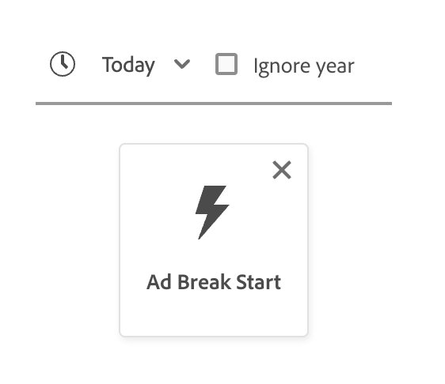

# [!DNL Segment Builder] Guia da interface

>[!NOTE]
>
>Este guia explica como criar públicos-alvo por meio de **definições de segmento** usando o Construtor de segmentos. Para saber como criar públicos-alvo usando a Composição de público-alvo, leia o [Guia da interface do usuário de Composição de público-alvo](./audience-composition.md).

[!DNL Segment Builder] fornece um espaço de trabalho avançado que permite a você interagir com elementos de dados [!DNL Profile]. O espaço de trabalho fornece controles intuitivos para criar e editar regras, como arrastar e soltar blocos usados para representar propriedades de dados.

## Aspectos fundamentais da definição de segmentos {#building-blocks}

>[!CONTEXTUALHELP]
>id="platform_segments_createsegment_segmentbuilder_fields"
>title="Campos"
>abstract="Os três tipos de campo que compõem uma definição de segmento são atributos, eventos e públicos-alvo. Os atributos permitem usar atributos de perfil que pertencem à classe de perfil individual XDM, os eventos permitem criar um público com base em ações ou eventos que ocorrem usando elementos de dados XDM ExperienceEvent e os públicos-alvo permitem usar públicos importados de fontes externas."

>[!CONTEXTUALHELP]
>id="platform_segmentation_segmentbuilder_showfullxdmschema"
>title="Mostrar esquema XDM completo"
>abstract="Por padrão, somente os campos que contêm dados são exibidos. Habilite essa opção para mostrar todos os campos no esquema XDM."

>[!CONTEXTUALHELP]
>id="platform_segmentation_segmentbuilder_showdeprecatedfields"
>title="Mostrar campos obsoletos"
>abstract="Por padrão, campos XDM obsoletos não são exibidos. Habilite essa opção para mostrar campos XDM obsoletos."

Os blocos fundamentais das definições de segmento são atributos e eventos. Além disso, os atributos e eventos contidos nos públicos-alvo existentes podem ser usados como componentes para novas definições.

>[!CONTEXTUALHELP]
>id="platform_segments_createsegment_segmentbuilder_summarydata"
>title="Dados de resumo"
>abstract="Os dados de resumo só aparecem para os atributos de perfil e <b>não</b> aparecem para os atributos de evento ou público-alvo.  Os dados de resumo dos atributos de perfil podem não aparecer nas seguintes circunstâncias: <ol><li>Alguns valores do atributo contêm mais de 100 caracteres.</li><li>Há mais de 3.000 valores exclusivos para o atributo.</li></ol>"

>[!NOTE]
>
>Se você selecionar a bolha de informações de um atributo, poderá exibir a distribuição de valores, também conhecida como dados de resumo, do campo. Estes são **somente** disponíveis na guia de atributos e não estão disponíveis para uso na guia de eventos ou públicos.
>
>Os dados do resumo serão exibidos se o atributo atender aos seguintes critérios: Todos os valores do atributo têm 100 caracteres ou menos e há 3000 valores únicos ou menos para o atributo.
>
>No entanto, um atributo **não** terá dados de resumo se for um dado de várias entidades vinculado ao perfil por meio de uma relação. Por exemplo, se você tiver um esquema personalizado chamado `Vehicle`, as **propriedades** do esquema `Vehicle` **não** terão dados de resumo.

Você pode ver estes blocos de construção na seção **[!UICONTROL Campos]** à esquerda do espaço de trabalho [!DNL Segment Builder]. **[!UICONTROL Campos]** contém uma guia para cada um dos blocos de construção principais: &quot;[!UICONTROL Atributos]&quot;, &quot;[!UICONTROL Eventos]&quot; e &quot;[!UICONTROL Públicos]&quot;.

### Atributos

A guia **[!UICONTROL Atributos]** permite procurar atributos [!DNL Profile] pertencentes à classe [!DNL XDM Individual Profile]. Cada pasta pode ser expandida para revelar atributos adicionais, em que cada atributo é um bloco que pode ser arrastado para a tela do construtor de regras no centro do espaço de trabalho. A [tela do construtor de regras](#rule-builder-canvas) será discutida com mais detalhes posteriormente neste guia.

### Eventos

A guia **[!UICONTROL Eventos]** permite criar um público-alvo com base em eventos ou ações que ocorreram usando [!DNL XDM ExperienceEvent] elementos de dados. Você também pode encontrar Tipos de evento na guia **[!UICONTROL Eventos]**, que são uma coleção de eventos comumente usados para permitir que você crie suas definições de segmento mais rapidamente.

Além de poder procurar elementos de [!DNL ExperienceEvent], você também pode procurar Tipos de Evento. Os Tipos de Evento usam a mesma lógica de codificação que [!DNL ExperienceEvents], sem exigir que você pesquise a classe [!DNL XDM ExperienceEvent] procurando o evento correto. Por exemplo, usar a barra de pesquisa para pesquisar &quot;carrinho&quot; retorna os Tipos de Evento &quot;[!UICONTROL AddCart]&quot; e &quot;[!UICONTROL RemoveCart]&quot;, que são duas ações de carrinho muito usadas ao criar definições de segmento.

Qualquer tipo de componente pode ser pesquisado digitando seu nome na barra de pesquisa, que usa a [sintaxe de pesquisa do Lucene](https://docs.microsoft.com/en-us/azure/search/query-lucene-syntax). Os resultados da pesquisa começam a ser preenchidos à medida que palavras inteiras são inseridas. Por exemplo, para criar uma regra com base no campo XDM `ExperienceEvent.commerce.productViews`, comece digitando &quot;exibições de produto&quot; no campo de pesquisa. Após digitar a palavra &quot;produto&quot;, os resultados da pesquisa começam a aparecer. Cada resultado inclui a hierarquia de objetos à qual ele pertence.

>[!NOTE]
>
>Os campos de esquema personalizados definidos por sua organização podem levar até 24 horas para serem exibidos e disponibilizados para uso nas regras de criação.

Em seguida, você pode arrastar e soltar facilmente [!DNL ExperienceEvents] e &quot;[!UICONTROL Tipos de evento]&quot; na definição do seu segmento.

Por padrão, somente os campos de esquema preenchidos no armazenamento de dados são mostrados. Isso inclui &quot;[!UICONTROL Tipos de Evento]&quot;. Se a lista &quot;[!UICONTROL Tipos de Evento]&quot; não estiver visível ou você só puder selecionar &quot;[!UICONTROL Qualquer]&quot; como um &quot;[!UICONTROL Tipo de Evento]&quot;, selecione o **ícone de engrenagem** ao lado de **[!UICONTROL Campos]** e selecione **[!UICONTROL Mostrar esquema XDM completo]** em **[!UICONTROL Campos Disponíveis]**. Selecione o **ícone de engrenagem** novamente para retornar à guia **[!UICONTROL Campos]** e, agora, você poderá exibir vários &quot;[!UICONTROL Tipos de evento]&quot; e campos de esquema, independentemente de eles conterem ou não dados.

#### Conjuntos de dados do conjunto de relatórios do Adobe Analytics

Você pode usar dados de um único conjunto de relatórios do Adobe Analytics ou de vários conjuntos de relatórios como eventos dentro da segmentação.

Ao usar dados de um único conjunto de relatórios do Analytics, o Experience Platform adicionará automaticamente descritores e nomes amigáveis às eVars, facilitando a localização desses campos no [!DNL Segment Builder].

Ao usar dados de vários conjuntos de relatórios do Analytics, o Experience Platform **não pode** adicionar automaticamente descritores ou nomes amigáveis às eVars. Como resultado, antes de usar os dados dos conjuntos de relatórios do Analytics, você deve mapear para campos XDM. Mais informações sobre como mapear variáveis do Analytics para o XDM podem ser encontradas no [guia de conexão de origem do Adobe Analytics](../../sources/tutorials/ui/create/adobe-applications/analytics.md#mapping).

Por exemplo, considere uma situação em que você tinha dois conjuntos de relatórios com as seguintes variáveis:

| Campo | Esquema A do conjunto de relatórios | Esquema B do conjunto de relatórios |
| ----- | --------------------- | --------------------- |
| EVAR1 | Domínio de referência | Conectado em S/N |
| EVAR2 | Nome da página | ID de fidelidade do membro |
| EVAR3 | URL | Nome da página |
| EVAR4 | Pesquisar termos | Nome do produto |
| event1 | Cliques | Page Views |
| event2 | Page Views | Adições ao carrinho |
| event3 | Adições ao carrinho | Check-outs |
| event4 | Compras | Compras |

Nesse caso, você pode mapear os dois conjuntos de relatórios com o seguinte esquema:

>[!NOTE]
>
>Embora os valores genéricos do eVar ainda sejam preenchidos, você deve **não** usá-los nas definições de segmento (se possível), já que os valores podem ter significados diferentes do que eles eram originalmente em seus relatórios.

Depois que os conjuntos de relatórios forem mapeados, você poderá usar esses campos recém-mapeados em seus fluxos de trabalho e segmentação relacionados ao perfil.

| Cenário | Experiência do esquema de união | Variável genérica de segmentação | Variável mapeada de segmentação |
| -------- | ----------------------- | ----------------------------- | ---------------------------- |
| Conjunto de relatórios único | O descritor de nome amigável está incluído nas variáveis genéricas.   **Exemplo:** Nome da Página (eVar2) | <ul><li>Descritor de nome amigável incluído com variáveis genéricas</li><li>Os queries usam dados do conjunto de dados específico, pois ele é o único</li></ul> | Os queries podem usar dados do Adobe Analytics e possivelmente outras fontes. |
| Vários conjuntos de relatórios | Nenhum descritor de nome simples é incluído com variáveis genéricas.   **Exemplo:** eVar2 | <ul><li>Qualquer campo com vários descritores é exibido como genérico. Isso significa que nenhum nome amigável é exibido na interface do usuário.</li><li>Os queries podem usar dados de qualquer conjunto de dados que contenha a eVar, o que pode resultar em resultados mistos ou incorretos.</li></ul> | As consultas usam os resultados combinados corretamente de vários conjuntos de dados. |

### Públicos-alvo

>[!CONTEXTUALHELP]
>id="platform_segmentation_segmentBuilder_b2b_decomposition"
>title="Avaliação complexa"
>abstract="A expressão a seguir é muito complicada para ser expressa como um único público-alvo. Para usar regras B2B e eventos baseados em pessoas na mesma definição de segmento, siga as etapas abaixo.<ol><li>Crie uma definição de segmento que se refira apenas aos eventos com base em pessoas e salve-a como sua própria definição de segmento.</li><li>Em uma nova definição de segmento, importe a definição de segmento criada anteriormente enquanto se refere às regras B2B.</li></ol>"

>[!CONTEXTUALHELP]
>id="platform_segmentation_segmentbuilder_externalaudiences"
>title="Públicos-alvo externos"
>abstract="Os públicos-alvo importados por meio da guia Públicos-alvo agora são disponibilizados automaticamente no Portal de público-alvo. Isso inclui públicos-alvo assimilados do Audience Manager, do Customer Journey Analytics, da correspondência de segmentos e de outras integrações personalizadas.  Até o final de setembro de 2025, os públicos-alvo serão recuperados exclusivamente por meio da Pesquisa unificada e o fluxo de trabalho anterior não terá mais suporte. A Correspondência de segmentos permanece disponível somente para um pequeno número de clientes selecionados enquanto fazemos a transição do serviço. O acesso de novos clientes à Correspondência de segmentos ainda pode ser habilitado mediante solicitação antes que o serviço seja totalmente descontinuado.  Para casos de uso de colaboração de dados em andamento, a Adobe recomenda a transição para o Collaboration, que é a solução com suporte a longo prazo."
>additional-url="https://experienceleague.adobe.com/pt-br/docs/experience-platform/segmentation/ui/audience-portal#list" text="Portal de público-alvo"

>[!NOTE]
>
>Para públicos criados no Experience Platform, somente os públicos com a **mesma** política de mesclagem serão exibidos.

A guia **[!UICONTROL Públicos-alvo]** lista todos os públicos-alvo importados de fontes externas, como Adobe Audience Manager ou Customer Journey Analytics, bem como os públicos-alvo criados em [!DNL Experience Platform].

Na guia **[!UICONTROL Públicos-alvo]**, você pode ver todas as fontes disponíveis como um grupo de pastas. À medida que você seleciona as pastas, as subpastas e os públicos-alvo disponíveis podem ser vistos. Além disso, você pode selecionar o ícone de pasta (como mostrado na imagem à direita) para visualizar a estrutura de pastas (uma marca de seleção indica a pasta em que você está no momento) e navegar facilmente de volta pelas pastas selecionando o nome de uma pasta na árvore.

Você pode passar o mouse sobre a ⓘ ao lado de um público-alvo para ver informações sobre ele, incluindo a ID, a descrição e a hierarquia de pastas para localizá-lo.

## Tela do construtor de regras {#rule-builder-canvas}

>[!IMPORTANT]
>
>A partir da versão de junho de 2024, as restrições de tempo &quot;Este mês&quot; e &quot;Este ano&quot; representam &quot;acumulado no mês&quot; e &quot;acumulado no ano&quot;, respectivamente. Por exemplo, se você criasse um público-alvo em 18 de julho procurando &quot;todos os clientes cujo aniversário ocorre este mês&quot;, o público-alvo obteria todos os clientes cujos aniversários ocorreram de 1º a 31 de julho. Em 1º de agosto, esse público-alvo obteria todos os clientes cujo aniversário ocorre de 1º a 31 de agosto.
>
>Anteriormente, &quot;Este mês&quot; e &quot;este ano&quot; representavam 30 dias e 365 dias respectivamente, que não contavam para meses com 31 dias e anos bissextos.
>
>Para atualizar a lógica dos públicos-alvo, salve novamente os públicos-alvo criados anteriormente.

Uma definição de segmento é uma coleção de regras usadas para descrever as principais características ou comportamento de um público-alvo. Essas regras são criadas usando a tela do construtor de regras, localizada no centro de [!DNL Segment Builder].

Para adicionar uma nova regra à definição de segmento, arraste um bloco da guia **[!UICONTROL Campos]** e solte-o na tela do construtor de regras. Serão apresentadas opções específicas do contexto de acordo com o tipo de dados que está sendo adicionado. Os tipos de dados disponíveis incluem: cadeias de caracteres, datas, [!DNL ExperienceEvents], &quot;[!UICONTROL Tipos de evento]&quot; e públicos-alvo.

>[!IMPORTANT]
>
>As últimas alterações no Adobe Experience Platform atualizaram o uso dos operadores lógicos `OR` e `AND` entre eventos. Essas atualizações não afetarão as definições de segmento existentes. No entanto, todas as atualizações subsequentes nas definições de segmento existentes e nas definições de segmento recém-criadas serão afetadas por essas alterações. Leia a [atualização de constantes de tempo](./segment-refactoring.md) para obter mais informações.

Ao selecionar um valor para o atributo, você verá uma lista de valores de enumeração que o atributo pode ser.

Se selecionar um valor desta lista de enumerações, o valor será contornado com uma borda sólida. No entanto, para campos que usam enumerações `meta:enum` (suaves), você também pode selecionar um valor que seja **não** da lista de enumerações. Se você criar seu próprio valor, ele será contornado com uma borda pontilhada, juntamente com um aviso de que esse valor não está na lista de enumerações.

Se estiver criando vários valores, é possível adicionar todos eles de uma só vez usando o upload em massa. Selecione o  para mostrar o popover **[!UICONTROL Adicionar valores em massa]**.

No popover **[!UICONTROL Adicionar valores em massa]**, você pode carregar um arquivo CSV ou TSV.

Como alternativa, você pode adicionar manualmente valores separados por vírgula.

Observe que há um máximo de 250 valores permitidos. Se você exceder esse valor, será necessário remover alguns valores antes de adicionar mais.

### Adição de públicos-alvo

>[!CONTEXTUALHELP]
>id="platform_segmentation_segmentbuilder_addaudiences"
>title="Procurar atualizações"
>abstract="O sistema de pesquisa foi atualizado para usar a Pesquisa unificada. A Pesquisa unificada permite que você pesquise seus públicos-alvo de forma mais fácil e robusta quanto à associação a um segmento."

Você pode arrastar e soltar um público-alvo da guia **[!UICONTROL Público-alvo]** na tela do construtor de regras para fazer referência à associação de público-alvo na nova definição de segmento. Isso permite incluir ou excluir a associação de público-alvo como um atributo nas novas regras de definição de segmento.

Para [!DNL Experience Platform] públicos-alvo criados com o [!DNL Segment Builder], você tem a opção de converter o público-alvo para o conjunto de regras que foram usadas na definição de segmento desse público-alvo. Essa conversão faz uma cópia da lógica da regra, que pode ser modificada sem afetar a definição do segmento original. Certifique-se de ter salvo as alterações recentes na definição do segmento antes de convertê-lo na lógica da regra.

>[!NOTE]
>
>Ao adicionar um público-alvo de uma fonte externa, somente a associação do público-alvo é referenciada. Não é possível converter o público-alvo em regras e, portanto, as regras usadas para criar o público-alvo original não podem ser modificadas na nova definição de segmento.

Se surgirem conflitos ao converter públicos-alvo em regras, o [!DNL Segment Builder] tentará preservar as opções existentes o melhor possível.

### Visualização de código

Como alternativa, você pode exibir uma versão baseada em código de uma regra criada no [!DNL Segment Builder]. Depois de criar a regra na tela do construtor de regras, você pode selecionar **[!UICONTROL Visualização de código]** para ver a definição do segmento como PQL.

A visualização de código fornece um botão que permite copiar o valor da definição de segmento para usar em chamadas de API. Para obter a versão mais recente da definição de segmento, salve as alterações mais recentes na definição de segmento.

### Funções de agregação

Uma agregação em [!DNL Segment Builder] é um cálculo em um grupo de atributos XDM cujo tipo de dados é um número (duplo ou inteiro). As quatro funções de agregação compatíveis com o Construtor de segmentos são SUM, AVERAGE, MIN e MAX.

Para criar uma função de agregação, selecione um evento no painel esquerdo e insira-o no contêiner [!UICONTROL Eventos].

Depois de colocar o evento no contêiner Eventos, selecione o ícone de reticências (...), seguido por **[!UICONTROL Agregar]**.

A agregação agora é adicionada. Agora você pode selecionar a função de agregação, escolher qual atributo agregar, a função de igualdade, e o valor. No exemplo abaixo, essa definição de segmento qualificaria qualquer perfil que tenha uma soma de valores comprados superior a US$ 100, mesmo se cada compra individual for inferior a US$ 100.

### Contar funções {#count-functions}

As funções de contagem no Construtor de segmentos são usadas para procurar eventos especificados e contar o número de vezes que eles são concluídos. As funções de contagem compatíveis no Construtor de segmentos são &quot;No mínimo&quot;, &quot;No máximo&quot;, &quot;Exatamente&quot;, &quot;Entre&quot; e &quot;Todos&quot;.

Para criar uma função de contagem, selecione um evento no painel esquerdo e insira-o no contêiner [!UICONTROL Eventos].

Depois de colocar o evento no contêiner Eventos, selecione o botão [!UICONTROL Pelo menos 1].

A função count agora é adicionada. Agora você pode selecionar a função count e o valor da função. O exemplo abaixo seria para incluir qualquer evento que tenha pelo menos um clique.

### Restrições de tempo {#time-constraints}

As restrições de tempo permitem aplicar restrições de tempo a atributos baseados em tempo, eventos e à sequência entre os eventos.

>[!IMPORTANT]
>
>Se você criou uma definição de segmento com as restrições de tempo &quot;Este mês&quot; ou &quot;Este ano&quot; antes de junho de 2024, será necessário salvar novamente as definições de segmento. Antes de junho de 2024, &quot;Este mês&quot; tinha 30 dias como base e &quot;Este ano&quot; tinha 365 dias como base.

>[!NOTE]
>
>Ambas as [restrições de tempo de ano ignoradas](./ignore-year.md) e [restrições de tempo em nível de regra](./segment-refactoring.md) foram refatoradas anteriormente, com mais informações disponíveis nas visões gerais vinculadas.

A lista de restrições de tempo disponíveis é a seguinte:

+++ Restrições de tempo disponíveis

>[!NOTE]
>
>Todas as restrições de tempo são baseadas em UTC.
>
>Além disso, se a caixa de seleção [!UICONTROL Ignorar ano] estiver habilitada, o ano **não** será comparado como parte da avaliação de definição de segmento.

| Restrição de tempo | Descrição | Pode permitir ignorar ano | Exemplo |
| --------------- | ----------- | ------------------- | ------- |
| Hoje | O atributo ou evento que está sendo comparado **deve** ocorrer hoje. | Sim | {width="100" zoomable="yes"} |
| Ontem | O atributo ou evento que está sendo comparado **deve** ocorreu ontem. | Sim | {width="100" zoomable="yes"} |
| Este mês | O atributo ou evento que está sendo comparado **deve** ocorrer neste mês do calendário. | Sim | {width="100" zoomable="yes"} |
| Este ano | O atributo ou evento que está sendo comparado **deve** ocorrer neste ano. | Não | {width="100" zoomable="yes"} |
| Data personalizada | O atributo ou evento que está sendo comparado **deve** ocorrer na data especificada. | Sim | {width="100" zoomable="yes"} |
| No(s) último(s) | O atributo ou evento que está sendo comparado **deve** ocorrer no último período escolhido. Este período é **inclusivo** até o momento da avaliação. | Não | {width="100" zoomable="yes"} |
| De (para) | O atributo ou evento sendo comparado **deve** ocorrer dentro das duas datas do calendário escolhidas. Este período é **inclusivo** das duas datas. | Sim, se for uma data personalizada | {width="100" zoomable="yes"} |
| Durante | O atributo ou evento que está sendo comparado **deve** ocorrer dentro do mês ou ano selecionado. Se um mês for selecionado, você precisará escolher o mês e um ano em que o atributo ou evento ocorreu.  Se um ano for selecionado, você precisará apenas escolher o ano em que o atributo ou evento ocorreu. Se você selecionar um mês, também poderá habilitar a caixa de seleção [!UICONTROL Ignorar ano]. | Sim | {width="100" zoomable="yes"} |
| No prazo de (+/-) | O atributo ou evento que está sendo comparado **deve** ocorrer em dias, semanas, meses ou anos a partir da data selecionada. Este período é **inclusivo** das duas datas. A data selecionada pode ser hoje, ontem ou outra data personalizada de sua escolha. | Sim | {width="100" zoomable="yes"} |
| Antes | O atributo ou evento que está sendo comparado **deve** ocorrer antes da data selecionada. A data selecionada pode ser uma data personalizada de sua escolha ou uma seleção entre dias, semanas, meses ou anos atrás. | Sim | {width="100" zoomable="yes"} |
| Depois | O atributo ou evento que está sendo comparado **deve** ocorrer após a data selecionada. A data selecionada pode ser uma data personalizada de sua escolha ou uma seleção entre dias, semanas, meses ou anos atrás. | Sim | {width="100" zoomable="yes"} |
| Intervalo contínuo | O atributo ou evento que está sendo comparado deve ocorrer entre as duas datas relativas. As datas podem ser representadas em segundos, minutos, horas, dias, semanas, meses ou anos. | Não | {width="100" zoomable="yes"} |
| No próximo | O atributo ou evento que está sendo comparado deve ocorrer dentro do próximo período selecionado. Os períodos de tempo selecionados incluem minutos, horas, dias, semanas, meses e anos. | Não | {width="100" zoomable="yes"} |
| Existe | O atributo existe. | Não | {width="100" zoomable="yes"} |
| Não existe | O atributo não existe. | Não | {width="100" zoomable="yes"} |

+++

Ao aplicar uma restrição de tempo a um evento, você pode aplicá-la no nível da tela, no nível do cartão ou entre eventos.

#### Restrição no nível da tela

Para aplicar uma restrição de tempo em nível de tela de desenho, selecione o ícone de relógio que aparece acima da linha do tempo dos eventos.

Quando você aplica uma restrição de tempo no nível da tela, ela se aplica a **todos** eventos no público-alvo.

#### Restrição no nível do cartão

Para aplicar uma restrição no nível do cartão, selecione o cartão no qual deseja aplicar a restrição de tempo, seguido pelo ícone de reticências e **[!UICONTROL Aplicar regra de tempo]**. Isso permite selecionar uma restrição de tempo no contêiner **[!UICONTROL Regras de evento]**.

Ao aplicar uma restrição de tempo no nível do cartão, você aplica a restrição de tempo no evento **specified** no público-alvo.

#### Restrição Entre eventos

Para aplicar uma restrição de tempo entre eventos, selecione o ícone de relógio entre os dois eventos aos quais deseja aplicar a restrição de tempo.

Quando você aplica uma restrição de tempo entre o evento, ela aplica a restrição de tempo ao tempo **entre** os eventos.

A lista de restrições de tempo disponíveis para esta operação difere da lista principal de restrições de tempo, e é a seguinte:

+++ Restrições de tempo disponíveis

| Restrição de tempo | Descrição |
| --------------- | ----------- |
| Depois | O último evento **deve pelo menos** ocorrer após o evento anterior. |
| Dentro de | Os dois eventos **must** ocorrem durante o período listado na restrição de tempo. |

>[!NOTE]
>
>Ao usar a restrição de tempo &quot;Depois&quot;, o último evento pode ocorrer por mais tempo do que o listado na restrição de tempo. >
>>Por exemplo, se você tiver um evento de Exibição de página e um evento de Check-out e colocar a restrição de tempo &quot;Após 1 hora&quot; entre esses dois eventos, uma definição de segmento com um evento de Check-out 2 horas após o evento de Exibição de página será qualificada.
>
>Além disso, essas duas restrições de tempo podem ser usadas em coordenação umas com as outras.
>
>Por exemplo, se você tiver um evento de Exibição de página e um evento de Check-out e colocar as restrições de tempo &quot;Após 1 hora&quot; e &quot;Dentro de 24 horas&quot;, uma definição de segmento com um evento de Check-out 12 horas após o evento de Exibição de página seria qualificada, mas uma definição de segmento com um evento de Check-out 36 horas após o evento de Exibição de página não seria qualificada.

+++

## Containers {#containers}

As regras de segmento são avaliadas na ordem em que são listadas. Os containers permitem controlar a ordem de execução por meio do uso de consultas aninhadas.

Depois de adicionar pelo menos um bloco à tela do construtor de regras, você pode começar a adicionar contêineres. Para criar um novo contêiner, selecione as reticências (...) no canto superior direito do bloco e selecione **[!UICONTROL Adicionar contêiner]**.

Um novo contêiner é exibido como filho do primeiro contêiner, mas você pode ajustar a hierarquia arrastando e movendo os contêineres. O comportamento padrão de um contêiner é &quot;[!UICONTROL Incluir]&quot; o atributo, evento ou público fornecido. É possível definir a regra para &quot;[!UICONTROL Excluir]&quot; perfis que correspondam aos critérios do contêiner ao selecionar **[!UICONTROL Incluir]** no canto superior esquerdo do bloco e selecionar &quot;[!UICONTROL Excluir]&quot;.

Um contêiner filho também pode ser extraído e adicionado em linha ao contêiner pai selecionando &quot;Decodificar contêiner&quot; no contêiner filho. Selecione as reticências (...) no canto superior direito do container filho para acessar essa opção.

Depois de selecionar **[!UICONTROL Decodificar contêiner]**, o contêiner filho será removido e os critérios aparecerão embutidos.

>[!NOTE]
>
>Ao desempacotar contêineres, tenha cuidado para que a lógica continue atendendo à definição de segmento desejada.

## Mesclar políticas

>[!CONTEXTUALHELP]
>id="platform_segmentation_createSegment_segmentBuilder_mergePolicies"
>title="Mesclar políticas"
>abstract="Uma política de mesclagem permite mesclar diferentes conjuntos de dados para formar o perfil. A Experience Platform fornece uma política de mesclagem padrão, mas você também pode criar uma nova política de mesclagem padrão em Perfis. Escolha uma política de mesclagem que corresponda à sua finalidade de marketing para este público-alvo."

O [!DNL Experience Platform] permite reunir dados de várias fontes e combiná-los para obter uma visão completa de cada cliente individual. Ao reunir esses dados, as políticas de mesclagem são as regras que [!DNL Experience Platform] usa para determinar como os dados serão priorizados e quais dados serão combinados para criar um perfil.

Você pode selecionar uma política de mesclagem que corresponda à sua finalidade de marketing para este público ou usar a política de mesclagem padrão fornecida por [!DNL Experience Platform]. É possível criar várias políticas de mesclagem exclusivas para sua organização, incluindo a criação de sua própria política de mesclagem padrão. Para obter instruções passo a passo sobre como criar políticas de mesclagem para sua organização, comece lendo a [visão geral das políticas de mesclagem](../../profile/merge-policies/overview.md).

Para selecionar uma política de mesclagem para a definição do segmento, selecione o ícone de engrenagem na guia **[!UICONTROL Campos]** e use o menu suspenso **[!UICONTROL Política de mesclagem]** para selecionar a política de mesclagem que deseja usar.

## Propriedades de público-alvo {#audience-properties}

>[!CONTEXTUALHELP]
>id="platform_segments_createsegment_segmentbuilder_segmentproperties"
>title="Propriedades de público-alvo"
>abstract="A seção de propriedades do público-alvo exibe uma estimativa do tamanho do público-alvo resultante, exibindo o número de perfis qualificados em comparação com o número total de perfis. Isso permite ajustar o seu público-alvo, conforme necessário, antes de criar o público-alvo em si."

>[!CONTEXTUALHELP]
>id="platform_segments_createsegment_segmentbuilder_refreshestimate"
>title="Atualizar estimativas"
>abstract="Você pode atualizar as estimativas do seu segmento para ver imediatamente uma visualização de quantos perfis se qualificariam para a definição do segmento proposto. As estimativas de público-alvo são geradas usando um tamanho de amostra dos dados de amostra desse dia."
>additional-url="https://experienceleague.adobe.com/docs/experience-platform/segmentation/tutorials/create-a-segment.html?lang=pt-BR#estimate-and-preview-an-audience" text="Estimar e visualizar um público-alvo"

>[!CONTEXTUALHELP]
>id="platform_segments_createsegment_segmentbuilder_qualifiedprofiles"
>title="Perfis qualificados"
>abstract="Perfis qualificados indicam o número real de perfis que correspondem às regras do público-alvo. Esse número atualiza a cada 24 horas, após a execução do trabalho de avaliação do segmento."

>[!CONTEXTUALHELP]
>id="platform_segments_createsegment_segmentbuilder_estimatedprofiles"
>title="Perfis estimados"
>abstract="Perfis estimados indicam um número aproximado de perfis, com base na amostra de tarefa, que se qualificariam para as regras do público-alvo."

Ao criar uma definição de segmento, a seção **[!UICONTROL Propriedades do público-alvo]** no lado direito do espaço de trabalho exibe uma estimativa do tamanho da definição de segmento resultante, permitindo ajustar a definição do segmento conforme necessário antes de criar o público-alvo em si.

**[!UICONTROL Perfis qualificados]** indica o número **real** de perfis que correspondem às regras de definição de segmento. Esse número atualiza a cada 24 horas, após a execução do trabalho de avaliação do segmento.

O carimbo de data/hora para perfis qualificados indica o trabalho de avaliação de segmento mais recente do **lote** e é **não** exibido para definições de segmento avaliadas usando a segmentação de borda ou de streaming. Se você editar a definição do segmento, o número de perfis qualificados permanecerá o mesmo até que o próximo trabalho de avaliação de segmento seja executado.

**[!UICONTROL Perfis estimados]** indica um **intervalo aproximado** de perfis, com base no **trabalho de amostra**. Isso significa que os dados de amostra são projetados no conjunto maior de perfis, resultando em um número estimado que pode ser diferente do número real de perfis qualificados. A amostra de perfil estimada tem um intervalo de confiança de 95%.

Ao fazer alterações nas regras do público-alvo, você pode selecionar o botão **[!UICONTROL Atualizar estimativa]** para ver uma contagem atualizada dos perfis estimados. No entanto, esse número ainda se baseia no trabalho de amostra anterior. O trabalho de amostra é atualizado quando há uma alteração maior que 3% nos dados do cliente ou o último trabalho de amostra tem mais de três dias.

Selecionar a bolha de informações fornece a data e a hora em que o último trabalho de amostra foi executado.

A seção **[!UICONTROL Propriedades do público-alvo]** também é o local onde você pode especificar informações importantes sobre o público-alvo, incluindo nome, descrição e tipo de avaliação. Os nomes são usados para identificar a definição do segmento entre os definidos pela organização e, portanto, devem ser descritivos, concisos e exclusivos.

Enquanto você continua a criar seu público-alvo, pode visualizá-lo paginado selecionando **[!UICONTROL Exibir Perfis]**.

>[!NOTE]
>
>As estimativas de público-alvo são geradas usando um tamanho de amostra dos dados de amostra desse dia. Se houver menos de 1 milhão de entidades no armazenamento do Perfil, o conjunto de dados completo será usado; para entre 1 e 20 milhões de entidades, será usado 1 milhão de entidades; e para mais de 20 milhões de entidades, será usado 5% do total de entidades.
>
>Além disso, essa estimativa se baseia em quando o último trabalho de amostra de perfil foi executado. Isso significa que se estiver usando uma função de data relativa, como &quot;Hoje&quot; ou &quot;Esta semana&quot;, a estimativa baseará seus cálculos no último tempo de execução do trabalho de amostra do perfil. Por exemplo, se hoje for 24 de janeiro e o último trabalho de amostra de perfil for executado em 22 de janeiro, a função de data relativa &quot;Ontem&quot; será baseada em 21 de janeiro, e não 23 de janeiro.
>
>Mais informações sobre a geração de estimativas para definições de segmento podem ser encontradas na [seção de geração de estimativa](../tutorials/create-a-segment.md#estimate-and-preview-an-audience) do tutorial de criação de definição de segmento.

Você também pode selecionar seu método de avaliação. Se você souber qual método de avaliação deseja usar, poderá selecionar o método de avaliação desejado usando a lista suspensa. Se quiser saber para quais tipos de avaliação essa definição de segmento se qualifica, você pode selecionar o ícone de navegação  para ver uma lista dos métodos de avaliação de definição de segmento disponíveis.

O popover [!UICONTROL Qualificação para o método de avaliação] é exibido. Esse popover exibe os métodos de avaliação disponíveis, que são batch, streaming e edge. O popover mostra quais métodos de avaliação são elegíveis e inelegíveis. Dependendo dos parâmetros usados na definição do segmento, ele pode não se qualificar para determinados métodos de avaliação. Para obter mais informações sobre os requisitos de cada método de avaliação, leia as visões gerais da [segmentação de transmissão](../methods/streaming-segmentation.md#query-types) ou da [segmentação de borda](../methods/edge-segmentation.md#query-types).

Você também pode alterar o método de avaliação da definição do segmento depois de terminar de criá-lo. Se você alterar o método de avaliação de Edge ou Streaming para Batch, **não** poderá alterá-lo de volta para Edge ou Streaming. A alteração no método de avaliação **somente** entrará em vigor depois que você selecionar **[!UICONTROL Salvar]** no popover. Cancelar a caixa de diálogo **manterá** o método de avaliação original.

Se você selecionar um método de avaliação inválido, será solicitado a alterar as regras de definição de segmento ou o método de avaliação.

Mais informações sobre os diferentes métodos de avaliação de definição de segmento podem ser encontradas na [visão geral da segmentação](../home.md#evaluate-segments).

## Próximas etapas {#next-steps}

O Construtor de segmentos fornece um fluxo de trabalho avançado que permite isolar públicos comercializáveis dos dados de [!DNL Real-Time Customer Profile]. Depois de ler este guia, você deverá ser capaz de:

- Crie definições de segmento usando uma combinação de atributos, eventos e públicos-alvo existentes como blocos de construção.
- Use a tela e os contêineres do construtor de regras para controlar a ordem em que as regras de segmento são executadas.
- Visualize estimativas de seu público-alvo em potencial, permitindo ajustar as definições de segmento, conforme necessário.
- Ative todas as definições de segmento para a segmentação programada.
- Ative as definições de segmento especificadas para a segmentação por transmissão.

Para saber mais sobre [!DNL Segmentation Service], continue lendo a documentação e complemente seu aprendizado assistindo aos vídeos relacionados. Para saber mais sobre as outras partes da interface do [!DNL Segmentation Service], leia o [[!DNL Segmentation Service] guia do usuário](./overview.md).
