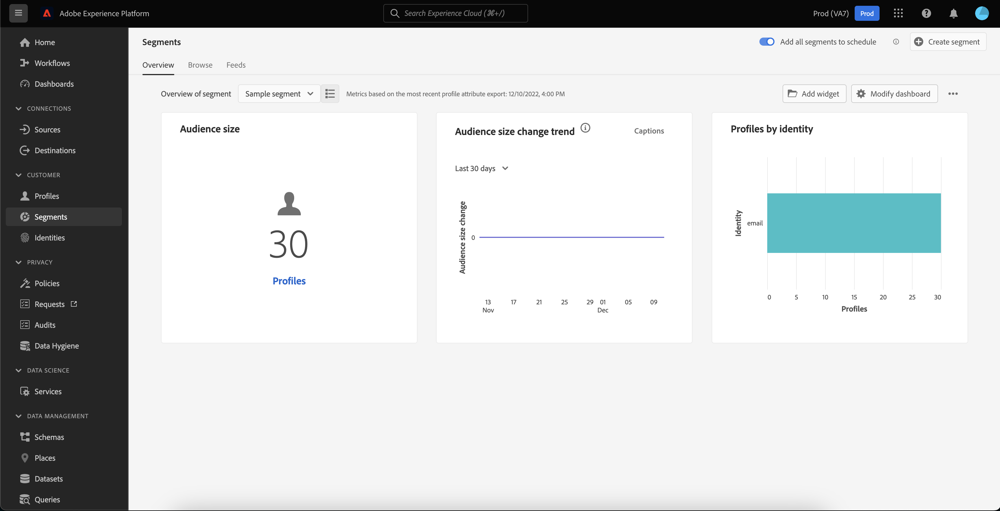

#  Painel de segmentos  {#segment-dashboard}

A interface do usuário do Adobe Experience Platform (UI) fornece um painel através do qual você pode visualizar informações importantes sobre seus segmentos, conforme capturado durante um instantâneo diário.

Para obter instruções detalhadas sobre como acessar e interagir com o painel de segmentos na interface do usuário, bem como saber mais sobre as métricas disponíveis exibidas no painel, visite o [guia do painel de segmentos](../../dashboards/guides/segments.md).

Para obter uma visão geral de todos os recursos do painel na interface do usuário do Experience Platform, comece lendo a [visão geral dos painéis](../../dashboards/home.md).

