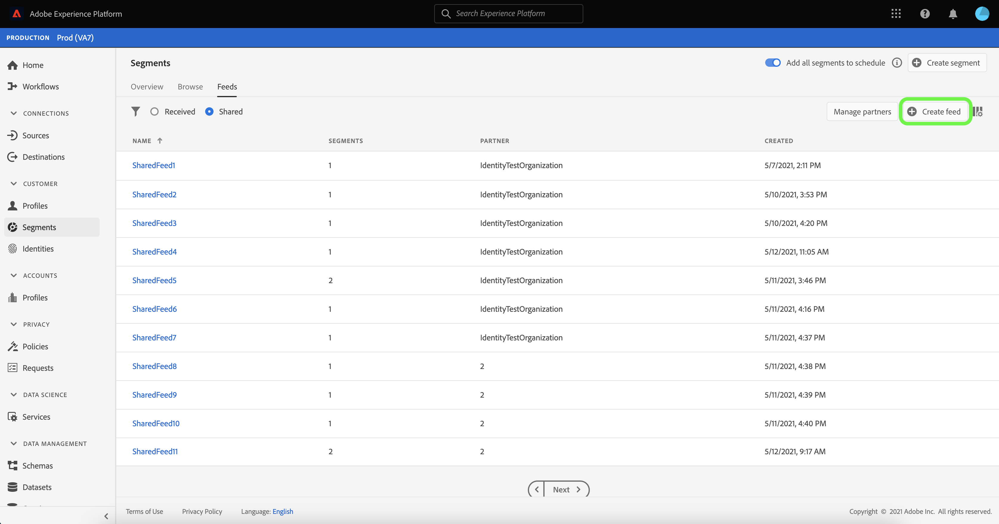

# Visão geral do [!DNL Segment Match]

>[!IMPORTANT]
>
>A Adobe lançou o [!DNL Segment Match] em 2021 para que os clientes colaborem e troquem públicos. No início de 2025, o Adobe apresentou o [Real-Time CDP Collaboration](https://experienceleague.adobe.com/pt-br/docs/real-time-cdp-collaboration/using/home), que é a abordagem de longo prazo para atender a esse caso de uso.
>
>* Para clientes nos Estados Unidos, Canadá, Austrália, Nova Zelândia e EMEA: a Adobe recomenda que os clientes do Real-Time CDP Prime e Ultimate façam a transição de casos de uso de colaboração de dados do [!DNL Segment Match] para o Real-Time CDP Collaboration. Exiba a [documentação](https://experienceleague.adobe.com/pt-br/docs/real-time-cdp-collaboration/using/home) e o [guia de início rápido](https://experienceleague.adobe.com/pt-br/docs/real-time-cdp-collaboration/using/quick-start-guide) da Real-Time CDP Collaboration e entre em contato com a equipe de conta da Adobe para saber mais.
>* Para clientes em todas as outras regiões geográficas: [!DNL Segment Match] é a opção recomendada até que o Real-Time CDP Collaboration seja lançado nessas regiões geográficas em 2026.

A Correspondência de segmentos do Adobe Experience Platform é um serviço de compartilhamento de segmentos que permite que dois ou mais usuários do Experience Platform troquem dados de segmento de maneira segura, controlada e compatível com a privacidade. O [!DNL Segment Match] usa os padrões de privacidade da Experience Platform e identificadores pessoais, como emails com hash, números de telefone com hash e identificadores de dispositivos, como IDFAs e GAIDs.

Com [!DNL Segment Match] você pode:

* Gerencie o processo de sobreposição de identidade.
* Exibir estimativas pré-compartilhamento.
* Aplique rótulos de uso de dados para controlar se os dados podem ser compartilhados com parceiros.
* Mantenha o gerenciamento do ciclo de vida do público compartilhado após a publicação de um feed e continue uma troca dinâmica de dados por meio das capacidades de adicionar, excluir e cancelar o compartilhamento.

O [!DNL Segment Match] usa um processo de sobreposição de identidade para garantir que o compartilhamento de segmentos seja feito de maneira segura e com foco na privacidade. Uma **identidade sobreposta** é uma identidade que tem uma correspondência no seu segmento e no segmento do parceiro selecionado. Antes de compartilhar um segmento entre um remetente e um destinatário, o processo de sobreposição de identidade verifica se há uma sobreposição nos namespaces e verificações de consentimento entre o remetente e o(s) destinatário(s). Ambas as verificações de sobreposição devem ser aprovadas para que um segmento seja compartilhado.

As seções a seguir fornecem mais informações sobre [!DNL Segment Match], incluindo detalhes sobre a instalação e seu fluxo de trabalho completo.

## Configurar

As seções a seguir descrevem como instalar e configurar o [!DNL Segment Match]:

### Configurar namespaces e dados de identidade {#namespaces}

A primeira etapa para começar a usar o [!DNL Segment Match] é verificar se você está assimilando dados nos namespaces de identidade com suporte.

Os namespaces de identidade são um componente do [Adobe Experience Platform Identity Service](../../../identity-service/home.md). Cada identidade do cliente contém um namespace associado que indica o contexto da identidade. Por exemplo, um namespace pode distinguir um valor de &quot;name@email.com&quot; como um endereço de email ou &quot;443522&quot; como uma ID de CRM numérica.

Uma identidade totalmente qualificada inclui um valor de ID e um namespace. Ao corresponder dados de registro em fragmentos de perfil (como quando [!DNL Real-Time Customer Profile] mescla dados de Perfil), o valor de identidade e o namespace devem corresponder um ao outro.

No contexto de [!DNL Segment Match], os namespaces são usados no processo de sobreposição ao compartilhar dados.

A lista de namespaces compatíveis é a seguinte:

| Namespace | Descrição |
| --------- | ----------- |
| Emails (SHA256, em letras minúsculas) | Um namespace para o endereço de email com hash prévio. Os valores fornecidos neste namespace são convertidos em minúsculas antes do hash com SHA256. Espaços à esquerda e à direita precisam ser cortados antes da normalização de um endereço de email. Esta configuração não pode ser alterada retroativamente. A Experience Platform oferece dois métodos de hash de suporte na coleta de dados, por meio de [`setCustomerIDs`](https://experienceleague.adobe.com/docs/id-service/using/reference/hashing-support.html?lang=pt-BR#hashing-support) e por meio de [preparação de dados](../../../data-prep/functions.md#hashing). |
| Telefone (SHA256_E.164) | Um namespace que representa números de telefone brutos que precisam ser transformados em hash, utilizando os formatos SHA256 e E.164. |
| ECID | Um namespace que representa um valor de Experience Cloud ID (ECID). Esse namespace também pode ser referenciado pelos seguintes aliases: &quot;Adobe Marketing Cloud ID&quot;, &quot;Adobe Experience Cloud ID&quot;, &quot;Adobe Experience Platform ID&quot;. Consulte a [visão geral da ECID](../../../identity-service/features/ecid.md) para obter mais informações. |
| Apple IDFA (ID para anunciantes) | Um namespace que representa a Apple ID para anunciantes. Consulte o seguinte documento em [anúncios baseados em interesses](https://support.apple.com/en-us/HT202074) para obter mais informações. |
| ID Google Ad | Um namespace que representa uma Google Advertising ID. Consulte o seguinte documento no [Google Advertising ID](https://support.google.com/googleplay/android-developer/answer/6048248?hl=en) para obter mais informações. |

### Definir configuração de consentimento

Você deve fornecer uma configuração de consentimento e definir seu valor padrão como `opt-in` ou `opt-out` para uma verificação de consentimento.

A verificação de consentimento de aceitação e recusa determina se você pode operar com o consentimento para compartilhar dados do usuário por padrão. Se o padrão de configuração de consentimento for definido como `opt-out`, os dados do usuário poderão ser compartilhados, a menos que um usuário recuse explicitamente. Se o padrão estiver definido como `opt-in`, os dados do usuário não poderão ser compartilhados, a menos que um usuário opte explicitamente por participar.

A configuração de consentimento padrão para [!DNL Segment Match] está definida como `opt-out`. Para aplicar um modelo de aceitação para seus dados, envie uma solicitação por email para a equipe de conta da Adobe.

Para obter mais informações sobre o atributo `share` usado para definir o valor de consentimento de compartilhamento de dados, consulte a documentação a seguir no [grupo de campos de privacidade e consentimentos](../../../xdm/field-groups/profile/consents.md). Para obter informações sobre o grupo de campos específico usado para registrar o consentimento do consumidor para a coleta e uso de dados relacionados à privacidade, personalização e preferências de marketing, consulte o seguinte [Exemplo de consentimento para privacidade, Personalization e Preferências de marketing do GitHub](https://github.com/adobe/xdm/blob/master/docs/reference/datatypes/consent/consent-preferences.schema.md).

### Configurar rótulos de uso de dados

O último pré-requisito que você deve estabelecer é configurar um novo rótulo de uso de dados para impedir o compartilhamento de dados. Por meio dos rótulos de uso de dados, você pode gerenciar quais dados podem ser compartilhados por meio do [!DNL Segment Match].

Os rótulos de uso de dados permitem categorizar conjuntos de dados e campos de acordo com as políticas de uso que se aplicam a esses dados. Os rótulos podem ser aplicados a qualquer momento, proporcionando flexibilidade na maneira como você escolhe controlar os dados. As práticas recomendadas incentivam a rotulação de dados assim que eles forem assimilados na Experience Platform ou assim que os dados estiverem disponíveis para uso no Experience Platform.

[!DNL Segment Match] usa o rótulo C11, um rótulo de contrato específico para [!DNL Segment Match] que você pode adicionar manualmente a qualquer conjunto de dados ou atributo para garantir que eles sejam excluídos do processo de compartilhamento de parceiros [!DNL Segment Match]. O rótulo C11 indica dados que não devem ser usados em [!DNL Segment Match] processos. Depois de determinar quais conjuntos de dados e/ou campos você deseja excluir de [!DNL Segment Match] e adicionar o rótulo C11 de acordo, o rótulo será aplicado automaticamente pelo fluxo de trabalho [!DNL Segment Match]. [!DNL Segment Match] habilita automaticamente a política principal [!UICONTROL Restrict data sharing]. Para obter instruções específicas sobre como aplicar rótulos de uso de dados a conjuntos de dados, consulte o tutorial em [gerenciamento de rótulos de uso de dados na interface](../../../data-governance/labels/user-guide.md).

Para obter uma lista de rótulos de uso de dados e suas definições, consulte o [glossário de rótulos de uso de dados](../../../data-governance/labels/reference.md). Para obter informações sobre políticas de uso de dados, consulte a [visão geral das políticas de uso de dados](../../../data-governance/policies/overview.md).

### Compreendendo [!DNL Segment Match] permissões

Há duas permissões associadas a [!DNL Segment Match]:

| Permissão | Descrição |
| --- | --- |
| Gerenciar conexões de compartilhamento de público | Essa permissão permite concluir o processo de handshake de parceiro, que conecta duas organizações para habilitar os fluxos do [!DNL Segment Match]. |
| Gerenciar compartilhamentos de público | Esta permissão permite criar, editar e publicar feeds (o pacote de dados usado para [!DNL Segment Match]) com parceiros ativos (parceiros que foram conectados pelo usuário administrador com acesso de **[!UICONTROL Audience Share Connections]**). |

Consulte a [visão geral do controle de acesso](../../../access-control/home.md) para obter mais informações sobre controle de acesso e permissões.

## [!DNL Segment Match] fluxo de trabalho completo

Após configurar seus dados de identidade e namespaces, a configuração de consentimento e o rótulo de uso de dados, você pode começar a trabalhar com o [!DNL Segment Match] e seus recursos.

### Gerenciar parceiro

Na interface do usuário do Experience Platform, selecione **[!UICONTROL Segments]** no menu de navegação esquerdo e, em seguida, selecione **[!UICONTROL Feeds]** no cabeçalho superior.

A página [!UICONTROL Feeds] contém uma lista de feeds recebidos de parceiros, bem como feeds compartilhados. Para exibir uma lista de parceiros existentes ou estabelecer uma conexão com um novo parceiro, selecione **[!UICONTROL Manage partners]**.

Uma conexão entre dois parceiros é um &quot;handshake bidirecional&quot; que atua como um método de autoatendimento para que os usuários conectem suas organizações da Experience Platform em conjunto no nível da sandbox. A conexão é necessária para informar à Experience Platform que um contrato foi estabelecido e que a Experience Platform pode facilitar o compartilhamento de serviços entre você e seu(s) parceiro(s).

>[!NOTE]
>
>O &quot;aperto de mão bidirecional&quot; entre você e seu parceiro é estritamente uma conexão. Nenhum dado é trocado durante esse processo.

Você pode exibir uma lista de conexões com parceiros existentes na interface principal da tela [!UICONTROL Manage partners]. No painel direito está o painel [!UICONTROL Share setting], que fornece a opção de gerar um novo [!UICONTROL connect ID], bem como uma caixa de entrada onde você pode inserir a [!UICONTROL connect ID] de um parceiro.

Para criar um novo [!UICONTROL connect ID], selecione **[!UICONTROL Regenerate]** em [!UICONTROL Share setting] e selecione o ícone copiar ao lado da ID recém-gerada.

Para conectar um parceiro usando seu [!UICONTROL connect ID], digite o valor de identificação exclusiva na caixa de entrada em [!UICONTROL Connect partner] e selecione **[!UICONTROL Request]**.

### Criar feed {#create-feed}

>[!CONTEXTUALHELP]
>id="platform_segment_match_marketing"
>title="Casos de uso de marketing restritos"
>abstract="Casos de uso restritos de marketing ajudam a fornecer orientação aos parceiros para garantir que os segmentos compartilhados sejam usados adequadamente de acordo com as restrições de governança de dados."
>text="Learn more in documentation"

Um **feed** é um agrupamento de dados (segmentos), as regras sobre como esses dados podem ser expostos ou usados e as configurações que determinam como seus dados são comparados com os dados de seus parceiros. Um feed pode ser gerenciado de forma independente e trocado com outros usuários do Experience Platform por meio de [!DNL Segment Match].

Para criar um novo feed, selecione **[!UICONTROL Create feed]** no painel [!UICONTROL Feeds].

A configuração básica de um feed inclui um nome, uma descrição e configurações relacionadas a casos de uso de marketing e configurações de identidade. Forneça um nome e uma descrição para o feed e aplique os casos de uso de marketing dos quais deseja que os dados sejam excluídos. Você pode selecionar mais de um caso de uso em uma lista que inclui:

* [!UICONTROL Analytics]
* [!UICONTROL Combine with PII]
* [!UICONTROL Cross-site targeting]
* [!UICONTROL Data Science]
* [!UICONTROL Email targeting]
* [!UICONTROL Export to third party]
* [!UICONTROL Onsite advertising]
* [!UICONTROL Onsite personalization]
* [!UICONTROL Segment Match]
* [!UICONTROL Single identity personalization]

Por fim, selecione os namespaces de identidade apropriados para seu feed. Para obter informações sobre os namespaces específicos compatíveis com o [!DNL Segment Match], consulte a [tabela de namespaces e dados de identidade](#namespaces). Quando terminar, selecione **[!UICONTROL Next]**.

Depois de estabelecer as configurações do feed, selecione os segmentos que deseja compartilhar na lista de segmentos primários. É possível selecionar mais de um segmento na lista e usar o painel direito para gerenciar a lista de segmentos selecionados. Quando terminar, selecione **[!UICONTROL Next]**.

A página [!UICONTROL Share] é exibida, fornecendo uma interface para selecionar os parceiros com os quais você deseja compartilhar seu feed. Durante essa etapa, você também pode exibir o relatório de estimativas de sobreposição pré-compartilhamento e ver o número de identidades sobrepostas por namespace entre você e seu parceiro, o número de identidades sobrepostas que têm consentimento para compartilhar dados.

Selecione **[!UICONTROL Analyze by segment]** para ver o relatório de estimativas.

O relatório de estimativas de sobreposição permite gerenciar verificações de sobreposição e consentimento por parceiro e por segmento antes de compartilhar o feed.

| Métricas | Descrição |
| ------- | ----------- |
| Estimativa de identidades com consentimento | O número total de identidades sobrepostas que atendem aos requisitos de consentimento configurados para sua organização. |
| Estimativa de identidades sobrepostas | O número de identidades qualificadas para o segmento selecionado e que também têm uma correspondência com o parceiro selecionado. Essas identidades são exibidas por namespace e não representam identidades de perfil individuais. As estimativas de sobreposição se baseiam em rascunhos de perfil. |

Quando terminar, selecione **[!UICONTROL Close]**.

Depois de selecionar seus parceiros e visualizar seu relatório de estimativas de sobreposição, selecione **[!UICONTROL Next]** para continuar.

A etapa [!UICONTROL Review] é exibida, permitindo que você revise o novo feed antes que ele seja compartilhado e publicado. Esta etapa inclui detalhes sobre a configuração de identidade aplicada, bem como informações sobre os casos de uso de marketing, segmentos e parceiros selecionados.

Selecione **[!UICONTROL Finish]** para continuar.

### Atualizar feed

Para adicionar ou remover segmentos, selecione **[!UICONTROL Create feed]** na página [!UICONTROL Feeds] e, em seguida, selecione **[!UICONTROL Existing feed]**. Na lista de feeds existentes exibida, selecione o feed que deseja atualizar e selecione **[!UICONTROL Next]**.

A lista de segmentos é exibida. Aqui, você pode adicionar novos segmentos ao feed e usar o painel direito para remover os segmentos que não são mais necessários. Quando terminar de gerenciar os segmentos no feed, selecione **[!UICONTROL Next]** e siga as etapas descritas acima para concluir o feed atualizado.

Atualização do 

>[!NOTE]
>
>Quando você adiciona ou remove um segmento de um feed compartilhado, o parceiro destinatário deve confirmar a alteração habilitando novamente a opção [!DNL Profile] em sua lista de feeds recebidos.

### Aceitar um feed recebido

Para exibir um feed de entrada, selecione **[!UICONTROL Received]** no cabeçalho da página [!UICONTROL Feeds] e selecione o feed que deseja exibir na lista. Para aceitar o feed, selecione **[!UICONTROL Enable for profile]** e aguarde alguns momentos para o status ser atualizado de [!UICONTROL Pending] para [!UICONTROL Enabled].

Depois de aceitar um feed compartilhado, você pode começar a usar os dados compartilhados para criar novos segmentos.

## Próximas etapas

Ao ler este documento, você compreendeu o [!DNL Segment Match], seus recursos e seu fluxo de trabalho completo. Consulte os seguintes documentos para saber mais sobre outros serviços da plataforma:

* [[!DNL Segmentation Service]](../../home.md)
* [[!DNL Identity Service]](../../../identity-service/home.md)
* [Visão geral do [!DNL Real-Time Customer Profile]](../../../profile/home.md)
