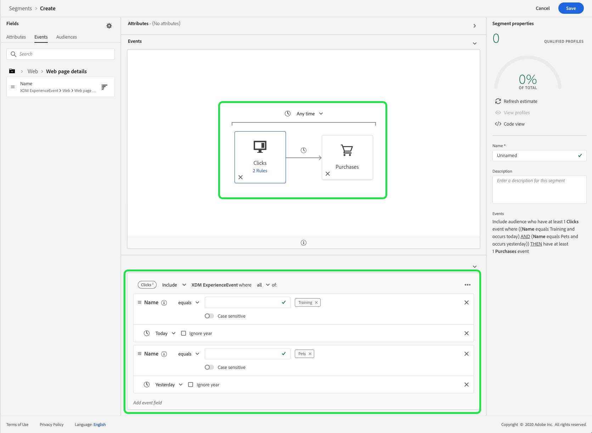

# Reestruturação de restrições de tempo

A versão de outubro de 2020 do Adobe Experience Platform introduziu alterações de desempenho no Adobe Experience Platform Segmentation Service que adicionam novas restrições ao uso dos operadores lógicos OR e AND. Essas alterações afetarão segmentos recém-criados ou editados feitos com a interface do usuário do Construtor de segmentos. Este guia explica como atenuar essas alterações.

Antes da versão de outubro de 2020, todas as restrições de tempo a nível de regra, de grupo e a nível de evento se referiam redundantemente ao mesmo carimbo de data e hora. Para esclarecer o uso da restrição de tempo, as restrições de tempo a nível de regra e de grupo foram removidas. Para acomodar essa alteração, todas as restrições de tempo devem ser regravadas como restrições de tempo no nível do evento.

Anteriormente, um evento individual podia ter várias regras de restrição de tempo anexadas a ele.

Como é possível observar, esse segmento tem duas restrições no nível da regra: Um para &quot;[!UICONTROL Today]&quot; e outro para &quot;[!UICONTROL Yesterday]&quot;.

O segmento anterior é equivalente ao seguinte segmento — ambas as restrições de tempo no nível do evento foram conectadas usando um operador AND. A primeira restrição de tempo de nível de evento faz referência a um evento de clique cujo nome é &quot;Treinamento&quot; e está acontecendo hoje, enquanto a segunda restrição de tempo de nível de evento faz referência a um evento de clique cujo nome é igual a &quot;Predefinições&quot; e aconteceu ontem.

 

Essa refatoração das restrições de tempo também afeta as restrições de tempo que são conectadas usando um operador OU.
