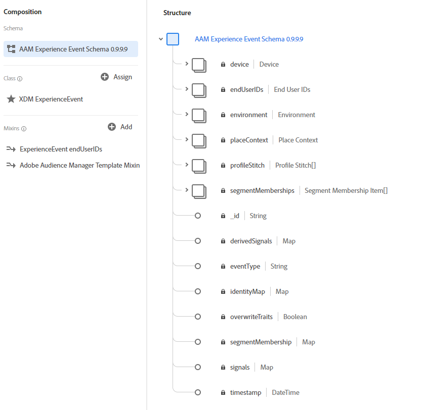

# conector Audience Manager

O conector de dados do Adobe Audience Manager transmite dados primários coletados no Adobe Audience Manager para o Adobe Experience Platform. O conector de Audience Manager assimila duas categorias de dados para a Plataforma:

- **Dados em tempo real:** dados capturados em tempo real no servidor de coleta de dados do Audience Manager. Esses dados são usados no Audience Manager para preencher características baseadas em regras e aparecerão na Platform no menor tempo de latência.
- **Dados de perfil:** o Audience Manager usa dados em tempo real e integrados para derivar perfis de clientes. Esses perfis são usados para preencher gráficos de identidade e características em realizações de segmentos.

O conector Audience Manager mapeia essas categorias de dados para o esquema Experience Data Model (XDM) e as envia para a Plataforma. Os dados em tempo real são enviados como dados do ExperienceEvent XDM, enquanto os dados do perfil são enviados como Perfis individuais XDM.

Para obter instruções sobre como criar uma conexão com o Adobe Audience Manager usando a interface do usuário da plataforma, consulte o tutorial [Audience Manager connector](../../tutorials/ui/create/adobe-applications/audience-manager.md).

## O que é o Experience Data Model (XDM)?

O XDM é uma especificação documentada publicamente que fornece uma estrutura padronizada pela qual a Platform organiza os dados de experiência do cliente.

O cumprimento dos padrões XDM permite que os dados de experiência do cliente sejam incorporados uniformemente, facilitando a entrega de dados e a coleta de informações.

Para obter mais informações sobre como o XDM é usado no Experience Platform, consulte a [Visão geral do sistema XDM](../../../xdm/home.md). Para saber mais sobre como os Esquemas XDM como o Perfil e o ExperienceEvent são estruturados, consulte as [noções básicas da composição do esquema](../../../xdm/schema/composition.md).

## Exemplos de esquemas XDM

Abaixo estão exemplos da estrutura do Audience Manager mapeada para XDM ExperienceEvent e XDM Individual Profile na plataforma.

### ExperienceEvent - para dados em tempo real e dados integrados

### Perfil individual XDM - para dados de perfil

## Como os campos são mapeados do Adobe Audience Manager para o XDM?

Consulte a documentação de [Audience Manager mapping fields](./mapping/audience-manager.md) para obter mais informações.

## Gerenciamento de dados na plataforma

### Conjuntos de dados

Os conjuntos de dados são uma construção de armazenamento e gerenciamento para uma coleção de dados, normalmente uma tabela, que contém esquema (colunas) e campos (linhas) e é disponibilizada por uma conexão de dados. Os dados do Audience Manager consistem em dados em tempo real, dados de entrada e dados do perfil. Para localizar seus conjuntos de dados do Audience Manager, use a função de pesquisa na interface do usuário com as convenções de nomenclatura fornecidas para cada tipo de dados.

Por padrão, os conjuntos de dados do Audience Manager são desativados para Perfil e os usuários podem ativar ou desativar conjuntos de dados com base em seus casos de uso. Não é recomendável desativar conjuntos de dados que serão usados para associação de segmentos no Perfil.

| Nome do conjunto de dados | Descrição |
| ------------ | ----------- |
| AAM em tempo real | Esse conjunto de dados contém dados coletados por ocorrências diretas em pontos de extremidade Audience Manager DCS e mapas de identidade para perfis Audience Manager. Mantenha esse conjunto de dados habilitado para assimilação de perfil. |
| AAM atualizações de perfil em tempo real | Esse conjunto de dados permite o direcionamento em tempo real de características e segmentos do Audience Manager. Ele inclui informações para roteamento regional do Edge, característica e associação a segmentos. Mantenha esse conjunto de dados habilitado para assimilação de perfil. Os dados não são visíveis como lotes no conjunto de dados. Você pode ativar o botão **[!UICONTROL Profile]** para assimilar os dados diretamente para o Perfil. |
| Dados de dispositivos AAM | Dados do dispositivo com ECIDs e realizações de segmento correspondentes agregados no Audience Manager. Os dados não são visíveis como lotes no conjunto de dados. Você pode ativar o botão **[!UICONTROL Profile]** para assimilar os dados diretamente para o Perfil. |
| Dados de perfil do dispositivo AAM | Usado para diagnóstico de conector Audience Manager. Os dados não são visíveis como lotes no conjunto de dados. Você pode ativar o botão **[!UICONTROL Profile]** para assimilar os dados diretamente para o Perfil. |
| Perfis Autenticados AAM | Esse conjunto de dados contém perfis autenticados do Audience Manager. Os dados não são visíveis como lotes no conjunto de dados. Você pode ativar o botão **[!UICONTROL Profile]** para assimilar os dados diretamente para o Perfil. |
| Metadados de perfis autenticados do AAM | Usado para diagnóstico Audience Manager Connector. Os dados não são visíveis como lotes no conjunto de dados. Você pode ativar o botão **[!UICONTROL Profile]** para assimilar os dados diretamente para o Perfil. |
| Preenchimento retroativo de dados de dispositivos AAM | O conjunto de dados não trouxe dados de dispositivos antigos. Ele contém ECIDs e realizações de segmento correspondentes agregadas no Audience Manager. Os dados não são visíveis como lotes no conjunto de dados. Você pode ativar o botão **[!UICONTROL Profile]** para assimilar diretamente os dados no Perfil. |
| AAM preenchimento retroativo de perfis autenticados | O conjunto de dados de trazer dados autenticados anteriormente. Ele contém perfis autenticados do Audience Manager. Os dados não são visíveis como lotes no conjunto de dados. Você pode ativar o botão **[!UICONTROL Profile]** para assimilar diretamente os dados no Perfil. |

### Conexões

O Adobe Audience Manager cria uma conexão no Catálogo: Conexão Audience Manager. Catálogo é o sistema dos registros para localização e linhagem de dados no Adobe Experience Platform. Uma conexão é um objeto de Catálogo que é uma instância específica do cliente de Conectores. Consulte a [Visão geral do Serviço de Catálogo](../../../catalog/home.md) para obter mais informações sobre Catálogo, conexões e conectores.

## Qual é a latência esperada de dados do Audience Manager na plataforma?

| Audience Manager Data | Latência | Notas |
| --- | --- | --- |
| Dados em tempo real | &lt; 35 minutos. | Tempo de ser capturado no nó Audience Manager Edge até aparecer no Platform Data Lake. |
| Dados do perfil | &lt; 2 dias | Tempo de ser capturado por meio de dados DCS/PCS Edge e dados integrados, sendo processado para um perfil de usuário, para aparecer em Perfil. Esses dados não chegam diretamente no Platform Data Lake hoje. A alternância de perfil pode ser ativada para conjuntos de dados de Perfil do Audience Manager para assimilar esses dados diretamente no Perfil. |
