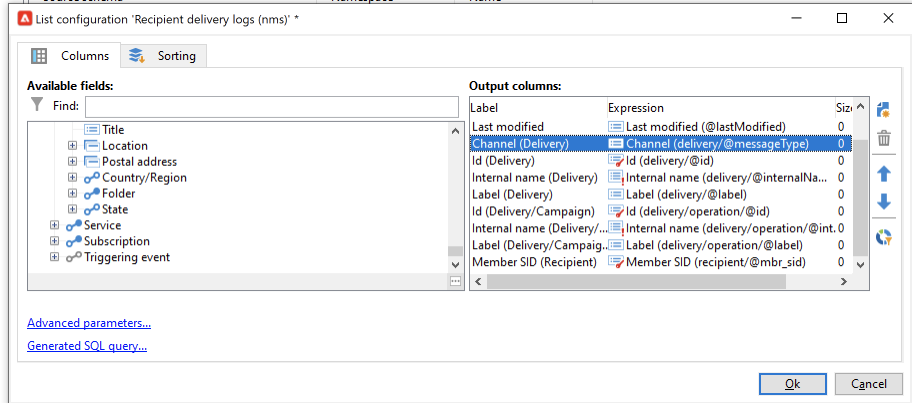

# Adobe Campaign Managed Cloud Services

O Adobe Campaign Managed Cloud Services oferece uma plataforma gerenciada para projetar experiências de clientes entre canais, oferecer suporte à orquestração visual de campanhas, ao gerenciamento de interação em tempo real e à execução entre canais. Para obter mais detalhes, consulte a [documentação do Adobe Campaign v8](https://experienceleague.adobe.com/docs/campaign/campaign-v8/campaign-home.html?lang=pt-BR).

O conector de origem do Adobe Campaign Managed Cloud Services permite assimilar dados de log de delivery e rastreamento do Adobe Campaign v8 na Adobe Experience Platform. Esse conector opera como uma origem em lote na Platform.

## Pré-requisitos

Antes de criar uma conexão de origem para trazer seu Campaign v8 para o Experience Platform, primeiro complete os seguintes pré-requisitos:

* [Configure a importação do log de eventos usando o console do cliente Adobe Campaign](#view-delivery-and-tracking-log-data)
* [Criar um esquema XDM ExperienceEvent](#create-a-schema)
* [Criar um conjunto de dados](#create-a-dataset)

### Exibir dados de log de rastreamento e entrega {#view-delivery-and-tracking-log-data}

>[!IMPORTANT]
>
>Você deve ter acesso ao Console do cliente do Adobe Campaign v8 para visualizar os dados de log no Campaign. Visite a [documentação do Campaign v8](https://experienceleague.adobe.com/docs/campaign/campaign-v8/deploy/connect.html) para obter informações sobre como baixar e instalar o console do cliente.

Faça logon na instância do Campaign v8 por meio do Console do cliente. Na guia [!DNL Explorer], selecione [!DNL Administration] e [!DNL Configuration]. Em seguida, selecione [!DNL Data schemas] e aplique o filtro `broadLog` para nome ou rótulo. Na lista exibida, selecione o esquema de origem dos logs de entrega do destinatário com o nome `broadLogRcp`.

Em seguida, selecione a guia **Dados**.

Clique com o botão direito do mouse/toque com a tecla no painel de dados para abrir o menu contextual. Aqui, selecione **Configurar lista...**

A janela de configuração de lista é exibida, fornecendo uma interface na qual você pode adicionar os campos desejados à lista pré-existente para visualizar os dados no painel de dados.

Agora é possível visualizar os logs do delivery do recipient, incluindo os campos de configuração adicionados na etapa anterior.

>[!TIP]
>
>Você pode repetir as mesmas etapas, mas filtrar por `tracking` para exibir os dados do log de rastreamento.

### Criar um esquema {#create-a-schema}

Em seguida, crie um esquema XDM ExperienceEvent para logs do delivery e logs de rastreamento. Você deve aplicar o grupo de campos Logs de entrega da campanha ao esquema de logs de entrega e o grupo de campos Logs de rastreamento da campanha ao esquema de logs de rastreamento. Você também deve definir o campo `externalID` como a identidade principal do esquema.

>[!NOTE]
>
>Seu esquema XDM ExperienceEvent deve ser habilitado para perfil para assimilar os dados do Campaign para [!DNL Real-Time Customer Profile].

Para obter instruções detalhadas sobre como criar um esquema, leia o manual sobre [criação de um esquema XDM na interface](../../../xdm/tutorials/create-schema-ui.md).

### Criar um conjunto de dados {#create-a-dataset}

Por fim, você deve criar um conjunto de dados para seus esquemas. Para obter instruções detalhadas sobre como criar um conjunto de dados, leia o manual sobre [criação de um conjunto de dados na interface](../../../catalog/datasets/user-guide.md).

## Latência esperada para a origem do Adobe Campaign Managed Cloud Services {#latency}

A latência completa de um evento do Campaign para a disponibilidade de dados no Experience Platform normalmente é de 15 a 30 minutos em configurações padrão (incluindo replicação de 15 minutos, exportação de microlotes e um fluxo de dados agendado do Experience Platform), considerando volumes de dados normais e sem backlog. Esse é um processo quase em tempo real obtido por meio da sincronização programada de microlotes (geralmente na ordem de dezenas de minutos), mas não é um streaming contínuo.

| Cenário | Detalhes | Latência esperada |
| --- | --- | --- |
| O evento de campanha é gerado em uma instância de mid-sourcing/centro de mensagens | Um evento de delivery ou rastreamento (envio, abertura, clique etc.) ocorre em um nó de execução do Campaign v8 (mid/centro de mensagens). | Tempo real no tempo de execução do Campaign (atualmente não visível no Experience Platform). |
| Replicação do tempo de execução para o banco de dados de marketing do Campaign | Os dados do evento são replicados do centro intermediário/de mensagens para o banco de dados de marketing do Campaign ([!DNL Snowflake] ou [!DNL Postgres], dependendo do tamanho do cliente). Os padrões de integração padrão assumem um trabalho de replicação regular. | Aproximadamente 15 minutos, com base na cadência padrão de replicação de 15 minutos. |
| Exportar do banco de dados de marketing do Campaign para a zona de destino (como [!DNL Data Landing Zone], [!DNL Amazon S3] ou [!DNL Azure Blob]) | Um fluxo de trabalho de exportação (Serviço de exportação) no Campaign é executado em um agendamento para extrair logs de delivery e rastreamento novos/alterados e gravá-los como microlotes em uma zona de aterrissagem baseada em arquivos. | Minutos, mais o intervalo de agendamento de exportação. |
| O fluxo de dados de origem do Experience Platform coleta arquivos exportados | A origem do Adobe Campaign Managed Cloud Services está configurada como um fluxo de dados em lote no Experience Platform [!DNL Flow Service]. Ele verifica periodicamente a zona de aterrissagem, assimila novos arquivos e os grava nos conjuntos de dados ExperienceEvent configurados. O monitoramento expõe &quot;lotes bem-sucedidos&quot; e &quot;lotes com falha&quot;. | Minutos, mais o intervalo de agendamento do fluxo de dados. |
| Dados disponíveis no data lake e no Perfil do cliente em tempo real | Depois que o lote é assimilado, os registros são obtidos no data lake e (se o conjunto de dados estiver habilitado para perfil) substituídos no Perfil do cliente em tempo real. Os SLAs padrão do Experience Platform para assimilação em lote e de perfil se aplicam. | Na mesma janela de execução do fluxo de dados, ou seja, logo após a conclusão da execução em lote. Os registros normalmente ficam disponíveis em minutos para serviços downstream. |

{style="table-layout:auto"}

## Criar uma conexão de origem do Adobe Campaign Managed Cloud Services usando a interface do usuário do Experience Platform

Agora que você acessou os logs de dados no console do cliente Campaign, criou um esquema e um conjunto de dados, é possível continuar a criar uma conexão de origem para trazer os dados do Campaign Managed Services para a Experience Platform.

Para obter instruções detalhadas sobre como trazer os dados dos logs de entrega e de rastreamento do Campaign v8 para a Experience Platform, leia o manual sobre [criação de uma conexão de origem do Campaign Managed Services na interface](../../tutorials/ui/create/adobe-applications/campaign.md).

>[!IMPORTANT]
>
>Há um caso periférico em que a interação de um destinatário de email recentemente removido com um email pode assimilar novamente informações pessoais no Experience Platform. Em alguns casos, isso poderia reativar o marketing para esse usuário.
>
>* Esse cenário só estará ativo entre o momento em que uma solicitação de acesso a dados pessoais foi executada no Experience Platform e o momento em que foi executada no Adobe Campaign Classic. Depois que a solicitação é executada no Campaign, há uma verificação para garantir que o registro não seja exportado para o Campaign. Para resolver esse problema, emita novamente uma solicitação de GDPR após 72 horas da execução.
