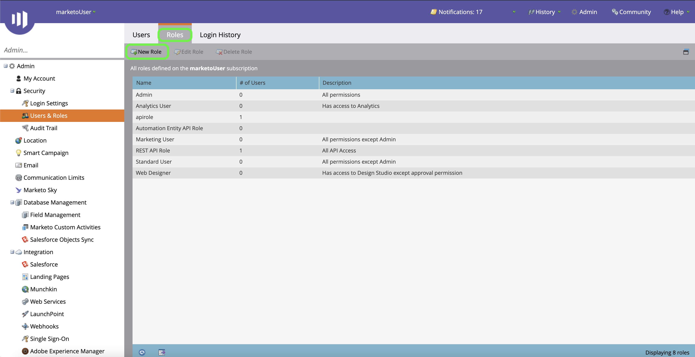

# Autentique seu conector de origem do [!DNL Marketo Engage]

Antes de criar um conector de origem do [!DNL Marketo Engage] (a seguir denominado &quot;[!DNL Marketo]&quot;), você deve primeiro configurar um serviço personalizado por meio da interface do [!DNL Marketo], bem como recuperar valores para sua ID do Munchkin, ID do cliente e segredo do cliente.

A documentação abaixo fornece etapas sobre como adquirir credenciais de autenticação para criar um conector de origem [!DNL Marketo].

## Configurar uma nova função

A primeira etapa para adquirir suas credenciais de autenticação é configurar uma nova função por meio da interface [[!DNL Marketo]](https://app-sjint.marketo.com/#MM0A1).

Faça logon em [!DNL Marketo] e selecione **[!DNL Admin]** na barra de navegação superior.

A página *[!DNL Users & Role]s* contém informações sobre usuários, funções e históricos de logon. Para criar uma nova função, selecione **[!DNL Roles]** no cabeçalho superior e selecione **[!DNL New Role]**.

A caixa de diálogo **[!DNL Create New Role]** é exibida. Forneça um nome e uma descrição e selecione as permissões que gostaria de conceder para esta função. As permissões são restritas a espaços de trabalho específicos e os usuários só podem executar ações em espaços de trabalho para os quais têm permissões.

Depois de selecionar as permissões que gostaria de conceder, selecione **[!DNL Create]**.

Você pode gerenciar permissões restritas na API ao criar funções com [!DNL Marketo]. Em vez de selecionar &quot;Acessar API&quot;, você pode fornecer uma função com o nível mínimo de acesso selecionando as seguintes permissões:

* [!DNL Read-Only Activity]
* [!DNL Read-Only Assets]
* [!DNL Read-Only Campaign]
* [!DNL Read-Only Company]
* [!DNL Read-Only Custom Object]
* [!DNL Read-Only Custom Object Type]
* [!DNL Read-Only Named Account]
* [!DNL Read-Only Named Account List]
* [!DNL Read-Only Opportunity]
* [!DNL Read-Only Person]
* [!DNL Read-Only Sales Person]

## Configurar um novo usuário

Semelhante a funções, você pode configurar um novo usuário na página **[!DNL Users & Roles]**. A página **[!DNL Users]** fornece uma lista de usuários ativos atualmente provisionados no Marketo. Selecione **[!DNL Invite New User]** para provisionar um novo usuário.

Um menu de diálogo de popover é exibido. Forneça as informações apropriadas para seu email, nome, sobrenome e motivo. Durante essa etapa, também é possível estabelecer uma data de expiração para o acesso da nova conta de usuário que você está convidando. Quando terminar, selecione **[!DNL Next]**.

>[!IMPORTANT]
>
>Ao configurar um novo usuário, você deve atribuir acesso a um usuário dedicado estritamente ao serviço personalizado que está criando.

Selecione os campos apropriados na etapa **[!DNL Permissions]** e marque a caixa de seleção **[!DNL API Only]** para fornecer uma função de API ao novo usuário. Selecione **[!DNL Next]** para continuar.

Para concluir o processo, selecione **[!DNL Send]**.

## Configurar um serviço personalizado

Depois de estabelecer um novo usuário, você pode configurar um serviço personalizado para recuperar suas novas credenciais. Na página de administração, selecione **[!DNL LaunchPoint]**.

A página **[!DNL Installed services]** contém uma lista de serviços existentes. Para criar um novo serviço personalizado, selecione **[!DNL New]** e **[!DNL New Service]**.

Forneça um nome de exibição descritivo ao novo serviço e selecione **[!DNL Custom]** no menu suspenso **[!DNL Service]**. Forneça uma descrição apropriada e selecione o usuário que deseja provisionar no menu suspenso **[!DNL API Only User]**. Depois de preencher os detalhes necessários, selecione **[!DNL Create]** para criar seu novo serviço personalizado.

## Obter a ID do cliente e o segredo do cliente

Com a criação de um novo serviço personalizado, agora é possível recuperar valores para a ID do cliente e o segredo do cliente. No menu **[!DNL Installed Services]**, localize o serviço personalizado que deseja acessar e selecione **[!DNL View Details]**.

Uma caixa de diálogo é exibida, contendo a ID do cliente e o segredo do cliente.

## Obtenha sua ID do Munchkin

A etapa final que você deve concluir para autenticar seu conector de origem do [!DNL Marketo] é recuperar sua ID do Munchkin. Na página de administração, selecione **[!DNL Munchkin]** no painel **[!DNL Integration]**.

A página *[!DNL Munchkin]* é exibida, com sua ID exclusiva do Munchkin listada na parte superior do painel.

Combinado com a ID do cliente e o segredo do cliente, você pode usar o Munchkin ID para configurar uma nova conta e [criar uma nova [!DNL Marketo] conexão de origem](../../../tutorials/ui/create/adobe-applications/marketo.md) no Experience Platform.
