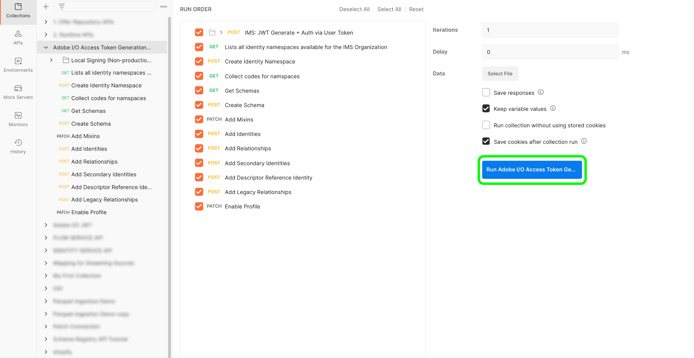

# Espaços de nomes e esquemas B2B

Este documento fornece informações sobre a configuração subjacente para os namespaces e esquemas a serem usados com fontes B2B. Este documento também fornece detalhes sobre como configurar seu utilitário de automação do Postman necessário para gerar namespaces e esquemas B2B.

## Configurar namespaces B2B e utilitário de geração automática de esquema

A primeira etapa no uso do namespace B2B e do utilitário de geração automática de esquema é configurar o console do desenvolvedor do Platform e o ambiente [!DNL Postman].

- Você pode baixar o namespace e o ambiente do utilitário de geração automática de esquema deste [repositório GitHub](https://github.com/adobe/experience-platform-postman-samples/tree/master/Postman%20Collections/CDP%20Namespaces%20and%20Schemas%20Utility).
- Para obter informações sobre como usar APIs de plataforma, incluindo detalhes sobre como coletar valores para cabeçalhos necessários e ler chamadas de API de amostra, consulte o guia sobre como [começar a usar APIs de plataforma](../../../../landing/api-guide.md).
- Para obter informações sobre como gerar suas credenciais para APIs da plataforma, consulte o tutorial em [autenticação e acesso a APIs do Experience Platform](../../../../landing/api-authentication.md).
- Para obter informações sobre como configurar [!DNL Postman] para APIs da plataforma, consulte o tutorial em [configurar o console do desenvolvedor e [!DNL Postman]](../../../../landing/postman.md).

Com um console do desenvolvedor da Platform e [!DNL Postman] configuradas, agora é possível começar a aplicar os valores de ambiente apropriados ao seu ambiente [!DNL Postman].

A tabela a seguir contém valores de exemplo e informações adicionais sobre como preencher o ambiente [!DNL Postman]:

| Variable | Descrição | Exemplo |
| --- | --- | --- |
| `CLIENT_SECRET` | Um identificador exclusivo usado para gerar `{ACCESS_TOKEN}`. Consulte o tutorial em [autenticar e acessar APIs do Experience Platform](../../../../landing/api-authentication.md) para obter informações sobre como recuperar seu `{CLIENT_SECRET}`. | `{CLIENT_SECRET}` |
| `JWT_TOKEN` | O JSON Web Token (JWT) é uma credencial de autenticação usada para gerar seu {ACCESS_TOKEN}. Consulte o tutorial em [autenticar e acessar APIs do Experience Platform](../../../../landing/api-authentication.md) para obter informações sobre como gerar seu `{JWT_TOKEN}`. | `{JWT_TOKEN}` |
| `API_KEY` | Um identificador exclusivo usado para autenticar chamadas para APIs do Experience Platform. Consulte o tutorial em [autenticar e acessar APIs do Experience Platform](../../../../landing/api-authentication.md) para obter informações sobre como recuperar seu `{API_KEY}`. | `c8d9a2f5c1e03789bd22e8efdd1bdc1b` |
| `ACCESS_TOKEN` | O token de autorização necessário para concluir chamadas para APIs do Experience Platform. Consulte o tutorial em [autenticar e acessar APIs do Experience Platform](../../../../landing/api-authentication.md) para obter informações sobre como recuperar seu `{ACCESS_TOKEN}`. | `Bearer {ACCESS_TOKEN}` |
| `META_SCOPE` | No que diz respeito a [!DNL Marketo], esse valor é fixo e sempre está definido como: `ent_dataservices_sdk`. | `ent_dataservices_sdk` |
| `CONTAINER_ID` | O contêiner `global` contém todas as classes, grupos de campos de esquema, tipos de dados e esquemas fornecidos pelo Adobe e parceiro de Experience Platform. Em relação a [!DNL Marketo], esse valor é fixo e sempre está definido como `global`. | `global` |
| `PRIVATE_KEY` | Uma credencial usada para autenticar sua instância [!DNL Postman] para APIs do Experience Platform. Consulte o tutorial sobre como configurar o console do desenvolvedor e [configurar o console do desenvolvedor e [!DNL Postman]](../../../../landing/postman.md) para obter instruções sobre como recuperar seu {PRIVATE_KEY}. | `{PRIVATE_KEY}` |
| `TECHNICAL_ACCOUNT_ID` | Uma credencial usada para integrar ao Adobe I/O. | `D42AEVJZTTJC6LZADUBVPA15@techacct.adobe.com` |
| `IMS` | O Sistema Identity Management (IMS) fornece a estrutura para autenticação dos serviços da Adobe. No que diz respeito a [!DNL Marketo], esse valor é fixo e sempre está definido como: `ims-na1.adobelogin.com`. | `ims-na1.adobelogin.com` |
| `IMS_ORG` | Uma entidade corporativa que pode ser proprietária ou licenciar produtos e serviços e permitir o acesso a seus membros. Consulte o tutorial em [configurar o console do desenvolvedor e [!DNL Postman]](../../../../landing/postman.md) para obter instruções sobre como recuperar suas informações `{IMS_ORG}`. | `ABCEH0D9KX6A7WA7ATQE0TE@adobeOrg` |
| `SANDBOX_NAME` | O nome da partição da sandbox virtual que você está usando. | `prod` |
| `TENANT_ID` | Uma ID usada para garantir que os recursos criados sejam namespacados corretamente e estejam contidos na organização IMS. | `b2bcdpproductiontest` |
| `PLATFORM_URL` | O endpoint de URL para o qual você está fazendo chamadas de API. Esse valor é fixo e sempre está definido como: `http://platform.adobe.io/`. | `http://platform.adobe.io/` |

{style=&quot;table-layout:auto&quot;}

### Execução dos scripts

Com sua coleção [!DNL Postman] e o ambiente configurados, agora é possível executar o script por meio da interface [!DNL Postman].

Na interface [!DNL Postman], selecione a pasta raiz do utilitário de gerador automático e selecione **[!DNL Run]** no cabeçalho superior.

A interface [!DNL Runner] é exibida. A partir daqui, verifique se todas as caixas de seleção estão selecionadas e selecione **[!DNL Run Namespaces and Schemas Autogeneration Utility]**.

Uma solicitação bem-sucedida cria os namespaces e schemas necessários para o B2B.

## Namespaces B2B

Os namespaces de identidade são um componente de [[!DNL Identity Service]](../../../../identity-service/home.md) que serve para distinguir o contexto ou o tipo de uma identidade. Uma identidade totalmente qualificada inclui um valor de ID e um namespace. Consulte a [visão geral dos namespaces](../../../../identity-service/namespaces.md) para obter mais informações.

Os namespaces B2B são usados na identidade primária da entidade.

A tabela a seguir contém informações sobre a configuração subjacente para namespaces B2B.

>[!NOTE]
>
>Role a tela para a esquerda/direita para exibir o conteúdo completo da tabela.

| Nome de exibição | Símbolo de identidade | Tipo de identidade |
| --- | --- | --- |
| Pessoa B2B | `b2b_person` | `CROSS_DEVICE` |
| Conta B2B | `b2b_account` | `B2B_ACCOUNT` |
| Oportunidade B2B | `b2b_opportunity` | `B2B_OPPORTUNITY` |
| Relação de Pessoa da Oportunidade B2B | `b2b_opportunity_person_relation` | `B2B_OPPORTUNITY_PERSON` |
| Campanha B2B | `b2b_campaign` | `B2B_CAMPAIGN` |
| Membro da Campanha B2B | `b2b_campaign_member` | `B2B_CAMPAIGN_MEMBER` |
| Lista de marketing B2B | `b2b_marketing_list` | `B2B_MARKETING_LIST` |
| Membro da Lista de Marketing B2B | `b2b_marketing_list_member` | `B2B_MARKETING_LIST_MEMBER` |

{style=&quot;table-layout:auto&quot;}

## Esquemas B2B

A Experience Platform utiliza esquemas para descrever a estrutura dos dados de forma consistente e reutilizável. Ao definir os dados de forma consistente em todos os sistemas, fica mais fácil manter o significado e, portanto, obter valor dos dados.

Para que os dados possam ser assimilados na Platform, um schema deve ser composto para descrever a estrutura dos dados e fornecer restrições ao tipo de dados que pode ser contido em cada campo. Os esquemas consistem em uma classe base e zero ou mais grupos de campos de esquema.

Para obter mais informações sobre o modelo de composição do schema, incluindo princípios de design e práticas recomendadas, consulte as [noções básicas da composição do schema](../../../../xdm/schema/composition.md).

A tabela a seguir contém informações sobre a configuração subjacente dos esquemas B2B.

>[!NOTE]
>
>Role a tela para a esquerda/direita para exibir o conteúdo completo da tabela.

| Nome do esquema | Classe base | Grupos de campos | [!DNL Profile] no Esquema | Identidade primária | Namespace da identidade primária | Identidade secundária | Namespace de identidade secundária | Relação | Notas |
| --- | --- | --- | --- | --- | --- | --- | --- | --- | --- |
| Conta B2B | Conta Comercial XDM | Detalhes da conta comercial XDM | Ativado | `accountKey.sourceKey` na classe base | Conta B2B | `extSourceSystemAudit.externalKey.sourceKey` na classe base | Conta B2B | <ul><li>`accountParentKey.sourceKey` no grupo de campos Detalhes da conta comercial XDM</li><li>Propriedade de destino: `/accountKey/sourceKey`</li><li>Tipo: um para um</li><li>Esquema de referência: Conta B2B</li><li>Namespace: Conta B2B</li></ul> |
| Pessoa B2B | Perfil individual XDM | <ul><li>Detalhes da Pessoa Comercial XDM</li><li>Componentes de Pessoa Comercial XDM</li><li>IdentityMap</li><li>Detalhes de consentimento e preferência</li></ul> | Ativado | `b2b.personKey.sourceKey` no Grupo de campos Detalhes da pessoa comercial do XDM | Pessoa B2B | <ol><li>`extSourceSystemAudit.externalKey.sourceKey` do grupo de campos Detalhes da Pessoa Comercial XDM</li><li>`workEmail.address` do grupo de campos Detalhes da Pessoa Comercial XDM</ol></li> | <ol><li>Pessoa B2B</li><li>Email</li></ol> | <ul><li>`personComponents.sourceAccountKey.sourceKey` do grupo de campos Componentes da Pessoa Comercial XDM</li><li>Tipo: Muitos para um</li><li>Esquema de referência: Conta B2B</li><li>Namespace: Conta B2B</li><li>Propriedade de destino: accountKey.sourceKey</li><li>Nome do relacionamento do schema atual: Conta</li><li>Nome do relacionamento do schema de referência: Pessoas</li></ul> |
| Oportunidade B2B | Oportunidade de negócios XDM | Detalhes da oportunidade de negócios XDM | Ativado | `opportunityKey.sourceKey` na classe base | Oportunidade B2B | `extSourceSystemAudit.externalKey.sourceKey` na classe base | Oportunidade B2B | <ul><li>`accountKey.sourceKey` na classe base</li><li>Tipo: Muitos para um</li><li>Esquema de referência: Conta B2B</li><li>Namespace: Conta B2B</li><li>Propriedade de destino: `accountKey.sourceKey`</li><li>Nome do relacionamento do schema atual: Conta</li><li>Nome do relacionamento do schema de referência: Oportunidades</li></ul> |
| Relação de Pessoa da Oportunidade B2B | Relação de Pessoa da Oportunidade de Negócios XDM | None | Ativado | `opportunityPersonKey.sourceKey` na classe base | Relação de Pessoa da Oportunidade B2B | `extSourceSystemAudit.externalKey.sourceKey` na classe base | Relação de Pessoa da Oportunidade B2B | **Primeira relação**<ul><li>`personKey.sourceKey` na classe base</li><li>Tipo: Muitos para um</li><li>Esquema de referência: Pessoa B2B</li><li>Namespace: Pessoa B2B</li><li>Propriedade de destino: b2b.personKey.sourceKey</li><li>Nome do relacionamento do schema atual: Pessoa</li><li>Nome do relacionamento do schema de referência: Oportunidades</li></ul>**Segunda relação**<ul><li>`opportunityKey.sourceKey` na classe base</li><li>Tipo: Muitos para um</li><li>Esquema de referência: Oportunidade B2B </li><li>Namespace: Oportunidade B2B </li><li>Propriedade de destino: `opportunityKey.sourceKey`</li><li>Nome do relacionamento do schema atual: Oportunidade</li><li>Nome do relacionamento do schema de referência: Pessoas</li></ul> |
| Campanha B2B | Campanha comercial XDM | Detalhes da campanha comercial XDM | Ativado | `campaignKey.sourceKey` na classe base | Campanha B2B | `extSourceSystemAudit.externalKey.sourceKey` na classe base | Campanha B2B |
| Membro da Campanha B2B | Membro da Campanha Comercial XDM | Detalhes do Membro da Campanha Empresarial XDM | Ativado | `ccampaignMemberKey.sourceKey` na classe base | Membro da Campanha B2B | `extSourceSystemAudit.externalKey.sourceKey` na classe base | Membro da Campanha B2B | **Primeira relação**<ul><li>`personKey.sourceKey` na classe base</li><li>Tipo: Muitos para um</li><li>Esquema de referência: Pessoa B2B</li><li>Namespace: Pessoa B2B</li><li>Propriedade de destino: `b2b.personKey.sourceKey`</li><li>Nome do relacionamento do schema atual: Pessoa</li><li>Nome do relacionamento do schema de referência: Campanhas</li></ul>**Segunda relação**<ul><li>`campaignKey.sourceKey` na classe base</li><li>Tipo: Muitos para um</li><li>Esquema de referência: Campanha B2B</li><li>Namespace: Campanha B2B</li><li>Propriedade de destino: `campaignKey.sourceKey`</li><li>Nome do relacionamento do schema atual: Campanha</li><li>Nome do relacionamento do schema de referência: Pessoas</li></ul> |
| Lista de marketing B2B | Lista de marketing comercial XDM | Nenhum | Ativado | `marketingListKey.sourceKey` na classe base | Lista de marketing B2B | Nenhum | Nenhum | Nenhum | A Lista estática não é sincronizada de [!DNL Salesforce] e, portanto, não tem uma identidade secundária. |
| Membro da Lista de Marketing B2B | Membros da Lista de Marketing Comercial XDM | Nenhum | Ativado | `marketingListMemberKey.sourceKey` na classe base | Membro da Lista de Marketing B2B | Nenhum | Nenhum | **Primeira relação**<ul><li>`PersonKey.sourceKey` na classe base</li><li>Tipo: Muitos para um</li><li>Esquema de referência: Pessoa B2B</li><li>Namespace: Pessoa B2B</li><li>Propriedade de destino: `b2b.personKey.sourceKey`</li><li>Nome do relacionamento do schema atual: Pessoa</li><li>Nome do relacionamento do schema de referência: Listas de marketing</li></ul>**Segunda relação**<ul><li>`marketingListKey.sourceKey` na classe base</li><li>Tipo: Muitos para um</li><li>Esquema de referência: Lista de marketing B2B</li><li>Namespace: Lista de marketing B2B</li><li>Propriedade de destino: `marketingListKey.sourceKey`</li><li>Nome do relacionamento do schema atual: Lista de marketing</li><li>Nome do relacionamento do schema de referência: Pessoas</li></ul> | O membro da lista estática não é sincronizado de [!DNL Salesforce] e, portanto, não tem uma identidade secundária. |
| Atividade B2B | ExperiênciaEvento XDM | <ul><li>Visitar WebPage</li><li>Novo cliente potencial</li><li>Converter lead</li><li>Adicionar à lista</li><li>Remover da lista</li><li>Adicionar à Oportunidade</li><li>Remover da Oportunidade</li><li>Formulário preenchido</li><li>Cliques em links</li><li>Email Entregue</li><li>Email aberto</li><li>Email clicado</li><li>Rejeição de email</li><li>Enviar email com rejeição suave</li><li>Email Inscrito</li><li>Pontuação alterada</li><li>Oportunidade Atualizada</li><li>Status in Campaign Progression Changed (Status da Progressão da Campanha Alterado)</li><li>Identificador de pessoa</li><li>URL da Web do Marketo</li><li>Momento interessante</li></ul> | Ativado | `personKey.sourceKey` do grupo de campos Identificador de Pessoa | Pessoa B2B | Nenhum | Nenhum | **Primeira relação**<ul><li>`listOperations.listKey.sourceKey` campo</li><li>Tipo: um para um</li><li>Esquema de referência: Lista de marketing B2B</li><li>Namespace: Lista de marketing B2B</li></ul>**Segunda relação**<ul><li>`opportunityEvent.opportunityKey.sourceKey` campo</li><li>Tipo: um para um</li><li>Esquema de referência: Oportunidade B2B</li><li>Namespace: Oportunidade B2B</li></ul>**Terceiro relacionamento**<ul><li>`leadOperation.campaignProgression.campaignKey.sourceKey` campo</li><li>Tipo: um para um</li><li>Esquema de referência: Campanha B2B</li><li>Namespace: Campanha B2B</li></ul> | `ExperienceEvent` é diferente das entidades. A identidade do evento de experiência é a pessoa que fez a atividade. |

{style=&quot;table-layout:auto&quot;}

## Próximas etapas

Para saber como conectar seus dados [!DNL Marketo] à Platform, consulte o tutorial em [criar um conector de origem Marketo na interface do usuário](../../../tutorials/ui/create/adobe-applications/marketo.md).
