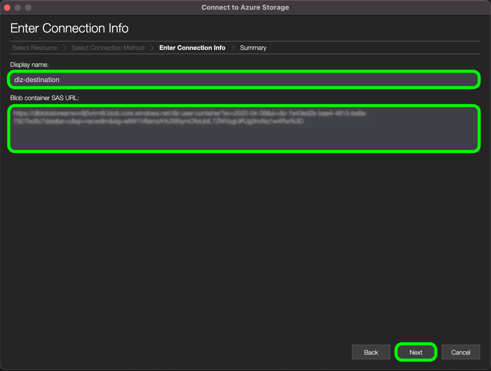

# [!DNL Data Landing Zone]

[!DNL Data Landing Zone] é um [!DNL Azure Blob] interface de armazenamento provisionada pela Adobe Experience Platform, permitindo que você acesse um recurso de armazenamento de arquivos seguro e baseado em nuvem para trazer arquivos para a plataforma. Você tem acesso a um [!DNL Data Landing Zone] por sandbox, e o volume total de dados em todos os contêineres está limitado aos dados totais fornecidos com sua licença de Produtos e Serviços da plataforma . Todos os clientes da Platform e seus serviços de aplicativos, como [!DNL Customer Journey Analytics], [!DNL Journey Orchestration], [!DNL Intelligent Services]e [!DNL Real-time Customer Data Platform] são provisionados com um [!DNL Data Landing Zone] contêiner por sandbox. Você pode ler e gravar arquivos no contêiner por meio de [!DNL Azure Storage Explorer] ou sua interface de linha de comando.

[!DNL Data Landing Zone] O suporta autenticação baseada em SAS e seus dados estão protegidos com o padrão [!DNL Azure Blob] mecanismos de segurança de armazenamento em repouso e em trânsito. A autenticação baseada em SAS permite que você acesse com segurança sua [!DNL Data Landing Zone] por meio de uma conexão pública com a Internet. Não são necessárias alterações de rede para que você acesse seu [!DNL Data Landing Zone] , o que significa que não é necessário configurar nenhuma configuração lista de permissões ou entre regiões para sua rede. A Platform impõe um TTL (time-to-live) estrito de sete dias em todos os arquivos carregados em um [!DNL Data Landing Zone] contêiner. Todos os arquivos são excluídos após sete dias.

## Restrições de nomenclatura para arquivos e diretórios

Esta é uma lista de restrições que você deve considerar ao nomear seus arquivos ou diretórios de armazenamento em nuvem.

- Os nomes de componentes de diretório e arquivo não podem exceder 255 caracteres.
- Os nomes de diretório e arquivo não podem terminar com uma barra (`/`). Se fornecido, ele será removido automaticamente.
- Os seguintes caracteres de URL reservados devem ser evitados corretamente: `! ' ( ) ; @ & = + $ , % # [ ]`
- Os seguintes caracteres não são permitidos: `" \ / : | < > * ?`.
- Caracteres de caminho de URL inválidos não permitidos. Pontos de código como `\uE000`, embora válidas em nomes de arquivo NTFS, não são caracteres Unicode válidos. Além disso, alguns caracteres ASCII ou Unicode, como caracteres de controle (como `0x00` para `0x1F`, `\u0081`e assim por diante), também não são permitidas. Para obter as regras que regem as cadeias de caracteres Unicode no HTTP/1.1, consulte [RFC 2616, Seção 2.2: Regras básicas](https://www.ietf.org/rfc/rfc2616.txt) e [RFC 3987](https://www.ietf.org/rfc/rfc3987.txt).
- Os seguintes nomes de arquivo não são permitidos: LPT1, LPT2, LPT3, LPT4, LPT5, LPT6, LPT7, LPT8, LPT9, COM1, COM2, COM3, COM4, COM5, COM6, COM7, COM8, COM8, COM9, PRN, AUX, NUL, CON, CLOCK$, caractere de ponto (...) e dois caracteres de ponto (.).

## Gerencie o conteúdo de seu [!DNL Data Landing Zone]

Você pode usar [[!DNL Azure Storage Explorer]](https://azure.microsoft.com/en-us/features/storage-explorer/) para gerenciar o conteúdo de sua [!DNL Data Landing Zone] contêiner.

No [!DNL Azure Storage Explorer] Na interface do usuário, selecione o ícone de conexão na navegação à esquerda. O **Selecionar recurso** for exibida, fornecendo opções para conexão. Selecionar **[!DNL Blob container]** para se conectar a [!DNL Data Landing Zone].


Em seguida, selecione **URL de assinatura de acesso compartilhado (SAS)** como seu método de conexão e selecione **Próximo**.


Depois de selecionar seu método de conexão, você deve fornecer uma **nome de exibição** e **[!DNL Blob]URL SAS do contêiner** que corresponde ao seu [!DNL Data Landing Zone] contêiner.

>[!TIP]
>
>Você pode recuperar seu [!DNL Data Landing Zone] credenciais do catálogo de origens na interface do usuário da plataforma.

Forneça sua [!DNL Data Landing Zone] URL SAS e selecione **Próximo**



O **Resumo** for exibida, fornecendo uma visão geral de suas configurações, incluindo informações sobre [!DNL Blob] endpoint e permissões. Quando estiver pronto, selecione **Connect**.


Uma conexão bem-sucedida atualiza sua [!DNL Azure Storage Explorer] Interface do usuário com seu [!DNL Data Landing Zone] contêiner.


Com seu [!DNL Data Landing Zone] contêiner conectado a [!DNL Azure Storage Explorer], agora é possível iniciar o upload de arquivos no [!DNL Data Landing Zone] contêiner. Para fazer upload, selecione **Upload** e depois selecione **Fazer upload de arquivos**.


Após selecionar o arquivo que deseja fazer upload, é necessário identificar a variável [!DNL Blob] digite o que deseja fazer upload como e do diretório de destino desejado. Quando terminar, selecione **Upload**.

| [!DNL Blob] tipos | Descrição |
| --- | --- |
| Bloco [!DNL Blob] | Bloco [!DNL Blobs] são otimizadas para carregar grandes quantidades de dados de maneira eficiente. Bloco [!DNL Blobs] são a opção padrão para [!DNL Data Landing Zone]. |
| Anexar [!DNL Blob] | Anexar [!DNL Blobs] são otimizadas para anexar dados ao final do arquivo. |


## Carregue arquivos no [!DNL Data Landing Zone] usando a interface da linha de comando

Você também pode usar a interface da linha de comando do seu dispositivo e acessar arquivos de upload para o seu [!DNL Data Landing Zone].

### Fazer upload de um arquivo usando o Bash

O exemplo a seguir usa Bash e cURL para fazer upload de um arquivo para um [!DNL Data Landing Zone] com o [!DNL Azure Blob Storage] REST API:

```shell
# Set Azure Blob-related settings
DATE_NOW=$(date -Ru | sed 's/\+0000/GMT/')
AZ_VERSION="2018-03-28"
AZ_BLOB_URL="<URL TO BLOB ACCOUNT>"
AZ_BLOB_CONTAINER="<BLOB CONTAINER NAME>"
AZ_BLOB_TARGET="${AZ_BLOB_URL}/${AZ_BLOB_CONTAINER}"
AZ_SAS_TOKEN="<SAS TOKEN, STARTING WITH ? AND ENDING WITH %3D>"

# Path to the file we wish to upload
FILE_PATH="</PATH/TO/FILE>"
FILE_NAME=$(basename "$FILE_PATH")

# Execute HTTP PUT to upload file (remove '-v' flag to suppress verbose output)
curl -v -X PUT \
   -H "Content-Type: application/octet-stream" \
   -H "x-ms-date: ${DATE_NOW}" \
   -H "x-ms-version: ${AZ_VERSION}" \
   -H "x-ms-blob-type: BlockBlob" \
   --data-binary "@${FILE_PATH}" "${AZ_BLOB_TARGET}/${FILE_NAME}${AZ_SAS_TOKEN}"
```

### Fazer upload de um arquivo usando Python

O exemplo a seguir usa [!DNL Microsoft's] Python v12 SDK para fazer upload de um arquivo para um [!DNL Data Landing Zone]:

>[!TIP]
>
>Enquanto o exemplo abaixo usa o URI SAS completo para se conectar a um [!DNL Azure Blob] , você pode usar outros métodos e operações para autenticar. Veja isso [[!DNL Microsoft] documento sobre o Python v12 SDK](https://docs.microsoft.com/en-us/azure/storage/blobs/storage-quickstart-blobs-python) para obter mais informações.

```py
import os
from azure.storage.blob import ContainerClient

try:
    # Set Azure Blob-related settings
    sasUri = "<SAS URI>"
    srcFilePath = "<FULL PATH TO FILE>" 
    srcFileName = os.path.basename(srcFilePath)

    # Connect to container using SAS URI
    containerClient = ContainerClient.from_container_url(sasUri)

    # Upload file to Data Landing Zone with overwrite enabled
    with open(srcFilePath, "rb") as fileToUpload:
        containerClient.upload_blob(srcFileName, fileToUpload, overwrite=True)

except Exception as ex:
    print("Exception: " + ex.strerror)
```

### Fazer upload de um arquivo usando [!DNL AzCopy]

O exemplo a seguir usa [!DNL Microsoft's] [!DNL AzCopy] para carregar um arquivo em um [!DNL Data Landing Zone]:

>[!TIP]
>
>Enquanto o exemplo abaixo está usando a variável `copy` , você pode usar outros comandos e opções para fazer upload de um arquivo para seu [!DNL Data Landing Zone], usando [!DNL AzCopy]. Veja isso [[!DNL Microsoft AzCopy] documento](https://docs.microsoft.com/en-us/azure/storage/common/storage-ref-azcopy?toc=/azure/storage/blobs/toc.json) para obter mais informações.

```bat
set sasUri=<FULL SAS URI, PROPERLY ESCAPED>
set srcFilePath=<PATH TO LOCAL FILE(S); WORKS WITH WILDCARD PATTERNS>

azcopy copy "%srcFilePath%" "%sasUri%" --overwrite=true --recursive=true
```

## Connect [!DNL Data Landing Zone] para [!DNL Platform]

A documentação abaixo fornece informações sobre como trazer dados de seu [!DNL Data Landing Zone] para o Adobe Experience Platform usando APIs ou a interface do usuário.

### Uso de APIs

- [Crie um [!DNL Data Landing Zone] conexão de origem usando a API do Serviço de Fluxo](../../tutorials/api/create/cloud-storage/data-landing-zone.md)
- [Criar um fluxo de dados para uma fonte de armazenamento em nuvem usando a API do Serviço de Fluxo](../../tutorials/api/collect/cloud-storage.md)

### Uso da interface do usuário

- [Connect [!DNL Data Landing Zone] para Plataforma usando a interface do usuário](../../tutorials/ui/create/cloud-storage/data-landing-zone.md)
- [Criar um fluxo de dados para uma conexão de armazenamento em nuvem na interface do usuário do](../../tutorials/ui/dataflow/batch/cloud-storage.md)
