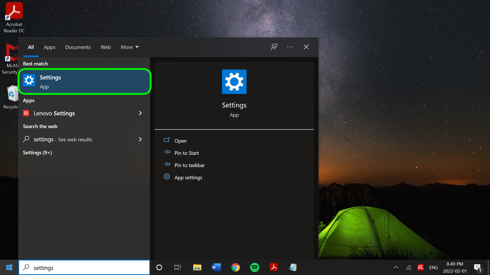
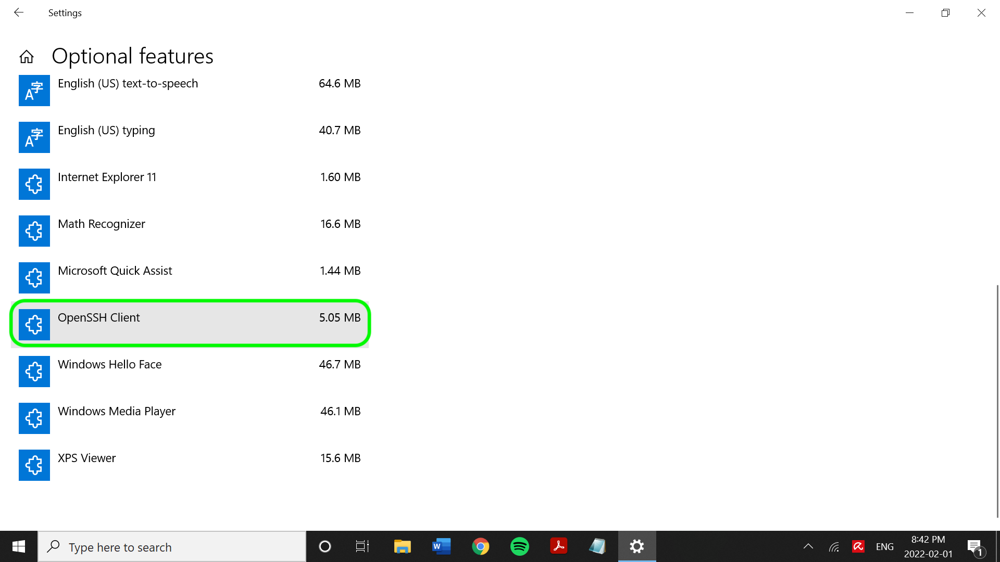

# Conector SFTP

>[!IMPORTANT]
>
>O servidor [!DNL SFTP] ao qual o Adobe Experience Platform se conecta deve ser capaz de oferecer suporte a fragmentação, o que significa várias conexões com um único arquivo. Se o servidor [!DNL SFTP] não oferecer suporte a fragmentação, talvez você receba um erro impedindo a assimilação de arquivos.

O Adobe Experience Platform fornece conectividade nativa para provedores de nuvem, como o AWS, o [!DNL Google Cloud Platform] e o [!DNL Azure], permitindo que você traga seus dados desses sistemas.

As fontes de armazenamento na nuvem podem trazer seus próprios dados para o [!DNL Platform] sem precisar baixar, formatar ou carregar. Os dados assimilados podem ser formatados como XDM JSON, XDM Parquet ou delimitados. Cada etapa do processo é integrada ao fluxo de trabalho Origens. O [!DNL Platform] permite trazer dados de um servidor FTP ou SFTP por meio de lotes.

## LISTA DE PERMISSÕES de endereço IP

Uma lista de endereços IP deve ser adicionada a uma lista de permissões antes de trabalhar com conectores de origem. Falha ao adicionar endereços IP específicos da região à lista de permissões pode levar a erros ou ao não desempenho ao usar origens. Consulte a página [lista de permissões de endereço IP](../../ip-address-allow-list.md) para obter mais informações.

## Restrições de nomenclatura para arquivos e diretórios

Veja a seguir uma lista de restrições que você deve considerar ao nomear seu arquivo ou diretório de armazenamento em nuvem.

- Os nomes dos componentes de diretório e arquivo não podem exceder 255 caracteres.
- Nomes de diretório e arquivo não podem terminar com uma barra (`/`). Se fornecido, ele será removido automaticamente.
- Os seguintes caracteres de URL reservados devem ter um escape adequado: `! ' ( ) ; @ & = + $ , % # [ ]`
- Os seguintes caracteres não são permitidos: `" \ / : | < > * ?`.
- Caracteres de caminho de URL inválidos não permitidos. Pontos de código como `\uE000`, embora válidos em nomes de arquivo NTFS, não são caracteres Unicode válidos. Além disso, alguns caracteres ASCII ou Unicode, como caracteres de controle (0x00 a 0x1F, \u0081 etc.), também não são permitidos. Para regras que regem cadeias de caracteres Unicode em HTTP/1.1, consulte [RFC 2616, Seção 2.2: Regras Básicas](https://www.ietf.org/rfc/rfc2616.txt) e [RFC 3987](https://www.ietf.org/rfc/rfc3987.txt).
- Os seguintes nomes de arquivo não são permitidos: LPT1, LPT2, LPT3, LPT4, LPT5, LPT6, LPT7, LPT8, LPT9, COM1, COM2, COM3, COM4, COM5, COM6, COM7, COM8, COM9, PRN, AUX, NUL, CON, CLOCK$, caractere de ponto (.) e dois caracteres de ponto (..).

## Configurar uma chave privada OpenSSH codificada na Base64 para [!DNL SFTP]

A origem [!DNL SFTP] dá suporte à autenticação usando a chave privada OpenSSH codificada em [!DNL Base64]. Consulte as etapas abaixo para obter informações sobre como gerar sua chave privada OpenSSH codificada na Base64 e conectar o [!DNL SFTP] à Platform.

### [!DNL Windows] usuários

Se você estiver usando uma máquina [!DNL Windows], abra o menu **Iniciar** e selecione **Configurações**.



No menu **Configurações** exibido, selecione **Aplicativos**.


Em seguida, selecione **Recursos opcionais**.


Uma lista de recursos opcionais é exibida. Se o **OpenSSH Client** já estiver pré-instalado no computador, ele será incluído na lista **Recursos instalados** em **Recursos opcionais**.



Se não estiver instalado, selecione **Instalar**, abra **[!DNL Powershell]** e execute o seguinte comando para gerar sua chave privada:

```shell
PS C:\Users\lucy> ssh-keygen -t rsa -m pem
Generating public/private rsa key pair.
Enter file in which to save the key (C:\Users\lucy/.ssh/id_rsa):
Enter passphrase (empty for no passphrase):
Enter same passphrase again:
Your identification has been saved in C:\Users\lucy/.ssh/id_rsa.
Your public key has been saved in C:\Users\lucy/.ssh/id_rsa.pub.
The key fingerprint is:
SHA256:osJ6Lg0TqK8nekNQyZGMoYwfyxNc+Wh0hYBtBylXuGk lucy@LAPTOP-FUJT1JEC
The key's randomart image is:
+---[RSA 3072]----+
|.=.*+B.o.        |
|=.O.O +          |
|+o+= B           |
|+o +E .          |
|.o=o  . S        |
|+... . .         |
| *o .            |
|o.B.             |
|=O..             |
+----[SHA256]-----+
```

Em seguida, execute o seguinte comando ao fornecer o caminho de arquivo da chave privada, para codificar sua chave privada em [!DNL Base64]:

```shell
C:\Users\lucy> [convert]::ToBase64String((Get-Content -path "C:\Users\lucy\.ssh\id_rsa" -Encoding byte)) > C:\Users\lucy\.ssh\id_rsa_base64
```

O comando acima salva a chave privada codificada em [!DNL Base64] no caminho de arquivo designado. Em seguida, você pode usar essa chave privada para se autenticar em [!DNL SFTP] e se conectar à Platform.

### [!DNL Mac] usuários

Se você estiver usando um [!DNL Mac], abra o **Terminal** e execute o seguinte comando para gerar a chave privada (nesse caso, a chave privada será salva em `/Documents/id_rsa`):

```shell
ssh-keygen -t rsa -m pem -f ~/Documents/id_rsa
Generating public/private rsa key pair.
Enter passphrase (empty for no passphrase):
Enter same passphrase again:
Your identification has been saved in /Users/vrana/Documents/id_rsa.
Your public key has been saved in /Users/vrana/Documents/id_rsa.pub.
The key fingerprint is:
SHA256:s49PCaO4a0Ee8I7OOeSyhQAGc+pSUQnRii9+5S7pp1M vrana@vrana-macOS
The key's randomart image is:
+---[RSA 2048]----+
|o ==..           |
|.+..o            |
|oo.+             |
|=.. +            |
|oo = .  S        |
|+.+ +E . = .     |
|o*..*.. . o      |
|.o*=.+   +       |
|.oo=Oo  ..o      |
+----[SHA256]-----+
```

Em seguida, execute o seguinte comando para codificar a chave privada em [!DNL Base64]:

```shell
base64 ~/Documents/id_rsa > ~/Documents/id_rsa_base64
 
 
# Print Content of base64 encoded file
cat ~/Documents/id_rsa_base64
LS0tLS1CRUdJTiBPUEVOU1NIIFBSSVZBVEUgS0VZLS0tLS0KYjNCbGJuTnphQzFyWlhrdGRqRUFBQUFBQkc1dmJtVUFBQUFFYm05dVpRQUFBQUFBQUFBQkFBQUJGd0FBQUFkemMyZ3RjbgpOaEFBQUFBd0VBQVFBQUFRRUF0cWFYczlXOUF1ZmtWazUwSXpwNXNLTDlOMU9VYklaYXVxbVM0Q0ZaenI1NjNxUGFuN244CmFxZWdvQTlCZnVnWDJsTVpGSFl5elEzbnp6NXdXMkdZa1hkdjFjakd0elVyNyt1NnBUeWRneGxrOGRXZWZsSzBpUlpYWW4KVFRwS0E5c2xXaHhjTXg3R2x5ejdGeDhWSzI3MmdNSzNqY1d1Q0VIU3lLSFR5SFFwekw0MEVKbGZJY1RGR1h1dW1LQjI5SwpEakhwT1grSDdGcG5Gd1pabTA4Uzc2UHJveTVaMndFalcyd1lYcTlyUDFhL0E4ejFoM1ZLdllzcG53c2tCcHFQSkQ1V3haCjczZ3M2OG9sVllIdnhWajNjS3ZsRlFqQlVFNWRNUnB2M0I5QWZ0SWlrYmNJeUNDaXV3UnJmbHk5eVNPQ2VlSEc0Z2tUcGwKL3V4YXNOT0h1d0FBQThqNnF6R1YrcXN4bFFBQUFBZHpjMmd0Y25OaEFBQUJBUUMycHBlejFiMEM1K1JXVG5Rak9ubXdvdgowM1U1UnNobHE2cVpMZ0lWbk92bnJlbzlxZnVmeHFwNkNnRDBGKzZCZmFVeGtVZGpMTkRlZlBQbkJiWVppUmQyL1Z5TWEzCk5TdnY2N3FsUEoyREdXVHgxWjUrVXJTSkZsZGlkTk9rb0QyeVZhSEZ3ekhzYVhMUHNYSHhVcmJ2YUF3cmVOeGE0SVFkTEkKb2RQSWRDbk12alFRbVY4aHhNVVplNjZZb0hiMG9PTWVrNWY0ZnNXbWNYQmxtYlR4THZvK3VqTGxuYkFTTmJiQmhlcjJzLwpWcjhEelBXSGRVcTlpeW1mQ3lRR21vOGtQbGJGbnZlQ3pyeWlWVmdlL0ZXUGR3cStVVkNNRlFUbDB4R20vY0gwQiswaUtSCnR3aklJS0s3Qkd0K1hMM0pJNEo1NGNiaUNST21YKzdGcXcwNGU3QUFBQUF3RUFBUUFBQVFBcGs0WllzMENSRnNRTk9WS0sKYWxjazlCVDdzUlRLRjFNenhrSGVydmpJYk9kL0lvRXpkcHlVa28rbm41RmpGK1hHRnNCUXZnOFdTaUlJTk1oU3BNYWI1agpvWXlka2gvd0ovWElOaDlZaE5QVXlURi9NNkFnMkNYd21KS2RxN1VKWjZyNjloV3V0VVN6U05QbkVYWTZLc29GeVUwTEFvCko0OHJMT1pMZldtMHFhWDBLNUgzNmJPaHFXSWJwMDNoZk94eno5M0MrSDM5MFJkRkp4bzJVZ0FVY3UvdHREb0REVldBdmEKVkVyMWEzak9LenVHbThrK21WeXpPZERjVFY4ckZIT0pwRnRBU3l6Q24yVld1MjV0TWtrcGRPRjNKcVdMZHdOY3loeG1URApXZGVDNWh4V0Fiano0WDZ5WXpHcFcwTmptVkFoWUVVZGNBSVlXWWM3OGEvQkFBQUFnRm8wakl4aGhwZkJ6QjF6b09FMDJBClpjTC9hcUNuYysrdmJ1a2V0aFg5Zzhlb0xQMTQyeUgzdlpLczl3c1RtbVVsZ0prZURaN2hUcklwOGY2eEwzdDRlMXByY1kKb2ZLd0gwckNGOTFyaldPbGZOUmxEempoR1NTTEVMczZoNlNzMEdBQXE2Z0ZQTVF2dTB4TDlQUTlGQ21YZVVKazJpRm1MWgpEWWJGc0NyVUxEQUFBQWdRRGF0a1pMamJaSTBFM0ZuY2dTOVF5Y3lVWmtkZ1dVNjBQcG9ud3BMQXdUdHRpOG1EQXE5cHYwClEvUlk1WE9UeGF3VXNHa0tYMjNtV1BYR0grdUlBSzhrelVVM2dGM1dRWGVkTWw4NHVCVFZCTEtUdStvVVAvZmIvMEE0dE0KSE9BSythbXZPMkZuYzFiSmVwd05USTE2cjZXWk9sZWV2ZklJQVpXcEgxVVpIdkVRQUFBSUVBMWNwcStDNUVXSFJwbnVPZQpiNHE4T0tKTlJhSUxIRUN6U0twWlFpZDFhRmJYWlVKUXpIQU85YzhINVZMcjBNUjFkcW1ORkNja2ZsZzI2Y3BEUEl3TjBYCm5HMFBxcmhKbXp0U3ZQZ3NGdkNPallncXF6U0RYUjkxd1JQTEN5cU8zcGMyM2kzZnp2WkhtMGhIdWdoNVJqV0loUlFZVkwKZUpDWHRqM08vY3p1SWdzQUFBQVJkbkpoYm1GQWRuSmhibUV0YldGalQxTUJBZz09Ci0tLS0tRU5EIE9QRU5TU0ggUFJJVkFURSBLRVktLS0tLQo=
```

Depois que a chave privada codificada em [!DNL Base64] for salva na pasta designada, você deverá adicionar o conteúdo do arquivo de chave pública a uma nova linha nas chaves autorizadas do host [!DNL SFTP]. Execute o seguinte comando na linha de comando:

```shell
cat ~/id_rsa.pub >> ~/.ssh/authorized_keys
```

Para confirmar se a chave pública foi adicionada corretamente, execute o seguinte na linha de comando:

```shell
more ~/.ssh/authorized_keys
```

## Conectar SFTP a [!DNL Platform]

>[!IMPORTANT]
>
>Os usuários precisam desativar a Autenticação interativa de teclado na configuração do servidor SFTP antes de se conectarem. Desativar a configuração permitirá que as senhas sejam inseridas manualmente, em vez de serem inseridas por meio de um serviço ou programa. Consulte o [documento Component Pro](https://doc.componentpro.com/ComponentPro-Sftp/authenticating-with-a-keyboard-interactive-authentication) para obter mais informações sobre a Autenticação interativa do teclado.

A documentação abaixo fornece informações sobre como conectar um servidor SFTP ao [!DNL Platform] usando APIs ou a interface do usuário:

### Uso das APIs

- [Criar uma conexão básica SFTP usando a API do serviço de fluxo](../../tutorials/api/create/cloud-storage/sftp.md)
- [Explore a estrutura de dados e o conteúdo de uma fonte de armazenamento na nuvem usando a API do serviço de fluxo](../../tutorials/api/explore/cloud-storage.md)
- [Criar um fluxo de dados para uma fonte de armazenamento na nuvem usando a API do Serviço de fluxo](../../tutorials/api/collect/cloud-storage.md)

### Uso da interface

- [Criar uma conexão de origem SFTP na interface](../../tutorials/ui/create/cloud-storage/sftp.md)
- [Criar um fluxo de dados para uma conexão de armazenamento na nuvem na interface](../../tutorials/ui/dataflow/batch/cloud-storage.md)
